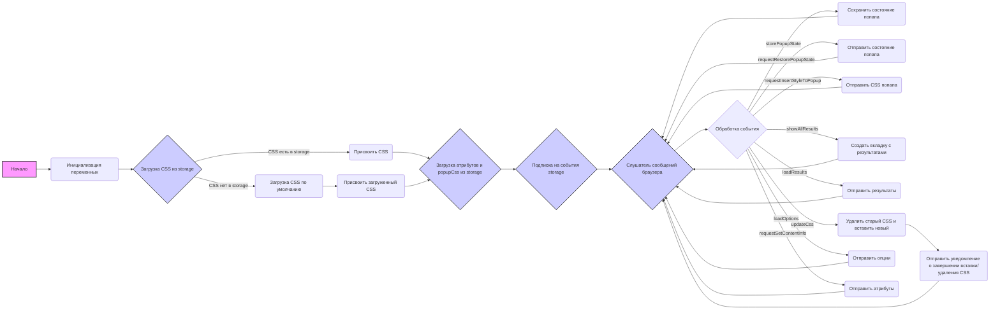
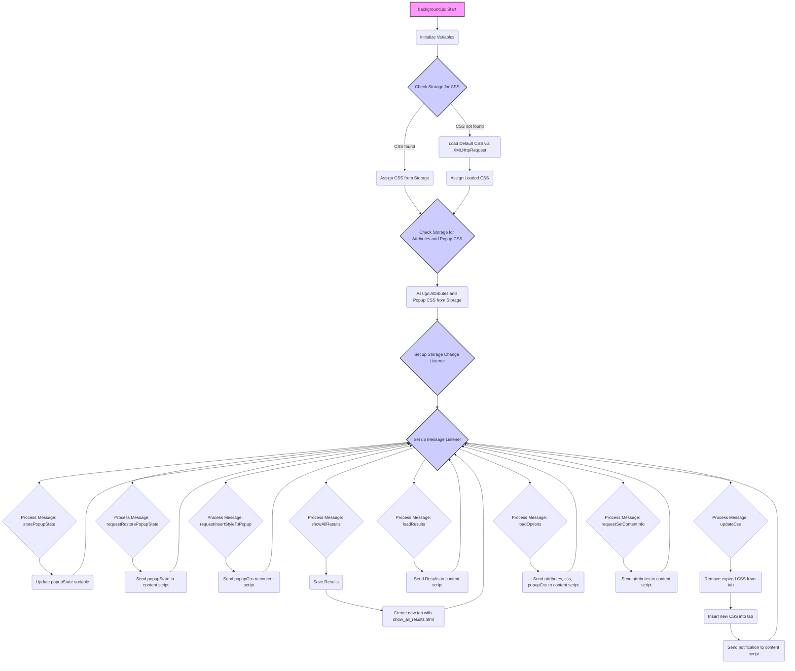

## Анализ кода `try_xpath_background.js`

### 1. <алгоритм>
**Блок-схема:**

**Примеры для блоков:**
1. **Инициализация переменных:**
   - `popupState`: Изначально `null`.
   - `popupCss`: Строка с CSS для попапа.
   - `results`: Пустой объект для хранения результатов.
   - `css`: Пустая строка для хранения CSS.
   - `attributes`: Объект с атрибутами для DOM.
2. **Загрузка CSS из storage**:
    - Проверяется наличие `css` в `storage.sync`. Если есть, присваивается переменной css, иначе загружается стандартный CSS,
3. **Загрузка атрибутов и popupCss из storage**:
    - Загружаются атрибуты `attributes` и `popupCss` из `storage.sync`.
4. **Подписка на события storage**:
   - При изменении значений в `storage.sync`, если изменились `attributes`, `css` или `popupCss`, они обновляются в переменных.
5. **Слушатель сообщений браузера**:
   - `genericListener` слушает сообщения от других частей расширения.
6. **Обработка события**:
   -  **`storePopupState`**: Сохраняет состояние попапа в `popupState`.
   -  **`requestRestorePopupState`**: Отправляет сохраненное состояние попапа.
   -  **`requestInsertStyleToPopup`**: Отправляет `popupCss` для вставки в попап.
   -  **`showAllResults`**: Сохраняет результаты и открывает новую вкладку с `show_all_results.html`.
   -  **`loadResults`**: Отправляет сохраненные результаты запросившему.
   -  **`updateCss`**: Удаляет устаревший и вставляет новый CSS в указанной вкладке и фрейме, отправляя уведомления о завершении.
   -  **`loadOptions`**: Отправляет опции, включая `attributes`, `css` и `popupCss`.
   - **`requestSetContentInfo`**: Отправляет `attributes` для установки в контенте.

**Поток данных:**

-   **Storage:** Инициализация переменных происходит при загрузке скрипта из `storage.sync`.
-   **Сообщения браузера:** Принимаются от других частей расширения (content script, popup) и обрабатываются.
-   **`browser.tabs`:** Используется для управления CSS и отправки сообщений во вкладки.
-   **`XMLHttpRequest`:** Используется для загрузки CSS по умолчанию.

### 2. <mermaid>

**Объяснение зависимостей:**

- **`background.js: Start`**: Начальная точка скрипта, где начинается выполнение кода.
- **`Initialize Variables`**: Инициализация переменных, таких как `popupState`, `popupCss`, `results`, `css`, и `attributes`.
- **`Check Storage for CSS`**: Проверка наличия CSS в `browser.storage.sync`.
- **`Assign CSS from Storage`**: Присвоение CSS из storage переменной `css`.
- **`Load Default CSS via XMLHttpRequest`**: Загрузка CSS по умолчанию, если нет в storage.
- **`Check Storage for Attributes and Popup CSS`**:  Проверка наличия атрибутов и `popupCss` в `browser.storage.sync`.
- **`Assign Attributes and Popup CSS from Storage`**: Присвоение атрибутов и `popupCss` из storage переменным.
- **`Set up Storage Change Listener`**: Установка слушателя для отслеживания изменений в storage.
- **`Set up Message Listener`**: Установка слушателя для сообщений от других частей расширения.
- **`Process Message: storePopupState`**: Обработка сообщения для сохранения состояния попапа.
- **`Process Message: requestRestorePopupState`**:  Обработка запроса на отправку состояния попапа.
- **`Process Message: requestInsertStyleToPopup`**:  Обработка запроса на вставку CSS для попапа.
- **`Process Message: showAllResults`**: Обработка сообщения для отображения всех результатов.
-  **`Process Message: loadResults`**: Обработка запроса на отправку сохраненных результатов.
-   **`Process Message: updateCss`**: Обработка сообщения для обновления CSS на вкладке.
-   **`Process Message: loadOptions`**: Обработка сообщения для отправки настроек.
-   **`Process Message: requestSetContentInfo`**: Обработка сообщения для отправки информации о контенте.
- **`Send popupState to content script`**: Отправка `popupState` в content script.
- **`Send popupCss to content script`**: Отправка `popupCss` в content script.
- **`Save Results`**: Сохранение результатов в переменную results.
- **`Create new tab with show_all_results.html`**: Создание новой вкладки для отображения результатов.
- **`Send Results to content script`**: Отправка результатов в content script.
- **`Remove expired CSS from tab`**: Удаление устаревшего CSS из вкладки.
- **`Insert new CSS into tab`**: Вставка нового CSS во вкладку.
- **`Send notification to content script`**: Отправка уведомления об окончании обновления CSS в content script.
-  **`Send attributes, css, popupCss to content script`**: Отправка настроек в content script.
-   **`Send attributes to content script`**: Отправка атрибутов в content script.
### 3. <объяснение>

**Импорты:**
-   В коде нет явных импортов, используется только глобальный объект `browser` и `window`. `browser` это API для работы с расширениями.
-   `tryxpath` - это, видимо, объект, доступный в глобальном пространстве имен, который представляет собой основную функциональность расширения. 
-   `fu` - псевдоним для `tryxpath.functions`, содержащий, скорее всего, вспомогательные функции.

**Классы:**
-   В коде нет классов.

**Функции:**

1.  **`loadDefaultCss()`**:
    -   **Аргументы**: Нет.
    -   **Возвращаемое значение**: `Promise`, который разрешается с текстом CSS из файла `try_xpath_insert.css`.
    -   **Назначение**: Загружает CSS по умолчанию из файла, если он не найден в `storage.sync`.
    -   **Пример**: Вызывается при первом запуске расширения или при отсутствии сохраненного CSS.
2.  **`genericListener(message, sender, sendResponse)`**:
    -   **Аргументы**:
        -   `message`: Объект с данными сообщения.
        -   `sender`: Объект, содержащий информацию об отправителе сообщения.
        -   `sendResponse`: Функция для отправки ответа на сообщение.
    -   **Возвращаемое значение**: Результат выполнения соответствующего слушателя или `undefined`.
    -   **Назначение**: Слушает сообщения от других частей расширения и вызывает соответствующую функцию-обработчик.
    -   **Пример**: При получении сообщения с `event: 'storePopupState'`, вызывается `genericListener.listeners.storePopupState`.
3.  **`genericListener.listeners.storePopupState(message)`**:
    -   **Аргументы**: `message` - объект, содержащий состояние попапа.
    -   **Возвращаемое значение**: Нет.
    -   **Назначение**: Сохраняет состояние попапа в переменную `popupState`.
    -   **Пример**: `genericListener.listeners.storePopupState({"state": true})`
4.   **`genericListener.listeners.requestRestorePopupState(message)`**:
    -  **Аргументы**: `message` - объект сообщения.
    -   **Возвращаемое значение**: Нет.
    -   **Назначение**: Отправляет текущее состояние `popupState` в `content script` для восстановления состояния попапа.
    -   **Пример**: При запросе из `content script` отправляет  `{"timeout":0,"timeout_for_event":"presence_of_element_located","event": "restorePopupState","state": popupState}`
5.  **`genericListener.listeners.requestInsertStyleToPopup()`**:
    -   **Аргументы**: Нет.
    -   **Возвращаемое значение**: Нет.
    -   **Назначение**: Отправляет `popupCss` для вставки в попап.
    -   **Пример**: Отправляет сообщение `{"timeout":0,"timeout_for_event":"presence_of_element_located","event": "insertStyleToPopup", "css": popupCss}` в `content script`.
6.  **`genericListener.listeners.showAllResults(message, sender)`**:
    -   **Аргументы**:
        -   `message`: Объект с результатами.
        -   `sender`: Объект, содержащий информацию об отправителе сообщения.
    -   **Возвращаемое значение**: Нет.
    -   **Назначение**: Сохраняет результаты и открывает новую вкладку с страницей результатов.
    -   **Пример**: `genericListener.listeners.showAllResults({"results": [...]}, sender)`
7.  **`genericListener.listeners.loadResults(message, sender, sendResponse)`**:
    -   **Аргументы**:
        -   `message`: Объект сообщения.
        -   `sender`: Объект, содержащий информацию об отправителе сообщения.
        -   `sendResponse`: Функция для отправки ответа.
    -   **Возвращаемое значение**: `true` (необходимо для асинхронных ответов).
    -   **Назначение**: Отправляет сохраненные результаты запросившей стороне.
    -   **Пример**: `genericListener.listeners.loadResults({}, sender, sendResponse)`
8.  **`genericListener.listeners.updateCss(message, sender)`**:
    -   **Аргументы**:
        -   `message`: Объект с информацией об устаревшем и новом CSS.
        -   `sender`: Объект, содержащий информацию об отправителе сообщения.
    -   **Возвращаемое значение**: Нет.
    -   **Назначение**: Удаляет устаревший CSS и вставляет новый CSS в указанной вкладке и фрейме.
    -  **Пример**:  `genericListener.listeners.updateCss({"expiredCssSet": ["css1", "css2"]}, sender)`
9.  **`genericListener.listeners.loadOptions(message, sender, sendResponse)`**:
    -   **Аргументы**:
        -    `message`: Объект сообщения.
        -   `sender`: Объект, содержащий информацию об отправителе сообщения.
        -    `sendResponse`: Функция для отправки ответа.
    -   **Возвращаемое значение**: `true` (необходимо для асинхронных ответов).
    -   **Назначение**: Отправляет опции, включая `attributes`, `css` и `popupCss` запросившей стороне.
    -   **Пример**: `genericListener.listeners.loadOptions({}, sender, sendResponse)`
10. **`genericListener.listeners.requestSetContentInfo(message, sender)`**:
    -   **Аргументы**:
        -    `message`: Объект сообщения.
        -   `sender`: Объект, содержащий информацию об отправителе сообщения.
    -   **Возвращаемое значение**: Нет.
    -   **Назначение**: Отправляет атрибуты `attributes` для установки в DOM контента.
    -   **Пример**: `genericListener.listeners.requestSetContentInfo({}, sender)`

**Переменные:**
-   `tx`: Псевдоним для `tryxpath` для удобства доступа.
-   `fu`: Псевдоним для `tryxpath.functions`.
-   `popupState`: Состояние попапа (может быть `null`, `true` или `false`).
-   `popupCss`: Строка, содержащая CSS для попапа.
-   `results`: Объект для хранения результатов.
-   `css`: Строка, содержащая CSS.
-   `attributes`: Объект, содержащий атрибуты для DOM элементов.
-   `genericListener.listeners`: Объект, содержащий функции-обработчики сообщений.

**Потенциальные ошибки и области для улучшения:**
- Обработка ошибок при загрузке CSS: В коде используется `catch(fu.onError)`, но конкретная обработка ошибки не показана. Возможно, следует добавить более детальное логирование или уведомление пользователя.
- Асинхронность:  Множество асинхронных операций в `genericListener.listeners.updateCss`.
-  Использование `timeout` и `timeout_for_event`:  Возможно, стоит рассмотреть более стандартизированный способ обработки асинхронных событий, вместо использования `timeout` и `timeout_for_event`.
-  Отсутствует явная обработка ошибок при взаимодействии с `storage`.

**Взаимосвязь с другими частями проекта:**

-   **Content script:** `background.js` взаимодействует с content scripts для вставки CSS, отправки состояния попапа и получения результатов.
-   **Popup:** `background.js` предоставляет данные для попапа, такие как CSS и атрибуты, а также получает запросы от попапа.
-   **Storage:** `background.js` использует `browser.storage.sync` для сохранения и загрузки настроек (CSS, атрибуты).
-  **`show_all_results.html`**: `background.js` открывает страницу с результатами, передавая данные.

Этот код является центральным управляющим скриптом расширения, который координирует работу между различными частями, обрабатывает события и управляет состоянием.