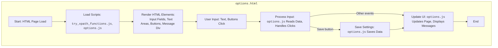

## Анализ HTML-кода `options.html`

### 1. <алгоритм>
Данный HTML-код представляет собой страницу настроек (options page) для расширения браузера, предназначенного для работы с путями XPath. Он позволяет пользователю задавать различные атрибуты для элементов, стили для вставки, а также размеры всплывающего окна.

**Пошаговая блок-схема:**

1.  **Загрузка HTML:** Браузер загружает `options.html`.
    *   *Пример:* Пользователь открывает страницу настроек расширения.

2.  **Подключение скриптов:** Подключаются два скрипта: `try_xpath_functions.js` и `options.js`.
    *   *Пример:* Браузер обрабатывает `` и ``.
    *   `try_xpath_functions.js` предположительно содержит функции для работы с XPath.
    *   `options.js` будет содержать код для управления элементами и взаимодействием на странице настроек.

3.  **Отображение элементов:** Браузер отображает элементы на странице.

    *   **Раздел "Attributes":**
        *   Поля ввода для атрибутов элементов: `Resulted elements`, `Context element`, `Focused element`, `Ancestors of the focused element`, `Frame elements`, `Ancestors of the frames`.
            *   *Пример:* Пользователь видит текстовые поля для ввода данных.
        *   Каждое поле ввода связано с определенным идентификатором (id): `element-attribute`, `context-attribute` и т.д.
            *   *Пример:* `<input type="text" id="element-attribute">`

    *   **Раздел "Style to be inserted":**
        *   Текстовое поле для ввода стилей (CSS).
            *   *Пример:* Пользователь видит поле ввода типа `<textarea>`.
        *   Идентификатор поля: `style`.
            *   *Пример:* `<textarea id="style"></textarea>`

    *   **Раздел "Popup styles":**
        *   Поля ввода для ширины и высоты всплывающего окна (popup).
             *   *Пример:* Пользователь видит текстовые поля для ввода данных.
        *   Идентификаторы полей: `popup-body-width`, `popup-body-height`.
            *   *Пример:* `<input type="text" id="popup-body-width">`

    *   **Кнопки:**
        *   Кнопка "Save" для сохранения настроек.
            *   *Пример:* `<button id="save">Save</button>`
        *   Кнопка "Show default" для возврата к значениям по умолчанию.
            *   *Пример:* `<button id="show-default">Show default</button>`

    *   **Сообщение:**
        *   Пустой div для вывода сообщений.
            *   *Пример:* `

`

4.  **Взаимодействие пользователя:** Пользователь вводит данные в поля, нажимает на кнопки.
    *   *Пример:* Пользователь вводит `body` в поле `element-attribute`,  `div` в поле `context-attribute`, и нажимает кнопку `Save`.

5.  **Обработка данных:** Скрипт `options.js` обрабатывает введенные данные и действия пользователя.
    *   *Пример:* `options.js` получает значения из текстовых полей с помощью `document.getElementById('element-attribute').value`, применяет стили к элементам.

6.  **Сохранение/отображение:** `options.js` сохраняет введенные данные, обновляет страницу и/или отображает сообщения в элементе `#message`.

### 2. <mermaid>

### 3. <объяснение>

**Импорты:**

*   В данном HTML-коде нет импортов Python-модулей, т.к. это HTML-файл. Однако, в нём есть два скрипта: `try_xpath_functions.js` и `options.js`, которые подключаются посредством тега `<script>`.
    *   `try_xpath_functions.js`: Скорее всего, это JavaScript-файл, содержащий функции для работы с XPath-запросами и элементами DOM. Этот скрипт обеспечивает функциональность по определению путей элементов на странице.
    *   `options.js`: Этот скрипт отвечает за динамическое поведение страницы настроек. Он обрабатывает действия пользователя, такие как ввод данных в поля, нажатие на кнопки, сохранение и применение настроек.

**HTML-структура:**

*   **Разделы:** Страница разделена на несколько секций с помощью `div`, каждая из которых содержит определенные элементы для ввода данных и управления настройками.
    *   **"Attributes":** Содержит поля для ввода значений атрибутов различных элементов, таких как "Resulted elements", "Context element" и т.д. Каждое поле имеет свой уникальный `id` для доступа из JavaScript.
    *   **"Style to be inserted":** Поле типа `textarea`, предназначенное для ввода CSS-стилей, которые должны быть применены к элементам.
    *   **"Popup styles":** Содержит поля для ввода ширины и высоты всплывающего окна расширения.
    *   **Кнопки:** Кнопка "Save" для сохранения текущих настроек и "Show default" для сброса к значениям по умолчанию.
    *   **Сообщение:** Div с `id="message"` для отображения сообщений пользователю (например, об успехе сохранения).

*   **Формы:** Страница не содержит тега `<form>`, а это значит что данные, скорее всего, будут обрабатываться JavaScript-ом. Данные будут считываться напрямую из полей ввода по их `id`.

**Элементы HTML:**

*   `<input type="text">`: Используются для ввода текстовых значений. У каждого `input` свой `id` для обращения к нему из JavaScript.
    *   *Пример:* `<input type="text" id="element-attribute">`
*   `<textarea>`: Поле для ввода многострочного текста (стилей CSS).
    *    *Пример:* `<textarea id="style"></textarea>`
*   `<button>`: Используются для выполнения действий.
    *   *Пример:* `<button id="save">Save</button>`
*   `
`: Контейнеры для группировки элементов.
    *   *Пример:* `

`

**Функциональность:**

Страница настроек расширения позволяет пользователю задавать атрибуты элементов, стили для вставки, а также размеры всплывающего окна. Все эти настройки, вероятно, будут использоваться в основном скрипте расширения для работы с веб-страницами.

**Потенциальные проблемы и улучшения:**

*   **Обработка ошибок:**  Нужно предусмотреть обработку ошибок, таких как неправильный ввод данных пользователем. Например, если пользователь введет некорректные значения для ширины и высоты окна.
*   **Валидация данных:**  Было бы полезно добавить валидацию данных, вводимых пользователем, перед сохранением, чтобы избежать некорректных настроек.
*   **Сохранение настроек:** Необходимо явно указать, как именно и куда сохраняются данные. Скорее всего это будет реализовано в `options.js` с использованием API браузера для сохранения расширений.
*   **Улучшение интерфейса:**  Можно добавить более информативные подсказки и сообщения для пользователя.
*  **Связь с другими частями проекта:**
    - Этот файл непосредственно связан с `try_xpath_functions.js` и `options.js`. Эти файлы будут обрабатывать введенные значения и сохранять настройки, которые будут использоваться в остальной части расширения.

Этот анализ обеспечивает полное понимание структуры, функциональности и потенциальных улучшений HTML-кода `options.html`.