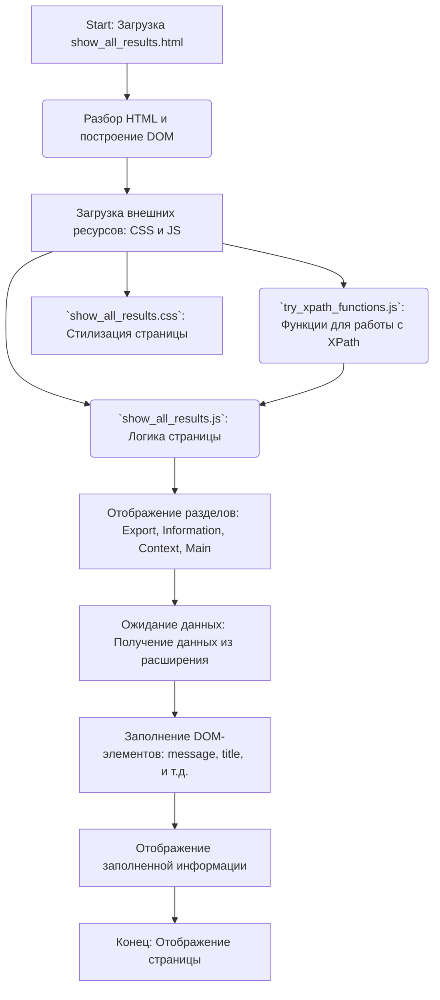

## АНАЛИЗ HTML-КОДА

### 1. <алгоритм>

1.  **Загрузка страницы**: Браузер загружает HTML-файл `show_all_results.html`.
2.  **Разбор HTML**: Браузер анализирует HTML-структуру страницы и строит DOM-дерево.
3.  **Загрузка внешних ресурсов**: Браузер загружает CSS и JS файлы:
    *   `../scripts/try_xpath_functions.js`: Содержит общие функции для работы с XPath (предположительно).
    *   `show_all_results.js`: Содержит скрипты, специфичные для этой страницы, отвечающие за логику отображения данных.
    *   `show_all_results.css`: Определяет стили отображения элементов на странице.
4.  **Отображение структуры**: На странице отображаются следующие разделы:
    *   **Export links**: Ссылки для экспорта результатов (plain text, partly converted). Пример: `<a id="export-text">Plain text</a>`
    *   **Information**:  Общая информация о странице (Message, Title, URL, frameId). Пример: `<td id="message"></td>`
    *   **Context information**:  Информация о контексте XPath-запроса (Method, Expression, Specified resultType, resultType, Resolver).  Пример: `<td id="context-method"></td>`
    *   **Context detail**: Детализированная таблица контекста.
    *   **Main information**:  Основная информация о запросе (Method, Expression, Specified resultType, resultType, Resolver, Count). Пример: `<td id="main-method"></td>`
    *   **Main details**:  Детализированная таблица основных результатов.
5.  **Работа скриптов**:
    *   `try_xpath_functions.js` предоставляет функции для работы с xpath.
    *   `show_all_results.js` вероятно заполняет таблицы данными, используя JavaScript и DOM API, после получения данных из расширения. Например, он может получать данные из Chrome Runtime API (или аналогичного) и устанавливать значения `textContent` соответствующих DOM элементов, используя их `id`.
6. **Ожидание действий**: Страница ожидает, что скрипт `show_all_results.js` получит данные из расширения (возможно через `chrome.runtime.sendMessage`).

### 2. <mermaid>

**Объяснение диаграммы:**

*   **A: Start**: Представляет начало процесса загрузки HTML-файла `show_all_results.html`.
*   **B: Разбор HTML и построение DOM**:  Браузер анализирует HTML и строит DOM дерево.
*   **C: Загрузка внешних ресурсов**:  Загружаются внешние ресурсы - JS и CSS файлы, которые содержат логику и стили страницы.
*   **D: `try_xpath_functions.js`**:  Скрипт предоставляет функции для обработки XPath-запросов (используются `show_all_results.js`).
*   **E: `show_all_results.js`**:  Скрипт, управляющий логикой отображения данных на странице (взаимодействует с DOM).
*   **F: `show_all_results.css`**: Файл, содержащий стили для оформления страницы.
*   **G: Отображение разделов**: Отображаются разделы страницы -  "Export links", "Information", "Context information", "Main information".
*   **H: Ожидание данных**:  `show_all_results.js` ожидает данных (скорее всего через `chrome.runtime.sendMessage` или аналогичный механизм).
*   **I: Заполнение DOM-элементов**: `show_all_results.js` обновляет DOM-элементы (например `textContent` элементов с `id="message"`) полученными данными.
*   **J: Отображение заполненной информации**: Страница отображает данные.
*   **K: Конец**: Конечная точка, страница отрисована.

### 3. <объяснение>

#### Общее
Это HTML-страница, предназначенная для отображения результатов XPath-запроса. Она является частью расширения браузера, связанного с инструментами для работы с XPath (вероятно "Try XPath").

####  Импорты
В явном виде импортов в самом HTML файле нет. Однако есть подключение к js и css файлам:
*   `../scripts/try_xpath_functions.js`: Этот файл, предположительно, содержит JavaScript-функции для работы с XPath. Он находится на уровень выше, в папке `scripts` относительно текущей папки `pages`. Его функциональность будет использована скриптом `show_all_results.js`.
*   `show_all_results.js`: Этот скрипт, по всей видимости, отвечает за динамическое обновление данных в HTML-странице. Располагается в той же папке.
*   `show_all_results.css`: Файл со стилями, определяющий внешний вид элементов на странице, расположен в той же папке.

####  Классы
Классов в данном HTML-файле не определено.

####  Функции
Функции в HTML-файле отсутствуют. Однако предполагается, что JavaScript-файлы содержат функции для обработки данных и обновления DOM.

#### Переменные
Переменная `MODE = 'debug'` определена в начале файла, и это является ошибкой. Эта переменная не оказывает влияния на работу HTML файла, ее следует перенести в js файл. Так же, HTML файл является лишь отображением, а не программой. Переменные будут обрабатываться в скриптах js. 

##### Потенциальные проблемы и области для улучшения:

*   **Размещение `MODE`**:  Переменная `MODE = 'debug'` в самом начале HTML-файла не имеет смысла. Она должна быть определена в JavaScript-файле, так как HTML - это разметка, а не язык программирования.
*   **Зависимость от скриптов**:  Работа страницы полностью зависит от JavaScript-кода (`show_all_results.js` и `try_xpath_functions.js`). Если скрипты не загрузятся или произойдет ошибка, страница будет отображаться некорректно.
*   **Отсутствие обработки ошибок**:  В HTML нет кода обработки ошибок. Необходимо добавить обработку ошибок в JavaScript, если данные не получены или возникла проблема с их отображением.
*   **Безопасность**: Необходимо проверить валидацию данных, получаемых из расширения (особенно если они динамически добавляются в DOM). Это необходимо для предотвращения XSS-атак.
*   **Разметка**: Разметка является базовой, но может быть улучшена для лучшей доступности и семантики.

##### Цепочка взаимосвязей:
1.  **HTML (`show_all_results.html`)**: Структура страницы, отображающей результаты XPath.
2.  **JavaScript (`show_all_results.js`)**: Логика страницы, которая заполняет данные в HTML.
3.  **JavaScript (`try_xpath_functions.js`)**: Общие функции для работы с XPath.
4.  **Расширение Edge**:  Предоставляет данные для отображения на странице через API. Скорее всего используется `chrome.runtime.sendMessage` для передачи данных из расширения в контент-скрипт, который в свою очередь модифицирует DOM.
5.  **Браузер Edge**:  Отображает страницу и выполняет скрипты.

**В заключение:** HTML-файл представляет собой структуру страницы для отображения результатов XPath-запроса. Динамическая часть функциональности выполняется JavaScript-файлами. В коде есть несколько недостатков, которые можно улучшить.