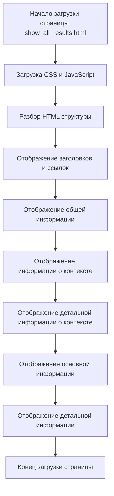

## Анализ кода `show_all_results.html`

### 1. **<алгоритм>**

HTML-файл `show_all_results.html` представляет собой страницу, предназначенную для отображения результатов выполнения XPath-выражений в расширении браузера. Вот пошаговое описание его работы:

1.  **Загрузка страницы:** Браузер загружает файл `show_all_results.html`.
2.  **Подключение ресурсов:**
    *   Загружаются скрипты `try_xpath_functions.js` и `show_all_results.js`.
    *   Загружается файл стилей `show_all_results.css`.
3.  **Отображение заголовков и ссылок:**
    *   Отображается заголовок "Export links".
    *   Отображаются две ссылки: "Plain text" и "Some values are converted by JSON.stringify."
4.  **Отображение информации:**
    *   Отображается таблица с информацией о:
        *   Сообщение (Message)
        *   Заголовок (Title)
        *   URL
        *   frameId
5.  **Отображение контекстной информации:**
    *   Отображается таблица с информацией о контексте выполнения XPath:
        *   Метод (Method)
        *   Выражение (Expression)
        *   Указанный тип результата (Specified resultType)
        *   Тип результата (resultType)
        *   Резолвер (Resolver)
    *   Отображается таблица для подробной информации о контексте (`context-detail`).
6.  **Отображение основной информации:**
    *   Отображается таблица с основной информацией о выполнении XPath:
        *   Метод (Method)
        *   Выражение (Expression)
        *   Указанный тип результата (Specified resultType)
        *   Тип результата (resultType)
        *   Резолвер (Resolver)
        *   Количество (Count)
    *   Отображается таблица для подробной информации о результатах (`main-details`).

**Примеры:**

*   **Загрузка скриптов:** После загрузки страницы, браузер загружает и выполняет Javascript код из `try_xpath_functions.js` (который, вероятно, содержит общие функции для работы с XPath) и `show_all_results.js` (который, скорее всего, отвечает за заполнение данными текущей страницы).
*   **Заполнение таблицы информации:** Javascript код (`show_all_results.js`) получает данные о результате XPath и динамически заполняет значения в ячейках таблицы (`#message`, `#title`, `#url`, `#frame-id` и др.).
*   **Экспорт ссылок:** При клике на ссылки "Plain text" или "Some values are converted by JSON.stringify." Javascript код, вероятно, подготавливает данные и предоставляет их для скачивания или копирования.

### 2.  **<mermaid>**

**Зависимости:**

В представленном коде HTML-страницы нет явных импортов, однако есть подключение внешних ресурсов:
*   `../scripts/try_xpath_functions.js`: Этот файл содержит общие JavaScript-функции, которые используются для обработки XPath. Он является частью проекта и необходим для работы основного функционала расширения.
*   `show_all_results.js`: Этот файл содержит JavaScript-код, специфичный для данной страницы. Вероятно, он отвечает за заполнение данных на странице и обработку событий экспорта. Он также является частью проекта и взаимодействует с `try_xpath_functions.js`.
*   `show_all_results.css`: Этот файл содержит стили для отображения элементов на странице. Он не влияет на логику приложения, но важен для представления.

### 3. **<объяснение>**

**Импорты**:

*   `../scripts/try_xpath_functions.js`: Этот скрипт является общим для расширения и содержит функции для выполнения XPath-запросов. Он нужен для того, чтобы скрипт `show_all_results.js` мог использовать общую логику обработки. Поскольку файл находится на один уровень выше, он является частью того же проекта.

*   `show_all_results.js`: Этот скрипт является специфичным для страницы `show_all_results.html` и отвечает за динамическое обновление контента на странице на основе результатов XPath. Взаимодействие с `try_xpath_functions.js` вероятно происходит через вызовы определенных функций.

**Переменные**:
*   `MODE = 'debug'`: Эта переменная устанавливает режим работы расширения, что может влиять на вывод отладочной информации или иное поведение скрипта. Эта переменная не используется в HTML, но имеет значение для всего проекта.

**HTML Структура**:
   * **`<head>`**: Содержит метаданные, заголовок страницы и ссылки на внешние ресурсы: JavaScript и CSS.
   * **`<body>`**: Содержит основной контент страницы, разделенный на блоки:
     * **Export Links (`div` -> `ul` -> `li` -> `a`)**: Содержит ссылки для экспорта результатов в формате простого текста или JSON.
     * **Information (`div` -> `table` -> `tbody` -> `tr` -> `th`, `td`)**: Таблица для отображения общей информации о запросе (сообщение, заголовок, URL, frameId).
     * **Context Information (`div` -> `table` -> `tbody` -> `tr` -> `th`, `td`)**: Таблица для отображения контекстной информации (метод, выражение, тип результата, резолвер).
     * **Context Detail (`div` -> `table` -> `tbody`)**: Таблица для детальной информации о контексте. Заполняется динамически.
     * **Main Information (`div` -> `table` -> `tbody` -> `tr` -> `th`, `td`)**: Таблица для отображения основной информации о запросе (метод, выражение, тип результата, резолвер, количество).
     * **Main Detail (`div` -> `table` -> `tbody`)**: Таблица для детальной информации о результатах. Заполняется динамически.

**Объяснение**:

Файл `show_all_results.html` предназначен для отображения результатов работы расширения, которое выполняет XPath-выражения.

*   Страница организована в виде набора таблиц и ссылок, которые позволяют пользователю увидеть информацию о запросе, контексте выполнения и полученных результатах.

*   Javascript, подключенные в теге `<head>`, отвечают за динамическое заполнение таблиц, обработку событий и, возможно, за экспорт данных.

*   Стилизация выполняется файлом `show_all_results.css`, что обеспечивает структурированное и читаемое отображение контента.

**Потенциальные ошибки и области для улучшения**:
* Отсутствие обработки ошибок: Javascript может не обрабатывать ситуации, когда данные отсутствуют или имеют некорректный формат.
*   Повторение HTML структуры: Блоки для "context information" и "main information" имеют схожую структуру, что может быть переработано с использованием шаблонов.
*   Отсутствие защиты от XSS: Если данные, полученные от пользователя, отображаются напрямую, это может создать уязвимость XSS.
*   Отсутствие асинхронности: Если скрипты выполняют длительные операции, это может привести к зависанию страницы.

**Цепочка взаимосвязей:**
1.  **`src/webdriver/edge/extentions/try_path_1.3.5/try_xpath.py`** (не показан в коде, но по пути файла предположительно является точкой входа)  : Запускает расширение, которое выполняет XPath.
2.  **`src/webdriver/edge/extentions/try_path_1.3.5/background.js`** (подразумевается): Обрабатывает запросы от try_xpath.py и запускает выполнение XPath в контексте браузера.
3.  **`src/webdriver/edge/extentions/try_path_1.3.5/scripts/try_xpath_functions.js`**:  Содержит общие функции для выполнения XPath, используемые в background.js и show_all_results.js.
4. **`src/webdriver/edge/extentions/try_path_1.3.5/pages/show_all_results.html`**: отображает полученные результаты.
5.  **`src/webdriver/edge/extentions/try_path_1.3.5/pages/show_all_results.js`**:  Заполняет  `show_all_results.html` данными о результатах XPath.
6. **`src/webdriver/edge/extentions/try_path_1.3.5/pages/show_all_results.css`**: придает стиль странице.