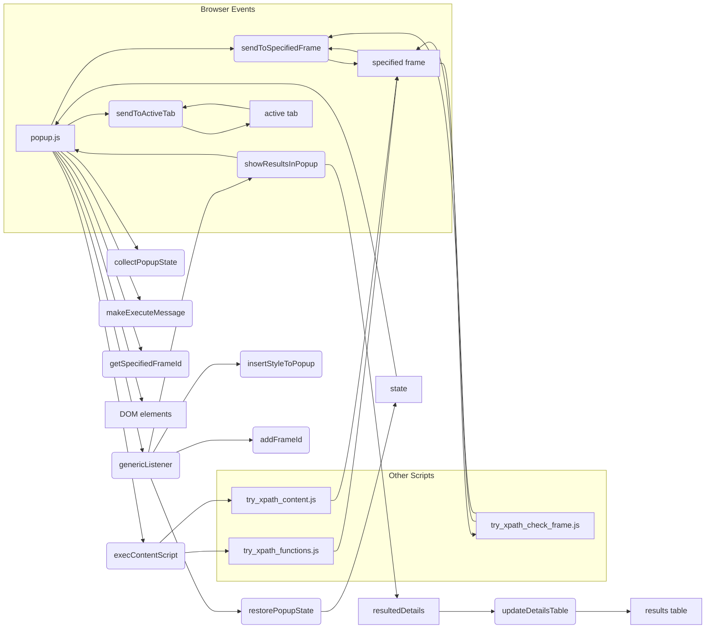

# Анализ кода popup.js

## <input code>

```javascript
/* This Source Code Form is subject to the terms of the Mozilla Public
 * License, v. 2.0. If a copy of the MPL was not distributed with this
 * file, You can obtain one at http://mozilla.org/MPL/2.0/. */

(function (window) {
    "use strict";

    // alias
    var tx = tryxpath;
    var fu = tryxpath.functions;

    var document = window.document;

    // ... (остальной код)
});
```

## <algorithm>

Код представляет собой скрипт для расширения браузера, управляющий взаимодействием с вкладкой/рамкой.  Подробный алгоритм сложен и требует анализа всех функций.

**Шаг 1:** Инициализация переменных.
-  Сохраняются ссылки на DOM-элементы.
- Инициализируются переменные, связанные с результатами, состоянием, и ID.

**Шаг 2:** Функции для отправки сообщений.
- `sendToActiveTab`: Отправляет сообщение активной вкладке.
- `sendToSpecifiedFrame`: Отправляет сообщение указанной рамке.

**Шаг 3:** Функции для обработки состояния.
- `collectPopupState`: Собрать текущее состояние из элементов формы.
- `changeContextVisible`, `changeResolverVisible`, `changeFrameIdVisible` и т.д.: Изменяют видимость секций интерфейса.
- `changeHelpVisible`: Изменяет видимость help-блока.

**Шаг 4:** Функция для формирования сообщения.
- `makeExecuteMessage`: Собирает данные для отправки в контентную страницу, основываясь на выбранных параметрах.

**Шаг 5:** Функция для получения frameId.
- `getSpecifiedFrameId`:  Возвращает ID выбранной рамки.

**Шаг 6:** Функции для выполнения скриптов.
- `execContentScript`: Выполняет скрипты (`try_xpath_functions.js`, `try_xpath_content.js`) на странице.

**Шаг 7:** Обработка событий.
- `handleExprEnter`: Обрабатывает нажатие Enter в строке выражения.
- `showDetailsPage`: Показывает результаты в таблице, обрабатывая постраничный вывод.
- `showError`: Выводит ошибку в интерфейсе.
- `genericListener`: Слушатель событий для обработки сообщений от контентной страницы.  (ключевой момент, соединяет расширение с содержанием страницы.)

**Шаг 8:** Инициализация событий при загрузке.
- Привязка обработчиков событий для кнопок, элементов ввода и т. д.
- Установка обратных вызовов для различных событий.
- `window.addEventListener("load", ...)`: Начинает работу скрипта при загрузке страницы расширения.


## <mermaid>



## <explanation>

**Импорты:**

- `tx = tryxpath;` и `fu = tryxpath.functions;`:  Эти строки импортируют переменные `tryxpath` и `tryxpath.functions` из, предположительно, модуля `tryxpath` (вероятно, из другого файла или модуля скрипта расширения). Это, вероятно, содержит функции для работы с XPath выражениями и другими вспомогательными функциями, используемыми в этом скрипте.

**Классы:**

Нет явных классов в коде.  В основном используются функции и глобальные переменные.

**Функции:**

- `sendToActiveTab(msg, opts)`: Отправляет сообщение заданной вкладке.  `msg` - само сообщение, `opts` - дополнительные параметры.
- `sendToSpecifiedFrame(msg)`: Отправляет сообщение конкретной рамке (frame) в активной вкладке. Использует `browser.tabs.executeScript` для выполнения скриптов на стороне контента. Очень важное взаимодействие с другими частями расширения.
- `collectPopupState()`: Собирает значения из элементов управления (input, select) в popup-окне, возвращая объект `state` для сохранения/восстановления.
- `changeContextVisible()`, `changeResolverVisible()`, `changeFrameIdVisible()`, `changeFrameDesignationVisible()`, `changeHelpVisible()`: Изменяют видимость отдельных секций в интерфейсе.  Эти функции обрабатывают логику скрытия/показа элементов, основываясь на состоянии переключателей.
- `makeExecuteMessage()`: Формирует и возвращает сообщение для отправки в контентный скрипт. Это сообщение содержит XPath выражения и другие настройки.
- `getSpecifiedFrameId()`: Возвращает ID рамки, выбранной пользователем. Важная функция для определения, на какой конкретной части страницы необходимо выполнить XPath выражения.
- `execContentScript()`: Выполняет скрипты в рамках вкладки. Важно для взаимодействия с контентом страницы.
- `showDetailsPage(index)`: Выводит результаты запроса (постранично) в popup-окне.
- `showError(message, frameId)`: Выводит сообщение об ошибке в popup-окне.
- `genericListener`: Обрабатывает сообщения, приходящие из контентного скрипта.  Является ключевым звеном для обмена данными между popup и контентной частью расширения.  Важно обратить внимание на обработку событий `showResultsInPopup`, `restorePopupState`, `insertStyleToPopup` and `addFrameId`.


**Переменные:**

Многие переменные – ссылки на DOM-элементы (например, `mainExpression`, `resultsTbody`, `helpCheckbox`). Это позволяет скрипту получить доступ и управлять элементами интерфейса. Есть также переменные, хранящие состояние (`relatedTabId`, `executionId`, `resultedDetails`), которые нужны для управления результатами и сессиями.

**Возможные ошибки и улучшения:**

- **Обработка ошибок:** В `showError` есть логика для установки `resultedDetails = []`, но не хватает более подробной обработки ошибок (try/catch) во многих функциях, которые взаимодействуют с браузерными API.
- **Проверка значений:** При обработке ввода (например, `parseInt(frameIdExpression.value, 10)`) нет проверки на корректный ввод, что может привести к ошибкам. Нужно добавить проверки типа данных.
- **Избыточность кода:** Несколько функций (`changeContextVisible` и т. д.) имеют похожую структуру. Возможно, стоит обобщить их.


**Взаимосвязи с другими частями проекта:**

Код сильно связан с контентными скриптами (`try_xpath_check_frame.js`, `try_xpath_functions.js`, `try_xpath_content.js`). Эти скрипты выполняют XPath выражения и возвращают результаты в popup.  Обратите внимание на `browser.tabs.executeScript` и `browser.tabs.sendMessage` для связи с контентом.