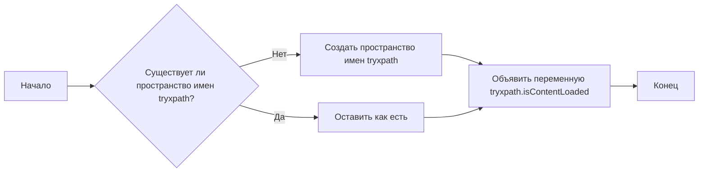

## АНАЛИЗ КОДА

### 1. <алгоритм>

**Блок-схема:**



**Описание шагов:**

1. **Начало:**  Начинается выполнение скрипта.
2. **Проверка пространства имен `tryxpath`:** Проверяется, существует ли уже пространство имен с именем `tryxpath`. Это делается для того, чтобы избежать переопределения, если оно уже создано.
   *  **Пример:** Если переменная `tryxpath` уже объявлена в другом скрипте, условие будет истинным и код перейдет к шагу 3. Если нет, то к шагу 4.
3. **Сохранить как есть:** Если пространство имен `tryxpath` уже существует, то никаких изменений не происходит.
4. **Создание пространства имен `tryxpath`:** Если пространство имен `tryxpath` не существует, то оно создается как пустой объект.
   *  **Пример:** `tryxpath = {}` создает новый объект, который будет использоваться для хранения переменных и функций, связанных с `tryxpath`.
5. **Объявление переменной `tryxpath.isContentLoaded`:**  Объявляется переменная `tryxpath.isContentLoaded` в созданном (или существующем) пространстве имен. Значение этой переменной не присваивается, и она по умолчанию будет `undefined`.
6. **Конец:** Завершение работы скрипта.

### 2. <mermaid>

```mermaid
flowchart TD
    Start[Начало] --> CheckNamespace{Проверка существования tryxpath};
    CheckNamespace -- Существует --> SkipCreation[Пропустить создание];
    CheckNamespace -- Не существует --> CreateNamespace[Создать tryxpath как пустой объект];
    SkipCreation --> DeclareVariable[Объявить tryxpath.isContentLoaded];
    CreateNamespace --> DeclareVariable;
    DeclareVariable --> End[Конец];
    
    
    classDef default fill:#f9f,stroke:#333,stroke-width:2px
    class Start,End, CheckNamespace, SkipCreation, CreateNamespace,DeclareVariable default
```

**Объяснение диаграммы:**

Диаграмма показывает поток выполнения скрипта. Сначала проверяется, существует ли переменная `tryxpath`. Если да, то шаг создания пространства имен пропускается. Если нет, то создается пустое пространство имен `tryxpath`. В любом случае, объявляется переменная `tryxpath.isContentLoaded`.

### 3. <объяснение>

**Импорты:**
В данном коде отсутствуют импорты.  Скрипт является самодостаточным в контексте пространства имен.

**Классы:**
В данном коде нет классов.

**Функции:**
В данном коде нет функций.

**Переменные:**

*   `tryxpath`:
    *   **Тип:**  Объект.
    *   **Назначение:**  Пространство имен (namespace) для хранения переменных и функций, связанных с  `tryxpath`. Это позволяет избежать конфликтов имен с другими скриптами, работающими на той же странице.  Это распространенный паттерн в JavaScript.
    *   **Пример:**  Если этот код выполняется на странице, где уже есть переменная с таким же названием, то переменная `tryxpath` не будет переопределена, а будет использована уже существующая, если такая есть.
*   `tryxpath.isContentLoaded`:
    *   **Тип:**  `undefined` (до момента присваивания какого-либо значения).
    *   **Назначение:** Эта переменная, скорее всего, будет использоваться для отслеживания, загружен ли контент, к которому нужно применить XPath. Значение по умолчанию не установлено и, вероятно, будет установлено где-то далее в коде.

**Потенциальные ошибки и области для улучшения:**

*   **Отсутствие значения для `tryxpath.isContentLoaded`:**  Код объявляет переменную, но не присваивает ей значения. Это подразумевает, что где-то в другом коде будет присвоено значение этой переменной. Это место могло бы быть прокомментировано.
*   **Глобальное пространство имен:** Если множество расширений или скриптов пытаются использовать такое же пространство имен, то все таки могут возникнуть конфликты. Уникализация пространств имен было бы хорошей практикой.
*   **Неочевидность назначения** Переменная `tryxpath.isContentLoaded` должна быть описана, чтобы было понятно, для чего она предназначена.

**Цепочка взаимосвязей:**
Этот скрипт, вероятно, является частью расширения браузера, предназначенного для работы с XPath. Его цель - создать собственное пространство имен `tryxpath` и объявить в нем переменную `isContentLoaded`. Другие части расширения будут использовать это пространство имен для доступа к переменным и функциям.

**Взаимосвязь с другими частями проекта:**

Вероятнее всего, другие части проекта будут использовать `tryxpath.isContentLoaded` для синхронизации операций. Например, если `tryxpath.isContentLoaded` будет установлено в `true`, то другие части кода, которые ожидают загрузку контента, начнут свою работу.