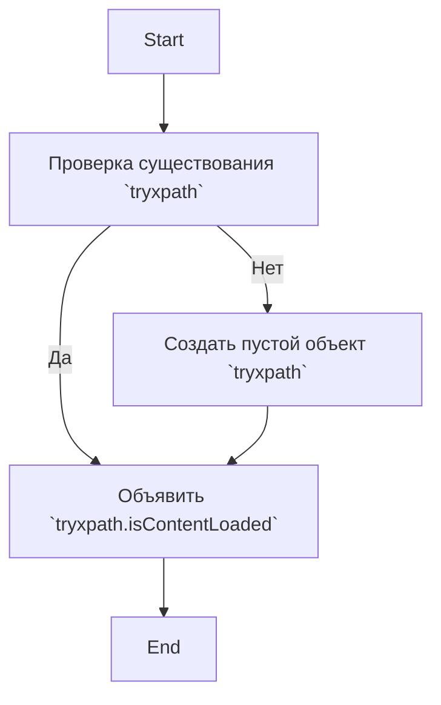

## Анализ кода `try_xpath_check_frame.js`

### 1. <алгоритм>

**Блок-схема:**

1. **Проверка наличия пространства имен `tryxpath`:**
   -  Проверяется, существует ли уже объект `tryxpath` в глобальной области видимости.
   -  *Пример:* Если переменная `tryxpath` не была ранее определена, то условие `!tryxpath` будет истинным.

2. **Создание пространства имен `tryxpath` (при необходимости):**
    - Если `tryxpath` не существует, создается пустой объект `tryxpath` (`var tryxpath = {};`).
     - *Пример:* После этой операции `tryxpath` будет существовать как пустой объект.

3. **Объявление переменной `tryxpath.isContentLoaded`:**
    - Объявляется переменная `tryxpath.isContentLoaded`, но ей не присваивается начальное значение.
     - *Пример:* После этой операции `tryxpath.isContentLoaded` будет существовать, но ее значение будет `undefined`.

### 2. <mermaid>

**Зависимости:**

Диаграмма показывает последовательность операций, выполняемых скриптом. Нет явных импортируемых зависимостей, поскольку код просто проверяет и создает объект в глобальной области видимости, а также объявляет переменную внутри этого объекта.

### 3. <объяснение>

**Импорты:**
   - В данном коде нет явных импортов. Код работает с глобальной областью видимости JavaScript, проверяя наличие переменной `tryxpath` и создавая её, если она не существует. Он не зависит от других модулей или библиотек.

**Классы:**
   - В коде нет классов.

**Функции:**
   - В коде нет функций.

**Переменные:**
   - `tryxpath`: Это переменная, которая используется в качестве пространства имен (namespace) для хранения переменных и функций, связанных с функционалом `tryxpath`.
   - `tryxpath.isContentLoaded`: Эта переменная предназначена для хранения состояния, указывающего, загружен ли контент. На данный момент ей не присвоено никакого значения, поэтому по умолчанию ее значение `undefined`.

**Потенциальные ошибки и улучшения:**
   - **Отсутствие начального значения:** Переменная `tryxpath.isContentLoaded` объявляется без начального значения. Это может привести к ошибкам, если код, использующий эту переменную, не ожидает значения `undefined`. Было бы полезно инициализировать ее значением `false` или другим значением по умолчанию.
   - **Неявная глобальная область видимости:** Использование глобальной переменной `tryxpath` может привести к конфликтам с другими частями кода, которые также используют `tryxpath` в глобальной области видимости. Лучше использовать модульную систему для организации кода и избегания таких конфликтов.
   - **Комментарий MPL:** В начале файла есть комментарий о лицензии MPL (Mozilla Public License). Он важен, но не влияет на функциональность кода.
   - **Потенциальное отсутствие документации:** Отсутствие комментария о предназначении `tryxpath.isContentLoaded` может усложнить понимание кода в будущем.

**Взаимосвязи с другими частями проекта:**

Данный скрипт, судя по названию файла `try_xpath_check_frame.js`, вероятно, используется для проверки корректности XPath в контексте веб-страницы, включая iframe. Этот скрипт, скорее всего, является частью большего расширения для браузера, где `tryxpath` служит пространством имен для группировки связанных функций и переменных. Вероятно, в других частях проекта будет происходить присвоение значения `tryxpath.isContentLoaded` и ее дальнейшее использование для определения готовности веб-страницы.