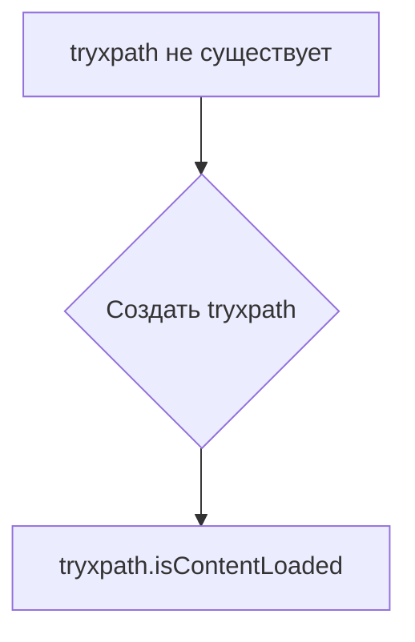

# Анализ кода try_xpath_check_frame.js

## <input code>

```javascript
/* This Source Code Form is subject to the terms of the Mozilla Public
 * License, v. 2.0. If a copy of the MPL was not distributed with this
 * file, You can obtain one at http://mozilla.org/MPL/2.0/. */

// namespace
if (!tryxpath) {
    var tryxpath = {};
}

tryxpath.isContentLoaded;
```

## <algorithm>

Этот код очень прост и представляет собой лишь объявление пространства имён и переменной.  Пошаговая блок-схема здесь не требуется, так как нет циклов или сложных вычислений.

**Пример:**

Команда `if (!tryxpath)` проверяет, существует ли объект `tryxpath`. Если нет, создается пустой объект `tryxpath`.  Затем `tryxpath.isContentLoaded;` просто ссылается на существование (или отсутствие) свойства `isContentLoaded` внутри объекта.


## <mermaid>



## <explanation>

**Импорты:** Нет импортов. Код работает в контексте существующего проекта, вероятно, используя глобальные переменные или импорты, не показанные в этом фрагменте.

**Классы:** Нет классов.

**Функции:** Нет функций.

**Переменные:**
- `tryxpath`: Переменная, которая представляет собой объект JavaScript. Если объект не существует, то создается пустой объект.  Эта переменная (объект) является частью пространства имен.

**Возможные ошибки или области для улучшений:**

- **Отсутствие контекста:**  Код слишком фрагментарный, чтобы полностью понять его работу. Неясно, как эта переменная `tryxpath.isContentLoaded` будет использована дальше в коде. Для полноценного понимания необходим контекст, в котором эта строка выполняется.  Непонятно, выполняется ли проверка содержания внутри определённых функций (например, проверка, загрузился ли iframe).
- **Условное объявление:** Использование `if (!tryxpath)` для проверки и создания объекта `tryxpath` - стандартная практика, но возможно, что это дублирует проверку в других частях проекта, если она используется.

**Цепочка взаимосвязей:**

Без дополнительного контекста, сложно точно определить взаимосвязь с другими частями проекта.  По всей вероятности, `tryxpath.isContentLoaded` используется в дальнейшем в скриптах, работающих в браузере для определения того, загрузилась ли страница полностью.  Например, для работы каких-либо функций, зависящих от полной загрузки содержания страницы (или фрейма).  Возможно, в других файлах есть функции, устанавливающие значение этого свойства.

**Заключение:**

Код представляет собой очень простую часть структуры, необходимой для работы более сложной логики, скорее всего, для взаимодействия с веб-страницей. Для полноценного анализа нужен контекст, в котором используется эта переменная.