## Анализ кода `try_xpath_content.js`

### 1. <алгоритм>

**Блок-схема:**

```mermaid
graph LR
    A[Начало] --> B{Проверка: скрипт уже загружен?};
    B -- Да --> Z[Конец];
    B -- Нет --> C[Установка флага: isContentLoaded = true];
    C --> D[Инициализация переменных];
    D --> E[Определение функций setAttr, setIndex, isFocusable, focusItem, setMainAttrs, restoreAttrs, resetPrev, makeTypeStr, updateCss, getFrames, parseFrameDesignation, traceBlankWindows, handleCssChange, findFrameByMessage, setFocusFrameListener, initBlankWindow, findStyleParent, updateStyleElement, updateAllStyleElements, removeStyleElement, removeAllStyleElements, createResultMessage];
    E --> F[Определение и настройка genericListener];
    F --> G[Установка слушателя сообщений от расширения (browser.runtime.onMessage)];
    G --> H{Слушатель: setContentInfo};
    H -- Да --> I[Обновление атрибутов];
    H -- Нет --> J{Слушатель: execute};
    J -- Да --> K[Сброс предыдущих результатов (resetPrev)];
    K --> L[Запрос на обновление CSS (updateCss)];
    L --> M[Подготовка сообщения для попапа (showResultsInPopup)];
    M --> N{Проверка наличия frameDesignation};
    N -- Да --> O[Получение и проверка фрейма];
    O -- Ошибка --> P[Отправка сообщения об ошибке];
    O -- Фрейм найден --> Q[Установка контекста для фрейма];
    N -- Нет --> Q;
    Q --> R{Проверка наличия context};
    R -- Да --> S[Выполнение выражения для контекста (execExpr)];
     S -- Ошибка --> T[Отправка сообщения об ошибке];
     S -- Нет контекста --> U[Отправка сообщения об ошибке];
    S -- Контекст найден --> V[Установка контекста];
    R -- Нет --> V;
    V --> W[Выполнение основного выражения (execExpr)];
    W -- Ошибка --> X[Отправка сообщения об ошибке];
    W -- Результат получен --> Y[Формирование и отправка сообщения с результатами];
    Y --> AA[Установка основных атрибутов (setMainAttrs)];
    AA --> AB{Проверка: inBlankWindow?};
    AB -- Да --> AC[Обновление стилей в текущем документе];
    AB -- Нет --> AD;
     AD --> Z;

    J -- Нет --> AE{Слушатель: focusItem};
    AE -- Да --> AF[Фокус на элементе];
    AE -- Нет --> AG{Слушатель: focusContextItem};
    AG -- Да --> AH[Фокус на контексте];
    AG -- Нет --> AI{Слушатель: focusFrame};
    AI -- Да --> AJ[Фокус на фрейме];
    AI -- Нет --> AK{Слушатель: requestShowResultsInPopup};
      AK -- Да --> AL[Отправка предыдущего сообщения для показа результатов];
    AK -- Нет --> AM{Слушатель: requestShowAllResults};
    AM -- Да --> AN[Отправка предыдущего сообщения для показа всех результатов];
    AM -- Нет --> AO{Слушатель: resetStyle};
    AO -- Да --> AP[Сброс стилей];
    AO -- Нет --> AQ{Слушатель: setStyle};
    AQ -- Да --> AR[Обновление стилей и атрибутов];
    AQ -- Нет --> AS{Слушатель: finishInsertCss};
    AS -- Да --> AT[Завершение вставки CSS];
     AS -- Нет --> AU{Слушатель: finishRemoveCss};
    AU -- Да --> AV[Завершение удаления CSS];
    AU -- Нет --> AW[Установка слушателя изменений в хранилище браузера];
    AW --> AX[Установка слушателя сообщений от других окон];
    AX --> AY[Отправка сообщения о готовности];
    AY --> Z;
    
    
    
     
    
```

**Примеры:**

*   **Инициализация переменных:**
    *   `dummyItem` = "" (пустая строка).
    *   `dummyItems` = [] (пустой массив).
    *   `invalidExecutionId` = NaN (не число).
    *   `attributes` =  объект с атрибутами для элементов.
    *   `executionCount` = 0 (счетчик выполненных запросов).

*   **Функция `setAttr`:**
    *   `setAttr("data-tryxpath-focused", "true", element)` - устанавливает атрибут `data-tryxpath-focused` в значение `true` для элемента `element`.

*   **Функция `focusItem`:**
    *   Выделяет элемент (добавляет атрибут `data-tryxpath-focused="true"`).

*   **Функция `execute`:**
    *   Получает сообщение с XPath выражением (например, `message.main.expression = "//div"`) и контекстным выражением `message.context.expression = "//body"`.
    *   Выполняет XPath выражение относительно контекста и отмечает найденные элементы атрибутами.
    *   Если есть `frameDesignation` -  то ищет фрейм и делает его контекстом.

*   **Функция `genericListener`:**
    *   Обрабатывает сообщения от расширения, перенаправляя их соответствующим функциям (`execute`, `focusItem` и т.д.).

```mermaid
flowchart TD
    subgraph tryxpath
        Start(Start) --> InitializeVariables[Initialize Variables]
        InitializeVariables --> DefineFunctions[Define Functions]
        DefineFunctions --> SetupGenericListener[Setup Generic Listener]
        SetupGenericListener --> AddRuntimeMessageListener[Add Runtime Message Listener]
        AddRuntimeMessageListener --> AddStorageChangeListener[Add Storage Change Listener]
        AddStorageChangeListener --> AddWindowMessageListener[Add Window Message Listener]
        AddWindowMessageListener --> RequestContentInfo[Request Content Info]

    
        subgraph genericListener.listeners
            
             AddRuntimeMessageListener --> setContentInfoListener{setContentInfo Listener}
             setContentInfoListener --> UpdateAttributes[Update attributes]
            UpdateAttributes --> End
            
            AddRuntimeMessageListener --> executeListener{execute Listener}
            executeListener --> ResetPrev[Reset Previous State]
            ResetPrev --> UpdateCssCall[Update CSS]
            UpdateCssCall --> PrepareMessage[Prepare Message for Popup]
            PrepareMessage --> CheckFrameDesignation[Check frameDesignation]
            CheckFrameDesignation -- Yes --> GetFrame[Get Frame]
            GetFrame -- Error --> SendError[Send Error Message to popup]
            GetFrame --> SetContextFrame[Set context to the frame]
            CheckFrameDesignation -- No --> SetContextFrame
           
             SetContextFrame --> CheckContext[Check context]
           CheckContext -- Yes --> ExecuteContextExpression[Execute context expression]
             ExecuteContextExpression -- Error --> SendError
            ExecuteContextExpression -- No context --> SendError
            ExecuteContextExpression --> SetContext[Set Context]
           
           CheckContext -- No --> SetContext
            
           SetContext --> ExecuteMainExpression[Execute main expression]
            ExecuteMainExpression -- Error --> SendError
            ExecuteMainExpression --> PrepareSuccessMessage[Prepare Success Message]
            PrepareSuccessMessage --> SendResultsToPopup[Send Results to Popup]
            SendResultsToPopup --> SetMainElementAttributes[Set Main element attributes]
            SetMainElementAttributes --> UpdateStyleElementCheck[Check Blank window]
             UpdateStyleElementCheck -- Yes --> UpdateStyleElement[Update Style Element]
              UpdateStyleElementCheck -- No --> End
             UpdateStyleElement --> End
             SendError --> End
            
            AddRuntimeMessageListener --> focusItemListener{focusItem Listener}
            focusItemListener --> UpdateStyleElementCheckFocus[Check Blank window]
            UpdateStyleElementCheckFocus -- Yes --> UpdateStyleElementFocus[Update Style Element]
            UpdateStyleElementCheckFocus -- No --> FocusElement[Focus Item]
              UpdateStyleElementFocus --> FocusElement
            FocusElement --> End
           
            AddRuntimeMessageListener --> focusContextItemListener{focusContextItem Listener}
            focusContextItemListener --> UpdateStyleElementCheckContext[Check Blank window]
            UpdateStyleElementCheckContext -- Yes --> UpdateStyleElementContext[Update Style Element]
            UpdateStyleElementCheckContext -- No --> FocusContext[Focus Context Item]
             UpdateStyleElementContext --> FocusContext
            FocusContext --> End
            
           AddRuntimeMessageListener --> focusFrameListener{focusFrame Listener}
           focusFrameListener --> FocusFrameCheckFrameDesignation[Check Frame Design]
           FocusFrameCheckFrameDesignation -- Yes --> FindFocusFrame[Find frame]
           FocusFrameCheckFrameDesignation -- No --> PassFocusFrame
             FindFocusFrame -- Error --> SendFocusError[Send focus error message to popup]
               FindFocusFrame --> PassFocusFrame
               SendFocusError --> End
           PassFocusFrame --> SendFrameFocusMessage[Send focus message to parent frame]
           SendFrameFocusMessage --> End

           AddRuntimeMessageListener --> requestShowResultsInPopupListener{requestShowResultsInPopup Listener}
           requestShowResultsInPopupListener --> SendPreviousMessage[Send Previous Message]
           SendPreviousMessage --> End
           
           AddRuntimeMessageListener --> requestShowAllResultsListener{requestShowAllResults Listener}
           requestShowAllResultsListener --> SendPreviousAllMessage[Send Previous Message All]
           SendPreviousAllMessage --> End
           
           AddRuntimeMessageListener --> resetStyleListener{resetStyle Listener}
           resetStyleListener --> RestoreAttributes[Restore Attributes]
           RestoreAttributes --> RemoveAllStyleElementsCall[Remove All Style Elements]
           RemoveAllStyleElementsCall --> End
            
          AddRuntimeMessageListener --> setStyleListener{setStyle Listener}
           setStyleListener --> RestoreAttributesForStyle[Restore Attributes]
           RestoreAttributesForStyle --> UpdateCssCallForStyle[Update CSS]
             UpdateCssCallForStyle --> CheckBlankForStyle[Check Blank window]
            CheckBlankForStyle -- Yes --> UpdateStyleElementForStyle[Update Style Element]
            CheckBlankForStyle -- No --> SetMainAttributesForStyle[Set main attributes]
              UpdateStyleElementForStyle --> SetMainAttributesForStyle
           SetMainAttributesForStyle --> End
            
            AddRuntimeMessageListener --> finishInsertCssListener{finishInsertCss Listener}
           finishInsertCssListener --> SetCurrentCss[Set current css]
          SetCurrentCss --> UpdateAllStyleElements[Update all style elements]
           UpdateAllStyleElements --> End
           
           AddRuntimeMessageListener --> finishRemoveCssListener{finishRemoveCss Listener}
           finishRemoveCssListener --> DeleteCssFromSet[Delete Css From Set]
          DeleteCssFromSet --> End
            
        end

        subgraph browser.storage
             AddStorageChangeListener --> storageChangeListener{storageChangeListener}
              storageChangeListener --> UpdateAttributeFromStorage[Update attribute from storage]
             UpdateAttributeFromStorage --> CheckCSSFromStorage[Check CSS from storage]
              CheckCSSFromStorage --> HandleCssChangeFromStorage[Handle css change from storage]
              HandleCssChangeFromStorage --> End
        end
        
         subgraph window
           AddWindowMessageListener --> windowMessageListener{windowMessageListener}
           windowMessageListener --> CheckMessageId[Check message ID]
            CheckMessageId -- 0 --> SendErrorFromWindow[Send Error Message from Window]
            CheckMessageId -- 1 --> SendErrorFromWindow[Send Error Message from Window]
             SendErrorFromWindow --> End
        end
    
    
    end
```

### 2. <mermaid>



**Зависимости:**
*   `browser.runtime.onMessage`: Слушает сообщения, отправленные из popup.
*    `browser.storage.onChanged`: Слушает изменения в хранилище, для обновления атрибутов и CSS.
*   `window.addEventListener("message")`: Слушает сообщения от других окон или фреймов.
*   `tryxpath.functions` (alias `fu`): Используется для работы с элементами, атрибутами и выполнением XPath выражений.
*   `tryxpath`: Общий объект пространства имен для данного скрипта.

### 3. <объяснение>

**Импорты:**
*   Нет явных импортов, но используется глобальный объект `tryxpath`, предполагается что `tryxpath` и `tryxpath.functions` определены в другом файле. В данном коде создается только `alias` для них.

**Классы:**
*   Нет явных классов. Код использует JavaScript объекты и функции для организации логики.

**Функции:**

*   **`setAttr(attr, value, item)`**:
    *   Аргументы:
        *   `attr` (String): Атрибут, который нужно установить.
        *   `value` (String): Значение атрибута.
        *   `item` (HTMLElement): Элемент, которому нужно установить атрибут.
    *   Возвращаемое значение: Нет.
    *   Назначение: Сохраняет текущее значение атрибута и устанавливает новое значение для элемента.
    *   Пример: `setAttr("data-tryxpath-element", "true", document.querySelector("div"))` - устанавливает атрибут `data-tryxpath-element` в значение `true` для первого `div` элемента.
*   **`setIndex(attr, items)`**:
    *   Аргументы:
        *   `attr` (String): Атрибут, который нужно установить.
        *   `items` (Array<HTMLElement>): Массив элементов.
    *   Возвращаемое значение: Нет.
    *   Назначение: Устанавливает индексы для всех элементов в массиве, основываясь на их позиции в массиве, сохраняя прежние значения.
    *   Пример: `setIndex("data-tryxpath-element", document.querySelectorAll("div"))` - устанавливает атрибут `data-tryxpath-element` в значение индекса для каждого `div`.
*   **`isFocusable(item)`**:
    *   Аргументы:
        *   `item` (HTMLElement or Attr): Элемент или атрибут.
    *   Возвращаемое значение: `true` если элемент/атрибут может получить фокус, `false` в противном случае.
    *   Назначение: Проверяет, является ли элемент (или его часть) фокусируемым.
    *   Пример: `isFocusable(document.querySelector("button"))` - вернет `true`, `isFocusable(document.querySelector("div"))` - вернет `false`.
*   **`focusItem(item)`**:
    *   Аргументы:
        *   `item` (HTMLElement or Attr): Элемент или атрибут, на который нужно сфокусироваться.
    *   Возвращаемое значение: Нет.
    *   Назначение: Устанавливает фокус на элемент, сбрасывая фокус с предыдущего элемента.
    *   Пример: `focusItem(document.querySelector("button"))` - фокус на первую кнопку.
*  **`setMainAttrs()`**
    *   Аргументы: Нет
     *   Возвращаемое значение: Нет.
     *  Назначение: устанавливает основные атрибуты (`data-tryxpath-context`, `data-tryxpath-element`) на контекстный элемент и на все найденные элементы.
*   **`restoreAttrs()`**:
    *   Аргументы: Нет.
    *   Возвращаемое значение: Нет.
    *   Назначение: Восстанавливает все ранее сохраненные значения атрибутов элементов.
*   **`resetPrev()`**:
    *   Аргументы: Нет.
    *   Возвращаемое значение: Нет.
    *   Назначение: Сбрасывает все переменные, хранящие информацию о предыдущем результате.
*   **`makeTypeStr(resultType)`**:
    *   Аргументы:
        *   `resultType` (Number): Числовой код типа результата XPath.
    *   Возвращаемое значение: Строка, описывающая тип результата XPath.
    *   Назначение: Преобразует числовой код типа XPath в строку для отображения в popup.
    *   Пример: `makeTypeStr(0)` вернет "ANY_TYPE(0)"
*   **`updateCss()`**:
    *   Аргументы: Нет
    *    Возвращаемое значение: Нет.
     *    Назначение: Отправляет сообщение для запроса на обновление CSS, если текущий CSS пуст или есть просроченные CSS.
*    **`getFrames(spec)`**:
     *   Аргументы:
         *  `spec` (String): Строка с JSON массивом номеров фреймов.
    *    Возвращаемое значение: Массив HTMLElement.
     *   Назначение: Находит фреймы на основе спецификации.
*   **`parseFrameDesignation(frameDesi)`**:
    *   Аргументы:
        *   `frameDesi` (String): JSON строка с индексами фреймов.
    *   Возвращаемое значение: Массив индексов.
    *   Назначение: Парсит строку с индексами фреймов.
*  **`traceBlankWindows(desi, win)`**:
     *   Аргументы:
         *  `desi` (Array<Number>): Массив индексов фреймов.
         *  `win` (Window): окно, в котором искать.
    *    Возвращаемое значение: Объект `result`.
     *   Назначение: Ищет фреймы, удостоверившись, что они пустые и возвращает массив этих фреймов.
*   **`handleCssChange(newCss)`**:
    *   Аргументы:
        *   `newCss` (String): Новая строка CSS.
    *   Возвращаемое значение: Нет.
    *   Назначение: Обрабатывает изменение CSS, устанавливает новый CSS, и отмечает предыдущий CSS как устаревший.
*   **`findFrameByMessage(event, win)`**:
    *   Аргументы:
        *   `event` (Event): Событие, содержащее данные.
        *   `win` (Window): окно, в котором искать.
    *   Возвращаемое значение: `HTMLElement` фрейма.
    *   Назначение: Находит элемент фрейма по индексу, указанному в сообщении.
*   **`setFocusFrameListener(win, isBlankWindow)`**:
    *   Аргументы:
        *   `win` (Window): окно, в котором установить слушателя.
        *   `isBlankWindow` (Boolean): Является ли окно пустым.
    *   Возвращаемое значение: Нет.
    *   Назначение: Устанавливает слушателя на сообщения для переключения фокуса на фрейм.
*   **`initBlankWindow(win)`**:
    *   Аргументы:
        *   `win` (Window): окно, для которого нужно провести инициализацию.
    *   Возвращаемое значение: Нет.
    *   Назначение: Инициализирует пустые окна для отслеживания фокуса.
*   **`findStyleParent(doc)`**:
    *   Аргументы:
        *   `doc` (Document): документ, в котором нужно найти head или body.
    *   Возвращаемое значение: head или body документа.
    *   Назначение: Возвращает родительский элемент (head или body) для вставки элемента style.
*    **`updateStyleElement(doc)`**:
     *   Аргументы:
         *  `doc` (Document): документ, в котором обновить стили.
    *   Возвращаемое значение: Нет.
     *   Назначение: Обновляет или создает `style` элемент в head или body документа.
*    **`updateAllStyleElements()`**:
     *   Аргументы: Нет.
    *   Возвращаемое значение: Нет.
     *   Назначение: Обновляет все элементы `style`.
*   **`removeStyleElement(doc)`**:
    *   Аргументы:
        *   `doc` (Document): документ, из которого нужно удалить `style` элемент.
    *   Возвращаемое значение: Нет.
    *   Назначение: Удаляет style элемент из документа.
*   **`removeAllStyleElements()`**:
    *   Аргументы: Нет.
    *   Возвращаемое значение: Нет.
    *   Назначение: Удаляет все элементы style.
*  **`createResultMessage()`**:
    *   Аргументы: Нет.
    *   Возвращаемое значение: Объект сообщения с пустыми значениями.
    *   Назначение: Создает шаблон сообщения для передачи результатов в попап.
*   **`genericListener(message, sender, sendResponse)`**:
    *   Аргументы:
        *   `message` (Object): Сообщение от расширения.
        *   `sender` (Object): Информация об отправителе сообщения.
        *   `sendResponse` (Function): Функция для отправки ответа.
    *   Возвращаемое значение: Нет.
    *   Назначение: Маршрутизирует сообщения к соответствующим обработчикам.

**Переменные:**

*   `tx` (Object): alias для `tryxpath`.
*   `fu` (Object): alias для `tryxpath.functions`.
*   `isContentLoaded` (Boolean): Флаг, предотвращающий повторную загрузку скрипта.
*   `dummyItem` (String): Пустая строка.
*   `dummyItems` (Array): Пустой массив.
*   `invalidExecutionId` (Number): Невалидный ID выполнения.
*  `styleElementHeader` (String): Заголовок для `style` элемента.
*   `attributes` (Object): Объект с именами атрибутов.
*   `prevMsg` (Object): Сообщение с предыдущими результатами.
*   `executionCount` (Number): Счетчик выполненных запросов.
*   `inBlankWindow` (Boolean): Флаг, указывающий, что скрипт выполняется в пустом окне.
*  `currentDocument` (Document): Текущий документ.
*   `contextItem` (HTMLElement): Текущий контекстный элемент.
*   `currentItems` (Array<HTMLElement>): Массив элементов, полученных в результате выполнения XPath выражения.
*   `focusedItem` (HTMLElement): Элемент, находящийся в фокусе.
*   `focusedAncestorItems` (Array<HTMLElement>): Массив предков элемента, находящегося в фокусе.
*   `currentCss` (String): Текущий CSS.
*   `insertedStyleElements` (Map): Словарь для хранения style элементов, добавленных в документ.
*  `expiredCssSet` (Object): Словарь с просроченными CSS.
*   `originalAttributes` (Map): Словарь для хранения первоначальных атрибутов элементов.

**Потенциальные ошибки и области для улучшения:**

*   **Обработка ошибок:** Код местами использует `try...catch` для обработки ошибок, но не везде. Нужно убедиться, что все потенциальные ошибки обработаны корректно, предоставляя пользователю понятное сообщение.
*   **Производительность:** Некоторые операции, такие как `querySelectorAll`, могут быть медленными на больших страницах. Возможно, стоит оптимизировать эти операции.
*   **Безопасность:** Использование `eval` или `new Function` может создать уязвимости. В данном коде есть использование `JSON.parse`, поэтому нужно убедиться, что принимаемые данные корректны.
*   **Расширяемость:** Код достаточно сложный, что может затруднить его дальнейшее расширение и поддержку. Следует рассмотреть возможность его рефакторинга и разбиения на более мелкие модули.

**Цепочка взаимосвязей с другими частями проекта:**

*   Скрипт взаимодействует с popup через механизм обмена сообщениями `browser.runtime.sendMessage` и `browser.runtime.onMessage.addListener`.
*   Скрипт использует функции из `tryxpath.functions` для выполнения XPath выражений и работы с элементами.
*   Скрипт использует `browser.storage` для сохранения и получения пользовательских настроек.

Этот подробный анализ должен предоставить исчерпывающее понимание функциональности и архитектуры `try_xpath_content.js`.