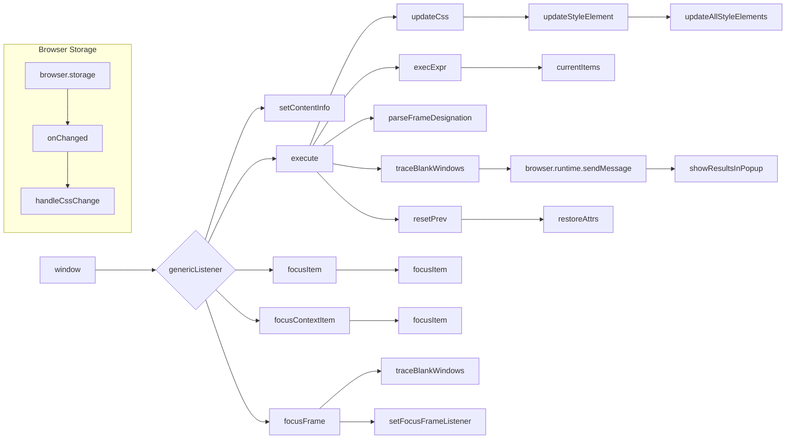

# Анализ кода try_xpath_content.js

```
/* This Source Code Form is subject to the terms of the Mozilla Public
 * License, v. 2.0. If a copy of the MPL was not distributed with this
 * file, You can obtain one at http://mozilla.org/MPL/2.0/. */

(function (window, undefined) {
    "use strict";

    // alias
    var tx = tryxpath;
    var fu = tryxpath.functions;

    // prevent multiple execution
    if (tx.isContentLoaded) {
        return;
    }
    tx.isContentLoaded = true;

    const dummyItem = "";
    const dummyItems = [];
    const invalidExecutionId = NaN;
    const styleElementHeader = "/* This style element was inserted by browser add-on, Try xpath."
          + " If you want to remove this element, please click the reset"
          + " style button in the popup. */\n";

    var attributes = {
        "element": "data-tryxpath-element",
        "context": "data-tryxpath-context",
        "focused": "data-tryxpath-focused",
        "focusedAncestor": "data-tryxpath-focused-ancestor",
        "frame": "data-tryxpath-frame",
        "frameAncestor": "data-tryxpath-frame-ancestor"
    };

    var prevMsg;
    var executionCount = 0;
    var inBlankWindow = false;
    var currentDocument = null;
    var contextItem = dummyItem;
    var currentItems = dummyItems;
    var focusedItem = dummyItem;
    var focusedAncestorItems = dummyItems;
    var currentCss = null;
    var insertedStyleElements = new Map();
    var expiredCssSet = Object.create(null);
    var originalAttributes = new Map();


    // ... (остальной код)
})(window);
```

## <algorithm>

Этот код реализует обработку событий для плагина браузера (вероятно, для работы с XPath).  Алгоритм работает в несколько этапов:

1. **Инициализация:**
    - Проверяется, был ли код уже выполнен. Если да, выполнение останавливается.
    - Инициализируются пустые значения для хранения данных: `dummyItem`, `dummyItems`, `invalidExecutionId`, атрибуты, переменные.
    - Определяются константы и переменные, которые необходимы для дальнейшего функционирования.
    - Инициализируется `prevMsg` для хранения предыдущих сообщений и счетчик `executionCount` для идентификации выполнения.
    - Инициализация `currentCss`, `insertedStyleElements`, `expiredCssSet` и `originalAttributes`.

2. **Обработка сообщений:**
    - Фунция `genericListener` обрабатывает сообщения, поступившие извне (внешние вызовы, предположительно).
      - Внутри `genericListener` различные обработчики (`setContentInfo`, `execute`, `focusItem`, `focusContextItem`, `focusFrame`, `requestShowResultsInPopup`, и т.д.)  используя `genericListener.listeners` реагируют на разные типы сообщений.

3. **Выполнение запросов:**
   - При поступлении события `execute`:
     - Обновление `currentCss`.
     - Создание сообщения для ответа.
     - Обработка фреймов (управление фреймами в случае `frameDesignation`).
     - Выполнение XPath запроса (`execExpr`) на основе контекста `contextItem`.
     - Установка `currentItems`, `message`, `itemDetails` в результирующее сообщение.
     - Отправка результата (посредством `browser.runtime.sendMessage`) в расширение/плагин.

4. **Обработка фокусировки:**
   - При поступлении сообщений `focusItem`, `focusContextItem`, `focusFrame` происходит изменение фокуса.
   - Устанавливается `focusedItem` и сопутствующие атрибуты.
   - Фокусировка элемента `focusedItem`.

5. **Установка и обновление стилей:**
   - `handleCssChange`: Обновление или удаление CSS стилей.
   - `updateStyleElement`: Добавление или обновление CSS стилей в текущем документе.
   - `updateAllStyleElements`: Обновление CSS стилей во всех документах, хранящихся в `insertedStyleElements`.

6. **Обработка сообщений из фреймов:**
   - `traceBlankWindows`: Проверка фреймов на пустоту.
   - `findFrameByMessage`: Находит элемент фрейма по его индексу.
   - `setFocusFrameListener`: Установка обработчика сообщений для фреймов.

7. **Восстановление атрибутов:**
   - `restoreAttrs`: Восстанавливает исходные атрибуты после выполнения запроса.

8. **Обработка событий хранения:**
   - `browser.storage.onChanged.addListener`: Обработчик изменений в хранилище.


## <mermaid>




## <explanation>

**Импорты:**  `tryxpath` и `tryxpath.functions` скорее всего являются собственными модулями или переменными из внешнего кода (возможно, из другого файла или расширения), определяющими функции для работы с XPath и элементами DOM.  Они не определены в данном файле и связаны с другими частями проекта, ответсвенными за обработку XPath запросов, контекста и взаимодействия с UI.

**Классы:**  Нет явных классов, но есть объекты с атрибутами (например, `attributes`, `insertedStyleElements`).  Эти объекты хранят данные, необходимые для управления элементами, стилями и состоянием приложения.


**Функции:**


* **`setAttr`, `setIndex`**: Эти функции устанавливают атрибуты и индексы элементов, вероятно, для хранения и манипулирования информацией об элементах DOM в браузере.
* **`isFocusable`, `focusItem`**: Работают с фокусом на элементах.
* **`setMainAttrs`, `restoreAttrs`, `resetPrev`**: Устанавливают главные атрибуты, восстанавливают исходное состояние и сбрасывают предыдущие значения.
* **`makeTypeStr`**: Преобразует тип результата в строку для вывода.
* **`updateCss`, `updateStyleElement`, `updateAllStyleElements`, `removeStyleElement`, `removeAllStyleElements`**: Управляют CSS стилями для элементов, добавляя, удаляя или обновляя CSS стили в документе.
* **`getFrames`, `parseFrameDesignation`**: Парсят спецификации фреймов.
* **`traceBlankWindows`**: Проверяет наличие и состояние фреймов.
* **`handleCssChange`**: Реагирует на изменения CSS.
* **`findFrameByMessage`**: Находит фрейм по сообщению.
* **`setFocusFrameListener`**: Устанавливает обработчик сообщений для фреймов.
* **`initBlankWindow`**: Инициализирует пустой фрейм.
* **`findStyleParent`**: Находит родительский элемент для стилей.
* **`createResultMessage`**: Создаёт базовое сообщение для результатов.
* **`genericListener`**: Главный обработчик сообщений.
* **`genericListener.listeners`**:  Словарь обработчиков различных типов сообщений.

**Переменные:**  `attributes`, `prevMsg`, `executionCount`, `inBlankWindow`, `currentDocument`, `contextItem`, `currentItems`, `focusedItem`, `focusedAncestorItems`, `currentCss`, `insertedStyleElements`, `expiredCssSet`, `originalAttributes`, и многие другие — хранят различные данные для обработки сообщений, состояния приложения и взаимодействия с элементами DOM.

**Возможные ошибки/улучшения:**

* **Обработка исключений:** Код содержит блоки `try...catch`, что важно для предотвращения падения приложения при возникновении ошибок при работе с XPath, фреймами и DOM. Однако, логика обработки исключений в некоторых местах может быть улучшена для более подробных сообщений об ошибках.
* **Улучшение читаемости:** В некоторых местах код может быть более удобочитаемым с использованием более осмысленных имен переменных и функций.
* **Документация:** Недостаточно внутренней документации для понимания отдельных частей функционала.

**Взаимосвязи с другими частями проекта:**

Код сильно зависит от внешнего модуля `tryxpath` и функции `fu`. Взаимодействие с расширением/плагином происходит через функцию `browser.runtime.sendMessage`.  Судя по коду, это расширение/плагин должно предоставлять необходимые функции и функционал для работы с DOM и XPath.  Этот код (try_xpath_content.js) действует как обработчик сообщений, получаемых из расширения и отвечающий на них.