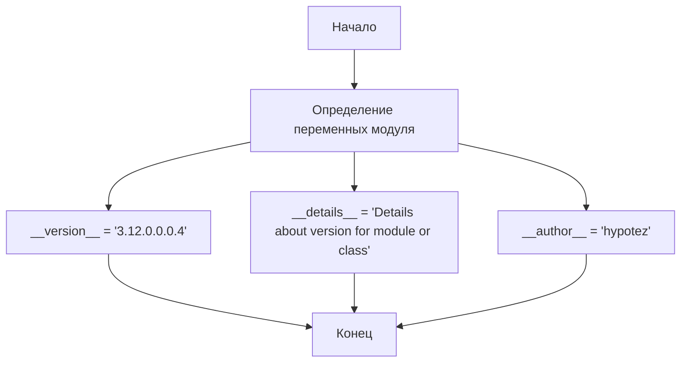
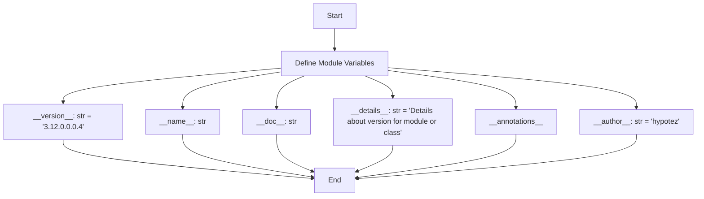

## АНАЛИЗ КОДА `hypotez/src/webdriver/edge/extentions/version.py`

### 1. **<алгоритм>**

Этот код представляет собой модуль Python, который в основном содержит метаданные о версии и авторе. Он не выполняет никаких вычислений или операций, а скорее определяет атрибуты модуля.

**Блок-схема:**

**Примеры:**

- `__version__`: строка, представляющая версию. Например, `"3.12.0.0.0.4"`.
- `__details__`: строка, содержащая описание модуля. Например, `"Details about version for module or class"`.
- `__author__`: строка, содержащая имя автора, например `"hypotez"`.
- `__name__`: строка, хранящая имя модуля, или `"__main__"` если скрипт выполняется напрямую.
- `__doc__`: строка, хранящая описание модуля.
- `__annotations__`: словарь, хранящий аннотации типов.

### 2. **<mermaid>**

**Анализ зависимостей:**

В данном коде нет явных зависимостей от других модулей, поэтому нет импортов.
* `__version__`, `__name__`, `__doc__`, `__details__`, `__annotations__`, `__author__` - предопределенные переменные модулей Python, определяющие его метаданные.
*  Связи между ними показаны в диаграмме `mermaid` - переменные модуля создаются и инициализируются, но не импортируют другие модули или классы.

### 3. **<объяснение>**

**Импорты:**

В данном коде нет импортов, так как он не использует сторонние библиотеки или модули.

**Классы:**

В коде нет определения классов.

**Функции:**

В коде нет определения функций.

**Переменные:**

- `__name__`: Переменная типа `str`, содержащая имя текущего модуля. При запуске файла напрямую, значение будет `"__main__"`.
- `__version__`: Переменная типа `str`, содержащая строку версии модуля. В данном случае, `"3.12.0.0.0.4"`.
- `__doc__`: Переменная типа `str`, содержащая строку документации модуля. В данном случае не присвоено значение, поэтому будет равна `None`.
- `__details__`: Переменная типа `str`, содержащая дополнительные сведения о модуле, в данном случае – `"Details about version for module or class"`.
- `__annotations__`: Переменная для хранения словаря с аннотациями типов для модуля. В данном случае значение не присвоено, поэтому будет равна `None`.
- `__author__`: Переменная типа `str`, содержащая строку с именем автора модуля, в данном случае – `"hypotez"`.

**Потенциальные ошибки и области для улучшения:**

1.  **Отсутствие документации**: Переменная `__doc__` не имеет присвоенного значения, хотя она предназначена для хранения документации модуля. Рекомендуется добавить Docstring к модулю, чтобы сделать его более понятным.
2.  **Неиспользуемая переменная:**  `__annotations__` объявлена, но ей не присвоено значение.
3.  **Неоднородность:** Переменные `__version__`, `__details__` и `__author__` являются строками, но при этом нету явного указания `str` для них, как в случае `__name__`.
4.  **Непоследовательность**: В первой строке кода есть неиспользуемые shebang-инструкции, которые указывают на различные интерпретаторы Python. Их следует удалить или скорректировать.
5.  **Избыточный код:** Много лишних пустых `"""` комментариев, следует их удалить.

**Взаимосвязь с другими частями проекта:**

Этот файл, вероятно, используется для хранения информации о версии и авторе модуля `webdriver.edge.extentions`. Он не имеет прямых зависимостей от других модулей, но информация, хранящаяся в нем, может использоваться другими частями проекта. Например, для логирования, отображения информации о версии или автоматизации процесса сборки.

**Цепочка взаимосвязей:**

Модуль `version.py` предоставляет метаданные. Это может использоваться в других частях проекта, например, для:
1.  Логирования (отслеживание версии используемого модуля).
2.  Интерфейс пользователя (отображение информации о версии).
3.  Автоматизация сборок (проверка версий).

Таким образом, другие модули, которые хотят получить доступ к информации о версии, будут импортировать этот модуль и использовать его переменные.