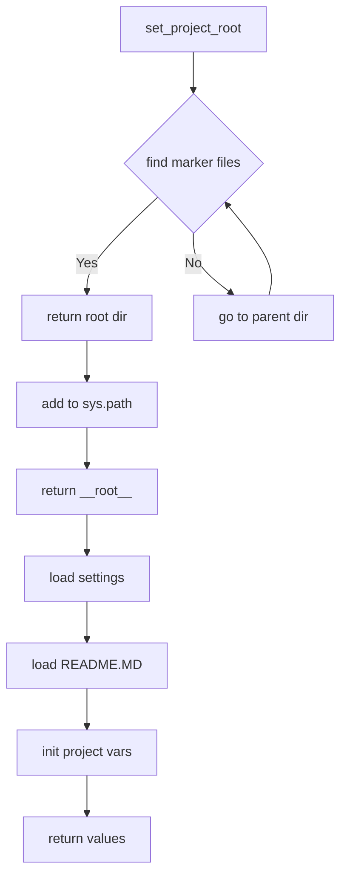

# Анализ кода файла `hypotez/src/webdriver/edge/header.py`

## <input code>

```python
## \file hypotez/src/webdriver/edge/header.py
# -*- coding: utf-8 -*-\n#! venv/Scripts/python.exe
#! venv/bin/python/python3.12

"""
.. module: src.webdriver.edge 
	:platform: Windows, Unix
	:synopsis:

"""
MODE = 'dev'


import sys
import json
from packaging.version import Version

from pathlib import Path
def set_project_root(marker_files=('pyproject.toml', 'requirements.txt', '.git')) -> Path:
    """
    Finds the root directory of the project starting from the current file's directory,
    searching upwards and stopping at the first directory containing any of the marker files.

    Args:
        marker_files (tuple): Filenames or directory names to identify the project root.
    
    Returns:
        Path: Path to the root directory if found, otherwise the directory where the script is located.
    """
    __root__:Path
    current_path:Path = Path(__file__).resolve().parent
    __root__ = current_path
    for parent in [current_path] + list(current_path.parents):
        if any((parent / marker).exists() for marker in marker_files):
            __root__ = parent
            break
    if __root__ not in sys.path:
        sys.path.insert(0, str(__root__))
    return __root__


# Get the root directory of the project
__root__ = set_project_root()
"""__root__ (Path): Path to the root directory of the project"""


from src import gs

settings:dict = None
try:
    with open(gs.path.root / 'src' / 'settings.json', 'r') as settings_file:
        settings = json.load(settings_file)
except (FileNotFoundError, json.JSONDecodeError):
    ...

doc_str:str = None
try:
    with open(gs.path.root / 'src' / 'README.MD', 'r') as settings_file:
        doc_str = settings_file.read()
except (FileNotFoundError, json.JSONDecodeError):
    ...


__project_name__ = settings.get("project_name", 'hypotez') if settings  else 'hypotez'
__version__: str = settings.get("version", '')  if settings  else ''
__doc__: str = doc_str if doc_str else ''
__details__: str = ''
__author__: str = settings.get("author", '')  if settings  else ''
__copyright__: str = settings.get("copyrihgnt", '')  if settings  else ''
__cofee__: str = settings.get("cofee", "Treat the developer to a cup of coffee for boosting enthusiasm in development: https://boosty.to/hypo69")  if settings  else "Treat the developer to a cup of coffee for boosting enthusiasm in development: https://boosty.to/hypo69"
```

## <algorithm>

1. **`set_project_root`:**
   - Принимает кортеж `marker_files` с именами файлов/папок, по которым ищется корень проекта.
   - Начинает поиск корня от текущего файла.
   - Итерируется по родительским директориям текущего файла.
   - Проверяет существование файлов/папок из `marker_files` в текущей директории.
   - Если найден файл/папка, возвращает родительскую директорию (`__root__`).
   - Добавляет корень проекта в `sys.path`, чтобы импорты работали правильно.
   - Возвращает путь к корню проекта.

   ```
   Пример:
   Текущий файл: /home/user/project/webdriver/edge/header.py
   marker_files: ('pyproject.toml', 'requirements.txt', '.git')

   Итерации:
   1. /home/user/project/webdriver/edge
      - pyproject.toml существует? Нет
   2. /home/user/project/webdriver
      - pyproject.toml существует? Нет
   3. /home/user/project
      - pyproject.toml существует? Да
   Возвращает /home/user/project
   ```

2. **Получение настроек:**
   - Инициализирует `__root__` с помощью `set_project_root`.
   - Читает файл `settings.json` из корня проекта, загружая настройки в `settings`. Обрабатывает исключения `FileNotFoundError` и `json.JSONDecodeError`.
   - Читает файл `README.MD` из корня проекта, загружая текст в `doc_str`. Обрабатывает исключения `FileNotFoundError` и `json.JSONDecodeError`.

3. **Инициализация переменных:**
   - Создает переменные, содержащие данные из настроек или значения по умолчанию, если настройки не найдены.

## <mermaid>



## <explanation>

**Импорты:**

- `sys`: Предоставляет доступ к системным переменным, в том числе `sys.path`, для управления путями поиска модулей.
- `json`: Используется для работы с файлами JSON, в частности для загрузки настроек из `settings.json`.
- `packaging.version`: Обеспечивает работу с версиями пакетов. Возможно, используется для проверки версий зависимостей или для хранения информации о версии проекта.
- `pathlib`: Обеспечивает работу с путями к файлам и директориям. Важно для создания корректных путей, независимо от операционной системы.
- `src.gs`: Вероятно, модуль, предоставляющий функции работы с файлами проекта.

**Классы:**

- Нет явно определенных классов.

**Функции:**

- `set_project_root`: Находит корень проекта, принимая в качестве аргумента кортеж с маркерами файлов, по которым производится поиск. Возвращает объект `Path` с путем к корню проекта.

**Переменные:**

- `MODE`: Строковая переменная, хранящая значение режима (в данном случае `'dev'`).
- `__root__`: Переменная, содержащая путь к корню проекта. Тип - `Path`.
- `settings`: Словарь, хранящий настройки проекта, загруженные из `settings.json`.
- `doc_str`: Строка, содержащая текст из файла `README.MD`.
- `__project_name__`, `__version__`, `__doc__`, `__details__`, `__author__`, `__copyright__`, `__cofee__`: Переменные, хранящие информацию о проекте, полученную из `settings.json` или имеющие значения по умолчанию.

**Возможные ошибки и улучшения:**

- **Обработка исключений:**  Используются `try...except` блоки для обработки `FileNotFoundError` и `json.JSONDecodeError`. Это хорошо, но можно добавить более подробную информацию об ошибке (например, вывести сообщение об ошибке в консоль).
- **Типизация:** Код хорошо типизирован с помощью аннотаций типов. Это помогает улучшить читаемость и поддержку кода.
- **Документация:** Документация к функции `set_project_root` могла быть улучшена: включение примеров использования и более подробное описание аргументов, возвращаемых значений и возможных исключений.


**Взаимосвязи с другими частями проекта:**

- Функция `set_project_root` является вспомогательной и используется в других частях проекта для нахождения корня проекта.
-  `from src import gs`  указывает на зависимость от модуля `gs` в пакете `src`, предполагая, что `gs` предоставляет полезные функции и/или атрибуты, например, для работы с путями к ресурсам проекта.
- `settings.json` и `README.MD` — это файлы конфигурации и документации проекта, соответственно, используемые различными частями приложения.