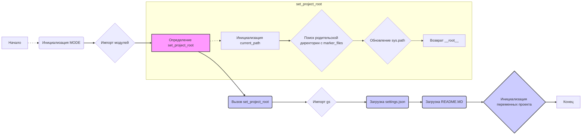

## Анализ кода `hypotez/src/webdriver/edge/header.py`

### 1. <алгоритм>

**Блок-схема:**

1.  **Начало**: Исполнение скрипта `header.py`.
2.  **Инициализация `MODE`**: Установка переменной `MODE` в значение `'dev'`.
    *   *Пример:* `MODE = 'dev'`
3.  **Импорт модулей**: Импорт необходимых модулей `sys`, `json`, `Version` из `packaging.version` и `Path` из `pathlib`.
    *   *Пример:* `import sys`, `import json`, `from packaging.version import Version`, `from pathlib import Path`
4.  **Определение функции `set_project_root`**:
    *   **Входные данные:** `marker_files` (tuple) - список файлов/директорий для поиска корня проекта.
    *   **Инициализация:** `current_path` - текущий путь к директории скрипта.
    *   **Поиск:** Перебор директорий от текущей до родительских, пока не найдена директория с одним из `marker_files`.
        *   *Пример:*
            ```
            current_path = Path('/path/to/hypotez/src/webdriver/edge')
            marker_files = ('pyproject.toml', 'requirements.txt', '.git')
            ищем '/path/to/hypotez/src/webdriver/edge', потом '/path/to/hypotez/src/webdriver', '/path/to/hypotez/src', '/path/to/hypotez'
            если '/path/to/hypotez' содержит 'pyproject.toml', тогда __root__ = '/path/to/hypotez'
            ```
    *   **Обновление `sys.path`**: Если путь корня не в `sys.path`, то добавить его.
    *   **Возврат:** `__root__` - путь к корневой директории проекта.
5.  **Вызов `set_project_root`**: Получение корневой директории проекта и сохранение в `__root__`.
    *   *Пример:* `__root__ = Path('/path/to/hypotez')`
6.  **Импорт `gs`**: Импорт модуля `gs` из `src`.
    *   *Пример:* `from src import gs`
7.  **Загрузка настроек из `settings.json`**:
    *   Попытка открыть файл `settings.json` из корня проекта.
    *   Загрузка данных в словарь `settings`.
    *   Обработка ошибок `FileNotFoundError` и `json.JSONDecodeError`.
    *   *Пример:*
        ```
        путь к файлу: '/path/to/hypotez/src/settings.json'
        Если файл существует и является валидным JSON, то settings = {'project_name': 'hypotez', 'version': '1.0.0', ...}
        ```
8.  **Загрузка документации из `README.MD`**:
    *   Попытка открыть файл `README.MD` из корня проекта.
    *   Чтение содержимого в строку `doc_str`.
    *   Обработка ошибок `FileNotFoundError` и `json.JSONDecodeError`.
    *   *Пример:*
        ```
        путь к файлу: '/path/to/hypotez/src/README.MD'
        Если файл существует, то doc_str = 'Содержимое файла README.MD'
        ```
9.  **Инициализация переменных проекта**:
    *   `__project_name__` - имя проекта из `settings` или `'hypotez'`.
    *   `__version__` - версия проекта из `settings` или `''`.
    *   `__doc__` - документация из `doc_str` или `''`.
    *   `__details__` - пустая строка `''`.
    *   `__author__` - автор проекта из `settings` или `''`.
    *   `__copyright__` - авторские права из `settings` или `''`.
    *   `__cofee__` - сообщение о поддержке из `settings` или сообщение по умолчанию.
    *   *Примеры:*
        ```
        Если settings = {'project_name': 'hypotez', 'version': '1.0.0', 'author': 'John Doe', 'copyrihgnt': 'Copyright 2023'}
        то __project_name__ = 'hypotez', __version__ = '1.0.0', __author__ = 'John Doe', __copyright__ = 'Copyright 2023'
        Если settings = None
        то __project_name__ = 'hypotez', __version__ = '',  __author__ = '', __copyright__ = ''
        ```
10. **Конец**: Завершение исполнения скрипта.

### 2. <mermaid>



**Объяснение зависимостей:**

*   **`Начало`**: Точка входа скрипта.
*   **`Инициализация MODE`**: Устанавливает режим работы (например, `dev`).
*   **`Импорт модулей`**: Зависимость от стандартных библиотек `sys`, `json`, а также от `packaging.version` и `pathlib`, которые необходимы для работы с путями и версиями.
*   **`Определение set_project_root`**: Функция, которая определяет корень проекта по наличию маркерных файлов.
    *   **`Инициализация current_path`**:  Получение текущего пути к директории скрипта.
    *   **`Поиск родительской директории с marker_files`**: Поиск директории, содержащей один из маркерных файлов.
    *   **`Обновление sys.path`**:  Добавление пути к корню проекта в список путей поиска модулей.
    *   **`Возврат __root__`**: Возвращает путь к корню проекта.
*   **`Вызов set_project_root`**: Вызов функции для получения корня проекта.
*   **`Импорт gs`**:  Зависимость от модуля `gs`, находящегося в директории `src`.
*   **`Загрузка settings.json`**: Зависимость от файла настроек проекта в формате JSON.
*   **`Загрузка README.MD`**: Зависимость от файла документации проекта.
*   **`Инициализация переменных проекта`**: Инициализация переменных проекта, таких как имя, версия, автор, и т.д., на основе данных из `settings.json` и `README.MD`.
*   **`Конец`**: Конечная точка скрипта.

### 3. <объяснение>

#### Импорты:

*   `sys`: Модуль `sys` используется для работы с интерпретатором Python, в частности для добавления пути к корневой директории проекта в `sys.path`, чтобы можно было импортировать модули из этого проекта.
*   `json`: Модуль `json` используется для загрузки данных из файла `settings.json`, который содержит настройки проекта в формате JSON.
*   `packaging.version.Version`:  Класс `Version` из библиотеки `packaging` используется для работы с версиями (не используется непосредственно в этом файле, но импортируется).
*   `pathlib.Path`: Класс `Path` из библиотеки `pathlib` используется для работы с путями к файлам и директориям, что делает код более читаемым и переносимым.
*   `src.gs`: Модуль `gs`, предположительно, содержит глобальные настройки или пути, используемые в проекте. Он импортируется из директории `src`.

#### Функции:

*   `set_project_root(marker_files: tuple) -> Path`:
    *   **Аргументы**:
        *   `marker_files` (tuple): Кортеж строк, содержащих имена файлов или директорий, которые указывают на корень проекта. По умолчанию (`'pyproject.toml'`, `'requirements.txt'`, `'.git'`).
    *   **Возвращает**: `Path` - объект, представляющий путь к корневой директории проекта.
    *   **Назначение**: Функция определяет корневую директорию проекта, поднимаясь по родительским директориям от текущего файла, пока не найдет одну из `marker_files`. Она также добавляет эту директорию в `sys.path`, чтобы Python мог импортировать модули из проекта.
    *   **Пример**: Если скрипт находится в `/path/to/hypotez/src/webdriver/edge` и `pyproject.toml` находится в `/path/to/hypotez`, то функция вернет `Path('/path/to/hypotez')`.

#### Переменные:

*   `MODE` (str): Строка, определяющая режим работы приложения, по умолчанию `'dev'`.
*   `__root__` (Path): Путь к корневой директории проекта, полученный через функцию `set_project_root()`.
*   `settings` (dict | None): Словарь, содержащий настройки проекта, загруженные из файла `settings.json` или `None`, если файл не найден или произошла ошибка при загрузке.
*   `doc_str` (str | None): Строка, содержащая документацию проекта, загруженную из файла `README.MD` или `None`, если файл не найден или произошла ошибка при загрузке.
*   `__project_name__` (str): Имя проекта, загруженное из настроек (`settings.json`) или `hypotez` по умолчанию.
*    `__version__` (str): Версия проекта, загруженное из настроек (`settings.json`) или `''` по умолчанию.
*   `__doc__` (str): Документация проекта, загруженная из `doc_str`, или `''` по умолчанию.
*   `__details__` (str): Строка для хранения дополнительной информации о проекте, по умолчанию `''`.
*   `__author__` (str): Автор проекта, загруженный из настроек (`settings.json`) или `''` по умолчанию.
*   `__copyright__` (str): Авторские права проекта, загруженные из настроек (`settings.json`) или `''` по умолчанию.
*    `__cofee__` (str): Строка с информацией о поддержке разработчика, загруженное из настроек (`settings.json`) или строка по умолчанию.

#### Потенциальные ошибки и области для улучшения:

1.  **Обработка ошибок при загрузке JSON**:  Сейчас, при ошибке загрузки `settings.json`, просто пропускается блок `try`. Возможно, стоит добавить логирование ошибки или вывод предупреждения, так как это может привести к неожиданному поведению программы.
2.  **Обработка ошибок при чтении README.MD**: Аналогично с обработкой `settings.json`, стоит добавить логику для обработки возможных ошибок.
3.  **Зависимость от `gs.path.root`**:  Код предполагает, что в `gs.path.root` хранится путь к корневой директории, но это не всегда может быть так, что может привести к проблемам. Стоит убедиться, что `gs` правильно настроен.
4.  **Использование magic strings**: Строки `'src/settings.json'` и `'src/README.MD'` можно вынести в константы для лучшей читаемости и поддержки.
5. **Отсутствие обработки ошибок**: Отсутствует явная обработка исключений при загрузке настроек и документации. Рекомендуется добавить логику для более надежной работы, например, логирование ошибок.
6. **Неиспользуемые импорты**: Класс `Version` из модуля `packaging.version` импортируется, но не используется. Рекомендуется удалить неиспользуемые импорты.
7.  **Ограниченная функциональность**: Модуль header.py выполняет начальную инициализацию и загрузку конфигурации. В будущем, возможно, потребуется расширить его функциональность.

#### Взаимосвязи с другими частями проекта:

*   Этот файл является частью пакета `src.webdriver.edge` и устанавливает начальные настройки, необходимые для других модулей этого пакета.
*   Модуль `gs` из `src` используется для доступа к путям проекта.
*   Файл `settings.json` содержит настройки, которые используются этим файлом.
*   Файл `README.MD` используется для получения документации.
*   Этот модуль используется для инициализации других модулей проекта.

В целом, файл `header.py` является важной частью проекта, отвечающей за настройку путей и загрузку основных параметров из `settings.json` и `README.MD` файлов. Он также добавляет путь к корню проекта в `sys.path`, обеспечивая возможность импорта модулей из проекта.