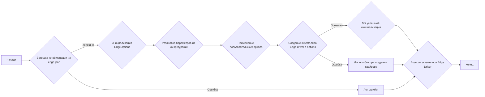
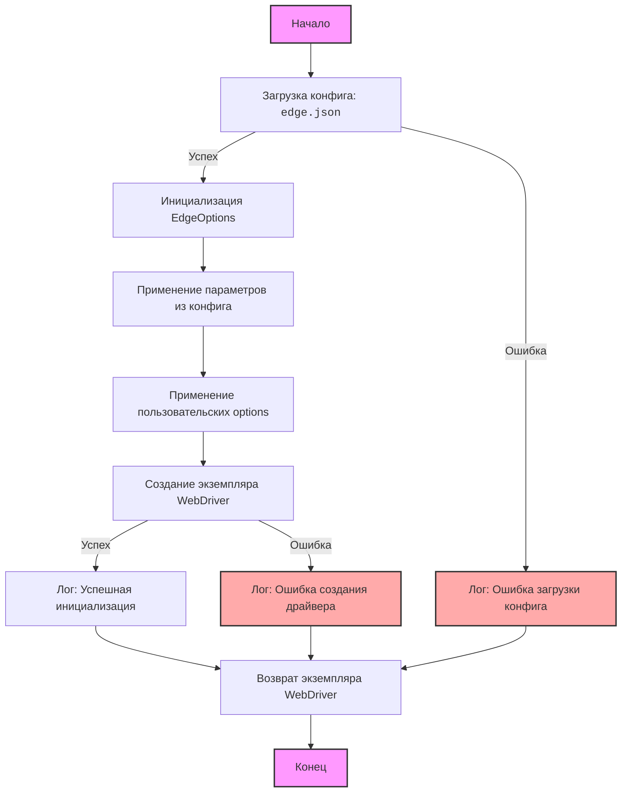
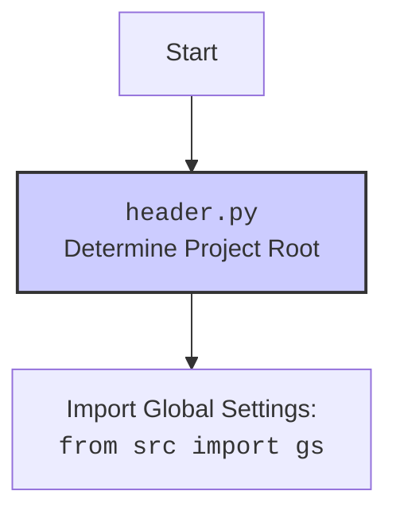

# Анализ модуля Edge WebDriver для Selenium

## 1. <алгоритм>

**Блок-схема работы Edge WebDriver:**

**Примеры для каждого блока:**

*   **A [Начало]**: Начало работы программы, когда создается экземпляр класса `Edge`.
*   **B {Загрузка конфигурации из edge.json}**: 
    *   **Пример успеха**: Загрузка файла `edge.json` в Python словарь.
    *   **Пример неудачи**: Ошибка `FileNotFoundError` или ошибка парсинга JSON.
*   **C {Инициализация EdgeOptions}**: Создание объекта `EdgeOptions` из библиотеки `selenium`.
*   **D {Установка параметров из конфигурации}**:
    *   **Пример**: Загрузка `user-agent` из секции `headers` и установка его в `EdgeOptions`.
    *   **Пример**: Загрузка пути к исполняемому файлу `msedgedriver.exe` из секции `executable_path` и установка его в `EdgeOptions`.
    *   **Пример**: Установка профиля пользователя `os` из секции `profiles` в `EdgeOptions`.
*   **E {Применение пользовательских options}**: Применение дополнительных опций, переданных при создании экземпляра `Edge`.
    *   **Пример**: Добавление опции `--headless` в `EdgeOptions`.
*   **F {Создание экземпляра Edge driver с options}**: Создание объекта `webdriver.Edge` с использованием настроенных `EdgeOptions`.
    *   **Пример успеха**: Создание экземпляра драйвера без ошибок.
    *   **Пример ошибки**: Ошибка, когда бинарный файл `msedgedriver.exe` не найден или несовместим.
*   **G {Лог успешной инициализации}**: Запись в лог сообщения об успешной инициализации.
*   **Z1 [Лог ошибки]**: Запись ошибки, если файл `edge.json` не найден или не распарсен.
*   **Z2 [Лог ошибки при создании драйвера]**: Запись ошибки, если не удалось инициализировать драйвер.
*   **H {Возврат экземпляра Edge Driver}**: Возврат созданного экземпляра `webdriver.Edge`.
*  **I [Конец]**:  Завершение работы функции, когда экземпляр класса `Edge` создан и готов к использованию.

## 2. <mermaid>

**Зависимости:**

*   **`selenium`**: Эта библиотека используется для управления браузером. В частности, импортируются `webdriver` и `EdgeOptions`.
*   **`src.config`**: Используется для загрузки конфигурации из JSON файла. Это обеспечивает возможность централизованного управления параметрами.
*   **`src.logger`**: Используется для логирования ошибок и сообщений, что помогает при отладке.
*   **`src.utils`**: Используется для получения абсолютного пути к исполняемому файлу и профилям.

## 3. <объяснение>

**Импорты:**

*   `from selenium import webdriver`: Импортирует модуль `webdriver` из библиотеки `selenium`, который используется для управления браузером.
*   `from selenium.webdriver.edge.options import Options as EdgeOptions`: Импортирует класс `Options` под псевдонимом `EdgeOptions`, который используется для настройки параметров браузера Edge.
*   `from src.config import Config`: Импортирует класс `Config` для загрузки и обработки конфигурационных файлов.
*   `from src.logger import logger`: Импортирует объект `logger` для логирования событий.
*    `from src.utils import absolute_path`: Импортирует функцию `absolute_path` для преобразования относительных путей в абсолютные.
*  `from src import gs`:  Импортирует глобальные настройки проекта из модуля `src`.

**Классы:**

*   `Edge`:
    *   **Роль**: Главный класс, предоставляющий функциональность для управления браузером Edge.
    *   **Атрибуты**:
        *   `_instance`: Приватный атрибут, содержащий единственный экземпляр драйвера (реализация Singleton).
        *   `_options`: Объект `EdgeOptions`, хранящий настройки браузера.
        *  `_driver`:  Экземпляр `webdriver.Edge`.
    *   **Методы**:
        *   `__init__(self, user_agent=None, options=None)`: Конструктор класса, инициализирует WebDriver с использованием конфигурации из `edge.json`. Принимает пользовательский user-agent и дополнительные options. Реализует паттерн Singleton.
        *   `get(self, url)`: Открывает URL в браузере.
        *   `quit(self)`: Закрывает браузер.

**Функции:**

*   `__init__(self, user_agent=None, options=None)`:
    *   **Аргументы**:
        *   `user_agent` (str, optional): Пользовательский user-agent. По умолчанию `None`.
        *   `options` (list, optional): Список дополнительных опций для Edge. По умолчанию `None`.
    *   **Возвращаемое значение**: None.
    *   **Назначение**: Инициализирует экземпляр класса `Edge`. Загружает конфигурацию из `edge.json`, настраивает `EdgeOptions`, применяет пользовательские опции и создает экземпляр `webdriver.Edge`.
    *   **Примеры**:
        *   `Edge()`: Создает экземпляр Edge с настройками по умолчанию.
        *   `Edge(user_agent="my_custom_agent", options=["--headless"])`: Создает экземпляр с пользовательским user-agent и опцией запуска в режиме headless.
* `get(self, url)`:
    * **Аргументы**: `url` (str): URL для открытия в браузере.
    * **Возвращаемое значение**: `None`.
    * **Назначение**: Загружает указанный URL в браузере.
    * **Примеры**: `browser.get("https://www.example.com")`.
* `quit(self)`:
    * **Аргументы**: None
    * **Возвращаемое значение**: None
    * **Назначение**: Закрывает сессию браузера.
    * **Примеры**: `browser.quit()`.

**Переменные:**

*   `_instance`: Статическая переменная, хранящая единственный экземпляр класса `Edge` (реализация Singleton).
*   `config`: Объект `Config`, хранящий конфигурацию, загруженную из `edge.json`.
*   `edge_options`: Объект `EdgeOptions`, хранящий настройки для Edge.
*   `default_profile_path`: Путь к стандартному профилю пользователя.
*   `os_profile_path`: Путь к профилю пользователя в операционной системе.
*   `executable_path`: Путь к исполняемому файлу `msedgedriver.exe`.
*   `headers`: Словарь с пользовательскими HTTP-заголовками.
*    `driver`:  Экземпляр `webdriver.Edge`.
*   `user_agent`:  Строка user-agent, которую необходимо использовать.
*   `options`: Список дополнительных опций для браузера.

**Потенциальные ошибки и области для улучшения:**

1.  **Обработка ошибок**: Код уже имеет базовую обработку ошибок через логирование. Необходимо добавить более детальную обработку ошибок, например, вызывать исключения при критических ошибках.
2.  **Валидация конфигурации**: Необходимо добавить валидацию содержимого файла `edge.json` для предотвращения неверных настроек (например, проверка наличия необходимых ключей).
3.  **Паттерн Singleton**: Singleton реализован в `__init__`, необходимо рассмотреть возможность его вынесения во внешний декоратор.
4.  **Управление временем выполнения**: Добавление таймаутов для операций webdriver.
5.  **Тестирование**:  Покрытие кода юнит-тестами для обеспечения надежности.
6.  **Обработка исключений при закрытии браузера**:  Учесть возможное отсутствие драйвера при вызове `quit()`.

**Взаимосвязь с другими частями проекта:**

*   **`src.config`**: Этот модуль используется для загрузки конфигурационных файлов, что позволяет отделить параметры от основного кода.
*   **`src.logger`**: Модуль логирования используется для записи сообщений о работе драйвера, что облегчает отладку и мониторинг.
*   **`src.utils`**: Модуль утилит используется для работы с абсолютными путями, что обеспечивает переносимость.
* **`src.webdriver`**: Этот модуль является частью более общей структуры для управления веб-драйверами, подразумевая наличие других драйверов (например, для Chrome или Firefox) в этой структуре.
*   **`src.gs`**: Этот модуль используется для хранения глобальных настроек, которые могут понадобиться для работы драйвера.

Этот анализ предоставляет подробное представление о структуре, функциональности и взаимосвязях модуля `Edge WebDriver`.