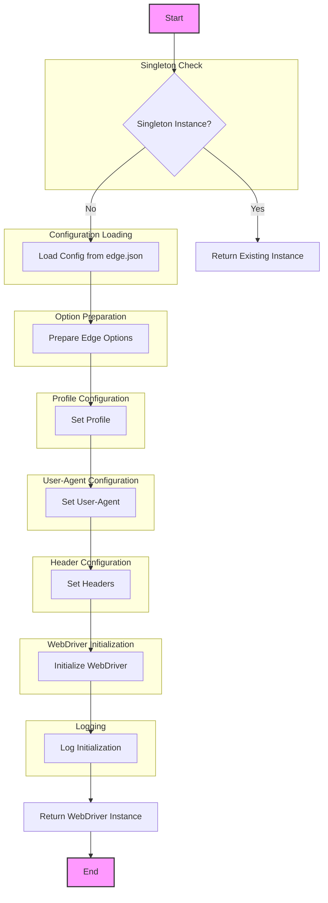

# Анализ модуля Edge WebDriver для Selenium

## 1. `<алгоритм>`:

**Блок-схема:**

1.  **Начало:** Пользователь вызывает класс `Edge` для создания или получения экземпляра WebDriver.
2.  **Проверка Singleton:** Проверяется, существует ли уже экземпляр `Edge` WebDriver.
    *   **Да:**  Возвращается существующий экземпляр. (Пример: `browser = Edge(); browser2 = Edge()`. `browser` и `browser2` будут ссылаться на один и тот же объект)
    *   **Нет:**  Переход к следующему шагу.
3.  **Загрузка конфигурации:** Чтение файла `edge.json` и загрузка настроек.
    *   **Пример файла `edge.json`:**
       ```json
       {
           "options": ["--disable-dev-shm-usage"],
           "profiles": {"os": "%LOCALAPPDATA%\\Microsoft\\Edge\\User Data\\Default"},
           "executable_path": {"default": "webdrivers\\edge\\123.0.2420.97\\msedgedriver.exe"},
           "headers": {"User-Agent": "...", "Accept": "...", ...}
       }
       ```
4.  **Подготовка опций:** Создание объекта `EdgeOptions` и добавление опций из `edge.json` и пользовательских опций.
    *   **Пример:** Из `edge.json` `--disable-dev-shm-usage`, из пользовательского ввода `--headless`.
5.  **Настройка профиля:** Выбор профиля браузера на основе настроек в `edge.json` и создание пути к каталогу профиля.
    *   **Пример:** Путь для профиля "os" `%LOCALAPPDATA%\\Microsoft\\Edge\\User Data\\Default`
6.  **Настройка user-agent:** Установка user-agent из конфигурации `edge.json` или пользовательского ввода.
    *   **Пример:** Из `edge.json`: `Mozilla/5.0 ...`, из пользовательского ввода `Mozilla/5.0 (Custom) ...`
7.  **Установка заголовков:** Добавление пользовательских заголовков из `edge.json` к `EdgeOptions`.
    *   **Пример:** Заголовки `User-Agent`, `Accept`, `Accept-Language` и т.д.
8.  **Инициализация WebDriver:** Создание экземпляра `Edge` WebDriver с подготовленными опциями.
    *   **Пример:** `webdriver.Edge(options=edge_options, executable_path=path_to_msedgedriver)`
9.  **Логирование:** Запись информации об успешной инициализации или ошибках в лог.
    *   **Пример:** `INFO: Edge WebDriver initialized successfully`
10. **Возврат экземпляра WebDriver:**  Возврат созданного или существующего экземпляра.
11. **Работа с браузером:** Использование методов `get()`, `quit()` и т.д.
    *   **Пример:** `browser.get("https://www.example.com"); browser.quit()`
12. **Конец:**  WebDriver закрыт.

**Поток данных:**

-   Пользовательские настройки (user-agent, дополнительные опции) -> Класс `Edge`
-   Содержимое `edge.json` -> Класс `Edge`
-   Настройки (путь к исполняемому файлу, профиль, user-agent, заголовки) -> `EdgeOptions`
-   `EdgeOptions` -> `webdriver.Edge`
-   Экземпляр WebDriver -> Пользователь

## 2. `<mermaid>`:



**Описание зависимостей `mermaid`:**

-   `Start`: Начало процесса инициализации `Edge` WebDriver.
-   `Singleton Instance?`: Проверка, существует ли уже экземпляр класса `Edge`. Этот шаг реализует паттерн Singleton, гарантируя, что только один экземпляр `Edge` WebDriver существует одновременно.
-   `Return Existing Instance`: Если экземпляр уже существует, он возвращается, и дальнейшая инициализация не требуется.
-   `Load Config from edge.json`: Загрузка настроек Edge WebDriver из файла `edge.json`. Эти настройки включают опции командной строки, пути к профилям, путь к исполняемому файлу, пользовательский user-agent и заголовки.
-   `Prepare Edge Options`:  Создание объекта `EdgeOptions`, который содержит все опции для настройки экземпляра `Edge` WebDriver.
-  `Set Profile`: Установка профиля браузера, который включает путь к директории пользовательских данных Edge.
-   `Set User-Agent`: Установка user-agent, который имитирует браузер, делая веб-запросы.
-   `Set Headers`: Установка кастомных HTTP-заголовков для запросов браузера.
-   `Initialize WebDriver`: Инициализация экземпляра Edge WebDriver с использованием подготовленных опций.
-  `Log Initialization`: Запись информации об успешной инициализации или ошибках.
-  `Return WebDriver Instance`: Возвращение нового или существующего экземпляра `Edge` WebDriver.
-   `End`: Конец процесса.

## 3. `<объяснение>`:

### Импорты:
-   Модуль не содержит импортов, но в неявном виде использует `selenium` для взаимодействия с браузером.

### Классы:

-   **`Edge`**:
    -   **Роль**: Класс `Edge` отвечает за создание и управление экземпляром `Edge` WebDriver, обеспечивая Singleton паттерн.
    -   **Атрибуты:**
        -   `_instance`: Статический атрибут для хранения единственного экземпляра `Edge` WebDriver.
        -   `logger`: Объект логгера для записи информации о процессе инициализации, ошибок и предупреждений.
        -   `config`: Словарь, содержащий загруженные из `edge.json` настройки.
    -   **Методы:**
        -   `__init__(self, user_agent=None, options=None)`: Конструктор класса, реализующий Singleton паттерн и инициализирующий WebDriver.
        -   `__new__(cls, *args, **kwargs)`: Метод для обеспечения Singleton паттерна. Гарантирует, что только один экземпляр класса `Edge` существует одновременно.
            -   Если экземпляр класса еще не создан ( `cls._instance is None` ), то вызывается метод `super().__new__(cls)` для создания нового экземпляра класса.
            -   В противном случае возвращается уже существующий экземпляр класса `cls._instance`.
            -   Метод гарантирует, что все последующие вызовы конструктора `Edge()` будут возвращать тот же экземпляр, а не создавать новые.
        -   `_load_config(self)`: Метод для чтения файла `edge.json` и загрузки настроек.
        -   `_setup_options(self, user_agent, options)`: Метод для подготовки опций `EdgeOptions` на основе конфигурации и пользовательских параметров.
        -   `_get_profile_path(self)`: Метод для получения пути к профилю браузера.
        -  `get_logger()`: Возвращает объект логгера.
   -   **Взаимодействие**:
        -   Использует класс `webdriver.Edge` из `selenium` для управления браузером.
        -   Использует `json` для загрузки конфигурации из файла.
        -   Взаимодействует с `src.logger` для логирования.

### Функции:

-   Нет явных функций, кроме методов класса.

### Переменные:

-   `user_agent`: Строка, представляющая user-agent браузера. Может быть задана в `edge.json` или передана пользователем.
-   `options`: Список строк, представляющих дополнительные опции для `Edge` WebDriver.
-   `config`: Словарь, хранящий настройки, загруженные из `edge.json`.
-   `_instance`: Переменная класса для хранения единственного экземпляра класса `Edge`.
-   `logger`: Объект логгера для записи сообщений в лог.

### Потенциальные ошибки и улучшения:

-   **Обработка исключений**:  Добавить обработку исключений при чтении файла `edge.json`, инициализации WebDriver и т.д., чтобы сделать код более устойчивым к ошибкам.
-   **Валидация конфигурации**: Добавить валидацию настроек, прочитанных из `edge.json`.
-   **Поддержка других операционных систем**: Пути к профилям жёстко заданы для Windows. Добавить поддержку других ОС.
-   **Управление версиями драйвера**: Автоматическое скачивание или обновление `msedgedriver` при необходимости.
-   **Более гибкая конфигурация**: Добавить возможность передавать различные пути к конфигурационному файлу или загружать конфигурацию из переменных окружения.
-   **Возможность настройки уровней логирования:**  Разрешить пользователю настраивать уровень подробности логов (например, DEBUG, INFO, WARNING, ERROR).

### Цепочка взаимосвязей с другими частями проекта:
-   **`src.logger`**:  Используется для логирования событий, ошибок и предупреждений.

Данный модуль предоставляет готовую реализацию Edge WebDriver, которая упрощает настройку и использование WebDriver в проекте, обеспечивая централизованное управление конфигурацией и логирование.