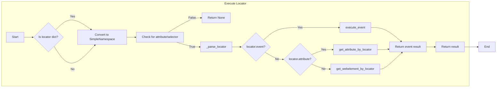

```MD
# Анализ кода из hypotez/src/webdriver/executor.py

## <input code>

```python
# ... (код из файла)
```

## <algorithm>

**Шаг 1:**  Проверка типа локатора. Функция `execute_locator` принимает локатор `locator`.  Она проверяет, является ли локатор `SimpleNamespace` или `dict`. Если это `dict`, преобразует его в `SimpleNamespace`.

**Шаг 2:** Проверка валидности локатора. Проверяется, имеются ли в локаторе атрибуты `attribute` или `selector`. Если нет, возвращается `None`.

**Шаг 3:** Вызов вспомогательной функции `_parse_locator`. Передается локатор и необязательное сообщение.

**Шаг 4:** Парсинг и обработка локатора в `_parse_locator`.
    * Задает атрибут `locator.by` согласно `by_mapping`.
    * Обрабатывает атрибут `locator.attribute` (например, преобразуя выражения с шаблонами `%...%`).
* Если есть событие `locator.event`, выполняет `execute_event`.
* Если есть атрибут `locator.attribute`, выполняет `get_attribute_by_locator`.
* Иначе выполняет `get_webelement_by_locator`.
* Возвращает результат обработки локатора.

**Шаг 5:** Выполнение событий в `execute_event`.
   * Разбивает строку событий `locator.event` по разделителю `;`.
   * Для каждого события:
       * Обрабатывает `click()`, `pause()`, `upload_media()`, `screenshot()`, `clear()`, `send_keys()`, `type()`.
       * Добавляет результат в список `result`.

**Шаг 6:** Обработка атрибутов в `get_attribute_by_locator`.
   * Получает веб-элемент по локатору.
   * Если атрибут `locator.attribute` — словарь, извлекает атрибуты по ключам.
   * Возвращает атрибуты или сам веб-элемент.

**Шаг 7:** Поиск веб-элемента в `get_webelement_by_locator`.
   * Если `timeout` равен 0, сразу пытается найти элемент.
   * Иначе ожидает элемент с заданным временем ожидания, используя `WebDriverWait`.
   * Возвращает найденный элемент или список элементов.

**Пример:**

Если `locator` - `{ "by": "XPATH", "selector": "//button[@id='submit']", "event": "click()" }`, то алгоритм выполнит поиск элемента по XPath, выполнит клик на нём и вернет `True`.


## <mermaid>



**Объяснение диаграммы:**

Диаграмма представляет главные ветки выполнения функций, демонстрируя последовательность проверки и обработки локатора. Подключаемые зависимости подразумеваются через вызовы функций, которые сами являются зависимостями от Selenium и других модулей из `src`.


## <explanation>

**Импорты:**
* `asyncio`, `re`, `sys`, `time`, `dataclass`, `Enum`, `Path`, `SimpleNamespace`, `typing`: Стандартные библиотеки Python.
* `selenium.common.exceptions`: Классы исключений Selenium для обработки ошибок.
* `selenium.webdriver.*`: Модули Selenium для работы с веб-драйвером.  Это основной инструмент для автоматизации веб-тестирования.
* `header`: Вероятно, файл с заголовками, конфигурациями или настройками.
* `gs`: Модуль `gs` (непонятно для чего).
* `src.logger`, `src.logger.exceptions`: Модули для логгирования и обработки пользовательских исключений.
* `src.utils.jjson`: Модуль для работы с JSON (возможно, для сериализации/десериализации).
* `src.utils.printer`: Модуль для печати данных в удобном формате.
* `src.utils.image`: Модуль для сохранения скриншотов.

**Классы:**
* `ExecuteLocator`: Обработчик локаторов. Хранит веб-драйвер `driver`, цепочки действий `actions` и словарь соответствий `by_mapping`.
    * `__post_init__`: Инициализирует `actions` при наличии `driver`.
    * `execute_locator`:  Обрабатывает локаторы, вызывает подфункции для выполнения кликов, получения атрибутов и т.д.
    * `evaluate_locator`:  Анализирует выражения с `%...%`.
    * `get_attribute_by_locator`: Получает атрибуты элемента(ов).
    * `get_webelement_by_locator`: Находит элемент(ы) по локатору.
    * `get_webelement_as_screenshot`: Создает скриншот.
    * `execute_event`: Выполняет события, связанные с локатором (например, click(), send_keys()).
    * `send_message`: Отправляет сообщение (заполнена частично).

**Функции:**
* `_parse_locator`: Вспомогательная функция для обработки локатора.
* `evaluate_locator`: Анализирует атрибуты локатора, заменяя шаблоны.
* `get_attribute_by_locator`: Извлекает атрибуты найденных элементов.
* `get_webelement_by_locator`: Находит веб-элементы.
* `get_webelement_as_screenshot`: Создает скриншот.
* `execute_event`: Выполняет действия (клики, ввод текста).
* `send_message`: Отправляет сообщение (частично реализована).


**Переменные:**
* `MODE`: Режим работы (debug или dev).

**Возможные ошибки/улучшения:**

* **Нечетко определены связи между модулями:** Необходимо более подробно описать взаимодействие с другими модулями `src`.
* **Избыточность проверки типов:**  Внутренние функции могут излишне проверять тип `locator` (почти все функции, особенно `execute_locator`).
* **Обработка ошибок:**  Обработка ошибок в `try...except` блоках слишком упрощена.  Необходимо более детальное выявление и logging причин ошибок.
* **asyncio.to_thread():**  Использование `asyncio.to_thread` для синхронных методов Selenium - потенциальная ошибка.
* **Передача параметров по умолчанию:**  Функции часто принимают параметры по умолчанию, но их использование не всегда соответствует лучшим практикам Python.
* **Много повторений кода:**  Код для преобразования словаря в `SimpleNamespace` повторяется.
* **Недостаток обработки пауз:**  В коде есть `pause()`, но нет проверки её корректности, что может привести к ошибкам в циклах.
* **Непроверенные условия:**  Неясно, как обрабатываются ложные значения `locator.attribute` или `locator.selector`.
* **Зависимость от внешних библиотек:**  Код сильно зависит от Selenium.

**Взаимосвязи с другими частями проекта:**

Модуль `executor` зависит от Selenium для взаимодействия с веб-драйвером и `src.logger` для ведения логов. Он использует `jjson` для работы с данными, `printer` для вывода информации, а `image` для скриншотов.  Другие модули, вероятно, пользуются модулем `executor` для управления элементами на странице браузера.