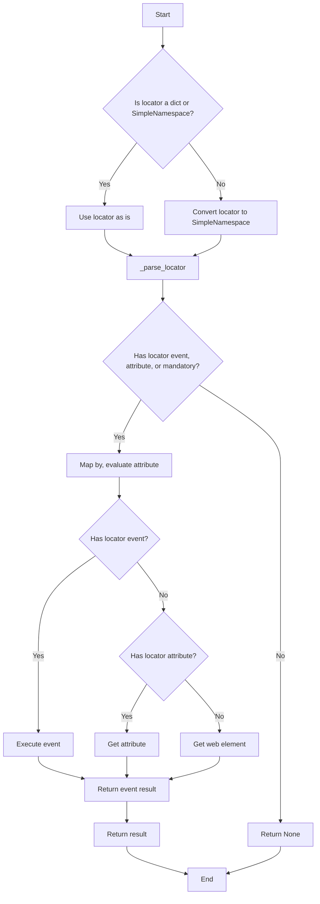
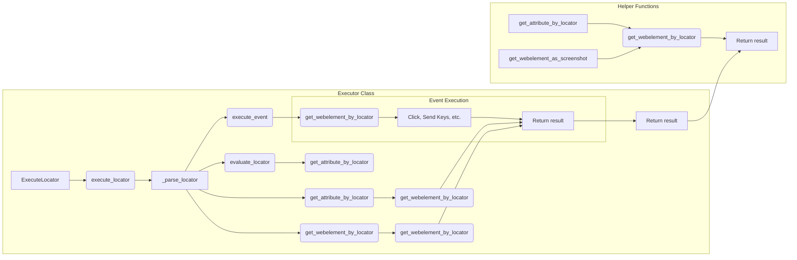

# Код:

```python
## \file hypotez/src/webdriver/executor.py
# -*- coding: utf-8 -*-\
#! venv/Scripts/python.exe
#! venv/bin/python/python3.12

"""
.. module: src.webdriver 
	:platform: Windows, Unix
	:synopsis: The purpose of the `executor` module is to perform actions on web elements based on provided configurations, 
known as "locators." These configurations (or "locators") are dictionaries containing information on how to locate and interact with elements on a web page. The module provides the following functionalities:

1. **Parsing and Handling Locators**: Converts dictionaries with configurations into `SimpleNamespace` objects, 
allowing for flexible manipulation of locator data.

2. **Interacting with Web Elements**: Depending on the provided data, the module can perform various actions such as clicks, 
sending messages, executing events, and retrieving attributes from web elements.

3. **Error Handling**: The module supports continuing execution in case of an error, allowing for the processing of web pages 
that might have unstable elements or require a special approach.

4. **Support for Multiple Locator Types**: Handles both single and multiple locators, enabling the identification and interaction 
with one or several web elements simultaneously.

This module provides flexibility and versatility in working with web elements, enabling the automation of complex web interaction scenarios.


"""
MODE = 'dev'

import asyncio
import re
import sys
import time
from dataclasses import dataclass, field
from enum import Enum
from pathlib import Path
from types import SimpleNamespace
from typing import BinaryIO, ByteString, Dict, List, Optional, Union

from selenium.common.exceptions import (
    ElementClickInterceptedException,
    JavascriptException,
    NoSuchElementException,
    StaleElementReferenceException,  # Этот импорт был добавлен
    TimeoutException,
)
from selenium.webdriver.common.action_chains import ActionChains
from selenium.webdriver.common.by import By
from selenium.webdriver.common.keys import Keys
from selenium.webdriver.remote.webelement import WebElement
from selenium.webdriver.support import expected_conditions as EC
from selenium.webdriver.support.ui import WebDriverWait

import header
from src import gs
from src.logger import logger
from src.logger.exceptions import (
    DefaultSettingsException,
    ExecuteLocatorException,
    WebDriverException,
)

from src.utils.jjson import j_dumps, j_loads, j_loads_ns
from src.utils.printer import pprint
from src.utils.image import save_png


# ... (rest of the code)
```

# Алгоритм:



**Описание шагов:**

1. **Проверка типа локетора:** Проверяется, является ли входной параметр `locator` словарем или объектом `SimpleNamespace`. Если это словарь, он преобразуется в `SimpleNamespace`.
2. **Вызов функции `_parse_locator`:**  Вызывается асинхронная функция `_parse_locator` для обработки локетора.
3. **Обработка атрибутов локетора:**  Функция `_parse_locator` пытается получить значения атрибутов `locator.by`, `locator.attribute` и проверяет наличие события.
4. **Обработка события:** Если событие есть, вызывается функция `execute_event`.
5. **Обработка атрибутов:** Если атрибут есть, вызывается функция `get_attribute_by_locator`.
6. **Получение веб-элемента:** Если ни события, ни атрибуты не найдены, вызывается функция `get_webelement_by_locator`.
7. **Возврат результата:**  Результат выполнения обрабатывается и возвращается.


# Mermaid:



# Объяснение:

**Импорты:**

* `asyncio`, `re`, `sys`, `time`, `dataclasses`, `enum`, `pathlib`, `types`, `typing`: Стандартные библиотеки Python.
* `selenium.common.exceptions`, `selenium.webdriver.*`: Библиотека Selenium для управления веб-драйвером.  Важны для взаимодействия с веб-элементами и обработки исключений.
* `src.gs`, `src.logger`, `src.logger.exceptions`, `src.utils.*`, `header`:  Импорты из собственных модулей проекта (`src`).  Они отвечают за логирование, работу с настройками, утилиты и, вероятно, заголовки проекта.
* `jjson`, `printer`, `image`:  Это утилиты, предназначенные для работы с JSON, вывода данных и работы с изображениями соответственно.


**Классы:**

* `ExecuteLocator`:  Обрабатывает действия с веб-элементами, используя Selenium.
    * `driver`: Веб-драйвер Selenium.
    * `actions`: Объект `ActionChains` для выполнения сложных действий.
    * `by_mapping`: Словарь, сопоставляющий названия локаторов (XPATH, ID и т.д.) с соответствующими константами `By` из Selenium.
    * `mode`: Режим работы (debug/dev).
    * `execute_locator`: Метод для выполнения действий с элементом по заданному локатору.
    * `evaluate_locator`: Метод для оценки и обработки атрибутов локетора.
    * `get_attribute_by_locator`: Метод для получения атрибутов веб-элемента.
    * `get_webelement_by_locator`: Метод для поиска веб-элементов по заданному локатору с использованием `WebDriverWait`.
    * `get_webelement_as_screenshot`: Метод для получения скриншота веб-элемента.
    * `execute_event`: Метод для выполнения различных событий (клик, отправка текста и т.д.).
    * `send_message`: Метод для отправки сообщений в веб-элемент.

**Функции:**

* `_parse_locator`, `evaluate_locator`, `get_attribute_by_locator`, `get_webelement_by_locator`, `get_webelement_as_screenshot`, `execute_event`, `send_message`: Вспомогательные функции для выполнения различных задач, связанных с управлением веб-драйвером и обработкой локеторов.
* `_parse_dict_string`, `_get_attributes_from_dict`, `_evaluate`: Вспомогательные функции для работы с атрибутами локеторов.


**Переменные:**

* `MODE`: Переменная, хранящая режим работы (`'dev'` или `'debug'`).
* `locator`: Словарь или `SimpleNamespace` с данными для поиска и взаимодействия с веб-элементами.
* `timeout`, `timeout_for_event`, `message`, `typing_speed`, `continue_on_error`: Параметры для управления ожиданием и обработкой ошибок.


**Возможные ошибки и улучшения:**

* **Многократное преобразование в SimpleNamespace:** Код преобразует `locator` в `SimpleNamespace` многократно. Можно оптимизировать, выполнив преобразование один раз.
* **Обработка ошибок:**  Обработка ошибок выполняется внутри try-except блоков, но некоторые части могут быть излишне раздуты. Рекомендуется более структурированная и полная обработка исключений.
* **Ясность кода:** В некоторых местах код может быть слишком сложным для понимания, возможно, стоит добавить комментарии.
* **Использование `asyncio.to_thread`:**  Использование `asyncio.to_thread`  для синхронных вызовов необходимо при взаимодействии с Selenium, но следует убедиться, что функции, которые вызываются внутри,  являются асинхронными, чтобы не блокировать основной поток. 
* **Типы возвращаемых значений:**  В некоторых местах код возвращает `None`  при ошибке, что может затруднять обработку ошибок.  Возможно, стоит возвращать специфическое значение исключения.

**Взаимосвязи с другими частями проекта:**

Модуль `executor` тесно связан с модулями `logger`, `utils`, `gs`, и `header`, которые предоставляют необходимые функции для логирования, работы с JSON, управлением ресурсами и т.д. Модуль `gs` вероятно отвечает за работу с данными, а `header` — за заголовки, которые необходимы для некоторых запросов.  Взаимодействие идет через вызовы функций и методов между ними.  Без доступа к остальным модулям трудно полностью оценить работу `executor`.