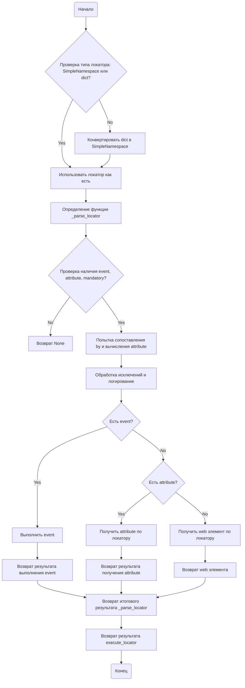
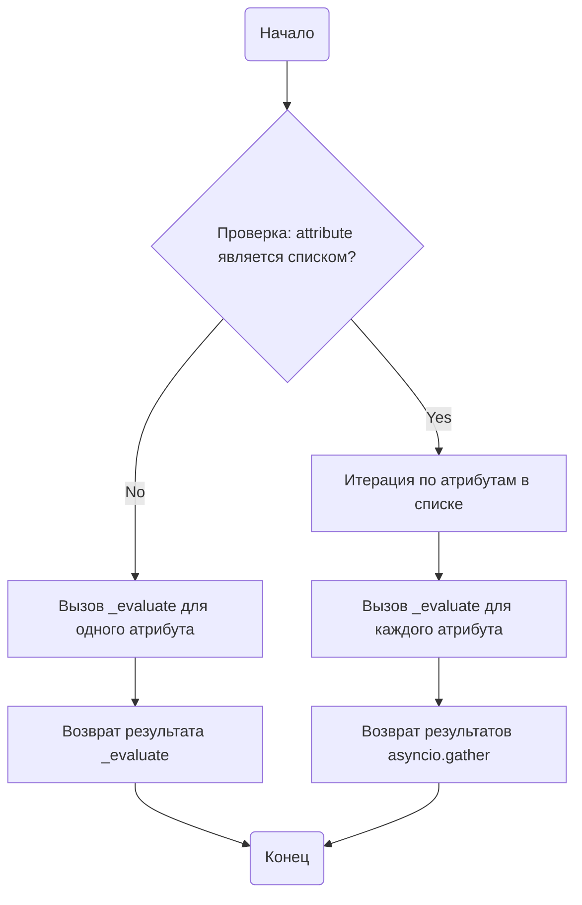
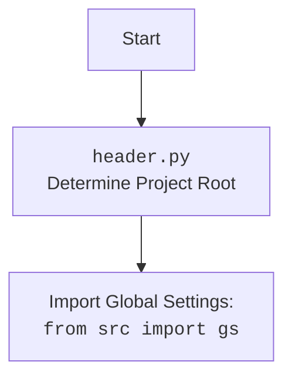

## АНАЛИЗ КОДА: `src/webdriver/executor.md`

### 1. <алгоритм>

**Общая схема работы `executor.py`:**
Модуль `executor.py` предназначен для автоматизации взаимодействия с веб-элементами через Selenium. Основной класс `ExecuteLocator` принимает на вход объект WebDriver и набор конфигураций (локаторов) для управления элементами на странице. Модуль поддерживает различные типы локаторов, извлечение атрибутов и выполнение событий.

**Схема выполнения `execute_locator`:**

1.  **Начало**: Функция `execute_locator` получает на вход локатор (`locator`), который может быть как словарем, так и `SimpleNamespace`.
    *   _Пример:_ `locator = {"by": "id", "selector": "myElement", "event": "click()"}`
2.  **Проверка типа локатора**: Проверяется, является ли локатор `SimpleNamespace` или словарем.
    *   _Пример:_ `isinstance(locator, SimpleNamespace)`
3.  **Преобразование словаря**: Если локатор является словарем, он преобразуется в `SimpleNamespace`.
    *   _Пример:_ `locator = SimpleNamespace(**locator)`
4.  **Определение функции `_parse_locator`**: Внутри `execute_locator` определяется асинхронная функция `_parse_locator` для обработки локатора.
5.  **Проверка наличия `event`, `attribute`, `mandatory`**: В `_parse_locator` проверяется наличие одного из ключевых полей: `event`, `attribute` или `mandatory`. Если их нет, то функция возвращает `None`.
    *   _Пример:_ Если в `locator` нет ни `event`, ни `attribute`, ни `mandatory`, возвращается `None`.
6.  **Попытка сопоставления и вычисления атрибута**: Вызывается метод `evaluate_locator` для извлечения атрибута веб-элемента или выполнения событий.
    *   _Пример:_ `await self.evaluate_locator(locator)`
7.  **Обработка ошибок**: Возможные исключения обрабатываются, и при необходимости ведется лог.
8.  **Проверка наличия события**: Проверяется, есть ли в локаторе `event`.
    *   _Пример:_ `if locator.event:`
9.  **Выполнение события**: Если событие есть, оно выполняется методом `execute_event`.
    *   _Пример:_ `await self.execute_event(locator)`
10. **Проверка наличия атрибута**: Если события нет, проверяется, есть ли в локаторе `attribute`.
    *   _Пример:_ `if locator.attribute:`
11. **Получение атрибута**: Если атрибут есть, он извлекается методом `get_attribute_by_locator`.
    *   _Пример:_ `await self.get_attribute_by_locator(locator)`
12. **Получение веб-элемента**: Если нет ни события, ни атрибута, извлекается веб-элемент методом `get_webelement_by_locator`.
    *   _Пример:_ `await self.get_webelement_by_locator(locator)`
13. **Возврат результата**: Результат выполнения события, извлечения атрибута или получения веб-элемента возвращается.
14. **Конец**: Функция `execute_locator` возвращает итоговый результат.

**Схема выполнения `evaluate_locator`:**

1.  **Начало**: Функция `evaluate_locator` получает на вход локатор (`locator`).
    *   _Пример:_ `locator = SimpleNamespace(attribute='text', by='id', selector='myElement')`
2.  **Проверка, является ли атрибут списком**: Проверяется, является ли атрибут (`locator.attribute`) списком.
    *   _Пример:_ `isinstance(locator.attribute, list)`
3.  **Итерация по атрибутам (если список)**: Если атрибут является списком, происходит итерация по каждому атрибуту.
    *   _Пример:_ `for attr in locator.attribute:`
4.  **Вызов `_evaluate` для каждого атрибута**: Для каждого атрибута из списка вызывается метод `_evaluate`. Результаты собираются с помощью `asyncio.gather`.
    *    _Пример:_ `await asyncio.gather(*[_evaluate(locator, attr) for attr in locator.attribute])`
5.  **Вызов `_evaluate` для одного атрибута**: Если атрибут не список, вызывается метод `_evaluate` для одного атрибута.
    *   _Пример:_ `await self._evaluate(locator, locator.attribute)`
6.  **Возврат результата**: Функция `evaluate_locator` возвращает результат (список результатов или результат для одного атрибута).
7.  **Конец**.

**Схема выполнения `get_attribute_by_locator`:**

1. **Начало**: Функция `get_attribute_by_locator` получает на вход локатор (`locator`).
    *  _Пример:_ `locator = {"by": "id", "selector": "myElement", "attribute": "text"}`
2. **Проверка типа локатора**: Проверяется, является ли локатор `SimpleNamespace` или словарем, и при необходимости преобразуется в `SimpleNamespace`.
3.  **Вызов `get_webelement_by_locator`**: Вызывается метод `get_webelement_by_locator` для получения веб-элемента.
    *   _Пример:_ `elements = await self.get_webelement_by_locator(locator)`
4.  **Проверка наличия элемента**: Проверяется, был ли найден веб-элемент. Если элемент не найден, функция возвращает `None` и пишет сообщение в лог.
5.  **Проверка типа атрибута**: Проверяется, является ли `locator.attribute` строкой, представляющей словарь.
    *  _Пример:_ `isinstance(locator.attribute, str) and locator.attribute.startswith('{') and locator.attribute.endswith('}')`
6.  **Разбор атрибута в словарь**: Если атрибут является строкой, представляющей словарь, он преобразуется в словарь Python.
    *   _Пример:_ `attribute_dict = json.loads(locator.attribute)`
7.  **Проверка, является ли веб-элемент списком**: Проверяется, является ли `elements` списком.
    *   _Пример:_ `isinstance(elements, list)`
8. **Извлечение атрибута для каждого элемента**: Если `elements` является списком, то функция проходит по каждому элементу и извлекает нужный атрибут.
9.  **Извлечение атрибута для одиночного элемента**: Если `elements` не список, функция извлекает атрибут для одного элемента.
10. **Возврат списка атрибутов или одного атрибута**: Возвращается список извлеченных атрибутов или один атрибут, если элемент был найден.
11. **Конец**.

### 2. <mermaid>

#### `execute_locator` диаграмма:



**Зависимости диаграммы `execute_locator`:**

*   Нет импортов, специфичных для диаграммы.

#### `evaluate_locator` диаграмма:



**Зависимости диаграммы `evaluate_locator`:**

*   Нет импортов, специфичных для диаграммы.

#### `get_attribute_by_locator` диаграмма:

```mermaid
graph TD
    Start(Начало) --> CheckIfLocatorIsSimpleNamespaceOrDict{Проверка типа локатора: SimpleNamespace или dict?}
    CheckIfLocatorIsSimpleNamespaceOrDict -- Yes --> ConvertLocatorToSimpleNamespaceIfNeeded[Конвертация локатора в SimpleNamespace (если нужно)]
    ConvertLocatorToSimpleNamespaceIfNeeded --> CallGetWebElementByLocator[Вызов get_webelement_by_locator]
    CallGetWebElementByLocator --> CheckIfWebElementIsFound{Проверка: веб-элемент найден?}
    CheckIfWebElementIsFound -- No --> LogDebugMessageAndReturn[Логирование и возврат None]
    CheckIfWebElementIsFound -- Yes --> CheckIfAttributeIsDictionaryLikeString{Проверка: locator.attribute - строка, похожая на dict?}
    CheckIfAttributeIsDictionaryLikeString -- Yes --> ParseAttributeStringToDict[Парсинг строки в dict]
    ParseAttributeStringToDict --> CheckIfWebElementIsList{Проверка: веб-элемент - список?}
    CheckIfWebElementIsList -- Yes --> RetrieveAttributesForEachElementInList[Получение атрибутов для каждого элемента в списке]
    RetrieveAttributesForEachElementInList --> ReturnListOfAttributes[Возврат списка атрибутов]
    CheckIfWebElementIsList -- No --> RetrieveAttributesForSingleWebElement[Получение атрибутов для одного элемента]
    RetrieveAttributesForSingleWebElement --> ReturnListOfAttributes
    CheckIfAttributeIsDictionaryLikeString -- No --> CheckIfWebElementIsListAgain{Проверка: веб-элемент - список?}
    CheckIfWebElementIsListAgain -- Yes --> RetrieveAttributesForEachElementInListAgain[Получение атрибутов для каждого элемента в списке]
     RetrieveAttributesForEachElementInListAgain --> ReturnListOfAttributesOrSingleAttribute[Возврат списка атрибутов или одного атрибута]
    CheckIfWebElementIsListAgain -- No --> RetrieveAttributeForSingleWebElementAgain[Получение атрибута для одного элемента]
    RetrieveAttributeForSingleWebElementAgain --> ReturnListOfAttributesOrSingleAttribute
    ReturnListOfAttributesOrSingleAttribute --> End(Конец)
    LogDebugMessageAndReturn --> End
```

**Зависимости диаграммы `get_attribute_by_locator`:**

*   Нет импортов, специфичных для диаграммы.

#### `header.py` диаграмма (на основе инструкции):

**Зависимости диаграммы `header.py`:**
*   `src`:  Указывает, что импортируются глобальные настройки из пакета `src`, используя переменную `gs`.

### 3. <объяснение>

#### Импорты:

-   `selenium`: Основной пакет для управления веб-браузерами, включая `webdriver` и `ActionChains`.
-   `asyncio`: Пакет для поддержки асинхронного программирования в Python, используется для асинхронных операций с веб-элементами.
-   `re`: Модуль для работы с регулярными выражениями, может использоваться для обработки строк, например, при разборе локаторов.
-   `dataclasses`: Модуль для создания классов данных, что помогает структурировать информацию о локаторах.
-   `enum`: Модуль для создания перечислений, полезен для определения набора допустимых типов локаторов.
-   `pathlib`: Модуль для работы с файловыми путями, может использоваться для работы со скриншотами элементов.
-    `types`: Используется для создания простых пространств имен (SimpleNamespace), удобных для представления конфигураций локаторов.
-   `typing`: Модуль для добавления аннотаций типов, повышает читаемость и надежность кода.
-   `json`: Используется для работы с данными в формате JSON, что может потребоваться для разбора сложных атрибутов.

#### Классы:

-   **`ExecuteLocator`**:
    -   **Роль**: Основной класс для взаимодействия с веб-элементами. Он обрабатывает локаторы и выполняет действия над элементами.
    -   **Атрибуты**:
        -   `driver`: Экземпляр `selenium.webdriver`, используемый для управления браузером.
        -   `actions`: Экземпляр `selenium.webdriver.ActionChains` для выполнения сложных действий над элементами.
        -   `by_mapping`: Словарь, связывающий строковые обозначения типов локаторов (например, "ID", "XPATH") с соответствующими константами `selenium.webdriver.common.by.By`.
        -   `mode`: Режим работы (например, "debug", "dev"), используемый для управления логированием и поведением в разных средах.
    -   **Методы**:
        -   `__post_init__`: Инициализирует объект `ActionChains` при создании экземпляра класса, если передан `driver`.
        -   `execute_locator`: Выполняет основную логику взаимодействия с веб-элементом, обрабатывая локатор и выполняя нужные действия.
        -   `evaluate_locator`: Вычисляет и обрабатывает атрибуты локатора, поддерживая как единичные атрибуты, так и списки.
        -   `get_attribute_by_locator`: Извлекает значения атрибутов веб-элементов на основе переданного локатора.
        -   `get_webelement_by_locator`: Извлекает веб-элементы на основе предоставленного локатора.
        -   `get_webelement_as_screenshot`: Делает скриншот веб-элемента и сохраняет его на диске.
        -   `execute_event`: Выполняет событие над веб-элементом, например, клик или отправку текста.
        -   `send_message`: Отправляет сообщение веб-элементу (например, ввод текста).

#### Функции:

-   `execute_locator`:
    -   **Аргументы**: `locator` (словарь или `SimpleNamespace` с информацией о локаторе).
    -   **Возвращаемое значение**: Результат выполненного действия (например, атрибут элемента, результат события или объект веб-элемента), или `None` в случае ошибки.
    -   **Назначение**: Координирует взаимодействие с веб-элементом, выбирая между получением атрибутов, выполнением событий и получением самого элемента.
    -   **Пример**:
        ```python
        locator = {"by": "id", "selector": "myButton", "event": "click()"}
        result = await executor.execute_locator(locator) # Вызов для клика на элементе
        ```
-  `evaluate_locator`:
    -   **Аргументы**: `locator` (SimpleNamespace с информацией о локаторе).
    -   **Возвращаемое значение**: Список результатов, если атрибут список, или результат _evaluate для одиночного атрибута.
    -   **Назначение**: Обрабатывает атрибут, вычисляя его для веб-элемента.
    -   **Пример**:
        ```python
        locator = SimpleNamespace(attribute=['text', 'class'], by='id', selector='myElement')
        result = await executor.evaluate_locator(locator) # Вернет список значений атрибутов 'text' и 'class'
        ```
-   `get_attribute_by_locator`:
    -   **Аргументы**: `locator` (словарь или `SimpleNamespace` с информацией о локаторе).
    -   **Возвращаемое значение**: Значение атрибута, список значений атрибутов, или None если элемент не найден.
    -   **Назначение**: Извлекает атрибут веб-элемента.
    -   **Пример**:
        ```python
        locator = {"by": "id", "selector": "myElement", "attribute": "text"}
        text = await executor.get_attribute_by_locator(locator) # Извлекает текст из элемента
        ```
-   `get_webelement_by_locator`:
    -   **Аргументы**: `locator` (словарь или `SimpleNamespace` с информацией о локаторе).
    -   **Возвращаемое значение**: Экземпляр `WebElement` или список `WebElement`, или None если элемент не найден.
    -   **Назначение**: Извлекает веб-элемент на основе предоставленного локатора.
    -   **Пример**:
        ```python
        locator = {"by": "id", "selector": "myElement"}
        element = await executor.get_webelement_by_locator(locator) # Возвращает объект веб-элемента
        ```

#### Переменные:

-   `driver`: Экземпляр `selenium.webdriver` - объект, управляющий браузером.
-   `actions`: Экземпляр `ActionChains` - объект для цепочки действий с элементами.
-   `by_mapping`: Словарь, преобразующий типы локаторов в константы `By`, используемые Selenium.
-   `mode`: Строка, указывающая текущий режим работы модуля.

#### Потенциальные ошибки и области для улучшения:

-   Недостаточная обработка ошибок: Хотя модуль и обрабатывает ошибки, более детальное логирование и обработка разных исключений могут повысить его устойчивость.
-   Сложные локаторы: Поддержка более сложных локаторов, например, с использованием XPath, может быть улучшена.
-   Расширяемость: Возможно, стоит добавить поддержку кастомных типов локаторов, чтобы сделать модуль более гибким.
-  Улучшение читаемости: Некоторые моменты в коде можно сделать более читаемыми, например, переименовав некоторые переменные.

#### Взаимосвязи с другими частями проекта:

-   **`src.webdriver.header`**: Импорт заголовков для определения корневой директории проекта.
-   **`src.gs`**: Импорт глобальных настроек из пакета `src`. Модуль использует глобальные настройки (например, режим `mode`).
-   **`src`**: Модуль является частью пакета `src.webdriver`, предполагается наличие других модулей в этом пакете, которые могут использовать данный модуль для взаимодействия с веб-элементами.
-   **Selenium**:  Модуль `executor.py` зависит от Selenium для взаимодействия с веб-браузером.