## Анализ кода `executor.py`

### <алгоритм>

**1. `execute_locator`:**

   1. **Начало:** Функция `execute_locator` получает `locator` (словарь или `SimpleNamespace`) и запускает процесс.
   2. **Проверка типа локатора:** Проверяет, является ли `locator` объектом `SimpleNamespace` или словарем.
      *   **Пример:** Если `locator` это `SimpleNamespace(by='ID', selector='myId', event='click()')`, переходим к шагу 4. Если `locator` это `{'by': 'ID', 'selector': 'myId', 'event': 'click()'}` переходим к шагу 3.
   3.  **Преобразование словаря в `SimpleNamespace`:** Если `locator` это словарь, преобразует его в объект `SimpleNamespace`.
       *   **Пример:**  `{'by': 'ID', 'selector': 'myId', 'event': 'click()'}` преобразуется в `SimpleNamespace(by='ID', selector='myId', event='click()')`.
   4.  **Использование локатора:** Используем `locator`  в виде объекта `SimpleNamespace`.
   5.  **Определение `_parse_locator`:** Создается асинхронная функция `_parse_locator`.
   6.  **Проверка атрибутов `event`, `attribute`, `mandatory`:** Проверяет наличие хотя бы одного из атрибутов `event`, `attribute` или `mandatory` в `locator`.
         *   **Пример:** Если `locator` содержит `event: 'click()'`, то переходим к шагу 7. Если ни одного из этих атрибутов нет, то возвращаем `None`.
   7.  **Попытка отобразить `by` и обработать `attribute`:** Пытается получить  веб-элемент, используя атрибуты `by` и `selector`, а затем обработать `attribute` (если он есть).
         *   **Пример:**  Если `locator = SimpleNamespace(by='ID', selector='myId', attribute='textContent')`  будет выполнен поиск веб-элемента с `ID = myId` и  получен его атрибут `textContent`.
   8. **Обработка исключений:** Перехватывает возможные исключения во время выполнения поиска и обработки элемента.
   9.  **Проверка на наличие `event`:** Проверяет, есть ли у локатора атрибут `event`.
        *   **Пример:** Если `locator = SimpleNamespace(by='ID', selector='myId', event='click()')` переходим к шагу 10. Если `event` не задан, то переходим к шагу 11.
   10. **Выполнение события:** Выполняет событие (например, клик) для найденного элемента.
        *   **Пример:** Выполняется клик по элементу, найденному по `ID = myId`.
   11. **Проверка на наличие `attribute`:** Проверяет, есть ли у локатора атрибут `attribute`.
        *  **Пример:** Если `locator = SimpleNamespace(by='ID', selector='myId', attribute='value')` переходим к шагу 12. Если  `attribute` не задан, то переходим к шагу 13.
   12. **Получение атрибута:** Получает значение атрибута элемента (например, `value`, `textContent`).
        *  **Пример:** Возвращается значение атрибута `value` найденного элемента.
   13. **Получение веб-элемента:** Получает веб-элемент.
        *   **Пример:** Возвращается объект веб-элемента, найденного по `ID = myId`.
   14. **Возврат результата:** Возвращает результат выполнения события, атрибута или веб-элемента.
   15. **Завершение:** Возвращает окончательный результат функции `execute_locator`.

**2. `evaluate_locator`:**

   1. **Начало:** Функция `evaluate_locator` получает атрибуты `locator.attribute`.
   2. **Проверка типа атрибута:** Проверяет, является ли `locator.attribute` списком.
        *  **Пример:** Если `locator.attribute` это `['value', 'textContent']` переходим к шагу 3. Если `locator.attribute` это строка `value` переходим к шагу 5.
   3.  **Итерация по атрибутам:** Если `locator.attribute` это список, то итерируется по каждому атрибуту.
   4.  **Вызов `_evaluate` для каждого атрибута:** Вызывает `_evaluate` для каждого атрибута, используя `asyncio.gather` для параллельного выполнения.
   5. **Вызов `_evaluate` для одного атрибута:** Если `locator.attribute` не список, вызывает `_evaluate` для одного атрибута.
   6. **Возврат результатов:** Возвращает результат `_evaluate` или результаты из `asyncio.gather`.
   7.  **Завершение.**

**3. `get_attribute_by_locator`:**

   1. **Начало:** Функция `get_attribute_by_locator` получает `locator`.
   2.  **Проверка типа локатора:** Проверяет, является ли `locator` объектом `SimpleNamespace` или словарем.
   3.  **Преобразование словаря в `SimpleNamespace`:** Если `locator` это словарь, преобразует его в объект `SimpleNamespace`.
   4.  **Получение веб-элемента:** Вызывает `get_webelement_by_locator` для получения веб-элемента.
   5.  **Проверка наличия веб-элемента:** Проверяет, был ли найден веб-элемент.
   6.  **Логирование и возврат:** Если веб-элемент не найден, логирует это и возвращает.
   7.  **Проверка типа `attribute`:** Проверяет, является ли `locator.attribute` строкой, похожей на словарь.
       *   **Пример:** Если `locator.attribute` это `"{'attr1': 'val1', 'attr2': 'val2'}"`, переходим к шагу 8. Иначе, переходим к шагу 10.
   8.  **Парсинг атрибута:** Парсит строку `locator.attribute` в словарь.
   9.  **Проверка типа веб-элемента:** Проверяет, является ли найденный веб-элемент списком.
       *   **Пример:** Если при поиске было найдено несколько элементов, то переходим к шагу 10. Если только один, то к шагу 11.
   10. **Получение атрибутов для каждого элемента списка:** Получает атрибуты для каждого элемента в списке и возвращает список.
   11. **Получение атрибутов для одного элемента:** Получает атрибуты для одного веб-элемента и возвращает список или один атрибут.
   12. **Проверка типа веб-элемента:** Если атрибут не словарь, проверяет, является ли веб-элемент списком.
   13. **Получение атрибутов для списка или одного элемента:** Возвращает список атрибутов или один атрибут, в зависимости от типа веб-элемента.
   14. **Завершение.**

```mermaid
graph TD
    subgraph execute_locator
        Start_execute_locator[Начало execute_locator] --> CheckLocatorType_execute_locator[Проверка типа локатора]
        CheckLocatorType_execute_locator --> IsSimpleNamespace_execute_locator{Является ли локатор SimpleNamespace?}
        IsSimpleNamespace_execute_locator -- Yes --> UseLocatorAsIs_execute_locator[Использовать локатор как есть]
        IsSimpleNamespace_execute_locator -- No --> ConvertDictToSimpleNamespace_execute_locator[Преобразовать словарь в SimpleNamespace]
        ConvertDictToSimpleNamespace_execute_locator --> UseLocatorAsIs_execute_locator
        UseLocatorAsIs_execute_locator --> DefineParseLocator_execute_locator[Определить _parse_locator]
        DefineParseLocator_execute_locator --> CheckEventAttributeMandatory_execute_locator[Проверить наличие event, attribute, mandatory]
        CheckEventAttributeMandatory_execute_locator -- No --> ReturnNone_execute_locator[Возврат None]
        CheckEventAttributeMandatory_execute_locator -- Yes --> TryMapByEvaluateAttribute_execute_locator[Попытка отобразить by и обработать attribute]
        TryMapByEvaluateAttribute_execute_locator --> CatchExceptionsAndLog_execute_locator[Перехват исключений]
        CatchExceptionsAndLog_execute_locator --> HasEvent_execute_locator{Есть event?}
        HasEvent_execute_locator -- Yes --> ExecuteEvent_execute_locator[Выполнить event]
        HasEvent_execute_locator -- No --> HasAttribute_execute_locator{Есть attribute?}
        HasAttribute_execute_locator -- Yes --> GetAttributeByLocator_execute_locator[Получить attribute по локатору]
        HasAttribute_execute_locator -- No --> GetWebElementByLocator_execute_locator[Получить web element по локатору]
        ExecuteEvent_execute_locator --> ReturnEventResult_execute_locator[Вернуть результат event]
        GetAttributeByLocator_execute_locator --> ReturnAttributeResult_execute_locator[Вернуть результат attribute]
        GetWebElementByLocator_execute_locator --> ReturnWebElementResult_execute_locator[Вернуть результат web element]
        ReturnEventResult_execute_locator --> ReturnFinalResult_execute_locator[Вернуть результат _parse_locator]
        ReturnAttributeResult_execute_locator --> ReturnFinalResult_execute_locator
        ReturnWebElementResult_execute_locator --> ReturnFinalResult_execute_locator
        ReturnFinalResult_execute_locator --> ReturnExecuteLocatorResult_execute_locator[Вернуть результат execute_locator]
        ReturnExecuteLocatorResult_execute_locator --> End_execute_locator[Конец execute_locator]
        ReturnNone_execute_locator --> ReturnExecuteLocatorResult_execute_locator
    end
    
    subgraph evaluate_locator
        Start_evaluate_locator[Начало evaluate_locator] --> CheckIfAttributeIsList_evaluate_locator[Проверить, attribute это список?]
        CheckIfAttributeIsList_evaluate_locator -- Yes --> IterateOverAttributes_evaluate_locator[Итерация по атрибутам]
        IterateOverAttributes_evaluate_locator --> CallEvaluateForEachAttribute_evaluate_locator[Вызов _evaluate для каждого атрибута]
        CallEvaluateForEachAttribute_evaluate_locator --> ReturnGatheredResults_evaluate_locator[Возврат результатов asyncio.gather]
         CheckIfAttributeIsList_evaluate_locator -- No --> CallEvaluateForSingleAttribute_evaluate_locator[Вызов _evaluate для одного атрибута]
        CallEvaluateForSingleAttribute_evaluate_locator --> ReturnEvaluateResult_evaluate_locator[Возврат результата _evaluate]
        ReturnEvaluateResult_evaluate_locator --> End_evaluate_locator[Конец evaluate_locator]
        ReturnGatheredResults_evaluate_locator --> End_evaluate_locator
    end
    
    subgraph get_attribute_by_locator
        Start_get_attribute_by_locator[Начало get_attribute_by_locator] --> CheckIfLocatorIsSimpleNamespaceOrDict_get_attribute_by_locator[Проверить тип локатора]
        CheckIfLocatorIsSimpleNamespaceOrDict_get_attribute_by_locator --> ConvertLocatorToSimpleNamespaceIfNeeded_get_attribute_by_locator[Конвертировать в SimpleNamespace если нужно]
        ConvertLocatorToSimpleNamespaceIfNeeded_get_attribute_by_locator --> CallGetWebElementByLocator_get_attribute_by_locator[Вызвать get_webelement_by_locator]
        CallGetWebElementByLocator_get_attribute_by_locator --> CheckIfWebElementIsFound_get_attribute_by_locator[Проверить, найден ли webElement]
        CheckIfWebElementIsFound_get_attribute_by_locator -- No --> LogDebugMessageAndReturn_get_attribute_by_locator[Лог и возврат]
        CheckIfWebElementIsFound_get_attribute_by_locator -- Yes --> CheckIfAttributeIsDictionaryLikeString_get_attribute_by_locator[Проверить, attribute это словарь-строка?]
        CheckIfAttributeIsDictionaryLikeString_get_attribute_by_locator -- Yes --> ParseAttributeStringToDict_get_attribute_by_locator[Распарсить строку атрибута в словарь]
        ParseAttributeStringToDict_get_attribute_by_locator --> CheckIfWebElementIsList_get_attribute_by_locator[Проверить, webElement это список?]
         CheckIfWebElementIsList_get_attribute_by_locator -- Yes --> RetrieveAttributesForEachElementInList_get_attribute_by_locator[Получить атрибуты для каждого элемента списка]
        RetrieveAttributesForEachElementInList_get_attribute_by_locator --> ReturnListOfAttributes_get_attribute_by_locator[Вернуть список атрибутов]
        CheckIfWebElementIsList_get_attribute_by_locator -- No --> RetrieveAttributesForSingleWebElement_get_attribute_by_locator[Получить атрибуты для одного элемента]
         RetrieveAttributesForSingleWebElement_get_attribute_by_locator --> ReturnListOfAttributes_get_attribute_by_locator
        CheckIfAttributeIsDictionaryLikeString_get_attribute_by_locator -- No --> CheckIfWebElementIsListAgain_get_attribute_by_locator[Проверить, webElement это список?]
       CheckIfWebElementIsListAgain_get_attribute_by_locator -- Yes --> RetrieveAttributesForEachElementInListAgain_get_attribute_by_locator[Получить атрибуты для каждого элемента списка]
         RetrieveAttributesForEachElementInListAgain_get_attribute_by_locator --> ReturnListOfAttributesOrSingleAttribute_get_attribute_by_locator[Вернуть список или один атрибут]
        CheckIfWebElementIsListAgain_get_attribute_by_locator -- No --> RetrieveAttributeForSingleWebElementAgain_get_attribute_by_locator[Получить атрибут для одного элемента]
         RetrieveAttributeForSingleWebElementAgain_get_attribute_by_locator --> ReturnListOfAttributesOrSingleAttribute_get_attribute_by_locator
        ReturnListOfAttributesOrSingleAttribute_get_attribute_by_locator --> End_get_attribute_by_locator[Конец get_attribute_by_locator]
        LogDebugMessageAndReturn_get_attribute_by_locator --> End_get_attribute_by_locator
        
    end
    
    execute_locator --> evaluate_locator
    execute_locator --> get_attribute_by_locator
```

### <mermaid>

### <объяснение>

**Импорты:**

-   `selenium.webdriver`: Используется для управления браузером и взаимодействия с веб-элементами.
-   `selenium.webdriver.common.by.By`: Используется для определения способов поиска веб-элементов (например, по ID, классу, XPath).
-  `selenium.webdriver.support.ui`: Содержит классы для ожидания условий при работе с веб-элементами.
- `selenium.webdriver.support.expected_conditions`:  Содержит набор заранее определенных ожидаемых условий при работе с веб-элементами.
-   `selenium.webdriver.remote.webelement.WebElement`:  Представляет веб-элемент на странице.
-   `selenium.webdriver.common.action_chains`: Используется для создания сложных последовательностей действий пользователя.
-   `asyncio`: Используется для выполнения асинхронных операций.
-   `re`: Используется для работы с регулярными выражениями.
-   `dataclasses.dataclass`: Используется для создания классов данных.
-   `enum.Enum`: Используется для создания перечислений.
-   `pathlib.Path`: Используется для работы с путями к файлам.
-   `types.SimpleNamespace`: Используется для создания простых объектов с атрибутами.
-   `typing`: Используется для аннотации типов.
-   `src.webdriver.exceptions`: Пакет содержит кастомные исключения для данного проекта.
-   `src.config.settings`: Используется для доступа к настройкам проекта.
-   `src.utils.image`: Содержит утилиты для работы с изображениями.
-   `src.utils.logger`: Содержит утилиты для логгирования.
-   `src.utils.utils`: Общие утилиты проекта.

**Классы:**

-   `ExecuteLocator`:
    -   **Роль:** Основной класс для выполнения действий с веб-элементами на основе локаторов.
    -   **Атрибуты:**
        -   `driver`: Экземпляр WebDriver для управления браузером.
        -   `actions`: Экземпляр `ActionChains` для выполнения сложных действий.
        -   `by_mapping`: Словарь, сопоставляющий типы локаторов с методами `By` из Selenium.
        -   `mode`: Режим работы (debug, dev и т.д.).
        -   `logger`: Логгер для записи сообщений.
        -   `element_wait_time`: Время ожидания при поиске элемента.
    -   **Методы:**
        -   `__post_init__`: Инициализирует `ActionChains` при создании экземпляра класса.
        -   `execute_locator`: Выполняет действие с веб-элементом на основе переданного локатора.
        -  `_parse_locator`: Внутренний метод для обработки локаторов и получения элементов или их атрибутов.
        -   `evaluate_locator`: Обрабатывает атрибуты локатора (получает значение атрибута или список атрибутов).
        -   `get_attribute_by_locator`: Получает атрибут веб-элемента(ов) по локатору.
        -   `get_webelement_by_locator`: Получает веб-элемент(ы) по локатору.
        -   `get_webelement_as_screenshot`: Делает скриншот веб-элемента.
        -   `execute_event`: Выполняет событие (например, клик) для веб-элемента.
        -   `send_message`: Отправляет сообщение в текстовое поле.

**Функции:**

-   `__post_init__`:  
    -   **Аргументы:** `self`.
    -   **Возвращаемое значение:** `None`.
    -   **Назначение:** Инициализирует атрибут `actions` класса `ExecuteLocator` при наличии экземпляра драйвера.
    -   **Пример:**  При создании объекта `ExecuteLocator` с переданным `driver`, этот метод инициализирует цепочку действий.

-   `execute_locator`:
    -   **Аргументы:** `self`, `locator` (словарь или `SimpleNamespace`).
    -   **Возвращаемое значение:** Результат выполнения действия с веб-элементом (значение атрибута, веб-элемент, результат события).
    -   **Назначение:** Основная функция для выполнения действий с веб-элементами на основе локатора.
    -   **Пример:** `await executor.execute_locator({'by': 'ID', 'selector': 'myId', 'event': 'click()'})` выполнит клик по элементу с `ID = myId`.

-   `evaluate_locator`:
    -   **Аргументы:** `self`, `locator` (объект `SimpleNamespace`).
    -   **Возвращаемое значение:**  Значение атрибута (или список значений).
    -   **Назначение:** Получает значения атрибутов из веб-элементов.
    -   **Пример:**  Если `locator.attribute` это `['value', 'textContent']`, будут получены значения этих атрибутов.

-   `get_attribute_by_locator`:
    -   **Аргументы:** `self`, `locator` (словарь или `SimpleNamespace`).
    -   **Возвращаемое значение:** Значение атрибута или список значений атрибутов.
    -   **Назначение:** Извлекает значения атрибутов из веб-элементов.
    -   **Пример:** `await executor.get_attribute_by_locator({'by': 'ID', 'selector': 'myId', 'attribute': 'textContent'})` получит текст элемента с `ID = myId`.

-   `get_webelement_by_locator`:
    -   **Аргументы:** `self`, `locator` (словарь или `SimpleNamespace`).
    -   **Возвращаемое значение:**  Веб-элемент или список веб-элементов.
    -   **Назначение:** Получает веб-элемент(ы) по локатору.
    -   **Пример:** `await executor.get_webelement_by_locator({'by': 'ID', 'selector': 'myId'})` вернет объект элемента с `ID = myId`.

-   `get_webelement_as_screenshot`:
    -   **Аргументы:** `self`, `locator` (словарь или `SimpleNamespace`), `filename` (строка).
    -   **Возвращаемое значение:** `Path` к созданному скриншоту.
    -   **Назначение:** Делает скриншот веб-элемента и сохраняет его.
    -   **Пример:** `await executor.get_webelement_as_screenshot({'by': 'ID', 'selector': 'myId'}, filename='element.png')` создаст скриншот элемента и сохранит его в файле element.png.

-   `execute_event`:
    -   **Аргументы:** `self`, `element` (веб-элемент), `event` (строка).
    -   **Возвращаемое значение:** Результат выполнения события.
    -   **Назначение:** Выполняет событие (например, клик) для веб-элемента.
    -   **Пример:** `await executor.execute_event(element, 'click()')` выполнит клик по элементу.

-   `send_message`:
    -   **Аргументы:** `self`, `locator` (словарь или `SimpleNamespace`), `message` (строка).
    -   **Возвращаемое значение:** `None`.
    -   **Назначение:** Отправляет сообщение в текстовое поле веб-элемента.
    -   **Пример:** `await executor.send_message({'by': 'ID', 'selector': 'myInput'}, 'Hello World!')` отправит сообщение в поле ввода.

**Переменные:**

-   `by_mapping`: Словарь, сопоставляющий строковые названия типов локаторов (например, `"ID"`) с соответствующими объектами `By` из Selenium (например, `By.ID`).
-  `element_wait_time`: Время ожидания при поиске элемента, задается в настройках проекта.
- `logger`: Экземпляр логера для записи сообщений, создается при инициализации класса.

**Потенциальные ошибки и улучшения:**

1.  **Обработка ошибок:** Код уже имеет обработку исключений, но можно расширить логирование для более подробной диагностики.
2.  **Динамическое ожидание:** Можно добавить более гибкие механизмы ожидания загрузки элементов на странице, например, используя `WebDriverWait` и `expected_conditions` из Selenium.
3.  **Параметризация:** Вынести часто используемые значения в настройки (например, время ожидания, типы локаторов).
4.  **Проверка типов:** Можно добавить проверки типов для аргументов функций (например, `locator` должен быть либо словарем, либо `SimpleNamespace`).

**Цепочка взаимосвязей с другими частями проекта:**

-   `src.webdriver.exceptions`: Используется для кастомных исключений, специфичных для этого модуля.
-   `src.config.settings`: Используется для получения общих настроек проекта.
-   `src.utils.image`: Используется для работы с изображениями, например при создании скриншотов.
-   `src.utils.logger`: Используется для логирования событий и ошибок.
- `src.utils.utils`: Используются общие утилиты для проекта, например `convert_str_to_dict` и другие.

В целом, этот модуль обеспечивает гибкий и мощный механизм для взаимодействия с веб-элементами, с хорошей структурой и возможностями для расширения и улучшения.