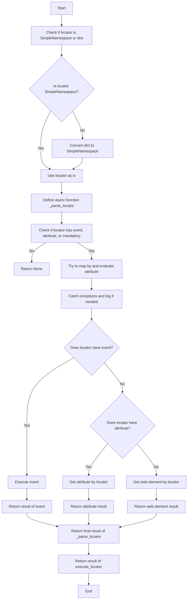
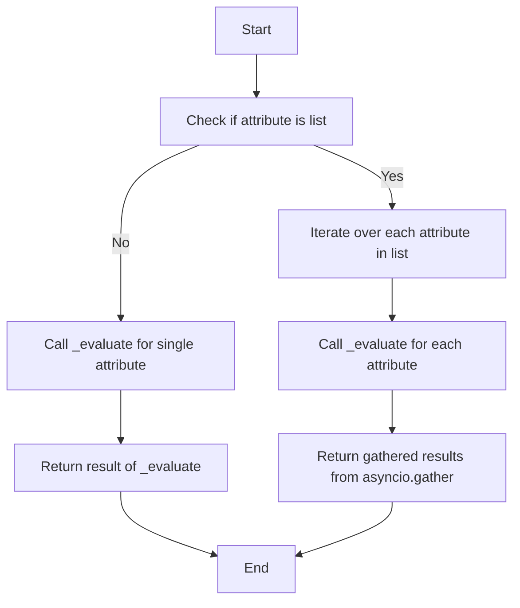
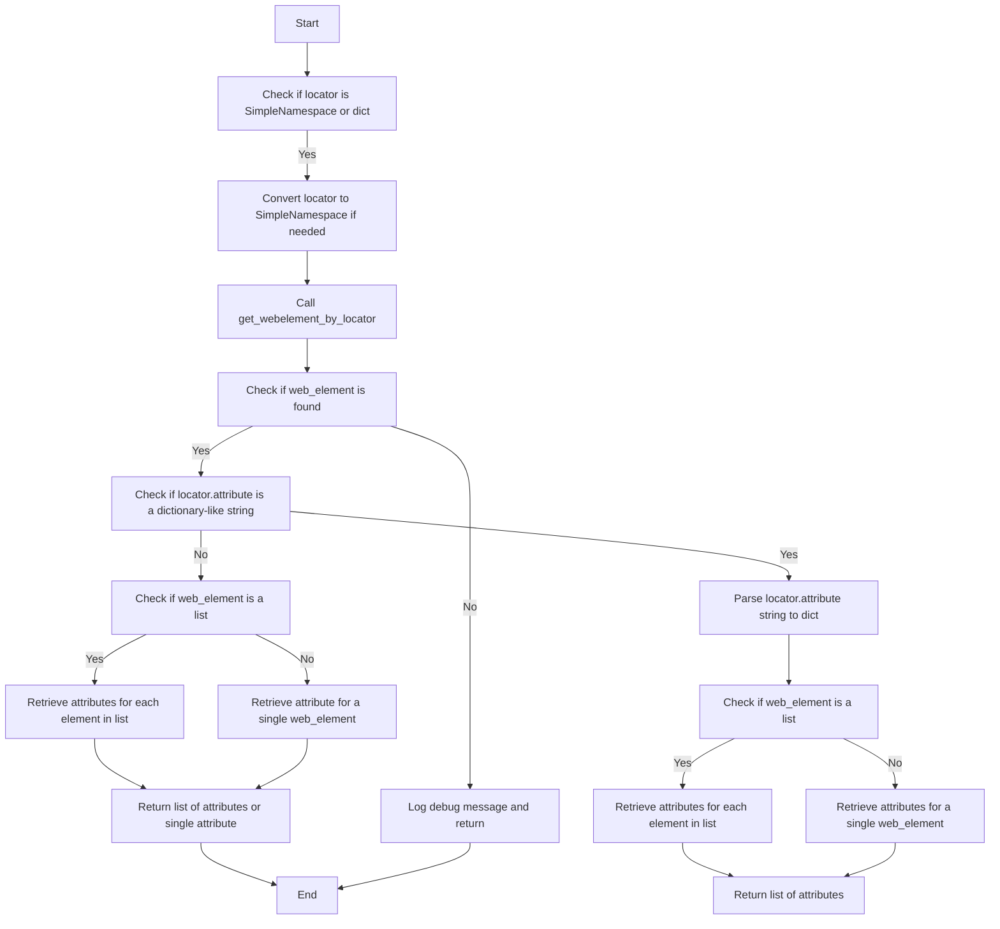

## АНАЛИЗ КОДА: `executor.py`

### 1. <алгоритм>

Модуль `executor.py` предназначен для автоматизации взаимодействия с веб-элементами с использованием Selenium. Он обрабатывает конфигурации (локаторы) и выполняет действия, такие как клики, ввод текста и извлечение данных.

**Основные шаги работы:**

1.  **Инициализация:**
    *   Создается экземпляр класса `ExecuteLocator`, принимающий `driver` (экземпляр Selenium WebDriver) и режим работы `mode` (например, debug).
    *   Инициализируется `ActionChains` для выполнения сложных взаимодействий.
    *   Определяется словарь `by_mapping`, связывающий типы локаторов (например, 'ID', 'XPATH') с соответствующими методами Selenium.

2.  **`execute_locator`**:
    *   Принимает локатор в виде словаря или `SimpleNamespace`.
    *   Преобразует словарь в `SimpleNamespace` для удобства работы.
    *   Определяет асинхронную функцию `_parse_locator` для обработки локатора.
    *   Если локатор имеет атрибуты `event`, `attribute` или `mandatory`, пытается обработать их.
    *   В случае возникновения исключений, логирует их и продолжает работу.
    *   Вызывает соответствующие функции в зависимости от наличия `event` или `attribute` в локаторе:
        *   `execute_event`: Выполняет событие (например, клик).
        *   `get_attribute_by_locator`: Получает атрибут(ы) элемента.
        *   `get_webelement_by_locator`: Получает веб-элемент(ы).
    *   Возвращает результат выполнения.

3.  **`evaluate_locator`**:
    *   Принимает локатор.
    *   Проверяет, является ли атрибут списком:
        *   Если является, то итерируется по каждому атрибуту, вызывая `_evaluate` для каждого и собирая результаты с помощью `asyncio.gather`.
        *   Если нет, вызывает `_evaluate` для одного атрибута.
    *   Возвращает результаты.

4.  **`get_attribute_by_locator`**:
    *   Принимает локатор.
    *   Получает веб-элемент(ы) с помощью `get_webelement_by_locator`.
    *   Если элемент(ы) не найдены, логирует и возвращает `None`.
    *   Проверяет, является ли атрибут строкой, похожей на словарь:
        *   Если да, парсит строку в словарь.
    *   Проверяет, является ли элемент списком:
        *   Если является, извлекает атрибуты для каждого элемента.
        *   Если нет, извлекает атрибуты для одного элемента.
    *   Возвращает список атрибутов или один атрибут.

**Примеры:**

*   **Локатор:**
    ```python
    locator = {
        "by": "ID",
        "selector": "my_button",
        "event": "click()"
    }
    ```
    *   `execute_locator` сначала преобразует этот словарь в `SimpleNamespace`.
    *   Затем, так как есть `event`, вызывается `execute_event`, который выполняет клик на элементе с `ID` "my_button".

*   **Локатор с атрибутом:**
    ```python
    locator = {
        "by": "CLASS_NAME",
        "selector": "item",
        "attribute": "text"
    }
    ```
    *   `execute_locator` вызывает `get_attribute_by_locator`.
    *   `get_attribute_by_locator` находит все элементы с классом "item" и возвращает их текст.

*   **Локатор со списком атрибутов:**
    ```python
        locator = {
            "by": "TAG_NAME",
            "selector": "input",
            "attribute": ["name", "type", "value"]
        }
    ```
    *   `evaluate_locator` получает список атрибутов.
    *   Для каждого атрибута вызывается функция `_evaluate` и с помощью `asyncio.gather` собираются результаты.

### 2. <mermaid>



**Описание зависимостей:**

*   **`Start`**: Начало выполнения функции `execute_locator`.
*   **`CheckLocatorType`**: Проверяет тип входного локатора.
*   **`IsSimpleNamespace`**: Условный блок, проверяющий, является ли локатор объектом `SimpleNamespace`.
*   **`UseLocatorAsIs`**: Использует локатор как есть, если он является `SimpleNamespace`.
*   **`ConvertDictToSimpleNamespace`**: Преобразует словарь в `SimpleNamespace`.
*   **`DefineParseLocator`**: Определяет асинхронную функцию `_parse_locator`.
*   **`CheckEventAttributeMandatory`**: Проверяет наличие атрибутов `event`, `attribute`, `mandatory`.
*   **`ReturnNone`**: Возвращает `None`, если атрибуты не найдены.
*   **`TryMapByEvaluateAttribute`**: Пытается сопоставить и обработать атрибут.
*   **`CatchExceptionsAndLog`**: Ловит исключения и логирует их.
*   **`HasEvent`**: Условный блок, проверяющий, есть ли атрибут `event`.
*   **`ExecuteEvent`**: Выполняет событие, например, клик.
*   **`HasAttribute`**: Условный блок, проверяющий, есть ли атрибут `attribute`.
*   **`GetAttributeByLocator`**: Получает атрибут элемента.
*   **`GetWebElementByLocator`**: Получает веб-элемент(ы).
*   **`ReturnEventResult`**: Возвращает результат выполнения события.
*   **`ReturnAttributeResult`**: Возвращает результат получения атрибута.
*   **`ReturnWebElementResult`**: Возвращает результат получения элемента.
*   **`ReturnFinalResult`**: Возвращает окончательный результат функции `_parse_locator`.
*   **`ReturnExecuteLocatorResult`**: Возвращает результат функции `execute_locator`.
*   **`End`**: Завершение выполнения функции `execute_locator`.



**Описание зависимостей:**

*   **`Start`**: Начало выполнения функции `evaluate_locator`.
*   **`CheckIfAttributeIsList`**: Проверяет, является ли атрибут списком.
*   **`IterateOverAttributes`**: Итерируется по атрибутам, если они в виде списка.
*   **`CallEvaluateForEachAttribute`**: Вызывает функцию `_evaluate` для каждого атрибута.
*   **`ReturnGatheredResults`**: Возвращает результаты, собранные с помощью `asyncio.gather`.
*  **`CallEvaluateForSingleAttribute`**: Вызывает `_evaluate` для одного атрибута.
*  **`ReturnEvaluateResult`**: Возвращает результат `_evaluate`.
*   **`End`**: Завершение выполнения функции `evaluate_locator`.



**Описание зависимостей:**

*   **`Start`**: Начало выполнения функции `get_attribute_by_locator`.
*   **`CheckIfLocatorIsSimpleNamespaceOrDict`**: Проверяет, является ли локатор `SimpleNamespace` или словарем.
*   **`ConvertLocatorToSimpleNamespaceIfNeeded`**: При необходимости конвертирует локатор в `SimpleNamespace`.
*   **`CallGetWebElementByLocator`**: Вызывает `get_webelement_by_locator` для получения веб-элемента(ов).
*   **`CheckIfWebElementIsFound`**: Проверяет, найден ли веб-элемент(ы).
*   **`LogDebugMessageAndReturn`**: Логирует сообщение об ошибке и возвращает `None`.
*   **`CheckIfAttributeIsDictionaryLikeString`**: Проверяет, является ли атрибут строкой, похожей на словарь.
*   **`ParseAttributeStringToDict`**: Парсит строку атрибута в словарь.
*   **`CheckIfWebElementIsList`**: Проверяет, является ли веб-элемент списком.
*   **`RetrieveAttributesForEachElementInList`**: Получает атрибуты для каждого элемента списка.
*   **`RetrieveAttributesForSingleWebElement`**: Получает атрибуты для одного веб-элемента.
*   **`ReturnListOfAttributes`**: Возвращает список атрибутов.
*   **`CheckIfWebElementIsListAgain`**: Повторная проверка, является ли веб-элемент списком.
*    **`RetrieveAttributesForEachElementInListAgain`**: Получает атрибуты для каждого элемента списка(альтернативная ветка).
*   **`RetrieveAttributeForSingleWebElementAgain`**: Получает атрибут для одного веб-элемента (альтернативная ветка).
*   **`ReturnListOfAttributesOrSingleAttribute`**: Возвращает список атрибутов или один атрибут (альтернативная ветка).
*    **`End`**: Завершение выполнения функции `get_attribute_by_locator`.

### 3. <объяснение>

**Импорты:**

*   `selenium.webdriver`: Для управления веб-браузером.
*   `selenium.webdriver.common.by`: Для определения способов поиска элементов (например, By.ID, By.XPATH).
*   `selenium.webdriver.common.action_chains`: Для выполнения сложных действий, таких как drag-and-drop.
*   `selenium.common.exceptions`: Для обработки исключений, которые могут возникнуть при взаимодействии с веб-элементами.
*   `asyncio`: Для асинхронного программирования.
*   `re`: Для работы с регулярными выражениями.
*   `dataclasses`: Для создания классов данных.
*   `enum`: Для создания перечислений.
*   `pathlib`: Для работы с файловыми путями.
*   `types`: Для создания простых пространств имен (SimpleNamespace).
*   `typing`: Для аннотации типов.

**Класс `ExecuteLocator`:**

*   **`__init__`**: Инициализирует класс. Принимает `driver` и `mode`. Создает `ActionChains` если передан `driver`. Определяет соответствие между типом локатора и методом `By` (например, 'id' -> `By.ID`).
*   **`execute_locator`**: Главная функция для выполнения действий с веб-элементами. Принимает локатор и выполняет действия, такие как клик или получение атрибута.
*   **`evaluate_locator`**: Оценивает атрибуты локатора, обрабатывая случаи, когда атрибут является списком. Использует `asyncio.gather` для одновременной обработки нескольких атрибутов.
*   **`get_attribute_by_locator`**: Получает атрибуты элемента(ов) по заданному локатору. Обрабатывает случаи, когда атрибут представлен в виде словаря в строке.
*   **`get_webelement_by_locator`**: Получает веб-элемент(ы) по заданному локатору.
*   **`get_webelement_as_screenshot`**: Делает скриншот найденного веб-элемента.
*   **`execute_event`**: Выполняет событие (например, клик) на найденном элементе.
*   **`send_message`**: Вводит текст в веб-элемент.
*   **`by_mapping`**: Словарь, определяющий соответствие между типами локаторов и методами `By` из Selenium.
*   **`driver`**: Экземпляр Selenium WebDriver.
*   **`actions`**: Экземпляр ActionChains для выполнения сложных действий.
*   **`mode`**: Режим работы (например, debug, dev).

**Функции:**

*   **`_parse_locator`**: Асинхронная функция, которая анализирует локатор и вызывает необходимые методы для взаимодействия с веб-элементом. Она используется внутри `execute_locator` для асинхронной обработки локаторов.
*   **`_evaluate`**: Асинхронная функция, вызываемая для обработки отдельных атрибутов.

**Переменные:**

*   **`locator`**: Словарь или SimpleNamespace, содержащий информацию о том, как найти элемент на странице.
*   **`by`**: Тип локатора (например, 'id', 'xpath').
*   **`selector`**: Строка, используемая для поиска элемента.
*   **`event`**: Событие для выполнения (например, "click()").
*   **`attribute`**: Атрибут, который необходимо получить (например, "text", "value").
*   **`message`**: Сообщение, которое необходимо отправить в элемент.

**Потенциальные ошибки и области для улучшения:**

1.  **Обработка исключений:** В блоке `TryMapByEvaluateAttribute` происходит общий отлов исключений. Возможно, стоит добавить более точную обработку разных типов исключений.
2.  **Гибкость `execute_event`:** Функция `execute_event` парсит строку события (например, `"click()"`). Возможно, стоит реализовать более структурированный способ передачи событий.
3.  **Асинхронность:** Модуль использует асинхронность, но некоторые операции (например, `get_webelement_by_locator`) могут быть узким местом, если реализация неоптимальна.
4.  **Расширяемость:** Можно добавить поддержку других типов локаторов или событий.

**Взаимосвязи с другими частями проекта:**

*   Модуль `executor.py` зависит от `selenium` для управления браузером.
*   Он, вероятно, будет использоваться другими модулями, например, модулями для парсинга или тестирования веб-страниц.
*   Также есть зависимость от `src.settings` через `from src import gs`.

Модуль `executor.py` является ключевым компонентом для автоматизированного взаимодействия с веб-элементами в проекте `hypo`. Он предоставляет гибкий и мощный интерфейс для выполнения различных действий на веб-страницах.