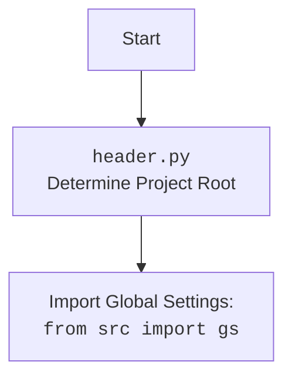

## ИНСТРУКЦИЯ:

Анализируй предоставленный код подробно и объясни его функциональность. Ответ должен включать три раздела:

1.  **<алгоритм>**: Опиши рабочий процесс в виде пошаговой блок-схемы, включая примеры для каждого логического блока, и проиллюстрируй поток данных между функциями, классами или методами.
2.  **<mermaid>**: Напиши код для диаграммы в формате `mermaid`, проанализируй и объясни все зависимости,
    которые импортируются при создании диаграммы.
    **ВАЖНО!** Убедитесь, что все имена переменных, используемые в диаграмме `mermaid`,
    имеют осмысленные и описательные имена. Имена переменных вроде `A`, `B`, `C`, и т.д., не допускаются!

    **Дополнительно**: Если в коде есть импорт `import header`, добавьте блок `mermaid` flowchart, объясняющий `header.py`:
    ```mermaid
    flowchart TD
        Start --> Header[<code>header.py</code><br> Determine Project Root]

        Header --> import[Import Global Settings: <br><code>from src import gs</code>]
    ```

3.  **<объяснение>**: Предоставьте подробные объяснения:
    -   **Импорты**: Их назначение и взаимосвязь с другими пакетами `src.`.
    -   **Классы**: Их роль, атрибуты, методы и взаимодействие с другими компонентами проекта.
    -   **Функции**: Их аргументы, возвращаемые значения, назначение и примеры.
    -   **Переменные**: Их типы и использование.
    -   Выделите потенциальные ошибки или области для улучшения.

Дополнительно, постройте цепочку взаимосвязей с другими частями проекта (если применимо).

Это обеспечивает всесторонний и структурированный анализ кода.
## Формат ответа: `.md` (markdown)
**КОНЕЦ ИНСТРУКЦИИ**

## <алгоритм>

**Общий алгоритм работы модуля `executor.py`:**

1.  **Инициализация:**
    *   Импортируются необходимые библиотеки и модули, такие как `asyncio`, `selenium`, `header`, `src.gs`, `src.logger`, `src.utils`.
    *   Определяется класс `ExecuteLocator`, который управляет действиями с веб-элементами. В `__post_init__` устанавливается `ActionChains`, если передан `driver`.
2.  **Выполнение локатора (`execute_locator`)**:
    *   Принимает на вход локатор (словарь или `SimpleNamespace`), таймаут, тип события, сообщение, скорость ввода и флаг `continue_on_error`.
    *   Конвертирует входной локатор в `SimpleNamespace`, если это словарь. Если локатор - заглушка (нет атрибута `attribute` и селектора `selector`), возвращает `None`.
    *   Вызывает внутреннюю асинхронную функцию `_parse_locator` для обработки локатора.
    *   Возвращает результат `_parse_locator`.
3.  **Разбор локатора (`_parse_locator`)**:
    *   Конвертирует локатор в `SimpleNamespace`, если это словарь.
    *   Проверяет, есть ли в локаторе событие, атрибут или признак обязательности. Если ничего нет - возвращает `None`.
    *   Преобразует `locator.by` в соответствующий элемент `By` из `selenium`.
    *   Пытается получить атрибут локатора (`await self.evaluate_locator(locator.attribute)`)
    *   Если `locator.by == 'VALUE'`, возвращает атрибут.
    *   Если есть событие, вызывает `execute_event`.
    *   Если есть атрибут, вызывает `get_attribute_by_locator`.
    *   Иначе, получает веб-элемент через `get_webelement_by_locator`.
    *   Возвращает результат.
4.  **Оценка атрибута (`evaluate_locator`)**:
    *   Принимает на вход атрибут (строка, список строк или словарь).
    *   Определяет внутреннюю асинхронную функцию `_evaluate`, которая проверяет, является ли атрибут константой из `Keys`. Если да, то возвращает константу, иначе - сам атрибут.
    *   Если атрибут - список, то вызывает `_evaluate` для каждого элемента списка и возвращает список результатов.
    *   Если атрибут - не список, вызывает `_evaluate` для атрибута.
5.  **Получение атрибута по локатору (`get_attribute_by_locator`)**:
    *   Принимает локатор, таймаут и тип события.
    *   Получает веб-элемент через `get_webelement_by_locator`.
    *   Если элемент не найден, возвращает `None`.
    *   Определяет внутреннюю функцию `_parse_dict_string` для парсинга строки-словаря.
    *   Определяет внутреннюю функцию `_get_attributes_from_dict` для получения атрибутов из веб-элемента на основе словаря.
    *   Проверяет, является ли атрибут словарем в виде строки. Если да, то парсит и вызывает функцию `_get_attributes_from_dict`.
    *   Если элемент - список, то вызывает `_get_attributes_from_dict` для каждого элемента и возвращает список.
    *   Если элемент - не список, то получает значение атрибута и возвращает его.
6.  **Получение веб-элемента по локатору (`get_webelement_by_locator`)**:
    *   Принимает локатор, таймаут и тип события.
    *   Определяет внутреннюю функцию `_parse_elements_list` для обработки списка веб-элементов. Она фильтрует список на основе значения `locator.if_list` (первый, последний, четные, нечетные, по индексу).
    *   Преобразует локатор в `SimpleNamespace`, если это словарь.
    *   Если таймаут равен нулю, то пытается сразу найти элементы.
    *   Иначе, использует `WebDriverWait` для ожидания появления элементов.
    *   Вызывает `_parse_elements_list` для фильтрации элементов.
    *   Возвращает список веб-элементов или `None` в случае ошибки.
7.  **Получение скриншота веб-элемента (`get_webelement_as_screenshot`)**:
    *   Принимает локатор, таймаут, тип события, сообщение, скорость ввода, флаг `continue_on_error` и веб-элемент (необязательно).
    *   Получает веб-элемент через `get_webelement_by_locator`, если он не был передан.
    *   Делает скриншот веб-элемента с помощью `webelement.screenshot_as_png`.
    *   Возвращает поток байтов с изображением или `None` в случае ошибки.
8. **Выполнение события (`execute_event`)**:
    * Принимает локатор, таймаут, тип события, сообщение, скорость ввода и флаг `continue_on_error`.
    * Получает веб-элемент через `get_webelement_by_locator`.
    * Разбирает строку события по разделителю ";".
    * Обрабатывает каждое событие в цикле:
    *   `click()`: кликает на элемент.
    *   `pause(n)`: делает паузу на `n` секунд.
    *   `upload_media()`: отправляет сообщение как путь к файлу.
    *   `screenshot()`: делает скриншот.
    *   `clear()`: очищает поле.
    *   `send_keys()`: отправляет последовательность клавиш.
    *   `type()`: печатает сообщение посимвольно.
    *   Возвращает список результатов или `True` в случае успеха.
9.  **Отправка сообщения (`send_message`)**:
    *   Принимает локатор, таймаут, тип события, сообщение, скорость ввода и флаг `continue_on_error`.
    *   Преобразует локатор в `SimpleNamespace`.
    *   Определяет внутреннюю функцию `type_message` для ввода сообщения с заданным темпом.
    *   Получает веб-элемент через `get_webelement_by_locator`.
    *   Использует `ActionChains` для перемещения к элементу и ввода текста с учетом скорости и замены символов.
    *   Возвращает `True` если ввод успешен.

## <mermaid>

```mermaid
flowchart TD
    Start(Начало) --> Init[Инициализация класса ExecuteLocator];
    Init --> ExecuteLocatorCall[Вызов execute_locator];
    ExecuteLocatorCall --> ConvertLocator[Конвертация локатора в SimpleNamespace];
    ConvertLocator --> CheckLocator[Проверка на заглушку];
    CheckLocator -- Да --> End(Завершение: None);
    CheckLocator -- Нет --> ParseLocatorCall[Вызов _parse_locator];
    ParseLocatorCall --> ConvertLocatorInParse[_parse_locator: Конвертация локатора в SimpleNamespace];
    ConvertLocatorInParse --> CheckLocatorEventAttrMandatory[_parse_locator: Проверка наличия event, attribute, mandatory];
    CheckLocatorEventAttrMandatory -- Нет --> End_ParseLocator(Завершение _parse_locator: None);
    CheckLocatorEventAttrMandatory -- Да --> MapLocatorBy[_parse_locator: Map locator.by];
    MapLocatorBy --> EvaluateLocatorCall[_parse_locator: Вызов evaluate_locator если есть locator.attribute];
    EvaluateLocatorCall --> CheckLocatorByValue[_parse_locator: Проверка if locator.by == 'VALUE'];
    CheckLocatorByValue -- Да --> ReturnAttribute[_parse_locator: Возврат значения locator.attribute];
    CheckLocatorByValue -- Нет --> CheckLocatorEvent[_parse_locator: Проверка наличия event];
    CheckLocatorEvent -- Да --> ExecuteEventCall[_parse_locator: Вызов execute_event];
    CheckLocatorEvent -- Нет --> CheckLocatorAttribute[_parse_locator: Проверка наличия attribute];
    CheckLocatorAttribute -- Да --> GetAttributeByLocatorCall[_parse_locator: Вызов get_attribute_by_locator];
    CheckLocatorAttribute -- Нет --> GetWebElementByLocatorCall[_parse_locator: Вызов get_webelement_by_locator];
    ExecuteEventCall --> ReturnResultExecuteEvent[_parse_locator: Возврат результата execute_event];
    GetAttributeByLocatorCall --> ReturnResultGetAttributeByLocator[_parse_locator: Возврат результата get_attribute_by_locator];
    GetWebElementByLocatorCall --> ReturnResultGetWebElementByLocator[_parse_locator: Возврат результата get_webelement_by_locator];
    ReturnAttribute --> End_ParseLocator;
    ReturnResultExecuteEvent --> End_ParseLocator;
    ReturnResultGetAttributeByLocator --> End_ParseLocator;
    ReturnResultGetWebElementByLocator --> End_ParseLocator;

    End_ParseLocator --> ReturnExecuteLocator[Возврат результата из execute_locator];
    ReturnExecuteLocator --> End;


    subgraph evaluate_locator
        EvaluateLocatorStart(Начало evaluate_locator) --> CheckAttributeType[Проверка типа attribute];
        CheckAttributeType -- Список -->  EvaluateEachAttribute[Итерация по элементам списка attribute];
        EvaluateEachAttribute --> EvaluateSingleElement[Вызов _evaluate для каждого элемента];
        EvaluateSingleElement --> GatherResults[Asyncio.gather результатов];
        GatherResults --> ReturnListAttribute[Возврат списка атрибутов];
        CheckAttributeType -- Не список --> EvaluateSingleAttribute[Вызов _evaluate для одного attribute];
        EvaluateSingleAttribute --> ReturnSingleAttribute[Возврат одного атрибута];
        ReturnListAttribute --> EvaluateLocatorEnd(Конец evaluate_locator);
        ReturnSingleAttribute --> EvaluateLocatorEnd;
    end

        subgraph get_attribute_by_locator
        GetAttributeByLocatorStart(Начало get_attribute_by_locator) --> ConvertLocatorGABL[Преобразование локатора в SimpleNamespace];
        ConvertLocatorGABL --> GetWebElementByLocatorGABL[Вызов get_webelement_by_locator];
        GetWebElementByLocatorGABL --> CheckWebElementGABL[Проверка наличия элемента];
        CheckWebElementGABL -- Нет --> ReturnNoneGABL[Завершение get_attribute_by_locator: None];
        CheckWebElementGABL -- Да --> CheckAttributeIsDictString[Проверка является ли attribute строкой-словарем];
        CheckAttributeIsDictString -- Да --> ParseDictString[Парсинг строки-словаря в словарь];
        ParseDictString --> CheckWebElementIsList[Проверка является ли веб-элемент списком];
        CheckWebElementIsList -- Да --> GetAttributesFromList[Получение атрибутов из каждого элемента списка];
        CheckWebElementIsList -- Нет --> GetAttributesFromSingleElement[Получение атрибутов из одного элемента];
        CheckAttributeIsDictString -- Нет --> CheckWebElementIsListNoDict[Проверка является ли веб-элемент списком без словаря];
        CheckWebElementIsListNoDict -- Да --> GetAttributesFromListNoDict[Получение атрибутов из каждого элемента списка без словаря];
        CheckWebElementIsListNoDict -- Нет --> GetAttributeFromSingleElementNoDict[Получение атрибута из одного элемента без словаря];

        GetAttributesFromList --> ReturnAttributesList[Возврат списка атрибутов];
        GetAttributesFromSingleElement --> ReturnAttributesSingle[Возврат атрибута];
        GetAttributesFromListNoDict --> ReturnAttributesListNoDict[Возврат списка атрибутов];
        GetAttributeFromSingleElementNoDict --> ReturnAttributeSingleNoDict[Возврат атрибута];


        ReturnNoneGABL --> GetAttributeByLocatorEnd(Конец get_attribute_by_locator);
        ReturnAttributesList --> GetAttributeByLocatorEnd;
        ReturnAttributesSingle --> GetAttributeByLocatorEnd;
        ReturnAttributesListNoDict --> GetAttributeByLocatorEnd;
        ReturnAttributeSingleNoDict --> GetAttributeByLocatorEnd;
    end
        subgraph get_webelement_by_locator
            GetWebElementByLocatorStart(Начало get_webelement_by_locator) --> ConvertLocatorGWBL[Преобразование локатора в SimpleNamespace];
            ConvertLocatorGWBL --> CheckTimeout[Проверка timeout];
            CheckTimeout -- timeout=0 --> FindElementsDirectly[Поиск элементов без ожидания];
            CheckTimeout -- timeout>0 --> WaitForElements[Ожидание элементов с помощью WebDriverWait];
            FindElementsDirectly --> ParseElementsListCall[Вызов _parse_elements_list];
            WaitForElements --> ParseElementsListCall;
            ParseElementsListCall --> ReturnWebElements[Возврат веб-элементов];
            ReturnWebElements --> GetWebElementByLocatorEnd(Конец get_webelement_by_locator);
        end
    subgraph get_webelement_as_screenshot
        GetWebElementAsScreenshotStart(Начало get_webelement_as_screenshot) --> ConvertLocatorGWS[Преобразование локатора в SimpleNamespace];
        ConvertLocatorGWS --> GetWebElementByLocatorCallGWS[Вызов get_webelement_by_locator, если web_element не передан];
        GetWebElementByLocatorCallGWS --> CheckWebElementGWS[Проверка наличия элемента];
        CheckWebElementGWS -- Нет --> ReturnNoneGWS[Завершение get_webelement_as_screenshot: None];
        CheckWebElementGWS -- Да --> GetScreenshot[Снятие скриншота с элемента];
        GetScreenshot --> ReturnScreenshot[Возврат потока байтов];
        ReturnNoneGWS --> GetWebElementAsScreenshotEnd(Конец get_webelement_as_screenshot);
        ReturnScreenshot --> GetWebElementAsScreenshotEnd;

    end

    subgraph execute_event
    ExecuteEventStart(Начало execute_event) --> ConvertLocatorEE[Преобразование локатора в SimpleNamespace];
    ConvertLocatorEE --> GetWebElementByLocatorEE[Вызов get_webelement_by_locator];
    GetWebElementByLocatorEE --> CheckWebElementEE[Проверка наличия элемента];
    CheckWebElementEE -- Нет --> ReturnFalseEE[Завершение execute_event: False];
    CheckWebElementEE -- Да --> ParseEventsString[Разбор строки событий по ";"];
    ParseEventsString --> IterateEvents[Цикл по событиям];
    IterateEvents --> CheckEventClick[Проверка события click()];
    CheckEventClick -- Да --> ClickElement[Клик на элемент];
    CheckEventClick -- Нет --> CheckEventPause[Проверка события pause()];
    CheckEventPause -- Да --> PauseAction[Выполнение паузы];
    CheckEventPause -- Нет --> CheckEventUploadMedia[Проверка события upload_media()];
    CheckEventUploadMedia -- Да --> UploadMediaAction[Загрузка медиа];
    CheckEventUploadMedia -- Нет --> CheckEventScreenShot[Проверка события screenshot()];
    CheckEventScreenShot -- Да --> ScreenshotAction[Снятие скриншота];
    CheckEventScreenShot -- Нет --> CheckEventClear[Проверка события clear()];
    CheckEventClear -- Да --> ClearAction[Очистка поля];
    CheckEventClear -- Нет --> CheckEventSendKeys[Проверка события send_keys()];
    CheckEventSendKeys -- Да --> SendKeysAction[Отправка комбинации клавиш];
    CheckEventSendKeys -- Нет --> CheckEventType[Проверка события type()];
    CheckEventType -- Да --> TypeAction[Ввод текста];
    ClickElement --> IterateEvents;
    PauseAction --> IterateEvents;
    UploadMediaAction --> IterateEvents;
    ScreenshotAction --> IterateEvents;
    ClearAction --> IterateEvents;
    SendKeysAction --> IterateEvents;
    TypeAction --> IterateEvents;
    IterateEvents -- Конец цикла --> ReturnResultEE[Возврат результата];
    ReturnFalseEE --> ExecuteEventEnd(Конец execute_event);
    ReturnResultEE --> ExecuteEventEnd;
    end
 subgraph send_message
    SendMessageStart(Начало send_message) --> ConvertLocatorSM[Преобразование локатора в SimpleNamespace];
    ConvertLocatorSM --> GetWebElementByLocatorCallSM[Вызов get_webelement_by_locator];
    GetWebElementByLocatorCallSM --> CheckWebElementSM[Проверка наличия элемента];
    CheckWebElementSM -- Нет --> ReturnNoneSM[Завершение send_message: None];
    CheckWebElementSM -- Да --> MoveToElementAction[Перемещение к элементу];
    MoveToElementAction --> CallTypeMessage[Вызов type_message];
    CallTypeMessage --> ReturnTrueSM[Возврат True];
    ReturnNoneSM --> SendMessageEnd(Конец send_message);
    ReturnTrueSM --> SendMessageEnd;

    subgraph type_message
    TypeMessageStart(Начало type_message) --> SplitMessage[Разделение сообщения на слова];
    SplitMessage --> IterateWords[Цикл по словам];
    IterateWords --> IterateLetters[Цикл по буквам в слове];
    IterateLetters --> CheckLetterInReplace[Проверка наличия буквы в replace_dict];
    CheckLetterInReplace -- Да --> SendSpecialKey[Отправка специальной клавиши из replace_dict];
    CheckLetterInReplace -- Нет --> SendLetter[Отправка буквы];
    SendSpecialKey --> IterateLetters;
    SendLetter --> PauseActionTypeMessage[Пауза];
    PauseActionTypeMessage --> IterateLetters;
    IterateLetters -- Конец цикла --> IterateWords;
    IterateWords -- Конец цикла --> ReturnTrueTM[Завершение type_message: True];
end
 end
```

**Анализ `mermaid` диаграммы:**

1.  **Общая структура:**
    *   Диаграмма представляет собой flowchart, который отражает последовательность вызовов функций и проверок в коде `executor.py`.
    *   Основной поток начинается с инициализации класса `ExecuteLocator`, вызова `execute_locator`,  а затем переходит к функциям `_parse_locator`, `evaluate_locator`, `get_attribute_by_locator`, `get_webelement_by_locator`, `get_webelement_as_screenshot`, `execute_event`, и `send_message`.
    *   Каждая из этих функций имеет свой подграф, показывающий её внутреннюю логику.

2.  **Основные блоки:**
    *   `Init`: Инициализация класса `ExecuteLocator` (создание экземпляра).
    *   `ExecuteLocatorCall`: Вызов функции `execute_locator`.
    *   `_parse_locator`: Разбор и выполнение инструкций локатора.
    *    `evaluate_locator`: Оценка и обработка атрибутов локатора.
    *   `get_attribute_by_locator`: Получение атрибутов веб-элемента по локатору.
    *   `get_webelement_by_locator`: Получение веб-элемента по локатору.
    *   `get_webelement_as_screenshot`: Получение скриншота веб-элемента.
    *   `execute_event`: Выполнение событий, связанных с локатором.
    *   `send_message`: Отправка сообщения в веб-элемент.

3.  **Поток управления:**
    *   Диаграмма явно показывает, как управление переходит от одной функции к другой. Например, `execute_locator` вызывает `_parse_locator`, которая, в зависимости от условий, может вызвать `execute_event`, `get_attribute_by_locator` или `get_webelement_by_locator`.
    *   Условные переходы (ромбы) показывают логику принятия решений, например, проверка наличия атрибута или события.

4.  **Вложенные подграфы:**
    *   Каждая функция имеет свой подграф, который показывает последовательность шагов и логику её выполнения. Например, подграф `evaluate_locator` показывает, как атрибут обрабатывается и возвращается.

5.  **Зависимости:**
    *   Диаграмма не отображает импортированные модули.  Например, нет информации о том что `ActionChains`, `By`  и `WebDriverWait` импортируются из `selenium`.

6. **Именование переменных:**
    * Все переменные в диаграмме имеют осмысленные и описательные имена, что помогает понять их роль в коде. Например, `ReturnWebElement`  явно указывает на то, что возвращается веб-элемент.

**Зависимости**
*   `ActionChains`  используется для создания цепочки действий пользователя.
*   `By` используется для определения способа поиска элементов.
*   `WebDriverWait` используется для явного ожидания загрузки элементов.
*   `Keys` используется для отправки специальных клавиш (например, Enter, Shift).

## <объяснение>

### Импорты:

*   **`asyncio`**: Используется для асинхронного программирования, что позволяет коду выполнять несколько задач одновременно.
*   **`re`**: Модуль для работы с регулярными выражениями, используемый для парсинга строк.
*   **`sys`**: Модуль для доступа к параметрам среды выполнения и функциям, в данном контексте может не использоваться напрямую.
*   **`time`**: Модуль для работы со временем, в данном контексте может не использоваться напрямую.
*   **`dataclasses` (`dataclass`, `field`)**: Используется для создания классов данных с автоматической генерацией методов.
*   **`enum` (`Enum`)**: Используется для создания перечислений.
*   **`pathlib` (`Path`)**: Используется для работы с файловыми путями.
*   **`types` (`SimpleNamespace`)**: Используется для создания объектов с атрибутами, к которым можно обращаться через точку.
*   **`typing` (`BinaryIO`, `ByteString`, `Dict`, `List`, `Optional`, `Union`)**: Модуль для аннотации типов, который помогает делать код более понятным и предсказуемым.
*   **`selenium.common.exceptions`**: Содержит классы исключений, которые могут возникнуть при работе с Selenium, такие как `ElementClickInterceptedException`, `NoSuchElementException`, `StaleElementReferenceException` и `TimeoutException`.
*   **`selenium.webdriver.common.action_chains` (`ActionChains`)**: Класс для выполнения сложных действий, таких как цепочки кликов или перемещение мыши.
*   **`selenium.webdriver.common.by` (`By`)**: Используется для определения способа поиска элемента (например, по ID, CSS-селектору, XPath).
*   **`selenium.webdriver.common.keys` (`Keys`)**: Используется для отправки специальных клавиш, например `Keys.ENTER`
*   **`selenium.webdriver.remote.webelement` (`WebElement`)**: Представляет веб-элемент на странице.
*   **`selenium.webdriver.support.expected_conditions` (`EC`)**: Содержит набор предопределенных условий для ожидания элементов, таких как `presence_of_element_located` или `element_to_be_clickable`.
*   **`selenium.webdriver.support.ui` (`WebDriverWait`)**: Используется для явного ожидания, пока элемент не станет доступным.
*   **`header`**: Внутренний модуль, предположительно для определения корневой директории проекта и загрузки глобальных настроек.
*   **`src` (`gs`)**: Глобальные настройки проекта.
*   **`src.logger.logger` (`logger`)**: Модуль логирования.
*   **`src.logger.exceptions`**: Содержит пользовательские исключения, определенные в проекте, например, `DefaultSettingsException`, `ExecuteLocatorException`, `WebDriverException`.
*   **`src.utils.jjson`**: Модуль для работы с JSON-подобными данными (загрузка, сохранение, и другие).
*    **`src.utils.printer` (`pprint`):** Модуль для красивой печати данных в консоль.
*   **`src.utils.image` (`save_image`)**: Модуль для работы с изображениями, например, для сохранения скриншотов.

**Взаимосвязь с другими пакетами `src`:**
*   Модуль активно использует `src.gs` для доступа к глобальным настройкам.
*   Модуль использует `src.logger` для записи логов, что помогает в отладке.
*   Модуль использует `src.utils` для работы с данными (json), для вывода на экран и для сохранения изображений, что расширяет его функциональность.

### Классы:

*   **`ExecuteLocator`**:
    *   **Роль:** Управляет действиями с веб-элементами.
    *   **Атрибуты:**
        *   `driver`: Опциональный экземпляр веб-драйвера Selenium.
        *   `actions`: Экземпляр `ActionChains` для выполнения сложных действий.
        *   `by_mapping`: Словарь, связывающий строковые обозначения способов поиска (`XPATH`, `ID`, `CSS_SELECTOR`, и т.д.) с соответствующими константами `selenium.webdriver.common.by.By`.
        *   `mode`: режим работы (например, debug).
    *   **Методы:**
        *   `__post_init__`: Инициализирует `ActionChains`, если драйвер передан.
        *   `execute_locator`: Главная функция для выполнения действия с локатором, вызывает `_parse_locator`.
        *   `_parse_locator`: Разбирает локатор и выполняет соответствующие действия.
        *   `evaluate_locator`: Оценивает атрибут локатора.
        *   `get_attribute_by_locator`: Получает значение атрибута элемента.
        *   `get_webelement_by_locator`: Получает веб-элемент по локатору.
        *   `get_webelement_as_screenshot`: Делает скриншот элемента.
        *   `execute_event`: Выполняет действие (клик, ввод текста, пауза, и т.д.)
        *   `send_message`: Отправляет сообщение в веб-элемент с заданной скоростью.
    *   **Взаимодействие с другими компонентами:**
        *   Взаимодействует с `selenium` для выполнения действий в браузере.
        *   Использует `src.logger` для записи логов.
        *  Использует `ActionChains` для выполнения сложных действий
        *  Использует `WebDriverWait` для явного ожидания загрузки элементов

### Функции:

*   **`execute_locator(locator, timeout, timeout_for_event, message, typing_speed, continue_on_error)`**:
    *   **Аргументы:**
        *   `locator`: Локатор (словарь или `SimpleNamespace`), который содержит информацию о том, как найти элемент.
        *   `timeout`: Время ожидания элемента.
        *   `timeout_for_event`: Тип ожидания события.
        *   `message`: Сообщение (например, для ввода текста).
        *   `typing_speed`: Скорость ввода текста (если используется).
        *   `continue_on_error`: Флаг, указывающий, нужно ли продолжать выполнение в случае ошибки.
    *   **Возвращаемое значение:** Результат выполнения действия (например, `WebElement`, `str`, `bool`).
    *   **Назначение:** Выполняет действие на веб-элементе, найденном с помощью локатора, и возвращает результат.
    *   **Пример:**
        ```python
        locator = {"by": "ID", "selector": "myElement", "event": "click()"}
        result = await executor.execute_locator(locator=locator, timeout=10)
        ```
*   **`_parse_locator(locator, message)`**:
    *   **Аргументы:**
        *   `locator`: Локатор (словарь или `SimpleNamespace`).
        *   `message`: Сообщение.
    *   **Возвращаемое значение:**  Результат выполнения действия (например, `WebElement`, `str`, `bool`, `None`).
    *   **Назначение:** Разбирает локатор, определяет, какое действие нужно выполнить (получение атрибута, выполнение события или получение элемента), и возвращает результат.
*   **`evaluate_locator(attribute)`**:
    *   **Аргументы:**
        *  `attribute`: Атрибут для оценки (строка, список строк, словарь).
    *   **Возвращаемое значение:**  Оцененный атрибут (строка, список строк, словарь)
    *   **Назначение:** Оценивает атрибут локатора. Если атрибут - константа из `Keys`, то возвращается константа, иначе - сам атрибут.
*   **`get_attribute_by_locator(locator, timeout, timeout_for_event)`**:
    *   **Аргументы:**
        *   `locator`: Локатор (словарь или `SimpleNamespace`).
        *   `timeout`: Время ожидания элемента.
        *    `timeout_for_event`: Тип ожидания события.
    *   **Возвращаемое значение:** Значение атрибута или список значений атрибутов (`str`, `list`, `dict`, `WebElement | list[WebElement] | None`).
    *   **Назначение:** Получает атрибут веб-элемента, найденного по локатору.
*    **`get_webelement_by_locator(locator, timeout, timeout_for_event)`**:
    *   **Аргументы:**
        *   `locator`: Локатор (словарь или `SimpleNamespace`).
        *    `timeout`: Время ожидания элемента.
        *   `timeout_for_event`: Тип ожидания события.
    *   **Возвращаемое значение:** Веб-элемент или список веб-элементов, найденных по локатору  (`WebElement | List[WebElement] | None`).
    *   **Назначение:** Находит веб-элемент по заданному локатору и возвращает его.
*   **`get_webelement_as_screenshot(locator, timeout, timeout_for_event, message, typing_speed, continue_on_error, webelement)`**:
    *    **Аргументы:**
        *   `locator`: Локатор (словарь или `SimpleNamespace`).
        *   `timeout`: Время ожидания элемента.
        *   `timeout_for_event`: Тип ожидания события.
        *   `message`: Сообщение.
        *   `typing_speed`: Скорость ввода текста.
        *   `continue_on_error`: Флаг, указывающий, нужно ли продолжать выполнение в случае ошибки.
        *   `webelement`: Опциональный веб-элемент, для которого нужно сделать скриншот
    *   **Возвращаемое значение:** Поток байтов с изображением, которое представляет собой скриншот элемента (`BinaryIO | None`).
    *   **Назначение:**  Делает скриншот элемента и возвращает байтовый поток.
*   **`execute_event(locator, timeout, timeout_for_event, message, typing_speed, continue_on_error)`**:
    *    **Аргументы:**
        *   `locator`: Локатор (словарь или `SimpleNamespace`).
        *    `timeout`: Время ожидания элемента.
        *    `timeout_for_event`: Тип ожидания события.
        *   `message`: Сообщение.
        *   `typing_speed`: Скорость ввода текста.
        *   `continue_on_error`: Флаг, указывающий, нужно ли продолжать выполнение в случае ошибки.
    *   **Возвращаемое значение:**  Результат выполнения события  (`str | list[str] | bytes | list[bytes] | bool`).
    *   **Назначение:** Выполняет событие (например, клик, ввод текста) на веб-элементе, найденном по локатору.
*   **`send_message(locator, timeout, timeout_for_event, message, typing_speed, continue_on_error)`**:
    *   **Аргументы:**
        *   `locator`: Локатор (словарь или `SimpleNamespace`).
        *  `timeout`: Время ожидания элемента.
         *   `timeout_for_event`: Тип ожидания события.
        *   `message`: Сообщение.
        *   `typing_speed`: Скорость ввода текста.
        *   `continue_on_error`: Флаг, указывающий, нужно ли продолжать выполнение в случае ошибки.
    *   **Возвращаемое значение:**  `True` если сообщение было отправлено успешно, `False` в случае ошибки
    *   **Назначение:** Отправляет сообщение в веб-элемент.

### Переменные:

*   `driver` в классе `ExecuteLocator`: Экземпляр веб-драйвера Selenium.
*   `actions` в классе `ExecuteLocator`: Экземпляр `ActionChains` для управления действиями пользователя.
*   `by_mapping` в классе `ExecuteLocator`: Словарь для преобразования строковых представлений типов локаторов в объекты `By`.
*   `locator`: Словарь или `SimpleNamespace`, содержащий информацию о том, как найти элемент.
*   `timeout`: Время ожидания элемента (число с плавающей точкой).
*   `timeout_for_event`: Строка, определяющая тип условия ожидания элемента.
*   `message`: Строка с сообщением для ввода.
*   `typing_speed`: Скорость ввода текста (число с плавающей точкой).
*    `continue_on_error`: Булевая переменная, определяющая, следует ли продолжать выполнение при ошибках.
*   `web_element`: Объект `WebElement