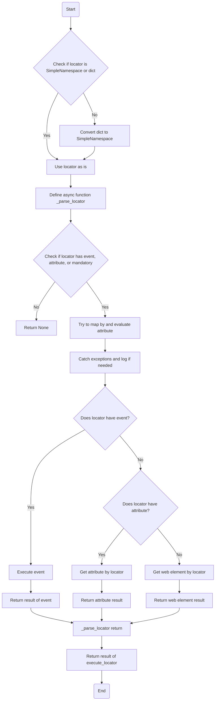
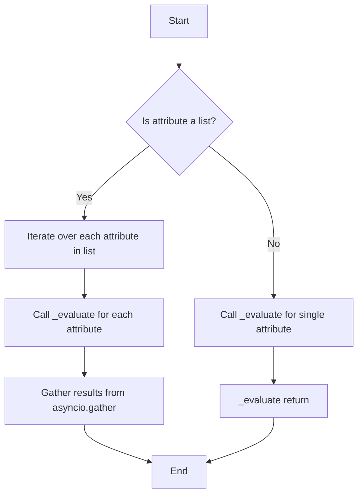
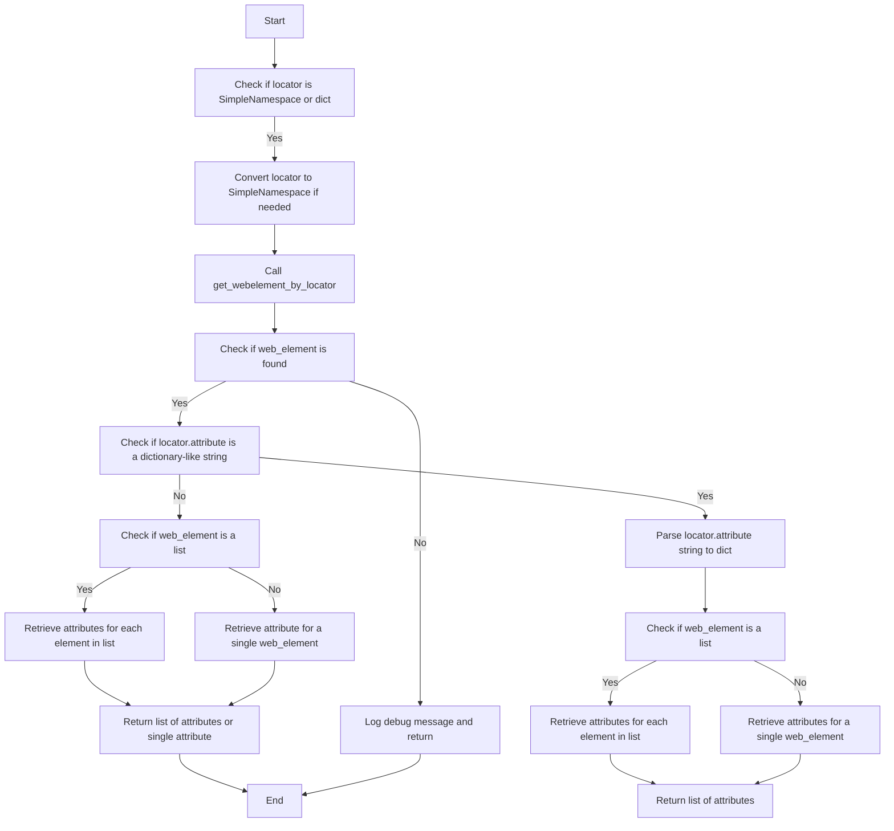
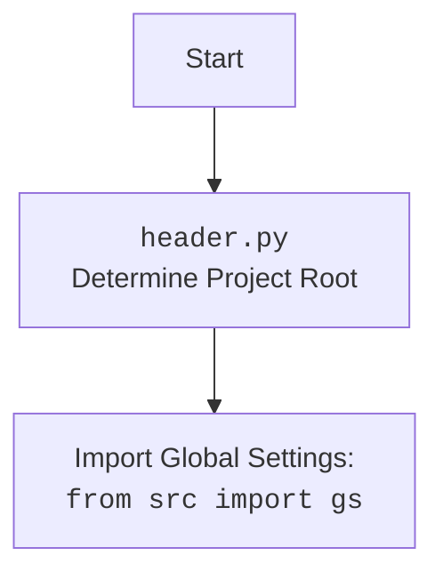

## АНАЛИЗ КОДА: `hypotez/src/webdriver/executor.py`

### 1. <алгоритм>

**Основная цель модуля:**  `executor.py` предназначен для выполнения действий с веб-элементами на основе заданных локаторов. Локатор представляет собой словарь или `SimpleNamespace` объект, содержащий информацию о том, как найти и взаимодействовать с элементами на веб-странице.

**Блок-схема основных функций:**

1. **`execute_locator`**:
    -   **Пример входа**: `locator = {'by': 'ID', 'selector': 'myElement', 'event': 'click()'}`.
    -   Преобразует входной `locator` в `SimpleNamespace` (если это словарь).
    -   Вызывает `_parse_locator` для обработки.
    -   Возвращает результат из `_parse_locator` (веб-элемент, атрибут или результат события).
    -   Если  `locator` не имеет ни `attribute`, ни `selector`, то возвращает `None`.

2.  **`_parse_locator`**:
    -   **Пример входа:** `locator = SimpleNamespace(by='ID', selector='myElement', event='click()', timeout=10)`
    -   Преобразует `locator` в `SimpleNamespace`
    -   Проверяет, есть ли в `locator` поля  `event`, `attribute`, или `mandatory`
    -   Если нет - возвращает `None`.
    -   Пытается определить `locator.by` , приводя его к верхнему регистру.
    -   Если есть `locator.attribute` - вызывает `evaluate_locator` и присваивает результат `locator.attribute`.
    -   Если `locator.by` == \'VALUE\' то возвращает `locator.attribute`.
    -   Ловит и логирует исключения.
    -   Проверяет наличие `event` -> вызывает `execute_event`.
    -   Проверяет наличие `attribute` -> вызывает `get_attribute_by_locator`.
    -   Вызывает `get_webelement_by_locator`
    -   Возвращает результат (веб-элемент, атрибут, результат события).

3. **`evaluate_locator`**:
    -   **Пример входа:** `attribute = '%ENTER%'` или `attribute = ['%ENTER%', '%TAB%']`
    -   Принимает атрибут (строку или список строк).
    -   Если атрибут - список - вызывает `_evaluate` для каждого элемента.
    -   Если атрибут строка - вызывает `_evaluate`
    -   `_evaluate`: проверяет, если атрибут начинается с `%`, то ищет соответствующий атрибут в `Keys` и возвращает его. Если не находит, то возвращает сам атрибут.
    -   Возвращает строку или список строк.

4. **`get_attribute_by_locator`**:
    -   **Пример входа:** `locator = {'by': 'ID', 'selector': 'myElement', 'attribute': 'value'}`
    -   Преобразует `locator` в `SimpleNamespace`.
    -   Вызывает `get_webelement_by_locator` для получения веб-элемента.
    -   Если веб-элемент не найден, возвращает `None`.
    -   Если `locator.attribute` строка, начинающаяся с `{`, то пытается распарсить строку как словарь.
    -   Если `web_element` список - вызывает  `_get_attributes_from_dict` для каждого элемента.
    -   Если `web_element` не список -  вызывает  `_get_attributes_from_dict` для одного элемента.
    -   Если `web_element` - список, то возвращает список атрибутов каждого элемента.
    -   Если  `web_element` - не список, то возвращает атрибут одного элемента.
    -  `_get_attributes_from_dict`:
          - Принимает элемент `WebElement` и словарь с атрибутами.
          - Возвращает словарь, где ключи и значения извлекаются из атрибутов элемента.
    -  `_parse_dict_string`:
          - Пытается распарсить входную строку в виде словаря
          - В случае успеха возвращает словарь
          - Возвращает `None` если парсинг не удался.

5.  **`get_webelement_by_locator`**:
    -   **Пример входа:** `locator = {'by': 'ID', 'selector': 'myElement', 'timeout': 10}`.
    -   Преобразует `locator` в `SimpleNamespace`.
    -   Если `timeout == 0` - находит элементы без ожидания.
    -   Если `timeout` > 0  - ждет пока элементы появятся на странице.
        - Выбирает условия ожидания: `presence_of_all_elements_located` или `visibility_of_all_elements_located`.
    -   Вызывает `_parse_elements_list` для фильтрации найденных элементов.
    -   Возвращает `WebElement` или список `WebElement` или `None`.
    -   `_parse_elements_list`:
        - Фильтрует список элементов на основе `locator.if_list`.
        - Поддерживает фильтры: `all`, `first`, `last`, `even`, `odd`, integer, list.
        - Возвращает отфильтрованный список элементов или один элемент

6. **`get_webelement_as_screenshot`**:
    -   **Пример входа:** `locator = {'by': 'ID', 'selector': 'myElement'}`
    -   Преобразует `locator` в `SimpleNamespace`.
    -   Вызывает `get_webelement_by_locator` для получения веб-элемента.
    -   Делает скриншот элемента и возвращает его в виде бинарного потока.

7.  **`execute_event`**:
    -   **Пример входа:** `locator = {'by': 'ID', 'selector': 'myElement', 'event': 'click()'}` или `locator = {'by': 'ID', 'selector': 'myElement', 'event': 'type(Hello)'}`.
    -   Преобразует `locator` в `SimpleNamespace`.
    -   Разделяет строку `locator.event` на список событий.
    -   Вызывает `get_webelement_by_locator` для получения элемента.
    -   Перебирает события и выполняет их.
      -   `click()`: кликает на элемент.
      -   `pause(N)`: делает паузу на N секунд.
      -   `upload_media()`: отправляет сообщение в элемент (используется для загрузки файлов).
      -   `screenshot()`: делает скриншот элемента и возвращает.
      -   `clear()`: очищает элемент.
      -   `send_keys()`: отправляет клавиши на элемент.
      -   `type()`: имитирует ввод текста в элемент (с задержкой или без).
    -   Возвращает результат (список или `True` / `False`).

8. **`send_message`**:
    -   **Пример входа:** `locator = {'by': 'ID', 'selector': 'myElement'}, message = 'Hello'`
    -   Преобразует `locator` в `SimpleNamespace`.
    -   Вызывает `get_webelement_by_locator` для получения элемента.
    -   Вызывает функцию `type_message`, которая имитирует ввод текста в элемент.
    -   `type_message`:
        - Разделяет сообщение на слова
        - Перебирает буквы в слове
        - Если буква в `replace_dict` - заменяет её комбинацией клавиш
        - Иначе - печатает букву и ставит паузу.
    -   Возвращает `True` в случае успеха.

### 2. <mermaid>

**Импорты и зависимости `mermaid`:**

*   **`Start`**: Начало процесса.
*   **`CheckLocatorType`**: Проверка типа локатора (является ли он `SimpleNamespace` или `dict`).
*   **`UseLocatorAsIs`**: Использовать локатор как есть (если это `SimpleNamespace`).
*   **`ConvertDictToSimpleNamespace`**: Преобразование словаря в `SimpleNamespace`.
*    **`DefineParseLocator`**:  Объявление асинхронной функции `_parse_locator`.
*   **`CheckLocatorFields`**: Проверка наличия полей `event`, `attribute`, или `mandatory` у локатора.
*   **`ReturnNone`**: Возврат значения `None`.
*   **`TryToMapByAndEvaluateAttribute`**: Попытка сопоставить `locator.by` и выполнить `evaluate_locator`.
*   **`CatchExceptionsAndLog`**: Перехват и логирование ошибок.
*   **`CheckForEvent`**: Проверка наличия события в локаторе.
*   **`ExecuteEvent`**: Выполнение события, если оно есть в локаторе.
*   **`CheckForAttribute`**: Проверка наличия атрибута в локаторе.
*   **`GetAttributeByLocator`**: Получение атрибута элемента, если он есть в локаторе.
*   **`GetWebElementByLocator`**: Получение веб-элемента по локатору.
*    **`ReturnResultOfEvent`**: Возврат результата вызова `execute_event`.
*    **`ReturnAttributeResult`**: Возврат результата вызова `get_attribute_by_locator`.
*    **`ReturnWebElementResult`**: Возврат результата вызова `get_webelement_by_locator`.
*   **`ReturnFinalResult`**: Возврат результата работы функции `_parse_locator`.
*   **`ReturnResultOfExecuteLocator`**: Возврат результата работы функции `execute_locator`.
*   **`End`**: Конец процесса.

**Импорты и зависимости `mermaid`:**

*   **`Start`**: Начало процесса.
*   **`IsAttributeList`**: Проверка, является ли атрибут списком.
*   **`IterateOverList`**: Итерация по каждому атрибуту в списке.
*   **`CallEvaluate`**: Вызов функции `_evaluate` для каждого атрибута.
*   **`GatherResults`**: Сбор результатов с помощью `asyncio.gather`.
*   **`CallEvaluateSingle`**: Вызов функции `_evaluate` для одного атрибута.
*   **`ReturnResult`**: Возврат результата работы функции `_evaluate`.
*   **`End`**: Конец процесса.

**Импорты и зависимости `mermaid`:**
* `Start`: Начало функции.
* `Check if locator is SimpleNamespace or dict`: Проверка типа данных локатора.
* `Convert locator to SimpleNamespace if needed`: Преобразование локатора в объект SimpleNamespace, если необходимо.
* `Call get_webelement_by_locator`: Вызов функции для получения веб-элемента.
* `Check if web_element is found`: Проверка, был ли найден веб-элемент.
* `Log debug message and return`: Логирование сообщения об ошибке и возврат `None`.
* `Check if locator.attribute is a dictionary-like string`: Проверка, является ли атрибут локатора строкой, похожей на словарь.
* `Parse locator.attribute string to dict`: Разбор строки атрибута в словарь.
* `Check if web_element is a list`: Проверка, является ли полученный веб-элемент списком элементов.
* `Retrieve attributes for each element in list`: Получение атрибутов для каждого элемента в списке.
* `Return list of attributes`: Возврат списка атрибутов.
* `Retrieve attributes for a single web_element`: Получение атрибутов для одиночного веб-элемента.
* `Return list of attributes or single attribute`: Возврат списка атрибутов или одного атрибута в зависимости от типа полученного веб-элемента.
* `End`: Конец функции.

**Дополнительно `mermaid` для `header.py`**:

**Импорты и зависимости `mermaid`:**

*   **`Start`**: Начало процесса.
*   **`Header`**: Описание роли `header.py` - определение корневого каталога проекта.
*   **`import`**: Указание на импорт глобальных настроек из `src.gs`.

### 3. <объяснение>

**Импорты:**

*   `asyncio`: Библиотека для асинхронного программирования.
*   `re`: Библиотека для работы с регулярными выражениями.
*   `sys`: Библиотека для работы с системными параметрами и функциями.
*   `time`: Библиотека для работы со временем.
*   `dataclasses`: Модуль для создания классов данных.
*   `enum`: Модуль для создания перечислений (enum).
*   `pathlib`: Модуль для работы с путями в файловой системе.
*   `types`: Модуль для работы с типами данных, в частности, для `SimpleNamespace`.
*   `typing`: Модуль для аннотации типов данных.
*   `selenium.common.exceptions`: Исключения, возникающие при работе с Selenium.
*   `selenium.webdriver.common.action_chains`: Модуль для создания цепочек действий (например, для имитации нажатий клавиш).
*   `selenium.webdriver.common.by`: Модуль для определения методов поиска веб-элементов.
*   `selenium.webdriver.common.keys`: Модуль для работы с клавишами.
*   `selenium.webdriver.remote.webelement`: Модуль для работы с веб-элементами.
*   `selenium.webdriver.support.expected_conditions`: Модуль для условий ожидания.
*   `selenium.webdriver.support.ui`: Модуль для ожидания.
*   `header`: Модуль для определения корневой директории проекта (из `src/__init__.py`).
*   `src.gs`: Глобальные настройки проекта.
*   `src.logger.logger`: Модуль для логирования.
*   `src.logger.exceptions`: Пользовательские исключения для логирования.
*   `src.utils.jjson`: Модуль для работы с JSON.
*   `src.utils.printer`: Модуль для форматированного вывода в консоль.
*   `src.utils.image`: Модуль для работы с изображениями.

**Классы:**

*   `ExecuteLocator`:
    *   **Роль**: Основной класс, управляющий взаимодействием с веб-элементами.
    *   **Атрибуты**:
        *   `driver`: Драйвер Selenium (экземпляр браузера).
        *   `actions`: Экземпляр `ActionChains` для выполнения действий.
        *   `by_mapping`: Словарь для сопоставления строк с методами поиска веб-элементов (например, `XPATH`, `ID`).
        *   `mode`: Режим работы (`dev`, `debug` или `prod`).
    *   **Методы**:
        *   `__post_init__`: Инициализирует `ActionChains` после создания объекта.
        *   `execute_locator`: Выполняет действие над веб-элементом, основываясь на данных локатора.
        *   `evaluate_locator`:  Обрабатывает атрибуты локатора, подставляя значения клавиш.
        *  `get_attribute_by_locator`: Извлекает атрибуты элемента.
        *   `get_webelement_by_locator`: Ищет веб-элемент на странице.
        *   `get_webelement_as_screenshot`: Делает скриншот элемента.
        *   `execute_event`: Выполняет событие (клик, отправку текста и т.д.) над элементом.
        *   `send_message`: Отправляет сообщение в элемент.

**Функции:**

*   `execute_locator`:
    *   **Аргументы**:
        *   `locator`: Словарь или `SimpleNamespace` с данными для поиска элемента.
        *   `timeout`: Время ожидания элемента.
        *   `timeout_for_event`:  Тип ожидаемого события.
        *   `message`: Сообщение для отправки.
        *   `typing_speed`: Скорость ввода текста.
        *   `continue_on_error`: Продолжать выполнение при ошибках.
    *   **Возвращаемое значение**: Строка, список, словарь, веб-элемент или логическое значение.
    *   **Назначение**:  Основная функция для обработки локатора и выполнения действий над элементом.
*   `evaluate_locator`:
    *   **Аргументы**:
        *   `attribute`: Строка или список строк, содержащие атрибуты локатора.
    *   **Возвращаемое значение**: Строка или список строк, содержащие значения атрибутов после обработки.
    *   **Назначение**: Извлекает значения из атрибутов локаторов.
*   `get_attribute_by_locator`:
    *   **Аргументы**:
       *    `locator`:  Локатор элемента.
        *   `timeout`: Время ожидания.
        *    `timeout_for_event`: Тип ожидания события.
    *   **Возвращаемое значение**: Значение атрибута(ов) или словарь атрибутов.
    *   **Назначение**: Получение атрибутов из веб-элементов.
*   `get_webelement_by_locator`:
    *   **Аргументы**:
        *   `locator`: Локатор элемента.
        *   `timeout`: Время ожидания.
        *   `timeout_for_event`: Тип ожидаемого события.
    *   **Возвращаемое значение**: Веб-элемент или список веб-элементов или `None`.
    *   **Назначение**: Получение веб-элемента(ов) по локатору.
*   `get_webelement_as_screenshot`:
    *   **Аргументы**:
        *    `locator`:  Локатор элемента.
        *    `timeout`: Время ожидания.
        *    `timeout_for_event`: Тип ожидания события.
        *   `webelement`: Pre-fetched web element
    *   **Возвращаемое значение**: Бинарный поток с изображением или `None`.
    *   **Назначение**: Получение скриншота веб-элемента.
*   `execute_event`:
    *   **Аргументы**:
        *   `locator`: Локатор элемента.
        *   `timeout`: Время ожидания.
        *   `timeout_for_event`: Тип ожидания события.
        *   `message`: Сообщение для отправки.
        *   `typing_speed`: Скорость ввода текста.
    *   **Возвращаемое значение**: Логическое значение (успех/неудача) или список результатов.
    *   **Назначение**: Выполнение действий над элементом (клик, ввод текста и т.д.).
*    `send_message`:
    *   **Аргументы**:
        *   `locator`:  Локатор элемента.
        *   `timeout`: Время ожидания.
        *   `timeout_for_event`: Тип ожидания события.
        *   `message`: Сообщение для отправки.
        *   `typing_speed`: Скорость ввода текста.
    *   **Возвращаемое значение**: Логическое значение.
    *   **Назначение**:  Отправляет сообщение в веб-элемент.
* `_parse_dict_string`:
    *   **Аргументы**:
         *  `attr_string`: строка с атрибутами.
    *   **Возвращаемое значение**: Словарь с атрибутами или `None`.
    *   **Назначение**: Разбирает строку в словарь

**Переменные:**

*   `MODE`: Режим работы приложения (`dev`, `debug` или `prod`).
*   `logger`: Экземпляр логгера для записи сообщений.

**Взаимосвязи с другими частями проекта:**

*   Импортирует `header.py` для определения корневого каталога проекта.
*   Импортирует `src.gs` для получения глобальных настроек.
*   Использует `src.logger` для логирования событий и ошибок.
*   Использует `src.utils.jjson` для сериализации и десериализации JSON.
*   Использует `src.utils.printer` для форматированного вывода в консоль.
*   Использует `src.utils.image` для сохранения скриншотов.

**Потенциальные ошибки и области для улучшения:**

*   В функции  `get_attribute_by_locator`  проверка на `locator.attribute.startswith("{")` не обеспечивает надежный парсинг словаря.
*   В функции  `get_attribute_by_locator` не обрабатываются ошибки при извлечении значений атрибутов, например, если атрибут не существует.
*   В функции `send_message` при передаче символов из словаря подмен не хватает проверок.
*   В функции `send_message` код не обрабатывает ошибки при передаче букв.
*   Необходимо добавить документацию для каждого метода, описывающую его назначение, аргументы и возвращаемое значение.
*   Функции `send_message` и `execute_event` можно улучшить для поддержки более сложных событий.
*   Добавить возможность конфигурации timeout для отдельных локаторов
*   Добавить возможность использования кастомных условий ожидания.
*   Нужно более надежно обрабатывать исключения `StaleElementReferenceException`.

**Цепочка взаимосвязей:**

1.  `executor.py` получает локаторы из других модулей проекта (например, из модулей, отвечающих за парсинг страниц).
2.  Использует драйвер Selenium для взаимодействия с веб-страницей.
3.  Использует `logger` для записи событий.
4.  Результаты работы (элементы, атрибуты, скриншоты) передаются обратно в вызывающие модули для дальнейшей обработки.
5.  Использует `gs` для получения конфигурационных настроек.

Этот анализ предоставляет полное понимание кода `executor.py`, его функциональности, архитектуры и взаимодействия с другими частями проекта.