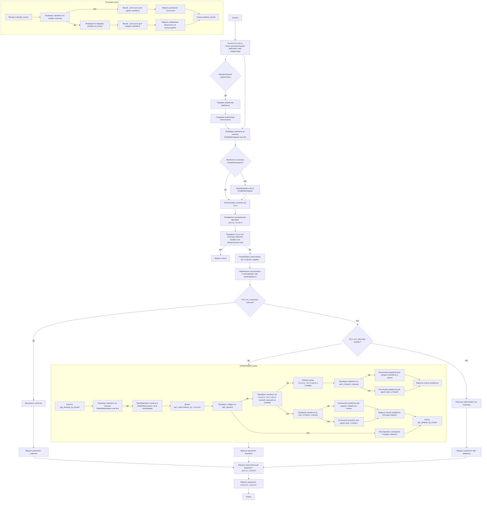
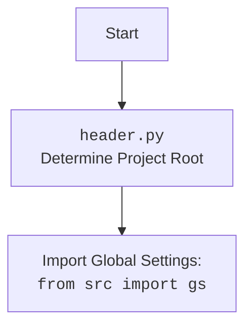

## ИНСТРУКЦИЯ:

Анализируй предоставленный код подробно и объясни его функциональность. Ответ должен включать три раздела:  

1.  **<алгоритм>**: Опиши рабочий процесс в виде пошаговой блок-схемы, включая примеры для каждого логического блока, и проиллюстрируй поток данных между функциями, классами или методами.  
2.  **<mermaid>**: Напиши код для диаграммы в формате `mermaid`, проанализируй и объясни все зависимости,  
    которые импортируются при создании диаграммы.  
    **ВАЖНО!** Убедитесь, что все имена переменных, используемые в диаграмме `mermaid`,  
    имеют осмысленные и описательные имена. Имена переменных вроде `A`, `B`, `C`, и т.д., не допускаются!  
    
    **Дополнительно**: Если в коде есть импорт `import header`, добавьте блок `mermaid` flowchart, объясняющий `header.py`:\
    ```mermaid
    flowchart TD
        Start --> Header[<code>header.py</code><br> Determine Project Root]
    
        Header --> import[Import Global Settings: <br><code>from src import gs</code>] 
    ```

3.  **<объяснение>**: Предоставьте подробные объяснения:  
    - **Импорты**: Их назначение и взаимосвязь с другими пакетами `src.`.  
    - **Классы**: Их роль, атрибуты, методы и взаимодействие с другими компонентами проекта.  
    - **Функции**: Их аргументы, возвращаемые значения, назначение и примеры.  
    - **Переменные**: Их типы и использование.  
    - Выделите потенциальные ошибки или области для улучшения.  

Дополнительно, постройте цепочку взаимосвязей с другими частями проекта (если применимо).  

Это обеспечивает всесторонний и структурированный анализ кода.
## Формат ответа: `.md` (markdown)
**КОНЕЦ ИНСТРУКЦИИ**

## Разбор кода `executor.py`

### 1. <алгоритм>

Модуль `executor.py` предназначен для управления взаимодействием с веб-элементами через Selenium WebDriver. Основной класс `ExecuteLocator` обрабатывает локаторы, выполняет действия (клики, отправку сообщений, извлечение атрибутов) и обрабатывает ошибки.

**Общий поток выполнения:**

1.  **Инициализация `ExecuteLocator`**: Создается экземпляр класса `ExecuteLocator` с передачей экземпляра `webdriver`.
2.  **Вызов `execute_locator`**: Передается словарь с параметрами локатора (тип, селектор, событие, атрибут).
3.  **Парсинг локатора**: Локатор преобразуется в объект `SimpleNamespace` для удобства доступа.
4.  **Определение действия**: Определяется, какое действие нужно выполнить (событие, получение атрибута, получение элемента).
5.  **Выполнение действия**:
    *   Если есть событие: выполняется событие (например, клик).
    *   Если есть атрибут: извлекается значение атрибута.
    *   Если нет ни события, ни атрибута: получается веб-элемент.
6.  **Возврат результата**: Возвращается результат выполненного действия.

**Блок-схемы методов:**

*   **`execute_locator(locator)`**:

    ```
    [Начало] --> [Проверка типа локатора (dict или SimpleNamespace)]
    [Проверка типа локатора (dict или SimpleNamespace)] --> [Преобразование dict в SimpleNamespace (если нужно)]
    [Преобразование dict в SimpleNamespace (если нужно)] --> [Определение функции _parse_locator]
    [Определение функции _parse_locator] --> [Проверка наличия события, атрибута, или обязательного поля]
    [Проверка наличия события, атрибута, или обязательного поля] -- Нет --> [Возврат None]
    [Проверка наличия события, атрибута, или обязательного поля] -- Да --> [Попытка сопоставления By и вызова _evaluate_locator]
    [Попытка сопоставления By и вызова _evaluate_locator] --> [Перехват исключений и логирование]
    [Перехват исключений и логирование] --> [Проверка наличия события]
    [Проверка наличия события] -- Да --> [Выполнение события]
    [Проверка наличия события] -- Нет --> [Проверка наличия атрибута]
    [Проверка наличия атрибута] -- Да --> [Получение атрибута по локатору]
    [Проверка наличия атрибута] -- Нет --> [Получение веб-элемента по локатору]
    [Выполнение события] --> [Возврат результата события]
    [Получение атрибута по локатору] --> [Возврат результата атрибута]
    [Получение веб-элемента по локатору] --> [Возврат результата элемента]
    [Возврат результата события] --> [Возврат результата _parse_locator]
    [Возврат результата атрибута] --> [Возврат результата _parse_locator]
     [Возврат результата элемента] --> [Возврат результата _parse_locator]
    [Возврат результата _parse_locator] --> [Возврат результата execute_locator]
    [Возврат результата execute_locator] --> [Конец]
    ```

*   **`evaluate_locator(locator)`**:

    ```
    [Начало] --> [Проверка является ли атрибут списком]
    [Проверка является ли атрибут списком] -- Да --> [Итерация по атрибутам]
    [Итерация по атрибутам] --> [Вызов _evaluate для каждого атрибута]
    [Вызов _evaluate для каждого атрибута] --> [Возврат списка результатов]
    [Проверка является ли атрибут списком] -- Нет --> [Вызов _evaluate для одного атрибута]
    [Вызов _evaluate для одного атрибута] --> [Возврат результата _evaluate]
     [Возврат списка результатов] --> [Конец]
    [Возврат результата _evaluate] --> [Конец]

    ```

*   **`get_attribute_by_locator(locator)`**:

    ```
    [Начало] --> [Проверка типа локатора (dict или SimpleNamespace)]
    [Проверка типа локатора (dict или SimpleNamespace)] --> [Преобразование dict в SimpleNamespace (если нужно)]
    [Преобразование dict в SimpleNamespace (если нужно)] --> [Вызов get_webelement_by_locator]
    [Вызов get_webelement_by_locator] --> [Проверка найден ли веб-элемент]
    [Проверка найден ли веб-элемент] -- Нет --> [Логирование и возврат None]
    [Проверка найден ли веб-элемент] -- Да --> [Проверка является ли locator.attribute строкой, похожей на словарь]
    [Проверка является ли locator.attribute строкой, похожей на словарь] -- Да --> [Парсинг строки в словарь]
    [Парсинг строки в словарь] --> [Проверка, является ли веб-элемент списком]
      [Проверка, является ли веб-элемент списком] -- Да --> [Получение атрибутов для всех элементов]
      [Проверка, является ли веб-элемент списком] -- Нет --> [Получение атрибутов для одного элемента]
        [Получение атрибутов для всех элементов] --> [Возврат списка атрибутов]
    [Получение атрибутов для одного элемента] --> [Возврат списка атрибутов]
      [Проверка является ли locator.attribute строкой, похожей на словарь] -- Нет --> [Проверка, является ли веб-элемент списком]
        [Проверка, является ли веб-элемент списком] -- Да --> [Получение атрибутов для всех элементов]
          [Получение атрибутов для всех элементов] --> [Возврат списка атрибутов или одного атрибута]
        [Проверка, является ли веб-элемент списком] -- Нет --> [Получение атрибута для одного элемента]
        [Получение атрибута для одного элемента] --> [Возврат списка атрибутов или одного атрибута]

    [Возврат списка атрибутов] --> [Конец]
    [Возврат списка атрибутов или одного атрибута] --> [Конец]
    [Логирование и возврат None] --> [Конец]
    ```

**Пример использования:**

```python
# Пример локатора:
locator = {
    "by": "ID",
    "selector": "my_element_id",
    "event": "click()"
}
# или
locator = {
  "by": "CSS_SELECTOR",
  "selector": ".my_class",
  "attribute": "innerText"
}
# или
locator = {
  "by": "XPATH",
  "selector": "//div[@id='main']",
}

# Вызов execute_locator:
result = await executor.execute_locator(locator)
```

### 2. <mermaid>



**Зависимости, используемые в `mermaid` диаграмме:**

*   `Start`, `End`: Начало и конец выполнения.
*   `ExecuteLocatorClass`: Класс, обрабатывающий выполнение действий с веб-элементами.
*   `ActionChainsInstance`: Экземпляр `ActionChains` для выполнения сложных действий.
*   `WebDriverInstance`: Проверка, передан ли экземпляр `WebDriver`.
*   `CheckLocatorType`: Проверка типа локатора (словарь или SimpleNamespace).
*   `IsSimpleNamespace`: Проверка, является ли локатор SimpleNamespace.
*   `UseLocatorAsIs`: Использование локатора без изменений.
*   `ConvertDictToSimpleNamespace`: Преобразование словаря в SimpleNamespace.
*  `DefineParseLocator`: Определение асинхронной функции `_parse_locator`.
*   `CheckEventAttributeMandatory`: Проверка наличия события или атрибута в локаторе.
*   `TryMapByEvaluateAttribute`: Попытка сопоставления `By` и оценки атрибута.
*   `CatchExceptionsAndLog`: Перехват исключений и логирование.
*   `HasEvent`: Проверка, есть ли у локатора событие.
*   `ExecuteEvent`: Выполнение события.
*   `HasAttribute`: Проверка, есть ли у локатора атрибут.
*   `GetAttributeByLocator`: Получение атрибута по локатору.
*   `GetWebElementByLocator`: Получение веб-элемента по локатору.
*  `ReturnEventResult`: Возвращение результата события.
*   `ReturnAttributeResult`: Возвращение результата атрибута.
*   `ReturnWebElementResult`: Возвращение результата веб-элемента.
*   `ReturnFinalResult`: Возвращение результата функции `_parse_locator`.
*   `ReturnExecuteLocatorResult`: Возвращение результата функции `execute_locator`.
*   `StartEvaluate`, `EndEvaluate`: Начало и конец выполнения `evaluate_locator`
*    `CheckIfAttributeIsList`: Проверка является ли атрибут списком.
*    `IterateOverAttributes`: Итерация по списку атрибутов.
*    `CallEvaluateForEachAttribute`: Вызов функции `_evaluate` для каждого атрибута.
*    `ReturnGatheredResults`: Возвращение результатов `asyncio.gather`
*    `CallEvaluateForSingleAttribute`: Вызов функции `_evaluate` для одного атрибута.
*    `ReturnEvaluateResult`: Возвращение результата выполнения функции `_evaluate`.
*   `StartGetAttribute`,`EndGetAttribute`: Начало и конец `get_attribute_by_locator`
*   `CheckIfLocatorIsSimpleNamespaceOrDict`: Проверка, является ли локатор SimpleNamespace или dict.
*   `ConvertLocatorToSimpleNamespaceIfNeeded`: Преобразование локатора в SimpleNamespace, если необходимо.
*   `CallGetWebElementByLocator`: Вызов `get_webelement_by_locator`.
*   `CheckIfWebElementIsFound`: Проверка, найден ли веб-элемент.
*   `LogDebugMessageAndReturn`: Логирование отладочного сообщения и возврат.
*   `CheckIfAttributeIsDictionaryLikeString`: Проверка, является ли locator.attribute строкой, похожей на словарь.
*   `ParseAttributeStringToDict`: Разбор строки locator.attribute в словарь.
*   `CheckIfWebElementIsList`: Проверка, является ли web_element списком.
*   `RetrieveAttributesForEachElementInList`: Получение атрибутов для каждого элемента в списке.
*   `ReturnListOfAttributes`: Возврат списка атрибутов.
*  `RetrieveAttributesForSingleWebElement`: Получение атрибутов для одного web_element.
*   `CheckIfWebElementIsListAgain`: Проверка, является ли web_element списком.
*   `RetrieveAttributesForEachElementInListAgain`: Получение атрибутов для каждого элемента в списке.
*   `ReturnListOfAttributesOrSingleAttribute`: Возврат списка атрибутов или одного атрибута.
*  `RetrieveAttributeForSingleWebElementAgain`: Получение атрибута для одного web_element.

### 3. <объяснение>

**Импорты:**

*   `selenium.webdriver.remote.webdriver.WebDriver`: Класс для управления браузером.
*   `selenium.webdriver.common.by.By`: Класс для определения стратегий поиска элементов.
*   `selenium.webdriver.support.ui`: Модуль для поддержки ожидания элементов на странице.
*   `selenium.webdriver.support import expected_conditions`: Модуль с набором готовых ожиданий.
*   `selenium.webdriver.common.action_chains.ActionChains`: Класс для выполнения сложных действий (например, перетаскивание).
*   `asyncio`: Библиотека для асинхронного программирования.
*   `re`: Библиотека для работы с регулярными выражениями.
*   `dataclasses`: Модуль для создания классов данных (используется для `SimpleNamespace`).
*   `enum`: Библиотека для работы с перечислениями.
*   `pathlib.Path`: Класс для работы с путями к файлам.
*   `types.SimpleNamespace`: Простой класс для создания объектов с произвольными атрибутами.
*   `typing`: Модуль для аннотаций типов.
*   `src.gs`: Глобальные настройки проекта (предположительно, для чтения конфигураций).

**Классы:**

*   `ExecuteLocator`:
    *   **Назначение**: Основной класс для взаимодействия с веб-элементами.
    *   **Атрибуты**:
        *   `driver`: Экземпляр `webdriver` для управления браузером.
        *   `actions`: Экземпляр `ActionChains` для сложных действий.
        *   `by_mapping`: Словарь, сопоставляющий типы локаторов (например, "ID", "XPATH") с соответствующими атрибутами класса `By`.
        *  `mode`: Режим выполнения (debug, dev и т.д.)
    *   **Методы**:
        *   `__post_init__`: Инициализирует `ActionChains` при создании объекта, если передан `driver`.
        *  `execute_locator(locator)`: Главный метод, принимающий локатор и вызывающий другие методы для обработки.
        *  `evaluate_locator(locator)`: Оценивает локатор и возвращает его значение.
        *   `get_attribute_by_locator(locator)`: Получает значение атрибута веб-элемента, найденного по локатору.
        *   `get_webelement_by_locator(locator)`: Получает веб-элемент по локатору.
        *   `get_webelement_as_screenshot(locator, filename)`: Делает скриншот веб-элемента.
        *   `execute_event(locator, web_element)`: Выполняет событие (например, клик).
        *   `send_message(locator, message, web_element)`: Отправляет сообщение в веб-элемент.

**Функции:**

*   Большая часть функциональности реализована как методы класса `ExecuteLocator`.
*    `_evaluate(locator, web_element)`: Выполняет асинхронное действие.

**Переменные:**

*   `by_mapping`: Словарь, который сопоставляет типы локаторов с методами класса `By` (например, `'ID': By.ID`).
*   `locator`: Словарь, содержащий данные о том, как найти веб-элемент (тип, селектор, атрибут и действие).

**Потенциальные ошибки и области для улучшения:**

*   **Обработка ошибок**: В коде уже есть обработка исключений, но можно добавить более детальное логирование и обработку конкретных типов ошибок (например, `NoSuchElementException`).
*   **Типизация**: Можно добавить больше аннотаций типов, особенно в методах `_evaluate`, для улучшения читаемости и проверки типов.
*   **Расширяемость**:  Можно добавить поддержку дополнительных типов локаторов и событий.
*   **Абстракция**: Вынести логику оценки атрибутов в отдельный метод для упрощения `evaluate_locator`.
* **Переименовать _parse_locator**: Метод `_parse_locator` следует переименовать в более понятное название.
* **Улучшить логику `get_attribute_by_locator`**: Слишком много условий, можно упростить и разбить на отдельные методы.

**Взаимосвязи с другими частями проекта:**

*   Модуль `executor.py` зависит от `src.gs` для получения глобальных настроек, что говорит о том, что он является частью более крупной автоматизированной системы тестирования или сбора данных.
*  `executor.py` использует `selenium` для взаимодействия с браузером.
*  Модуль использует `asyncio` для асинхронного выполнения.

**Дополнительное объяснение:**

Модуль `executor.py` предоставляет абстракцию над Selenium WebDriver, позволяя разработчикам определять локаторы в виде словарей и легко выполнять с ними различные действия. Он также реализует механизм обработки ошибок, что позволяет обрабатывать нестабильные веб-страницы более надежно.

## Mermaid `header.py` diagram

