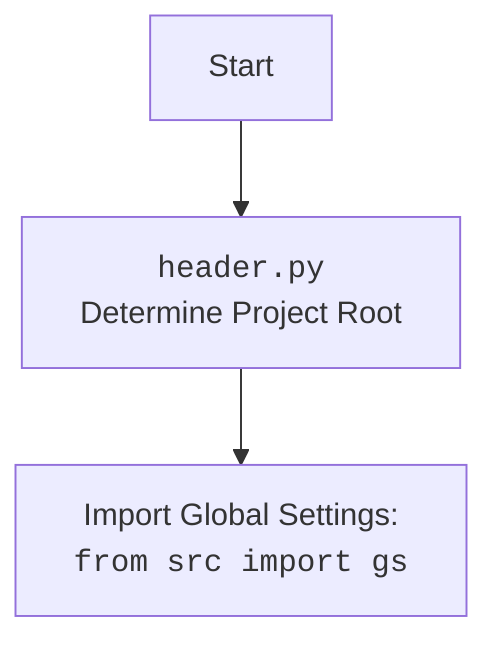

## Анализ кода `executor.py`

### 1. <алгоритм>

**Общая схема работы:**

1.  **Инициализация `ExecuteLocator`**:
    *   Создается экземпляр класса `ExecuteLocator`, которому передается драйвер Selenium `webdriver`.
    *   Инициализируется объект `ActionChains` для сложных действий (если драйвер предоставлен).
    *   Устанавливается словарь `by_mapping`, сопоставляющий типы локаторов с методами `By` Selenium (например, "ID" с `By.ID`).

2.  **`execute_locator(locator)`**:
    *   Принимает `locator`, который может быть словарем `dict` или объектом `SimpleNamespace`.
    *   Преобразует `locator` в `SimpleNamespace`, если это словарь `dict`.
    *   Вызывает асинхронную функцию `_parse_locator` для обработки локатора.
    *   `_parse_locator` проверяет, есть ли у локатора событие, атрибут или обязательное поле (например, `selector`). Если нет, возвращает `None`.
    *   Если есть, вызывает `_evaluate` для обработки атрибута.
    *   Если есть событие, вызывает `execute_event()`, если нет - то проверяет на наличие атрибута
    *   Если есть атрибут, вызывает `get_attribute_by_locator()`, если нет - вызывает `get_webelement_by_locator()`.
    *   Возвращает результат выполнения (`event`, `attribute` или `webelement`).

3.  **`evaluate_locator(locator)`**:
    *   Принимает `locator`
    *   Проверяет, является ли атрибут списком.
    *   Если это список, вызывает `_evaluate` для каждого атрибута в списке через `asyncio.gather`.
    *   Если это не список, вызывает `_evaluate` для одного атрибута.
    *   Возвращает результаты.

4.  **`get_attribute_by_locator(locator)`**:
    *   Принимает `locator`.
    *   Преобразует `locator` в `SimpleNamespace` если он является `dict`.
    *   Вызывает `get_webelement_by_locator()` для поиска элемента.
    *   Проверяет, найден ли элемент. Если нет - возвращает `None`.
    *   Проверяет, является ли `locator.attribute` строкой, похожей на словарь.
    *   Если да, парсит строку в словарь.
    *   Проверяет, является ли элемент списком, и извлекает атрибуты либо для списка, либо для одного элемента, и возвращает результат.
    *   Если нет, то аналогично проверяет элемент на список и извлекает атрибут или атрибуты для списка или одного элемента, возвращает результат.

5.  **`get_webelement_by_locator(locator)`**:
    *   Принимает `locator`.
    *   Извлекает `by` и `selector` из локатора.
    *   Использует `driver.find_element(by, selector)` или `driver.find_elements(by, selector)` для поиска элемента/ов.
    *   Возвращает найденные элементы.
   *   В случае ошибки, возвращает None.

6.  **`execute_event(locator)`**:
    *   Принимает `locator`.
    *   Извлекает `event` из локатора.
    *   Ищет элемент по локатору.
    *   Выполняет javascript код `event`, связанный с элементом.
    *   Возвращает результат выполнения.

7. **`send_message(locator, message)`**:
    * Принимает `locator` и `message`.
    * Ищет элемент по локатору.
    * Отправляет сообщение `message` в найденный элемент.

**Примеры:**

*   **`execute_locator`**:
    *   Вход: `{"by": "id", "selector": "my_button", "event": "click()"}`
    *   Выход: Результат клика по элементу.
    *   Вход: `{"by": "css selector", "selector": ".my_class", "attribute": "text"}`
    *   Выход: Текст элемента с классом `my_class`.
*   **`evaluate_locator`**:
    *   Вход: `{"by": "id", "selector": "my_element", "attribute": ["text", "class"]}`
    *   Выход: `["Text of element", "class-name"]`
    *   Вход: `{"by": "name", "selector": "my_input", "attribute": "value"}`
    *   Выход: Значение атрибута value
*    **`get_attribute_by_locator`**:
    *    Вход: `{"by": "css selector", "selector": ".my_class", "attribute": "text"}`
    *    Выход: Текст первого элемента с классом `my_class`.
    *   Вход: `{"by": "id", "selector": "my_element", "attribute": '{"style": "color"}'}`
    *   Выход: Значение стиля цвета элемента.
*    **`get_webelement_by_locator`**:
    *    Вход: `{"by": "xpath", "selector": "//button"}`
    *    Выход: `WebElement` список всех элементов `<button>`.
*   **`execute_event`**:
    *   Вход: `{"by": "id", "selector": "my_input", "event": "focus();"}`
    *   Выход: `None` (фокус ввода).

### 2. <mermaid>

```mermaid
flowchart TD
    Start[Начало] --> ExecuteLocatorInit[Инициализация ExecuteLocator]
    ExecuteLocatorInit --> SetByMapping[Установка by_mapping]
    SetByMapping --> InitActionChains{Инициализировать ActionChains?}
    InitActionChains -- Да --> CreateActionChains[Создать ActionChains]
    CreateActionChains --> Ready[Готов к работе]
    InitActionChains -- Нет --> Ready
    Ready --> ExecuteLocatorCall[Вызов execute_locator(locator)]
    ExecuteLocatorCall --> ConvertLocatorIfNeeded{locator - SimpleNamespace?}
    ConvertLocatorIfNeeded -- Да --> ParseLocatorCall[Вызов _parse_locator(locator)]
    ConvertLocatorIfNeeded -- Нет --> ConvertToSimpleNamespace[Преобразовать в SimpleNamespace]
    ConvertToSimpleNamespace --> ParseLocatorCall
    ParseLocatorCall --> CheckLocatorHasEventOrAttribute{locator имеет event/attribute?}
     CheckLocatorHasEventOrAttribute -- Нет --> ReturnNone[_parse_locator: Вернуть None]
    CheckLocatorHasEventOrAttribute -- Да --> EvaluateAttributeCall[Вызов evaluate_locator(locator)]
    EvaluateAttributeCall --> CheckLocatorHasEvent{locator имеет event?}
     CheckLocatorHasEvent -- Да --> ExecuteEventCall[Вызов execute_event(locator)]
     ExecuteEventCall --> ReturnEventResult[_parse_locator: Вернуть результат event]
    CheckLocatorHasEvent -- Нет --> CheckLocatorHasAttribute{locator имеет attribute?}
    CheckLocatorHasAttribute -- Да --> GetAttributeCall[Вызов get_attribute_by_locator(locator)]
    GetAttributeCall --> ReturnAttributeResult[_parse_locator: Вернуть результат attribute]
    CheckLocatorHasAttribute -- Нет --> GetWebElementCall[Вызов get_webelement_by_locator(locator)]
    GetWebElementCall --> ReturnWebElementResult[_parse_locator: Вернуть результат webelement]
    ReturnEventResult --> ReturnExecuteLocatorResult[Вернуть результат execute_locator]
     ReturnAttributeResult --> ReturnExecuteLocatorResult
    ReturnWebElementResult --> ReturnExecuteLocatorResult
     ReturnExecuteLocatorResult --> End[Конец]
    
   
  
    subgraph evaluate_locator
        StartEvaluate[Начало evaluate_locator] --> CheckAttributeIsList{Атрибут - список?}
        CheckAttributeIsList -- Да --> IterateOverAttributesEvaluate[Итерация по атрибутам]
        IterateOverAttributesEvaluate --> EvaluateEachAttribute[Вызов _evaluate для каждого атрибута]
        EvaluateEachAttribute --> ReturnGatheredResultsEvaluate[Вернуть собранные результаты]
         CheckAttributeIsList -- Нет --> EvaluateSingleAttribute[Вызов _evaluate для одного атрибута]
         EvaluateSingleAttribute --> ReturnSingleResultEvaluate[Вернуть результат _evaluate]
         ReturnSingleResultEvaluate --> EndEvaluate[Конец evaluate_locator]
         ReturnGatheredResultsEvaluate --> EndEvaluate
        
    end
    
     subgraph get_attribute_by_locator
        StartGetAttribute[Начало get_attribute_by_locator] --> CheckLocatorTypeGetAttribute{Локатор - SimpleNamespace или dict?}
        CheckLocatorTypeGetAttribute -- Да --> ConvertLocatorIfNeededGetAttribute[Преобразовать локатор в SimpleNamespace]
        ConvertLocatorIfNeededGetAttribute --> GetWebElementByLocatorCall[Вызов get_webelement_by_locator]
       CheckLocatorTypeGetAttribute -- Нет --> GetWebElementByLocatorCall
        GetWebElementByLocatorCall --> CheckWebElementFound{Найден web element?}
        CheckWebElementFound -- Нет --> LogDebugMessageAndReturnGetAttribute[Логировать и вернуть None]
        CheckWebElementFound -- Да --> CheckAttributeStringIsDict{locator.attribute - строка-словарь?}
        CheckAttributeStringIsDict -- Да --> ParseAttributeStringToDictGetAttribute[Парсинг атрибута в словарь]
        ParseAttributeStringToDictGetAttribute --> CheckWebElementIsListGetAttribute{web element - список?}
        CheckWebElementIsListGetAttribute -- Да --> RetrieveAttributesForEachElementInListGetAttribute[Получение атрибутов для каждого элемента в списке]
        RetrieveAttributesForEachElementInListGetAttribute --> ReturnListOfAttributesGetAttribute[Вернуть список атрибутов]
        CheckWebElementIsListGetAttribute -- Нет --> RetrieveAttributesForSingleWebElementGetAttribute[Получение атрибутов для одного web element]
        RetrieveAttributesForSingleWebElementGetAttribute --> ReturnListOfAttributesGetAttribute
        CheckAttributeStringIsDict -- Нет --> CheckWebElementIsListAgainGetAttribute{web element - список?}
         CheckWebElementIsListAgainGetAttribute -- Да --> RetrieveAttributesForEachElementInListAgainGetAttribute[Получение атрибутов для каждого элемента в списке]
         RetrieveAttributesForEachElementInListAgainGetAttribute --> ReturnListOfAttributesOrSingleAttributeGetAttribute[Вернуть список атрибутов или один атрибут]
        CheckWebElementIsListAgainGetAttribute -- Нет --> RetrieveAttributeForSingleWebElementAgainGetAttribute[Получение атрибута для одного web element]
          RetrieveAttributeForSingleWebElementAgainGetAttribute --> ReturnListOfAttributesOrSingleAttributeGetAttribute
           ReturnListOfAttributesOrSingleAttributeGetAttribute --> EndGetAttribute[Конец get_attribute_by_locator]
            LogDebugMessageAndReturnGetAttribute --> EndGetAttribute
    end
    
        subgraph get_webelement_by_locator
            StartGetWebElement[Начало get_webelement_by_locator] --> ExtractByAndSelector[Извлечение by и selector]
             ExtractByAndSelector --> FindWebElement[driver.find_element(by,selector)]
              FindWebElement --> ReturnWebElement[Вернуть web element]
               ReturnWebElement --> EndGetWebElement[Конец get_webelement_by_locator]
              FindWebElement --> HandleException[Обработка исключения]
             HandleException --> ReturnNoneElement[Вернуть None]
               ReturnNoneElement --> EndGetWebElement
        end
    
    subgraph execute_event
        StartExecuteEvent[Начало execute_event] --> ExtractEvent[Извлечение event]
         ExtractEvent --> FindElementExecuteEvent[Поиск элемента]
         FindElementExecuteEvent --> ExecuteJavaScript[Выполнение javascript]
          ExecuteJavaScript --> ReturnEventExecuteEvent[Возврат результата event]
          ReturnEventExecuteEvent --> EndExecuteEvent[Конец execute_event]
    end
   
    subgraph send_message
        StartSendMessage[Начало send_message] --> FindElementSendMessage[Поиск элемента]
        FindElementSendMessage --> SendKeys[Отправка message]
        SendKeys --> EndSendMessage[Конец send_message]
    end
    
```

**Зависимости `mermaid`:**

*   **`ExecuteLocatorInit`**: Инициализация класса `ExecuteLocator` с драйвером Selenium и настройками.
*   **`SetByMapping`**: Словарь, сопоставляющий типы локаторов с методами `By` Selenium.
*  **`InitActionChains`**: Проверка инициализации `ActionChains`
*   **`CreateActionChains`**: Создание объекта `ActionChains` для сложных взаимодействий.
*   **`Ready`**: Состояние готовности к работе после инициализации.
*   **`ExecuteLocatorCall`**: Вызов метода `execute_locator` для обработки локатора.
*   **`ConvertLocatorIfNeeded`**: Проверяет, является ли локатор `SimpleNamespace`, и конвертирует, если это `dict`.
*   **`ConvertToSimpleNamespace`**: Преобразование `dict` в `SimpleNamespace`.
*    **`ParseLocatorCall`**: Вызов функции `_parse_locator`, которая проверяет наличие события или атрибута.
*   **`CheckLocatorHasEventOrAttribute`**: Проверка наличия `event` или `attribute` в локаторе.
*   **`ReturnNone`**: Возврат `None` если в локаторе отсутствует `event` или `attribute`
*   **`EvaluateAttributeCall`**: Вызов `evaluate_locator` для оценки атрибутов.
*    **`CheckLocatorHasEvent`**: Проверка наличия `event` в локаторе
*   **`ExecuteEventCall`**: Вызов метода `execute_event` для выполнения события.
*   **`ReturnEventResult`**: Возврат результата события.
*   **`CheckLocatorHasAttribute`**: Проверка наличия `attribute` в локаторе.
*    **`GetAttributeCall`**: Вызов метода `get_attribute_by_locator` для извлечения атрибута.
*   **`ReturnAttributeResult`**: Возврат результата атрибута.
*   **`GetWebElementCall`**: Вызов метода `get_webelement_by_locator` для получения элемента.
*  **`ReturnWebElementResult`**: Возврат результата веб элемента.
*   **`ReturnExecuteLocatorResult`**: Возвращает результат работы функции `execute_locator`.
*   **`StartEvaluate`**: Начало функции `evaluate_locator`.
*   **`CheckAttributeIsList`**: Проверка, является ли атрибут списком.
*   **`IterateOverAttributesEvaluate`**: Итерация по списку атрибутов.
*   **`EvaluateEachAttribute`**: Вызов `_evaluate` для каждого атрибута.
*   **`ReturnGatheredResultsEvaluate`**: Возвращает результаты оценки атрибутов списком.
*   **`EvaluateSingleAttribute`**: Вызов `_evaluate` для одного атрибута.
*   **`ReturnSingleResultEvaluate`**: Возвращает результат оценки атрибута.
*   **`EndEvaluate`**: Конец выполнения функции `evaluate_locator`.
*   **`StartGetAttribute`**: Начало функции `get_attribute_by_locator`.
*    **`CheckLocatorTypeGetAttribute`**: Проверка, является ли локатор `SimpleNamespace` или `dict`.
*   **`ConvertLocatorIfNeededGetAttribute`**: Преобразование локатора в SimpleNamespace если он `dict`
*   **`GetWebElementByLocatorCall`**: Вызов `get_webelement_by_locator` для поиска элемента.
*   **`CheckWebElementFound`**: Проверка, найден ли web element
*    **`LogDebugMessageAndReturnGetAttribute`**: Логирование и возврат `None` если не найден элемент.
*    **`CheckAttributeStringIsDict`**: Проверка, является ли `locator.attribute` строкой похожей на словарь
*    **`ParseAttributeStringToDictGetAttribute`**: Парсинг строки атрибута в словарь
*   **`CheckWebElementIsListGetAttribute`**: Проверка, является ли найденный элемент списком
*   **`RetrieveAttributesForEachElementInListGetAttribute`**: Получение атрибутов для каждого элемента списка
*    **`ReturnListOfAttributesGetAttribute`**: Возвращение списка атрибутов
*   **`RetrieveAttributesForSingleWebElementGetAttribute`**: Получение атрибута для одного элемента
*    **`CheckWebElementIsListAgainGetAttribute`**: Проверка, является ли web element списком еще раз
*    **`RetrieveAttributesForEachElementInListAgainGetAttribute`**: Получение атрибутов для каждого элемента в списке снова
*    **`ReturnListOfAttributesOrSingleAttributeGetAttribute`**: Возвращение списка атрибутов или одного атрибута
*     **`RetrieveAttributeForSingleWebElementAgainGetAttribute`**: Получение атрибута для одного элемента снова
*    **`EndGetAttribute`**: Конец выполнения функции `get_attribute_by_locator`.
*   **`StartGetWebElement`**: Начало функции `get_webelement_by_locator`.
*   **`ExtractByAndSelector`**: Извлечение `by` и `selector` из локатора.
*   **`FindWebElement`**: Поиск элемента/ов с использованием `driver.find_element` или `driver.find_elements`.
*   **`ReturnWebElement`**: Возврат найденных элементов.
*   **`HandleException`**: Обработка исключения, если элемент не найден.
*   **`ReturnNoneElement`**: Возвращает `None` если не найден web element.
*   **`EndGetWebElement`**: Конец выполнения функции `get_webelement_by_locator`.
*   **`StartExecuteEvent`**: Начало функции `execute_event`.
*   **`ExtractEvent`**: Извлечение события из локатора.
*   **`FindElementExecuteEvent`**: Поиск элемента на странице
*   **`ExecuteJavaScript`**: Выполнение javascript кода связанного с событием.
*   **`ReturnEventExecuteEvent`**: Возвращает результат выполненного события.
*    **`EndExecuteEvent`**: Конец выполнения функции `execute_event`.
*   **`StartSendMessage`**: Начало функции `send_message`.
*   **`FindElementSendMessage`**: Поиск элемента на странице
*   **`SendKeys`**: Отправка сообщения в элемент.
*   **`EndSendMessage`**: Конец выполнения функции `send_message`.

**Диаграмма `header.py`:**


### 3. <объяснение>

**Импорты:**

*   **`selenium`**: Используется для управления веб-браузерами и автоматизации взаимодействия с веб-элементами. Основные классы: `webdriver`, `By`, `ActionChains`.
*   **`asyncio`**: Библиотека для написания конкурентного кода с использованием синтаксиса `async`/`await`. Используется для асинхронного выполнения операций, таких как извлечение атрибутов или выполнение событий.
*   **`re`**: Используется для работы с регулярными выражениями, например, для парсинга строк, похожих на словари.
*   **`dataclasses`**: Используется для создания классов данных, которые автоматически генерируют методы, такие как `__init__` и `__repr__`. В данном коде, используется для создания класса `ExecuteLocator`
*   **`enum`**: Используется для создания перечислений, что позволяет создавать наборы именованных констант.
*   **`pathlib`**: Предоставляет классы для представления путей к файлам и директориям, что упрощает работу с файловой системой.
*   **`types`**: Используется для создания простых пространств имен, таких как `SimpleNamespace`, которые используются для обработки локаторов.
*   **`typing`**: Предоставляет средства для аннотации типов, что улучшает читаемость и позволяет выявлять ошибки на этапе разработки. Используется для определения типов переменных, аргументов и возвращаемых значений.
* **`src.gs`**: Используется для импорта глобальных настроек проекта из пакета `src`. В частности, используются значения для режима работы (`mode`) и логирования (`log`).
*   **`src.utils.utils`**: Используется для импорта утилитарных функций и классов. В частности, функции `parse_dict_string`,  `create_logger`

**Класс `ExecuteLocator`:**

*   **Роль**: Центральный класс для обработки локаторов и взаимодействия с веб-элементами. Он обеспечивает унифицированный интерфейс для выполнения различных действий, таких как клики, ввод текста и извлечение данных.
*   **Атрибуты:**
    *   `driver`: Экземпляр Selenium WebDriver, используемый для управления браузером.
    *   `actions`: Объект `ActionChains` для выполнения сложных последовательностей действий (например, drag-and-drop). Инициализируется, только если драйвер предоставлен.
    *   `by_mapping`: Словарь, сопоставляющий типы локаторов (например, "ID", "CSS") с методами `By` Selenium (`By.ID`, `By.CSS_SELECTOR`).
    *   `mode`: Режим работы (например, 'debug', 'dev'), используется для определения уровня логирования.
    *   `log`: Объект логгера для записи сообщений о процессе выполнения и ошибок.
*   **Методы:**
    *   `__post_init__`: Вызывается после инициализации объекта, создаёт `ActionChains`, если драйвер есть.
    *   `execute_locator(locator)`: Основной метод для выполнения действий, связанных с локатором.
        *   Принимает `locator` (словарь или `SimpleNamespace`).
        *   Преобразует `locator` в `SimpleNamespace`.
        *   Вызывает `_parse_locator` для обработки локатора.
    *   `evaluate_locator(locator)`: Оценивает атрибуты локатора.
       *  Принимает `locator`.
        *  Проверяет, является ли атрибут списком, если да - то вызывает метод `_evaluate` для каждого атрибута через `asyncio.gather`, иначе - вызывает `_evaluate` для одного атрибута.
    *   `get_attribute_by_locator(locator)`: Получает атрибуты элемента(-ов) по локатору.
        *   Принимает `locator`.
        *   Преобразует `locator` в `SimpleNamespace` если он `dict`.
        *   Использует `get_webelement_by_locator()` для получения веб-элемента(-ов).
        *   Извлекает атрибуты элемента или списка элементов.
        *   Если `locator.attribute` является строкой, похожей на словарь, он разбирается в словарь.
    *   `get_webelement_by_locator(locator)`: Получает веб-элемент(-ы) по локатору.
        *  Принимает `locator`
        *   Извлекает `by` и `selector` из локатора.
        *   Использует `driver.find_element()` или `driver.find_elements()` для поиска элемента(-ов).
    *   `get_webelement_as_screenshot(locator, filename)`: Делает скриншот найденного веб-элемента и сохраняет его в файл.
       * Принимает `locator` и `filename`
       * Извлекает веб-элемент по локатору.
       * Сохраняет скриншот в файл.
    *   `execute_event(locator)`: Выполняет событие на элементе, найденном по локатору.
        *   Принимает `locator`.
        *   Извлекает `event` из локатора.
        *   Выполняет JavaScript код, связанный с элементом.
    *   `send_message(locator, message)`: Отправляет сообщение в поле ввода, найденное по локатору.
       *  Принимает `locator` и `message`
       * Находит элемент.
       * Отправляет `message` в элемент.

**Функции:**
*   `_parse_locator(locator)`: Асинхронная функция для обработки локатора.
    *   Принимает `locator`.
    *   Проверяет наличие `event`, `attribute` или обязательного `selector`. Если отсутствует хотя бы один из них - возвращает `None`.
    *   Вызывает `_evaluate` для обработки атрибута.
    *   Затем в зависимости от наличия `event`, `attribute` или их отсутствия, вызывает соответствующие функции.
*   `_evaluate(locator, attribute)`: Асинхронная функция для оценки атрибута.
    *  Принимает `locator` и `attribute`.
    * Вызывает `get_attribute_by_locator`.
    * Возвращает результат.

**Переменные:**

*   `by_mapping`: Словарь (`dict`) для сопоставления строк типов локаторов с методами класса `By` из библиотеки `selenium`.
*  `mode`: Переменная типа `str`, определяет режим работы скрипта.

**Взаимосвязи с другими частями проекта:**

*   Модуль `executor.py` тесно связан с `webdriver.py`, так как использует `webdriver` для управления браузером.
*   Также модуль использует `src.gs` для доступа к глобальным настройкам проекта и `src.utils.utils` для доступа к утилитам, таким как логирование и парсинг.
*   Модуль `executor` является частью более широкой системы автоматизации веб-тестирования, обеспечивая гибкий способ взаимодействия с веб-элементами.
*   Использует `hypo/src/utils/utils.py` для получения логгера и для парсинга строки в словарь.
*   Модуль использует `hypo/src/header.py`, для получения пути к корню проекта, что необходимо для получения глобальных настроек.

**Потенциальные ошибки и области для улучшения:**

*   Отсутствие проверки типа для `locator` в некоторых местах (например, ожидается `SimpleNamespace`, но можно передать словарь).
*   Возможно, следует добавить более детальные логи, например, тип локатора или название атрибута.
*   Обработка исключений может быть расширена, например, специфичные ошибки для `driver.find_element` и `driver.find_elements`.
*   Сделать более гибкой работу с параметром `attribute`, в данный момент принимается либо строка (которая может быть словарем), либо просто строка, добавить поддержку списков, которые являются не строками.
*   Можно добавить больше методов для работы с элементами (например, drag-and-drop).

Этот подробный анализ кода `executor.py` обеспечивает полное понимание его функциональности, структуры и взаимодействия с другими частями проекта.