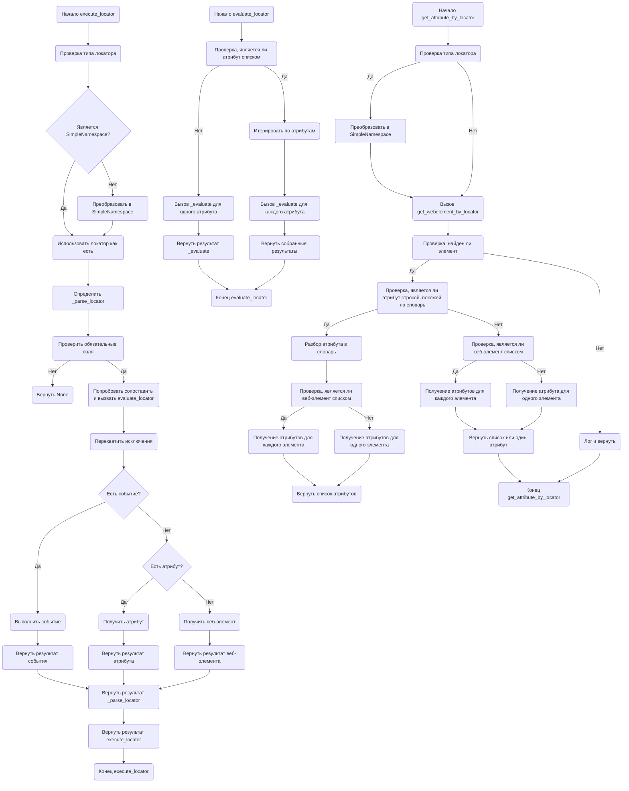

# Анализ кода `executor.py`

## 1. <алгоритм>

### execute_locator
1. **Начало**: Функция `execute_locator` принимает на вход `locator` (словарь или SimpleNamespace) и пытается выполнить действие над элементом веб-страницы, соответствующим этому локатору.
    ```python
        locator = {"by": "id", "selector": "myElement", "event": "click()"}
        # или
        locator = SimpleNamespace(by="id", selector="myElement", event="click()")
    ```
2. **Проверка типа локатора**: Проверяет, является ли `locator` объектом `SimpleNamespace` или словарем. Если это словарь, он преобразуется в `SimpleNamespace`.
    ```python
        if isinstance(locator, dict):
            locator = SimpleNamespace(**locator)
    ```
3. **Определение функции `_parse_locator`**: Определяется асинхронная вложенная функция `_parse_locator`, которая выполняет основную логику.
    ```python
       async def _parse_locator(locator):
            # ...
    ```
4. **Проверка наличия обязательных полей**: Проверяется наличие полей `event`, `attribute` или обязательных полей в `locator`. Если их нет, возвращается `None`.
    ```python
         if not any([locator.get("event"), locator.get("attribute"), ...]):
               return None
    ```
5. **Попытка сопоставить и оценить атрибут**: Функция пытается сопоставить `by` (тип локатора) с методом из `By` и вызывает `evaluate_locator` для обработки атрибута. 
    ```python
      try:
          by_type = self.by_mapping.get(locator.by.upper())
           return await self.evaluate_locator(locator)
      except Exception as e:
           ...
    ```
6. **Перехват исключений**: В случае ошибки логируется сообщение об ошибке.
    ```python
        except Exception as e:
            if self.mode == "debug":
                ...
            return None
    ```
7. **Проверка наличия события**: Проверяется, есть ли у локатора событие (`event`). Если есть, вызывается `execute_event`.
    ```python
        if locator.get("event"):
           return await self.execute_event(locator)
    ```
8. **Проверка наличия атрибута**: Проверяется, есть ли у локатора атрибут (`attribute`). Если есть, вызывается `get_attribute_by_locator`.
    ```python
       if locator.get("attribute"):
           return await self.get_attribute_by_locator(locator)
    ```
9. **Получение веб-элемента**: Если нет ни события, ни атрибута, вызывается `get_webelement_by_locator`.
    ```python
        return await self.get_webelement_by_locator(locator)
    ```
10. **Возврат результата**: Возвращается результат работы `_parse_locator`.
    ```python
        return await _parse_locator(locator)
    ```
11. **Конец**: Функция завершает выполнение.

### evaluate_locator
1.  **Начало**: Функция `evaluate_locator` принимает на вход `locator` (SimpleNamespace).
2.  **Проверка типа атрибута**: Проверяется, является ли `locator.attribute` списком.
    ```python
       if isinstance(locator.attribute, list):
    ```
3.  **Итерация по атрибутам**: Если `locator.attribute` это список, происходит итерация по каждому атрибуту и вызывается `_evaluate`. Результаты собираются в список с помощью `asyncio.gather`.
    ```python
        tasks = [self._evaluate(locator, attribute) for attribute in locator.attribute]
        return await asyncio.gather(*tasks)
    ```
4. **Вызов `_evaluate` для одного атрибута**: Если `locator.attribute` не список, вызывается `_evaluate` для одного атрибута.
    ```python
        return await self._evaluate(locator, locator.attribute)
    ```
5.  **Конец**: Функция завершает выполнение.

### get_attribute_by_locator
1. **Начало**: Функция `get_attribute_by_locator` принимает на вход `locator` (словарь или SimpleNamespace).
2. **Преобразование локатора**: Если `locator` это словарь, преобразуется в `SimpleNamespace`.
    ```python
         if isinstance(locator, dict):
            locator = SimpleNamespace(**locator)
    ```
3. **Получение веб-элемента**: Вызывается `get_webelement_by_locator` для получения веб-элементов.
    ```python
        web_element = await self.get_webelement_by_locator(locator)
    ```
4. **Проверка наличия веб-элемента**: Если веб-элементы не найдены, возвращается `None`.
    ```python
         if not web_element:
            ...
            return None
    ```
5. **Проверка атрибута на подобие словаря**: Проверяется, является ли `locator.attribute` строкой, похожей на словарь.
   ```python
        if isinstance(locator.attribute, str) and re.match(r"^\{.*\}$", locator.attribute.strip()):
            ...
   ```
6. **Разбор атрибута в словарь**: Строка атрибута парсится в словарь, используя `json.loads`.
   ```python
          locator.attribute = json.loads(locator.attribute)
   ```
7. **Проверка, является ли элемент списком**: Проверяется, является ли `web_element` списком.
   ```python
        if isinstance(web_element, list):
           ...
   ```
8. **Получение атрибутов для каждого элемента в списке**: Если `web_element` список, то происходит итерация по каждому элементу списка, из каждого элемента извлекаются значения атрибутов по ключам из `locator.attribute` и возвращается список этих значений.
   ```python
    attributes = []
    for element in web_element:
        attributes.append({key: element.get_attribute(key) for key in locator.attribute})
    return attributes
   ```
9. **Получение атрибутов для одного элемента**: Если `web_element` не список, то возвращается словарь, содержащий значения атрибутов одного элемента по ключам из `locator.attribute`.
    ```python
       return {key: web_element.get_attribute(key) for key in locator.attribute}
    ```
10. **Получение атрибута**: Если `locator.attribute` не является словарем, то извлекается значение атрибута из элемента или списка элементов и возвращается.
    ```python
        if isinstance(web_element, list):
          return [element.get_attribute(locator.attribute) for element in web_element]
        return web_element.get_attribute(locator.attribute)
    ```
11. **Конец**: Функция завершает выполнение и возвращает результат.

## 2. <mermaid>



### Зависимости Mermaid
- `graph TD`: Указывает, что диаграмма представляет собой ориентированный граф, отображающий поток данных сверху вниз.
- `Start`: Обозначает начало процесса.
- `End`: Обозначает конец процесса.
- `Check...`: Обозначает условные проверки.
- `...IsSimpleNamespace...`: Условные проверки, которые определяют является ли локатор SimpleNamespace
- `...Convert...`: Обозначает процесс преобразования типов данных.
- `...Try...`: Обозначает блок кода, в котором выполняется попытка выполнения действий, перехватываются исключения
- `...Evaluate...`: Обозначает вызов метода `evaluate_locator`.
- `...Get...`: Обозначает вызов метода для получения элемента или атрибута.
- `...Execute...`: Обозначает вызов метода для выполнения событий.
- `...Log...`: Обозначает логирование действий
- `...Return...`: Обозначает возврат результатов.
- `-->`: Обозначает поток выполнения.
- `{...}`: Обозначает условие.

## 3. <объяснение>

### Импорты
-   `selenium.webdriver.remote.webdriver`: Импортируется класс `WebDriver` для управления браузером.
-   `selenium.webdriver.common.by`: Импортируется класс `By` для определения стратегий поиска веб-элементов (например, по ID, классу, CSS-селектору).
-   `selenium.webdriver.support.ui`: Импортируется класс `WebDriverWait` для ожидания появления элементов на странице.
-  `selenium.webdriver.common.action_chains`: Импортируется класс `ActionChains` для выполнения сложных действий, таких как наведение курсора или перетаскивание.
- `asyncio`: Используется для асинхронного программирования, позволяя выполнять несколько задач одновременно и не блокировать основной поток программы. Это важно для управления веб-драйвером и обработки данных параллельно.
-   `re`:  Используется для работы с регулярными выражениями, что необходимо для анализа строк, в частности для проверки на строку, похожую на словарь.
-   `dataclasses`: Используется для создания классов данных (например, `SimpleNamespace`).
-   `enum`: Используется для создания перечислений.
-   `pathlib`: Используется для работы с путями к файлам.
-   `types`: Используется для создания простых пространств имен (например, `SimpleNamespace`).
- `typing`: Используется для аннотации типов, что помогает в разработке и отладке кода.
-   `json`: используется для парсинга строк в словарь
- `os`: для работы с операционной системой, например, для получения текущей директории

### Классы
-   **`ExecuteLocator`**:
    -   **Роль**: Основной класс для выполнения действий над веб-элементами на основе локаторов.
    -   **Атрибуты**:
        -   `driver` (`webdriver.Chrome`): Экземпляр WebDriver для управления браузером.
        -   `actions` (`ActionChains`): Объект для выполнения сложных действий с элементами.
        -   `by_mapping` (`dict`): Словарь, сопоставляющий строковые типы локаторов (например, "ID", "CLASS_NAME") с константами `By` из Selenium.
        -   `mode` (`str`): Режим выполнения (например, "debug", "dev").
        - `_screenshot_dir`: папка для сохранения скриншотов, по умолчанию `screenshot`.
        - `screenshot_format`: формат скриншотов, по умолчанию `png`
        - `fullpage_screenshot`: делать ли скриншот всей страницы или только веб-элемента, по умолчанию `False`
    -   **Методы**:
        -   `__post_init__`: Инициализирует `ActionChains`, если передан драйвер.
        -   `execute_locator(locator)`: Выполняет действие над элементом, определяемым локатором.
        -   `evaluate_locator(locator)`: Вызывает `_evaluate` для обработки атрибута(ов) элемента.
        -   `get_attribute_by_locator(locator)`: Извлекает значения атрибутов веб-элемента(ов) на основе локатора.
        -   `get_webelement_by_locator(locator)`: Получает веб-элемент(ы) на основе локатора.
        -   `get_webelement_as_screenshot(locator)`: Делает скриншот найденного веб-элемента.
        -  `execute_event(locator)`: Выполняет событие, связанное с локатором
        - `send_message(locator)`: Отправляет сообщение веб-элементу.

### Функции

-   **`execute_locator(locator)`**:
    -   **Аргументы**:
        -   `locator` (`dict` или `SimpleNamespace`): Локатор элемента, содержащий информацию о том, как найти элемент (например, `by`, `selector`) и какое действие с ним выполнить (`event`, `attribute`).
    -   **Возвращаемое значение**:
        - `Any`: результат выполнения действия над элементом или `None`, если элемент не найден.
    -   **Назначение**: Выполняет действие над элементом, определенным локатором.
    -   **Пример**:
        ```python
        locator = {"by": "id", "selector": "myElement", "event": "click()"}
        result = await executor.execute_locator(locator)
        ```
-   **`evaluate_locator(locator)`**:
    -   **Аргументы**:
        -   `locator` (`SimpleNamespace`): Локатор элемента.
    -   **Возвращаемое значение**:
        - `List[Any]` или `Any`: список результатов или результат вызова метода `_evaluate`.
    -   **Назначение**: Оценивает атрибут или список атрибутов элемента.
    -   **Пример**:
        ```python
        locator = SimpleNamespace(by="id", selector="myElement", attribute="text")
        result = await executor.evaluate_locator(locator)
        ```
-   **`get_attribute_by_locator(locator)`**:
    -   **Аргументы**:
        -   `locator` (`dict` или `SimpleNamespace`): Локатор элемента.
    -   **Возвращаемое значение**:
        -   `List[str]` или `str` или `List[dict]` или `dict` или `None`:  значение(я) атрибута(ов) или `None`, если элемент не найден.
    -   **Назначение**: Получает значение(я) атрибута(ов) элемента.
    -   **Пример**:
        ```python
        locator = {"by": "id", "selector": "myElement", "attribute": "text"}
        result = await executor.get_attribute_by_locator(locator)
        ```
-   **`get_webelement_by_locator(locator)`**:
    -   **Аргументы**:
        -   `locator` (`dict` или `SimpleNamespace`): Локатор элемента.
    -   **Возвращаемое значение**:
        - `WebElement` или `List[WebElement]` или `None`: веб-элемент(ы) или `None`, если элемент не найден.
    -   **Назначение**: Получает веб-элемент(ы) на основе локатора.
    -   **Пример**:
        ```python
        locator = {"by": "id", "selector": "myElement"}
        element = await executor.get_webelement_by_locator(locator)
        ```
-   **`get_webelement_as_screenshot(locator)`**:
    -   **Аргументы**:
        -   `locator` (`dict` или `SimpleNamespace`): Локатор элемента.
    -   **Возвращаемое значение**:
        - `str` or `None`:  путь к файлу со скриншотом элемента или `None`, если элемент не найден.
    -   **Назначение**: Делает скриншот элемента.
    -   **Пример**:
        ```python
         locator = {"by": "id", "selector": "myElement"}
         screenshot_path = await executor.get_webelement_as_screenshot(locator)
        ```
 -   **`_evaluate(locator, attribute)`**:
    -   **Аргументы**:
        - `locator`(`SimpleNamespace`): Локатор элемента.
        - `attribute` (`str`): атрибут элемента
    -   **Возвращаемое значение**:
       -  `Any` or `None`: результат извлечения атрибута элемента или `None`, если не удалось.
    -   **Назначение**: извлекает значение атрибута элемента и возвращает его.
-   **`execute_event(locator)`**:
     -  **Аргументы**:
        -   `locator` (`dict` или `SimpleNamespace`): Локатор элемента.
    -  **Возвращаемое значение**:
        - `Any` или `None`: результат выполнения события или `None`, если элемент не найден.
    -   **Назначение**: выполняет событие элемента, переданное в `locator`.
    -   **Пример**:
        ```python
        locator = {"by": "id", "selector": "myElement", "event": "click()"}
        result = await executor.execute_event(locator)
        ```
 -   **`send_message(locator)`**:
    -   **Аргументы**:
        -   `locator` (`dict` или `SimpleNamespace`): Локатор элемента.
    -   **Возвращаемое значение**:
         - `Any` или `None`: результат выполнения отправки сообщения или `None`, если элемент не найден.
    -   **Назначение**: отправляет сообщение веб-элементу, которое должно быть передано в `locator`.
    -   **Пример**:
         ```python
            locator = {"by": "id", "selector": "myElement", "message": "Hello, World"}
            result = await executor.send_message(locator)
         ```

### Переменные

-   `driver`: Экземпляр `WebDriver`, используется для управления браузером.
-   `actions`: Экземпляр `ActionChains`, используется для выполнения сложных действий.
-   `by_mapping`: Словарь, сопоставляющий типы локаторов с методами `By` Selenium.
-   `mode`: Режим выполнения (например, debug, dev).
-   `locator`: Словарь или SimpleNamespace, содержащий информацию о локаторе, по которому нужно взаимодействовать с веб-элементом.
-   `web_element`: Объект(ы) `WebElement` (или список `WebElement`) из Selenium.
-   `attribute`: Атрибут, который необходимо получить из веб-элемента.
-   `result`: Результат выполнения действия над веб-элементом (значение атрибута, результат клика и т.д.)

### Потенциальные ошибки и области для улучшения

1.  **Обработка ошибок**: Хотя модуль обрабатывает исключения, возможно, следует добавить более специфичные блоки `except` для различных типов исключений Selenium.
2.  **Логирование**: Логирование в режиме отладки `(if self.mode == "debug":)` можно расширить, добавив больше информации об ошибках и действиях.
3.  **Гибкость локаторов**:  В данный момент обрабатываются только самые простые локаторы, такие как `id`, `class name`, `xpath`.  Возможно,  потребуется поддержка других типов локаторов, таких как CSS-селекторы.
4.  **Динамические ожидания**:  Не используется явное ожидание элементов с помощью WebDriverWait. Это может привести к сбоям, если элементы загружаются асинхронно.
5.  **Сообщения**:  Для отправки сообщения, нужно, чтобы веб-элемент был полем ввода или текстовой областью. Необходимо проверять возможность отправки сообщения веб-элементу.
6. **Скриншоты**: Необходимо добавить проверку существования папки для скриншотов и создать ее, если она не существует.
7.  **Улучшить типизацию**: Добавить более точные аннотации типов для методов `_evaluate`, `execute_event`  и `send_message`.

### Взаимосвязи с другими частями проекта
-   Модуль `executor.py` используется для взаимодействия с веб-элементами в рамках автоматизированных тестов или веб-скрапинга. 
-   Он интегрируется с Selenium WebDriver для выполнения действий в браузере.
-   Результаты выполнения `executor.py` могут передаваться другим модулям для дальнейшей обработки.

**Цепочка взаимосвязей**
1.  **Модуль `webdriver`**: `executor.py` является частью `src.webdriver`, который отвечает за автоматизацию взаимодействия с веб-браузерами.
2.  **Модули `test` (если применимо)**: В тестовых модулях будет создан экземпляр `ExecuteLocator` и использованы методы класса для тестирования различных частей веб-приложения.
3.  **Модули для обработки данных**: После выполнения действий, таких как получение данных из веб-элементов, результаты могут передаваться модулям для анализа, сохранения или визуализации.
4.  **Конфигурационные файлы**: Локаторы могут загружаться из конфигурационных файлов.

Этот анализ предоставляет подробное понимание функциональности модуля `executor.py`, его структуры, зависимостей и взаимодействия с другими частями проекта.