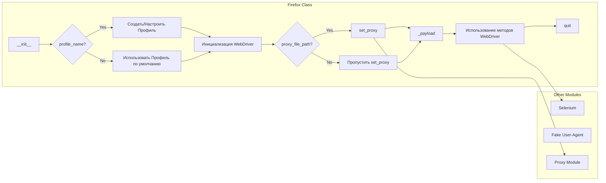

## Анализ кода модуля Firefox WebDriver

### 1. <алгоритм>

**Общая схема работы:**

1.  **Инициализация (класс `Firefox`)**:
    *   При создании объекта `Firefox` происходит инициализация параметров: `profile_name`, `geckodriver_version`, `firefox_version`, `user_agent`, `proxy_file_path`, и `options`.
    *   Пример: `browser = Firefox(profile_name="test", geckodriver_version="0.30", options=["--kiosk"])`
2.  **Установка профиля**:
    *   Если `profile_name` указан, создается и настраивается кастомный профиль Firefox.
    *   По умолчанию используется профиль по умолчанию Firefox.
3.  **Инициализация WebDriver**:
    *   Настраивается WebDriver с указанными параметрами (`geckodriver_version`, `firefox_version`).
    *   Передаются пользовательские опции (например, `--kiosk`, `--headless`).
    *   Пример: `webdriver.Firefox(firefox_profile=profile, executable_path='path/to/geckodriver', options=options)`
4.  **Установка прокси (метод `set_proxy`)**:
    *   Если `proxy_file_path` указан, из него выбирается случайный рабочий прокси, который настраивается в опциях Firefox.
    *   Используется модуль для работы с прокси.
    *   Пример: `options.proxy = Proxy({'proxyType': 'MANUAL', 'httpProxy': 'ip:port'})`
5.  **Загрузка пейлоада (метод `_payload`)**:
    *   Загружаются необходимые исполнители для локаторов и JavaScript.
    *   Это обеспечивает взаимодействие с элементами веб-страницы и выполнение скриптов.
6.  **Работа с WebDriver**:
    *   После инициализации, можно использовать стандартные методы WebDriver, такие как `get()`, `find_element()`, `execute_script()`, и `quit()`.
    *   Пример: `browser.get("https://www.example.com"); element = browser.find_element(By.ID, 'button');`
7.  **Закрытие браузера**:
    *   После завершения работы, необходимо закрыть браузер с помощью метода `quit()`.
    *   Пример: `browser.quit()`

**Блок-схема:**

```mermaid
graph LR
    A[Начало: Создание объекта Firefox] --> B{Проверка profile_name};
    B -- Да --> C[Создание кастомного профиля];
    B -- Нет --> D[Использование профиля по умолчанию];
    C --> D;
    D --> E[Инициализация WebDriver];
    E --> F{Проверка proxy_file_path};
    F -- Да --> G[Установка прокси];
    F -- Нет --> H[Пропуск установки прокси];
    G --> H;
    H --> I[Загрузка пейлоада];
    I --> J[Использование WebDriver (get, find_element и др.)];
    J --> K[Закрытие браузера (quit)];
    K --> L[Конец];
```

### 2. <mermaid>



**Анализ зависимостей:**

*   **Firefox Class**: Основной класс, который расширяет стандартный `webdriver` Firefox, добавляя функциональность, включая проксирование, кастомный профиль и пользовательские опции. Методы включают `__init__`, `set_proxy`, `_payload`.
*   **Selenium**: Необходим для управления браузером через WebDriver. Импортируется для создания экземпляра `webdriver.Firefox`.
*   **Fake User-Agent**: Используется для генерации случайных User-Agent, но по описанию кода не используется напрямую (возможно, есть нереализованная функциональность).
*   **Proxy Module**: Используется для работы с прокси, но название модуля не конкретизировано, в примере используется `selenium.webdriver.common.proxy.Proxy`
*   **Other Modules** : модули являются зависимостями для реализации функций класса `Firefox`.

### 3. <объяснение>

**Импорты:**

*   `selenium`: Используется для управления браузером через WebDriver.
*   `selenium.webdriver.firefox.options`: Импортируется для настройки параметров браузера Firefox.
*   `selenium.webdriver.common.proxy`: Импортируется для настройки прокси.
*   `typing.Optional`, `typing.List`: Используется для аннотации типов переменных.

**Классы:**

*   **`Firefox`**:
    *   **Роль**: Расширяет стандартный `webdriver.Firefox`, добавляя кастомную конфигурацию, прокси, user agent и опции.
    *   **Атрибуты**:
        *   `profile_name` (`Optional[str]`): Имя кастомного профиля.
        *   `geckodriver_version` (`Optional[str]`): Версия geckodriver.
        *   `firefox_version` (`Optional[str]`): Версия Firefox.
        *   `user_agent` (`Optional[str]`): Пользовательский User-Agent (не используется в коде).
        *   `proxy_file_path` (`Optional[str]`): Путь к файлу с прокси.
        *  `options` (`Optional[List[str]]`): Список опций для Firefox (например, `--kiosk`, `--headless`).
    *   **Методы**:
        *   `__init__`: Конструктор класса, принимает параметры конфигурации.
        *   `set_proxy`: Настраивает прокси из файла.
        *   `_payload`: Загружает исполнителей для JavaScript и локаторов.

**Функции:**

*   `__init__(self, profile_name: Optional[str] = None, geckodriver_version: Optional[str] = None, firefox_version: Optional[str] = None, user_agent: Optional[str] = None, proxy_file_path: Optional[str] = None, options: Optional[List[str]] = None, *args, **kwargs) -> None`:
    *   **Аргументы**: Параметры конфигурации Firefox (профиль, версии, прокси, опции).
    *   **Возвращаемое значение**: `None` (конструктор).
    *   **Назначение**: Инициализирует WebDriver Firefox с указанными настройками. Создает и применяет кастомный профиль, устанавливает прокси, и применяет опции запуска.
    *   **Пример**: `Firefox(profile_name="my_profile", geckodriver_version="0.32.0", proxy_file_path="proxies.txt", options=["--kiosk"])`
*   `set_proxy(self, options: Options) -> None`:
    *   **Аргументы**: `options` - объект Options класса selenium.
    *   **Возвращаемое значение**: `None`.
    *   **Назначение**: Устанавливает прокси для Firefox, выбирая случайный рабочий прокси из файла, указанного в `proxy_file_path`.
    *   **Пример**: `browser.set_proxy(options)`
*   `_payload(self) -> None`:
    *   **Аргументы**: `None`.
    *   **Возвращаемое значение**: `None`.
    *   **Назначение**: Загружает необходимые компоненты для взаимодействия с JavaScript и локаторами.

**Переменные:**

*   `profile_name`, `geckodriver_version`, `firefox_version`, `user_agent`, `proxy_file_path`, `options`: Переменные экземпляра класса `Firefox`, хранящие настройки.

**Потенциальные ошибки и области для улучшения:**

*   **Обработка ошибок**: Не хватает обработки ошибок при чтении прокси-файла, создании профиля, инициализации драйвера и настройке прокси.
*   **Неиспользуемый `user_agent`**:  Параметр `user_agent` передан в конструктор, но нигде не используется в коде.
*   **Конкретный модуль для прокси**: Использование абстрактного "модуля для прокси" может быть заменено на явный импорт `selenium.webdriver.common.proxy.Proxy`.
*   **Управление профилем**: Создание профиля должно быть более надежным и проверять наличие папки.

**Цепочка взаимосвязей:**

1.  `src.webdriver.firefox.Firefox` расширяет возможности `selenium.webdriver.firefox.webdriver.WebDriver`.
2.  Используется `selenium` для базового управления браузером.
3.  Используется кастомный модуль прокси (должен быть явно указан) для настройки прокси.
4.  Возможная интеграция с модулями `src.utils` (не показано явно в README).
5.  Может быть интегрирован в более общую систему тестирования или автоматизации.