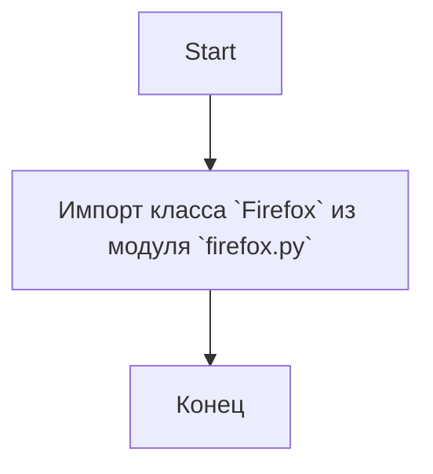

## Анализ кода `hypotez/src/webdriver/firefox/__init__.py`

### <алгоритм>

1.  **Начало**: Запускается интерпретатор Python.
2.  **Импорт**: Из модуля `firefox` (который находится в том же пакете `src.webdriver.firefox`) импортируется класс `Firefox`.
3.  **Конец**: Завершение работы скрипта.

Пример:
```python
from .firefox import Firefox
# В этом месте класс Firefox теперь доступен в текущем модуле и может использоваться.
# Например, можно создать экземпляр класса так:
# firefox_instance = Firefox()
```

### <mermaid>



### <объяснение>

**Импорты:**

*   `from .firefox import Firefox`: Этот оператор импортирует класс `Firefox` из модуля `firefox.py`, находящегося в том же пакете `src.webdriver.firefox`.  Это позволяет использовать класс `Firefox` в текущем модуле `__init__.py`.  Точка (`.`) перед `firefox` указывает на относительный импорт, т.е. `firefox.py`  находится в том же пакете, что и `__init__.py`.

**Файл `__init__.py`:**
Файл `__init__.py` в Python используется для обозначения директории как пакета. В данном случае, файл `hypotez/src/webdriver/firefox/__init__.py` делает директорию `firefox` пакетом, который может содержать другие модули. Файл `__init__.py` может быть пустым, но в этом случае, он используется для импорта класса `Firefox` в пакет `firefox`.

**Классы:**
*   `Firefox`: Импортированный класс, предположительно, предназначен для управления браузером Firefox. Этот класс, вероятно, будет содержать методы для запуска браузера, навигации, взаимодействия с элементами веб-страницы и т.д.  Детали реализации класса находятся в файле `firefox.py`, который импортируется.

**Функции:**
В этом коде функций явно не определено, но класс `Firefox`, вероятно, содержит методы, выполняющие различные действия.

**Переменные:**
В данном коде не используются явные переменные.

**Потенциальные ошибки и области для улучшения:**
*   В данном примере отсутствует конкретная реализация. Для полноценного понимания работы нужно анализировать код `firefox.py`.
*   Необходимо более детальное изучение `firefox.py` чтобы понять все возможности `Firefox` class.

**Взаимосвязь с другими частями проекта:**

Данный код находится в модуле `webdriver`, который, вероятно, является частью более крупного проекта `hypotez`. Предполагается, что другие модули проекта могут использовать класс `Firefox`, чтобы автоматизировать действия в браузере Firefox, например, для тестирования веб-приложений или сбора данных.

**Связь с другими частями `hypotez`:**

Этот модуль `src.webdriver.firefox` является частью пакета `webdriver`, который в свою очередь, скорее всего, является частью большей системы `hypotez`. Другие части `hypotez` могут использовать `webdriver.firefox.Firefox` класс, чтобы взаимодействовать с браузером Firefox.