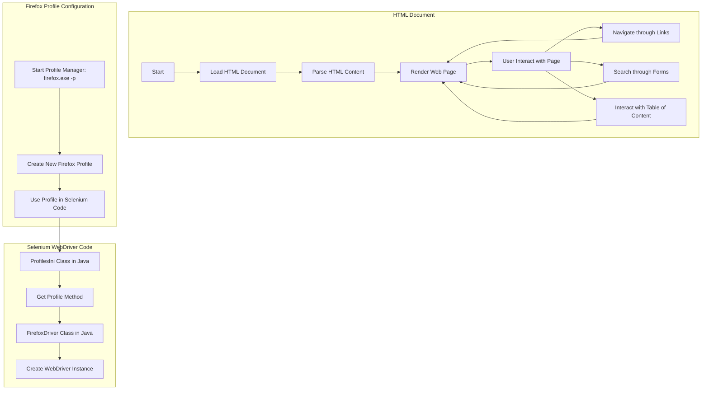

## <алгоритм>
1. **Инициализация:**
   - Загружается HTML-документ, описывающий шаги для настройки профиля Firefox для Selenium WebDriver.
   - Устанавливается режим `MODE = 'debug'` (это может использоваться для отладки, но в предоставленном HTML-коде напрямую не используется).

2. **Отображение веб-страницы:**
   - Браузер обрабатывает HTML, CSS и JavaScript для рендеринга веб-страницы.
   - **Пример**: Отображается заголовок страницы: "Steps to Configure Firefox profile for Selenium Webdriver | Tools QA".

3. **Интерактивные элементы:**
   - Пользователь может взаимодействовать с элементами страницы:
     - Навигация по меню (`<nav>`).
     - Поиск (`<form>`).
     - Переход по ссылкам (`<a>`).
     - Разворачивание/сворачивание блоков (`<section class="toc">`, `<div>` с туториалами).
   - **Пример**: Нажатие на ссылку "Selenium Tutorial" перенаправит пользователя на страницу `https://www.toolsqa.com/selenium-webdriver/selenium-tutorial/`.

4. **Работа с профилем Firefox (описание):**
   - Статья описывает, как создать новый профиль Firefox для использования в Selenium WebDriver.
   - **Пример**: Пошаговая инструкция: "Step 1: Starting the Profile Manager", "Step 2: Creating a Profile", "Step 3: User Custom Profile in Selenium".

5. **Создание нового профиля Firefox (инструкции):**
   - Пользователь должен следовать инструкциям:
     - Закрыть Firefox.
     - Запустить Profile Manager (`firefox.exe -p`).
     - Создать новый профиль.
     - Запустить Firefox с новым профилем.
   - **Пример**: Ввод команды `firefox.exe -p` в диалоговом окне "Run" (Windows).

6. **Использование профиля в Selenium (инструкции):**
   - В коде на Java необходимо использовать `ProfilesIni` и `FirefoxProfile` для указания нужного профиля.
   - **Пример кода (Java):**
     ```java
     ProfilesIni profile = new ProfilesIni();
     FirefoxProfile myprofile = profile.getProfile("profileToolsQA");
     WebDriver driver = new FirefoxDriver(myprofile);
     ```

7. **Заключительные элементы:**
   - Раздел с комментариями.
   - Футер с контактной информацией и ссылками.
   - Меню навигации (`<nav class="mega-menu">`) и гамбургер-меню для мобильных.
   - Всплывающее окно для обратной связи.
   - Различные рекламные блоки.
   - **Пример**: Форма для обратной связи (`<form class="feedback-form">`).

8. **Зависимости:**
   - Зависимостей от внешних python модулей нет. В коде присутствуют зависимости в виде ссылок на внешние ресурсы (скрипты, стили).

## <mermaid>

**Объяснение `mermaid` диаграммы:**

-   `HTML Document`:  Представляет процесс загрузки, парсинга и отображения HTML-документа.
    -   `Start`: Начало загрузки HTML-документа.
    -   `LoadHTML`: Загрузка HTML-документа.
    -   `ParseHTML`: Разбор HTML-кода для понимания структуры.
    -   `RenderPage`: Отображение веб-страницы в браузере.
    -   `Interact`: Пользователь взаимодействует со страницей.
    -   `Navigate`: Переход по ссылкам на странице.
        -   `Search`: Поиск через формы на странице.
            -   `Toc`: Работа с оглавлением на странице.
-   `Firefox Profile Configuration`: описывает процесс создания и настройки профиля Firefox.
    -   `CreateProfile`: Запуск менеджера профилей Firefox (`firefox.exe -p`).
    -   `NewProfile`: Создание нового профиля Firefox.
    -  `UseProfile`: Подготовка профиля для использования в Selenium.
-   `Selenium WebDriver Code`: описывает процесс инициализации WebDriver с кастомным профилем.
    -   `ProfilesIniClass`: Использование класса `ProfilesIni` в Java.
    -    `GetProfileMethod`: Вызов метода `getProfile` для получения необходимого профиля.
     -   `FirefoxDriverClass`: Использование класса `FirefoxDriver` в Java.
      -    `WebDriverInstance`: Создание экземпляра WebDriver с указанным профилем.

## <объяснение>

**Импорты:**
- В данном коде нет импортов python модулей. Присутствуют внешние зависимости в виде ссылок на css, js ресурсы, которые загружаются из CDN или локально.
-  `darkreader` стили, а также css стили от `tools qa`.
- `analytics.js` -  скрипт для Google Analytics.
- `gtm.js` - скрипт для Google Tag Manager.
- `f.txt` - (скрипт для показа рекламного баннера).
- `article.min.js` - основной скрипт для функционирования статьи.

**Классы:**
-   В коде нет определения пользовательских классов Python, т.к. это HTML документ.
-   HTML использует классы CSS для стилизации элементов.
-   Примеры CSS классов: `navbar`, `article-body`, `toc`, `series`, `author-details-section`, `similar-articles`, `comments-section`, `feedback-form` и др.

**Функции:**
-   **JavaScript:** В HTML-коде есть  несколько inline js функций, которые используются для функциональности сайта, к примеру: 
    -   `gtag()`: Функция для отправки данных в Google Analytics.
    -  `window.dataLayer.push()`: используется для интеграции с Google Tag Manager.
    -  также присутствуют другие сторонние js библиотеки, подключенные через `<script>` теги.
 - **Java (из примера в статье):**
    -   `ProfilesIni()`: Класс для работы с профилями Firefox.
    -   `getProfile(String profileName)`: Метод для получения профиля по его имени.
    -   `FirefoxDriver(FirefoxProfile profile)`: Конструктор для создания экземпляра FirefoxDriver с указанным профилем.
-   **HTML/CSS:** HTML-код структурирует контент, а CSS-стили управляют его внешним видом.
     -   `<header>`, `<nav>`:  заголовок и меню сайта.
     -   `<section>`:  секции для организации контента.
     -   `<main>`:  основное содержание статьи.
     -   `<footer>`:  подвал сайта.
-    **JavaScript:**
    -    Функции `modal.show`, `modal.close` из `micromodal`, управляют модальными окнами.
    -  `tns(element).goTo(index)` и `tns(element).next()` - функции tiny slider для работы с каруселями.
    -  `hamburgerMenu.classList.toggle('open')` - функция переключения состояния гамбургер меню.
    -   `loadComments` - скрипт для загрузки комментариев к статье.
  
**Переменные:**

-   `MODE = 'debug'`:  Глобальная переменная для режима отладки (используется в заголовке файла, но нигде не используется внутри HTML).

**Потенциальные ошибки и области для улучшения:**

-   **HTML:**
    -   Множество inline стилей, что затрудняет поддержку и масштабирование.
    -   Большое количество скриптов и стилей, что может замедлить загрузку страницы.
    -   Смешанный контент (HTTP и HTTPS), что может вызвать проблемы в браузере.
-   **JavaScript:**
    -   Отсутствует обработка ошибок в скриптах, что может привести к неожиданному поведению.
    -   Не оптимизированы для мобильных устройств (не все элементы адаптивны).
    -   Дублирование кода в некоторых местах.
-   **Общее:**
    -   Нет комментариев в HTML, CSS, JS, что усложняет понимание кода.
    -   Вложенность HTML-элементов может быть чрезмерной.

**Взаимосвязи с другими частями проекта:**

-   `src.webdriver.firefox`: Этот HTML-документ является частью документации для настройки Firefox в рамках проекта автоматизации тестирования.
-   Данные из этой страницы (инструкции и примеры) должны быть связаны с кодом, используемым для запуска тестов Selenium WebDriver.
-   Сайт `toolsqa.com`, где находится эта страница, является обучающей платформой, предоставляющей контент по автоматизации тестирования.

В целом, код предоставляет подробную инструкцию по созданию и использованию пользовательского профиля Firefox для автоматизации тестирования с помощью Selenium WebDriver. Основное содержание - это HTML-разметка с текстом и изображениями.