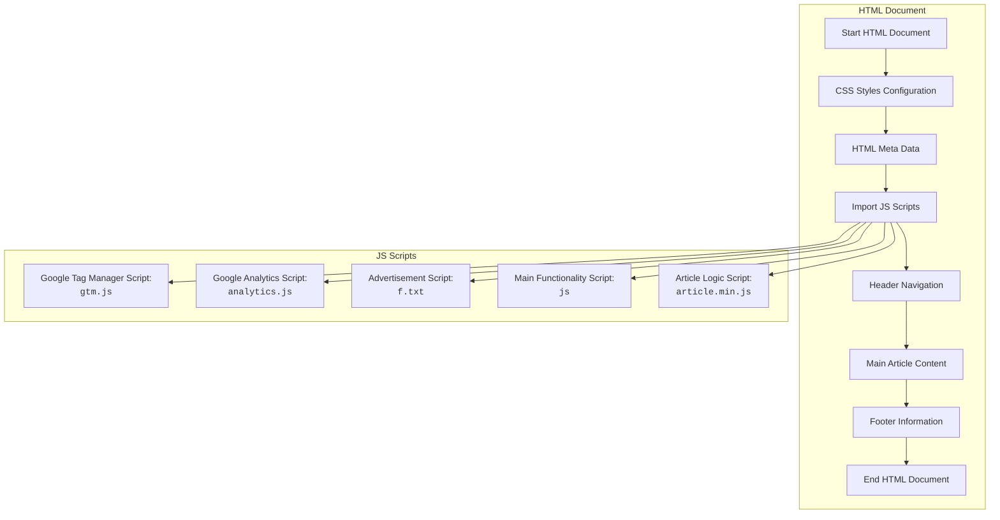

## АНАЛИЗ КОДА:

### <алгоритм>

1. **Инициализация:**
   - Устанавливается переменная `MODE` в значение `'debug'`.
   - HTML-документ начинается с объявления `<!DOCTYPE html>`, указывая на то, что это HTML5.

2. **Настройка стилей:**
   - Внутри `<head>` устанавливаются различные стили с использованием `<style>` тегов, включая:
     - Стили для `darkreader`, которые изменяют внешний вид веб-страницы для темного режима.
     - CSS переменные для определения цветов и других стилей.
     - Стили для пользовательского агента, чтобы установить базовые стили для HTML элементов.

3. **Метаданные:**
   - Метатеги предоставляют информацию о странице, такие как `viewport`, `description`, `og:description`, `og:type`, `og:site_name`, `article:publisher`, `article:published_time`, `article:modified_time`, `og:image`, `keywords`, `author`, а также подключение шрифтов `preconnect` и `preload`.
   - Указывается `darkreader` content, для работы расширения.
   - Устанавливается иконка сайта `shortcut icon` и заголовок `<title>`.

4. **Подключение скриптов:**
   - Подключаются асинхронные скрипты `analytics.js`, `gtm.js`, `f.txt` (рекламный скрипт), скрипт `js` (общая функциональность сайта), и `prompt.js` (скрипт расширения Chrome).
     - Инициализируется `dataLayer` для Google Tag Manager и настраивается Google Analytics `gtag`.

5. **HTML-структура:**
   -   `<body>` содержит:
     -   `<noscript>` iframe для Google Tag Manager.
     -   `<header>`:
       -   `navbar` с логотипом, кнопками меню, строкой поиска, навигационными ссылками и кнопкой "Tutorials".
     -  `
`:
       -   `
`:
         -   `<section>`: Breadcrumbs.
         -   `<section class="toc d-xl-none">`: Table of Contents для мобильных устройств.
         -   `
`:
           -   `
`: Table of Contents для десктопов.
           -   `
`: Контент статьи, включая метаданные, заголовок, описание, и код для создания профиля Firefox.
           -   `
`: Рекламные блоки.
         -  `<section class="series">`: Ссылки на предыдущую и следующую статью.
         -  `<section class="author-details-section">`: Детали об авторе и рецензентах.
         -   `<section class="similar-articles">`: Список похожих статей с каруселью.
         -   `<section class="comments-section">`: Кнопка для загрузки комментариев.
     - `<footer>`:
       - Ссылки на сайт, популярные и недавние статьи, социальные сети, и контактная информация.
   -   `
` - Оверлей, используемый для модальных окон и тд.
   -   `<nav class="mega-menu">` - Мега меню.
   -  `
` - Меню для мобильных устройств.
   - `
` - Кнопка для модального окна фидбека.
   -   `
`: Модальное окно для рекламы.
   -   `
`: Модальное окно для формы обратной связи.

6. **JavaScript функциональность:**
    - Подключается скрипт `article.min.js`, который содержит основную логику для работы элементов страницы, таких как раскрывающиеся меню, модальные окна и карусели.

### <mermaid>

### <объяснение>

#### Импорты

-   В этом коде нет явных импортов как в Python (`import module`). Однако, он включает внешние ресурсы (скрипты, стили, изображения) через `<link>` и `<script>` теги.
-   **`analytics.js`**: Скрипт для отслеживания посещаемости и поведения пользователей с помощью Google Analytics.
-   **`gtm.js`**: Скрипт для Google Tag Manager, позволяющий управлять различными тегами на сайте (включая GA).
-   **`f.txt`**: Асинхронный скрипт, вероятно, для показа рекламы на сайте (используется Google AdSense или аналогичная система).
-   **`js`**: Содержит основную логику сайта, возможно, обработку событий, динамическое отображение элементов и т.д.
-    **`article.min.js`**: Скрипт, отвечающий за функциональность конкретной страницы со статьёй, например, работа с каруселью, спойлерами, формой обратной связи.

#### Классы

-   В данном коде нет классов JavaScript или Python. Структура основана на HTML элементах, использующих CSS стили для отображения, и JavaScript для динамического поведения.

#### Функции

-   В HTML и JavaScript коде присутствует множество функций, которые выполняют специфические задачи. Примеры:
   -   **`gtag()`**: Функция, предоставляемая Google Analytics, для отправки данных отслеживания.
   -   **JavaScript-функции** внутри `article.min.js` для управления поведением страницы (например, открытие и закрытие модальных окон, прокрутка карусели, обработка форм).
   -   **Событийные функции:** `onclick`, `onload` для обработки событий взаимодействия пользователя с элементами страницы.

#### Переменные

-   **`MODE`**:  Устанавливается в `'debug'` в начале файла. Возможно, для переключения между режимами разработки и продакшена, или для включения отладочной информации.
-   **CSS переменные**:  Используются в `:root` для определения общих цветов и стилей.
-   **`dataLayer`**:  Объект данных, который используется Google Tag Manager для хранения информации о действиях пользователя.
-  **JavaScript переменные** используются для хранения данных, управления состояниями элементов и т.д.

#### Потенциальные ошибки и области для улучшения

1.  **Рекламный скрипт:** Скрипт `f.txt` загружается асинхронно, но если он не будет загружен, или произойдет ошибка, это может повлиять на загрузку страницы.
2.  **Зависимости:**  Использование множества внешних скриптов увеличивает зависимость от сторонних ресурсов и может замедлить загрузку страницы.
3.  **Локализация:** Весь контент на английском. Необходимо добавить возможность локализации.
4.  **Производительность:** Большой HTML документ и много CSS могут влиять на производительность страницы.
5.  **SEO:**  Хотя мета-теги присутствуют, может потребоваться дополнительная оптимизация для поисковых систем.
6.  **Доступность:** Необходимо проверить доступность страницы для пользователей с ограниченными возможностями, используя `aria-*` атрибуты.
7. **Устаревшие практики**: использование `icon` тега является не стандартным подходом.

#### Взаимосвязи с другими частями проекта

-   Этот HTML-файл является частью веб-сайта `toolsqa.com`, предоставляющего учебные материалы по автоматизации тестирования.
-   Он взаимодействует с другими частями сайта (навигация, футер, похожие статьи, комментарии, реклама, стили, скрипты) через общую структуру и подключенные ресурсы.
-   Скрипты отслеживания (Google Analytics, Google Tag Manager) передают данные о действиях пользователей в соответствующие системы.
-   Рекламные скрипты (Google AdSense) загружают и отображают рекламу, вероятно, через API.

В заключении, этот код представляет собой хорошо структурированную HTML-страницу, которая является частью большего сайта. Она использует CSS для стилизации и JavaScript для интерактивности, а также интегрирована с различными внешними сервисами для аналитики, рекламы и прочего.