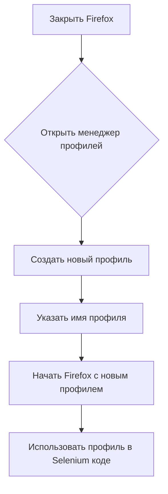

# Описание кода

## <input code>

```html
<!-- HTML код документа, описывающего конфигурацию профиля Firefox для Selenium WebDriver. -->
```

## <algorithm>

Алгоритм работы представленного кода не применим, так как это статический HTML-документ, а не исполняемый код.  Этот документ описывает шаги по созданию и использованию пользовательского профиля Firefox для Selenium WebDriver.  Алгоритм описывает последовательность действий для достижения этой цели, а не выполняет какие-либо вычисления.  Схема работы будет описывать шаги.

1. **Открытие менеджера профилей Firefox:**
    * Закрыть Firefox.
    * В диалоговом окне "Выполнить" (Windows) или аналогичном (другие ОС) ввести `firefox.exe -p` (или полный путь к firefox.exe) и нажать "ОК".
2. **Создание нового профиля:**
    * В открывшемся окне "Выбор пользовательского профиля" нажать кнопку "Создать профиль...".
    * В появившемся "Мастере создания профиля" ввести имя нового профиля (например, `profileToolsQA`).
    * Нажать "Готово".
3. **Использование профиля в Selenium:**
    * В коде Selenium WebDriver инициализировать драйвер Firefox, используя созданный профиль.

Пример кода на Java для использования профиля:

```java
ProfilesIni profile = new ProfilesIni();
FirefoxProfile myprofile = profile.getProfile("profileToolsQA");
WebDriver driver = new FirefoxDriver(myprofile);
```


## <mermaid>



**Объяснение зависимостей:**

Эта диаграмма иллюстрирует последовательность действий по конфигурации профиля. Зависимости заключаются в том, что использование пользовательского профиля Firefox в Selenium WebDriver предполагает успешное выполнение всех предшествующих шагов, включая закрытие Firefox, открытие менеджера профилей и создание нового профиля.

## <explanation>

- **Импорты:**
    Этот HTML-файл не содержит импортов в традиционном понимании, как в языках программирования (например, Java). Это статический HTML-документ.
- **Классы:**
    В примере присутствует код на Java, демонстрирующий создание `FirefoxProfile` и использование `ProfilesIni` для работы с профилем:
    * `ProfilesIni`: Класс, отвечающий за работу с профилями Firefox. Он используется для получения информации о существующих профилях или создания нового.
    * `FirefoxProfile`: Класс, представляющий пользовательский профиль Firefox, который используется для настройки параметров браузера.
- **Функции:**
    Этот HTML-файл не содержит функций в традиционном понимании. Это описание процесса конфигурации.
- **Переменные:**
    Примеры:
    * `profile`: Объект `ProfilesIni`, используемый для работы с профилями.
    * `myprofile`: Объект `FirefoxProfile`, представляющий созданный профиль.
    * `driver`: Объект `WebDriver`, используемый для управления браузером Firefox.

- **Возможные ошибки/улучшения:**

    * **Ошибки:**  В HTML-документе отсутствует код, который бы непосредственно выполнялся. Ошибки могут возникнуть в процессе создания профиля Firefox или при использовании драйвера в коде Selenium, если, например, путь к Firefox или необходимые драйверы некорректны, профиль с указанным именем не найден.
    * **Улучшения:**  Можно было бы добавить в документацию более подробные инструкции по установке Selenium и Firefox, а также примеры использования профиля в различных тестовых сценариях на Java или другом языке. Также полезно было бы добавить информацию о специфичных настройках, которые могут понадобиться для определенных тестов.

- **Связь с другими частями проекта:**
   Этот HTML-файл является документом, описывающим процесс, который должен быть интегрирован в автоматизированный тестовый фреймворк. Успешная конфигурация профиля Firefox необходима для запуска тестов Selenium WebDriver.  Профили обычно используются в контексте тестовых проектов Selenium, управляющих запуском браузера Firefox.


**Важно:**  Этот код на HTML не является исполняемым кодом, а скорее инструкцией.  Для того, чтобы этот процесс привел к автоматизации тестирования, необходимо дополнить его Java-кодом.