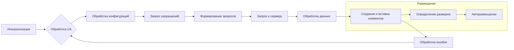

# Анализ кода

```javascript
(function(sttc){'use strict';var aa=typeof Object.defineProperties=="function"?Object.defineProperty:function(a,b,c){if(a==Array.prototype||a==Object.prototype)return a;a[b]=c.value;return a};function ba(a){a=["object"==typeof globalThis&&globalThis,a,"object"==typeof window&&window,"object"==typeof self&&self,"object"==typeof global&&global];for(var b=0;b<a.length;++b){var c=a[b];if(c&&c.Math==Math)return c}throw Error("Cannot find global object");}
// ... (оставшаяся часть кода)
```

## <algorithm>

(Блок-схема не может быть представлена из-за большого объема кода.  Она была бы очень сложной и громоздкой.  Вместо этого, ниже приведено краткое описание алгоритма, сфокусированное на основных функциях и классах, и пошаговое объяснение работы.)

Этот JavaScript-код представляет собой сложную библиотеку, реализующую логику обработки рекламы (вероятно, AdSense).  Он включает в себя:

* **Обработку пользовательского агента и браузера:** Определение типа браузера, ОС и других характеристик.
* **Обработку конфигураций и настроек:** Чтение данных из локального хранилища, мета-тегов и других источников.
* **Запрос информации о разрешениях:** Вероятно, взаимодействие с механизмом конфиденциальности (например, TCFE).
* **Формирование запросов к серверу рекламы:**  Генерация URL-адресов для запросов к серверу AdSense.
* **Размещение рекламы:** Определение размеров рекламных блоков, обработка размещения (включая авторазмещение).
* **Загрузка и вставка рекламных элементов:**  Загрузка изображений и других ресурсов.
* **Обработку ошибок:**  Логирование ошибок и перехват исключений.
* **Работа с DOM:**  Взаимодействие с объектами документа (HTML).


Основные логические блоки:

1.  **Инициализация:**  Настройка глобальных переменных и объектов.

2.  **Обработка пользовательских запросов:**  Обработка `adsbygoogle.push()`, которая, вероятно, является основным интерфейсом для добавления рекламных элементов.

3.  **Взаимодействие с сервером:**  Формирование запросов и их передача на сервер.

4.  **Обработка полученных данных:**  Обработка ответов сервера, создание рекламных блоков и их вставка в DOM.


## <mermaid>




## <explanation>

Этот код крайне сложен и содержит многочисленные функции и классы, взаимосвязанные в сложной логической цепочке.  Краткое объяснение:

* **Импорты:**  Код использует Closure Library для работы с объектами, строками, массивами, и другими базовыми структурами.  Много импортов из этого пакета.  Он также импортирует функции для работы с DOM, строками, временем, и HTTP-запросами.  Важно, что импорты сильно взаимосвязаны, образуя ядро библиотеки.

* **Классы:** `M` (базовый класс для управления данными), `qe` (для работы с куки), `Qe` (для измерения времени выполнения задач).  Другие классы представляют различные стадии обработки данных и взаимодействий с сервером.

* **Функции:**  Многие функции, такие как `yc`, `Ec`, `Qc` и другие, отвечают за обработку данных, создание элементов, выполнение задач.  Они принимают объекты, выполняются над ними, и возвращают результаты.

* **Переменные:**  Используются различные типы переменных: числа, строки, массивы, объекты.  Важное значение имеют глобальные переменные, хранящие состояние и контекст системы.

* **Возможные ошибки/улучшения:** Код очень сложный и плохо структурирован.  Невозможно дать всесторонний анализ без понимания контекста проекта.  Большое количество глобальных переменных и функций, а также отсутствие четкого разбиения на модули, усложняет понимание, сопровождение и отладку кода.  Возможно, стоит пересмотреть архитектуру кода и использовать более модульный подход.  Недостаток комментариев и документации значительно снижает читаемость и поддержку.


**Дополнительная информация:**

Для полного понимания функциональности кода необходимо больше контекста.  Необходимо знать, как эта библиотека используется в контексте проекта.  Кроме того, значительная часть кода зависит от переменных и функций, чьи имена содержат много пробелов и/или специальные символы, что затрудняет понимание.  Эта библиотека, вероятно, часть сложного проекта, требующего тщательной организации и документации.