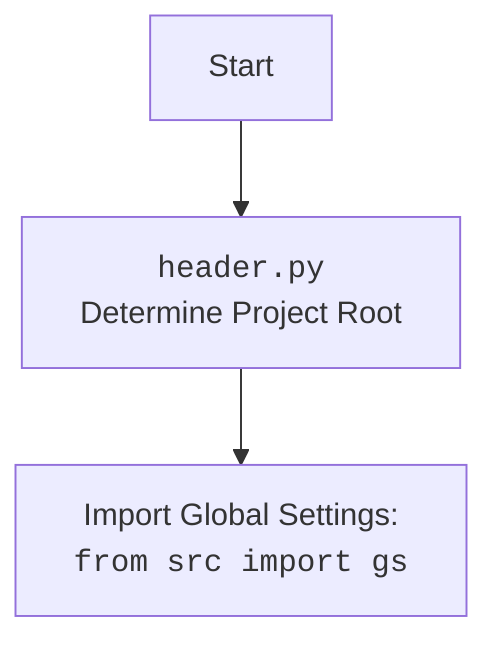

## АНАЛИЗ КОДА: `hypotez/src/webdriver/firefox/_docs/firefox.md`

### 1. <алгоритм>

**Блок-схема:**

1.  **Инициализация Firefox:**
    *   При создании экземпляра класса `Firefox` вызывается метод `__init__`.
    *   Устанавливается случайный `user_agent`, если он не передан в аргументах.
    *   Из файла `firefox.json` загружаются настройки с помощью `j_loads_ns`.
    *   Определяется путь к `geckodriver` из настроек.
    *   Создается профиль Firefox с помощью метода `_set_profile()`.
    *   Создаются опции запуска Firefox с помощью метода `_set_options()`.
    *   Создается объект `Service` для `geckodriver`.
    *   Если профиль создан, он назначается опциям.
    *   Пытается запустить Firefox с заданными опциями и сервисом. В случае ошибки, логирует её и завершает инициализацию.

2.  **Настройка профиля (`_set_profile`):**
    *   Принимает объект `SimpleNamespace` с настройками профиля.
    *   Определяет путь к каталогу профиля. Проверяет, содержит ли путь `%APPDATA%`.
        *   Если путь содержит `%APPDATA%`, подставляет значение переменной окружения `APPDATA`.
        *   Если нет, путь формируется относительно `src/webdriver/firefox/profiles`.
    *   Создаёт объект `FirefoxProfile`, используя полученный путь.
    *   Возвращает объект `FirefoxProfile`.

3.  **Настройка опций (`_set_options`):**
    *   Принимает объект `SimpleNamespace` с настройками.
    *   Создает объект `Options`.
    *   Проходит по всем опциям, определенным в настройках:
        *   Если опция содержит `'headless'`, устанавливает режим headless.
        *   Иначе, добавляет опцию с помощью `options.add_argument(opt)`.
    *   Проходит по всем заголовкам, определенным в настройках, и добавляет их в опции.
    *   Возвращает объект `Options`.

**Примеры:**

*   **Инициализация:**
    ```python
    # Вызов конструктора класса Firefox, user_agent не передается
    driver = Firefox()

    # Вызов конструктора класса Firefox, user_agent задан
    driver = Firefox(user_agent={"User-Agent": "Custom User Agent"})
    ```

*   **Настройка профиля:**
    ```python
    # Профиль по умолчанию
    profile_settings = SimpleNamespace(profile_path={"default": "%APPDATA%\\Mozilla\\Firefox\\Profiles"},
                                     default_profile_from='default',
                                     default_profile_directory=['default-profile'])
    profile = self._set_profile(profile_settings)
    
    # Профиль из директории проекта
    profile_settings = SimpleNamespace(profile_path={"custom": "profiles"},
                                     default_profile_from='custom',
                                     default_profile_directory=['custom-profile'])
    profile = self._set_profile(profile_settings)

    # Передача настроек профиля в метод _set_profile
    profile_obj = self._set_profile(profile_settings)
    ```

*   **Настройка опций:**
    ```python
    # Headless и пользовательский заголовок
    settings_options = SimpleNamespace(options=['--headless'],
                                      headers={'Accept-Language': 'en-US,en;q=0.5'})
    options_obj = self._set_options(settings_options)

    # Только дополнительные заголовки
    settings_options = SimpleNamespace(options=[],
                                      headers={'User-Agent': 'Mozilla'})
    options_obj = self._set_options(settings_options)
    
    # Разные аргументы и headless режим
    settings_options = SimpleNamespace(options=['--kiosk', 'headless'],
                                      headers={'User-Agent': 'Mozilla'})
    options_obj = self._set_options(settings_options)
    ```
    

### 2. <mermaid>

```mermaid
flowchart TD
    Start[Start] --> InitFirefox[<code>__init__</code><br>Initialize Firefox Driver]
    
    InitFirefox --> LoadSettings[Load Settings <br> from <code>firefox.json</code>]
    LoadSettings --> GetGeckoPath[Get geckodriver path <br>from settings]
    GetGeckoPath --> CreateProfile[Create Profile <br>using <code>_set_profile()</code>]
    CreateProfile --> CreateOptions[Create Options <br>using <code>_set_options()</code>]
    CreateOptions --> CreateService[Create Service <br>with geckodriver path]
    CreateService --> ApplyProfile[Apply Profile <br>to Options (if exists)]
    ApplyProfile --> LaunchFirefox[Launch Firefox <br> with options and service]
    
    LaunchFirefox -- Success --> End[End]
    LaunchFirefox -- WebDriverException --> LogCriticalError[Log Critical Error and Return]
    LaunchFirefox -- GeneralException --> LogGeneralError[Log General Error and Return]

    subgraph _set_profile
        PStart[Start] --> GetProfilePath[Determine Profile Path]
        GetProfilePath --> CheckAppData[Check for %APPDATA%]
        CheckAppData -- Yes --> ResolveAppData[Resolve %APPDATA% path]
        CheckAppData -- No --> ResolveDefaultPath[Resolve default path]
        ResolveAppData --> CreateProfileObject[Create FirefoxProfile Object <br> with Profile Path]
        ResolveDefaultPath --> CreateProfileObject
        CreateProfileObject --> PEnd[End]
    end
    
    subgraph _set_options
        OStart[Start] --> CreateOptionsObject[Create <code>Options</code> Object]
        CreateOptionsObject --> LoopOptions[Loop through Options]
        LoopOptions -- "headless" in opt --> SetHeadless[Set <code>headless = True</code>]
        LoopOptions -- "headless" not in opt --> AddArgumentOpt[Add argument using <br><code>add_argument(opt)</code>]
        SetHeadless --> LoopOptions
        AddArgumentOpt --> LoopOptions
        LoopOptions -- End loop --> LoopHeaders[Loop Through Headers]
         LoopHeaders --> AddHeaderArg[Add header argument using <br><code>add_argument(f"--{key}={value}")</code>]
        AddHeaderArg --> LoopHeaders
         LoopHeaders -- End loop --> OEnd[End]
    end

    InitFirefox --> PStart
    InitFirefox --> OStart
```

**Зависимости:**

*   **`os`:** Используется для работы с переменными окружения, например, для получения пути к `%APPDATA%` при создании профиля.
*   **`pathlib.Path`:** Используется для создания и манипулирования путями к файлам и каталогам, что обеспечивает кроссплатформенную совместимость.
*   **`types.SimpleNamespace`:** Используется для хранения настроек, прочитанных из файла `firefox.json`, в виде объекта с атрибутами.
*   **`typing.Optional, Any`:** Используется для аннотации типов, указывает, что `user_agent` может быть `None` или словарем и может содержать любые данные, также указывает, что  `*args` `**kwargs` - может принимать любые значения.
*   **`selenium.webdriver.Firefox`:** Базовый класс для управления браузером Firefox через Selenium.
*   **`selenium.webdriver.firefox.options.Options`:** Используется для настройки параметров запуска Firefox, таких как headless mode, языковые настройки и т.д.
*   **`selenium.webdriver.firefox.service.Service`:** Используется для запуска и управления `geckodriver`, который является мостом между Selenium и Firefox.
*   **`selenium.webdriver.firefox.firefox_profile.FirefoxProfile`:** Используется для настройки профиля пользователя Firefox, включая пользовательские настройки, расширения и т.д.
*   **`selenium.common.exceptions.WebDriverException`:** Класс исключения, выбрасываемый в случае ошибки вебдрайвера.
*  **`fake_useragent.UserAgent`:** Используется для генерации случайных user-agent.
*  **`src.gs`:** Используется для получения общих настроек проекта, таких как пути.
*   **`src.utils.jjson.j_loads_ns`:** Используется для загрузки настроек из JSON-файла в объект `SimpleNamespace`.
*   **`src.logger.logger.logger`:** Используется для логирования информации, ошибок и отладочных сообщений.



### 3. <объяснение>

**Импорты:**

*   **`os`:** Модуль для работы с операционной системой, в частности для доступа к переменным окружения (`os.environ`).
*   **`pathlib.Path`:** Модуль для работы с путями в файловой системе, предоставляет объектно-ориентированный интерфейс для создания и манипулирования путями.
*   **`types.SimpleNamespace`:** Удобный класс для создания объектов с динамически добавляемыми атрибутами, здесь используется для хранения настроек из JSON.
*  **`typing.Optional, Any`:** Используется для статической типизации, `Optional` указывает, что переменная может быть `None`, а `Any` допускает любой тип данных.
*   **`selenium.webdriver.Firefox`:** Основной класс Selenium для управления браузером Firefox. Этот класс будет расширен, чтобы добавить кастомную функциональность.
*   **`selenium.webdriver.firefox.options.Options`:** Класс для настройки опций запуска браузера Firefox (например, headless mode, добавление аргументов командной строки).
*   **`selenium.webdriver.firefox.service.Service`:** Класс для управления процессом `geckodriver`, который используется Selenium для взаимодействия с Firefox.
*   **`selenium.webdriver.firefox.firefox_profile.FirefoxProfile`:** Класс для работы с профилем Firefox, позволяющий настраивать пользовательские параметры (например, настройки прокси, пользовательские дополнения).
*   **`selenium.common.exceptions.WebDriverException`:** Класс исключений, возникающий при ошибках вебдрайвера, например, когда не удается запустить браузер.
*   **`fake_useragent.UserAgent`:** Используется для генерации случайного user-agent, чтобы имитировать использование браузера реальным пользователем.
*   **`src.gs`:** Модуль глобальных настроек проекта, предоставляющий доступ к общим путям и настройкам.
*   **`src.utils.jjson.j_loads_ns`:** Функция для загрузки данных из JSON-файла в объект `SimpleNamespace`, что обеспечивает удобный доступ к настройкам.
*   **`src.logger.logger.logger`:** Модуль для логирования, используется для записи ошибок, информационных сообщений и отладочных данных.

**Классы:**

*   **`Firefox(WebDriver)`:** Класс `Firefox` является подклассом `selenium.webdriver.Firefox`. Он расширяет функциональность базового класса, предоставляя методы для настройки запуска браузера, создания пользовательского профиля и установки дополнительных опций.

    *   **Атрибуты:**
        *   `driver_name`: Статический атрибут класса, устанавливается в значение `'firefox'`.

    *   **Методы:**

        *   `__init__(self, user_agent: Optional[dict] = None, *args, **kwargs)`: Конструктор класса. Принимает `user_agent` (необязательный словарь с настройками User-Agent), а так же любые неименованные и именованные параметры. Инициализирует экземпляр драйвера Firefox, загружает настройки из `firefox.json`, устанавливает профиль и опции, и запускает браузер.
        *   `_set_options(self, settings: SimpleNamespace) -> Options`: Метод для установки опций запуска Firefox. Принимает настройки `settings` в виде объекта `SimpleNamespace` и возвращает объект `Options` с установленными опциями.
        *   `_set_profile(self, profile: SimpleNamespace) -> FirefoxProfile`: Метод для установки профиля Firefox. Принимает настройки профиля `profile` в виде объекта `SimpleNamespace` и возвращает объект `FirefoxProfile`.

**Функции:**

*   `__init__(self, user_agent: Optional[dict] = None, *args, **kwargs)`:
    *   **Аргументы:** `user_agent` (необязательный, словарь), `*args` (позиционные аргументы), `**kwargs` (именованные аргументы).
    *   **Назначение:** Инициализирует объект `Firefox`, загружает настройки, создает профиль и опции, запускает браузер.
    *   **Примеры:** `Firefox()`, `Firefox(user_agent={"User-Agent": "Custom User Agent"})`
*   `_set_options(self, settings: SimpleNamespace) -> Options`:
    *   **Аргументы:** `settings` (объект `SimpleNamespace` с настройками).
    *   **Возвращаемое значение:** `Options` (объект с настроенными опциями).
    *   **Назначение:** Создает и настраивает опции запуска Firefox, включая headless режим, пользовательские аргументы командной строки и заголовки.
    *   **Примеры:** `self._set_options(settings_object)`
*   `_set_profile(self, profile: SimpleNamespace) -> FirefoxProfile`:
    *   **Аргументы:** `profile` (объект `SimpleNamespace` с настройками профиля).
    *   **Возвращаемое значение:** `FirefoxProfile` (объект с настроенным профилем).
    *   **Назначение:** Создает и настраивает профиль Firefox, определяя путь к директории профиля, загружая стандартный профиль или используя кастомный профиль.
    *   **Примеры:** `self._set_profile(profile_settings)`

**Переменные:**

*   `self.user_agent`: Хранит user-agent для браузера, может быть как переданный словарь, так и сгенерированный случайный `UserAgent`.
*   `settings`: Объект `SimpleNamespace`, содержащий настройки из `firefox.json`.
*   `geckodriver_path_parts`: Список строк, описывающих путь к `geckodriver`.
*   `geckodriver_path`: Строка, представляющая полный путь к `geckodriver`.
*   `profile`: Объект `FirefoxProfile`, представляющий профиль пользователя.
*   `options`: Объект `Options`, содержащий опции запуска браузера.
*   `service`: Объект `Service`, управляющий процессом `geckodriver`.
*   `profile_directory`: Строка, содержащая путь к каталогу профиля.

**Цепочка взаимосвязей:**

1.  Инициализация класса `Firefox` вызывает загрузку настроек из `firefox.json` с помощью `j_loads_ns`.
2.  Настройки используются для определения пути к `geckodriver` и создания объектов `FirefoxProfile` и `Options`.
3.  `geckodriver` запускается с использованием `Service`, а браузер запускается с заданными опциями и профилем.
4.  `src.gs` предоставляет общие настройки проекта, включая базовые пути к директориям.
5.  `src.logger.logger` используется для записи логов в процессе инициализации и запуска драйвера.

**Потенциальные ошибки и области для улучшения:**

1.  **Обработка ошибок:** Обработка ошибок в `__init__` может быть улучшена. Сейчас происходит просто логирование ошибки, но можно добавить более гранулярную обработку (например, ретрай, уведомление администратора).
2.  **Конфигурация `geckodriver`:** Путь к `geckodriver` жестко задан в `firefox.json`, возможно, было бы лучше использовать переменные окружения или автоматическое обнаружение.
3.  **Конфигурация профиля:**  Выбор профиля через `profile.default_profile_from` не совсем очевиден, можно пересмотреть этот механизм.
4.  **Типизация:** Использовать статические аннотации для переменных и атрибутов внутри методов для повышения читаемости и предсказуемости кода.
5.  **Документация:** Добавить докстринги к методам класса для повышения читаемости и понимания кода.
6.  **Тестирование:**  Отсутствуют тесты. Необходимо добавить модульные тесты, чтобы удостовериться в корректности работы каждого метода и класса.

Этот анализ предоставляет подробное понимание работы класса `Firefox`, его зависимостей, функций и потенциальных улучшений.