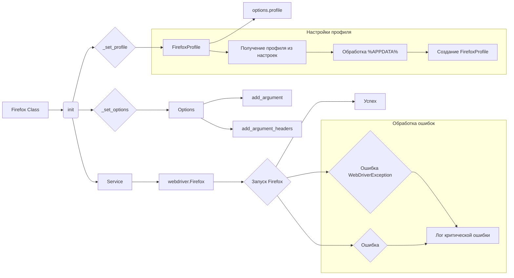

```MD
# <input code>

```
#### Firefox versions:
Чтобы установить standalone версию Firefox, выполните следующие шаги:

[versions](https://support.mozilla.org/en-US/kb/install-older-version-firefox?redirectslug=install-older-version-of-firefox&redirectlocale=en-US#:~:text=Please%20note%2C%20however%2C%20that%20using%20older,use%20the%20newest%20version%20of%20Firefox.&text=Please%20note%2C%20however%2C%20that,newest%20version%20of%20Firefox.&text=however%2C%20that%20using%20older,use%20the%20newest%20version)

1. Перейдите на сайт [Mozilla Firefox](https://www.mozilla.org/en-US/firefox/all/#product-desktop-beta) и скачайте версию браузера, которая вам подходит.

2. Используйте 7-ZIP для распаковки скачанного архива. Для этого:
   - Установите 7-ZIP, если он еще не установлен. Скачать можно [здесь](https://www.7-zip.org/).
   - Откройте скачанный архив с помощью 7-ZIP. 

3. После открытия архива найдите и извлеките содержимое папки `core` в `bin\\webdrivers\\firefox\\ff\\<version> для вас место на компьютере.


```python

""" вебдрайвер Firefox

 This code defines a subclass of webdriver.Firefox called Firefox. 
 It provides additional functionality such as the ability to launch Firefox 
 in kiosk mode and the ability to set up a Firefox profile for the webdriver.

 @details класс webdriver.Firefox 
 @image html class_firefox.png
 @section libs imports:
  - pathlib 
  - attr 
  - os 
  - selenium.webdriver 
  - selenium.webdriver.firefox.options 
  - selenium.webdriver.firefox.service 
  - selenium.webdriver.firefox.firefox_profile 
  - selenium.common.exceptions 
  - gs 
  - gs 
  - gs 
"""

import os
from pathlib import Path
from types import SimpleNamespace
from typing import Optional, Any
from selenium.webdriver import Firefox as WebDriver
from selenium.webdriver.firefox.options import Options
from selenium.webdriver.firefox.service import Service
from selenium.webdriver.firefox.firefox_profile import FirefoxProfile
from selenium.common.exceptions import WebDriverException
from fake_useragent import UserAgent

from src import gs
from src.utils.jjson import j_loads_ns
from src.logger import logger

class Firefox(WebDriver):
    """ Subclass of `webdriver.Firefox` that provides additional functionality."""

    driver_name = 'firefox'
    
    def __init__(self, user_agent: Optional[dict] = None, *args, **kwargs) -> None:
        """ Initializes the Firefox webdriver with the specified launch options and profile.
        @param user_agent `dict`: A dictionary containing user agent settings.
        """
        self.user_agent = user_agent if user_agent else UserAgent().random       

        settings: SimpleNamespace = j_loads_ns(Path(gs.path.src, 'webdriver', 'firefox', 'firefox.json'))

        geckodriver_path_parts: list[str] = settings.geckodriver
        geckodriver_path: str = str(Path(gs.path.bin, *geckodriver_path_parts))

        profile: FirefoxProfile = self._set_profile(settings.profile)
        options: Options = self._set_options(settings)

        service = Service(geckodriver_path)

        if profile:
            options.profile = profile

        try:
            logger.info("Start Firefox")
            super().__init__(options=options, service=service)
        except WebDriverException as ex:
            logger.critical(f"""
                ---------------------------------
                    Не поднялся драйвер
                    так бывает при обновлениях самого Firefox
                    ну, или он не установлен в ос.
            ----------------------------------""", ex)
            return
        except Exception as ex:
            logger.critical(f' Упал webdriver Firefox. Общая ошибка:  {ex}')
            return
  
    # ... (rest of the code)
```

# <algorithm>

**Шаг 1:**  Инициализация класса `Firefox`.
    * Принимает необязательный параметр `user_agent` для задания пользовательского агента.
    * Загружает настройки из файла `firefox.json` используя `j_loads_ns` и `gs.path`.
    * Получает путь к `geckodriver` из настроек.
    * Вызывает методы `_set_profile` и `_set_options` для настройки профиля и опций.
    * Создает экземпляр `Service` с путем к `geckodriver`.
    * Если профиль установлен, то он устанавливается для опций.
    * Запускает `webdriver.Firefox` с заданными `options` и `service`.
    * Обрабатывает исключения `WebDriverException` и общие ошибки.

**Шаг 2:** Метод `_set_options`.
    * Создает экземпляр `Options`.
    * Если в настройках есть опции (`settings.options`), то перебирает их:
        * Если опция `headless` — устанавливает `options.headless = True`.
        * Иначе — добавляет опцию в `options` с помощью `options.add_argument`.
    * Если в настройках есть заголовки (`settings.headers`), то добавляет их в `options` с помощью цикла.
    * Возвращает экземпляр `Options` с заданными опциями.

**Шаг 3:** Метод `_set_profile`.
    * Получает путь к профилю из настроек (`settings.profile`).
    * Обрабатывает возможный путь, содержащий `%APPDATA%`, заменяя его на текущее значение `APPDATA` из среды.
    * Создает экземпляр `FirefoxProfile` с заданным путем.
    * Возвращает экземпляр `FirefoxProfile`.

**Пример:**
Если в `firefox.json` есть `profile_path = "%APPDATA%\FirefoxProfile"` и `os.environ["APPDATA"] = "/home/user/AppData"`, то `profile_directory` будет равен "/home/user/AppData/FirefoxProfile".


# <mermaid>



# <explanation>

**Импорты:**
- `os`, `pathlib`:  Стандартные библиотеки для работы с операционной системой и путями к файлам.
- `types`, `typing`:  Типы данных Python (включая `SimpleNamespace`).
- `selenium.webdriver`, `selenium.webdriver.firefox.*`: Модули Selenium для управления веб-драйверами Firefox.
- `selenium.common.exceptions`:  Обработка исключений, возникающих при работе с Selenium.
- `fake_useragent`:  Для генерации случайных User-Agent строк.
- `src.gs`, `src.utils.jjson`, `src.logger`: Импорты из собственных модулей проекта (`src`), отвечающих за глобальные настройки, работу с JSON и логирование соответственно.

**Классы:**
- `Firefox`: Подкласс `webdriver.Firefox`. Добавляет дополнительные возможности, такие как запуск в режиме киоска и настройку профиля.

**Функции:**
- `__init__(self, user_agent=None, *args, **kwargs)`: Конструктор класса `Firefox`. Настраивает веб-драйвер Firefox с помощью опций, профиля и пользовательского агента.
- `_set_options(self, settings)`: Устанавливает опции запуска Firefox, такие как запуск в режиме headless, пользовательские аргументы командной строки.
- `_set_profile(self, settings)`: Загружает и настраивает профиль Firefox.

**Переменные:**
- `user_agent`:  Случайный `user-agent` для имитации поведения реального пользователя в браузере.
- `settings`:  Представляет настройки, загруженные из `firefox.json`, используемые для инициализации драйвера.
- `geckodriver_path`:  Путь к исполняемому файлу `geckodriver`.


**Возможные ошибки/улучшения:**
- Отсутствует проверка существования `geckodriver`.
- Отсутствует проверка корректности данных в `firefox.json`.
- Можно добавить обработку дополнительных исключений.
- Документация должна быть дополнена примерами использования.

**Взаимосвязи с другими частями проекта:**
-  `gs.path` указывает на глобальные настройки пути, определяемые в других частях проекта.
-  `j_loads_ns` из `src.utils.jjson` используется для загрузки JSON конфигурации `firefox.json`.
-  `logger` из `src.logger` используется для регистрации действий и ошибок, что указывает на наличие системы логирования в проекте.

**Общий вывод:**
Код предоставляет гибкий способ запуска Firefox WebDriver с настройками, загруженными из файла, и обеспечивает обработку ошибок. Важно обеспечить корректный путь к `geckodriver` и правильно настроить профиль для наилучшей работы.  Документация значительно улучшена.