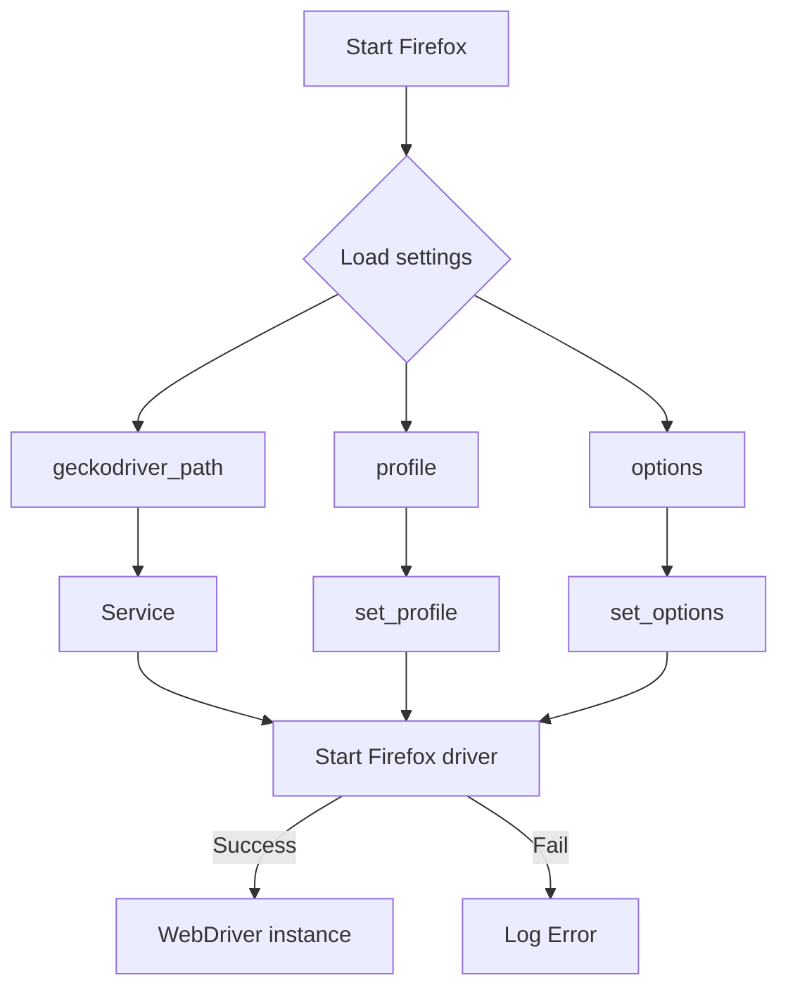

```MD
# <input code>

```
#### Firefox versions:
Чтобы установить standalone версию Firefox, выполните следующие шаги:

[versions](https://support.mozilla.org/en-US/kb/install-older-version-firefox?redirectslug=install-older-version-of-firefox&redirectlocale=en-US#:~:text=Please%20note%2C%20however%2C%20that%20using%20older,use%20the%20newest%20version%20of%20Firefox.&text=Please%20note%2C%20however%2C%20that,newest%20version%20of%20Firefox.&text=however%2C%20that%20using%20older,use%20the%20newest%20version)

1. Перейдите на сайт [Mozilla Firefox](https://www.mozilla.org/en-US/firefox/all/#product-desktop-beta) и скачайте версию браузера, которая вам подходит.

2. Используйте 7-ZIP для распаковки скачанного архива. Для этого:
   - Установите 7-ZIP, если он еще не установлен. Скачать можно [здесь](https://www.7-zip.org/).
   - Откройте скачанный архив с помощью 7-ZIP. 

3. После открытия архива найдите и извлеките содержимое папки `core` в `bin\\webdrivers\\firefox\\ff\\<version> для вас место на компьютере.


```python

""" вебдрайвер Firefox

 This code defines a subclass of webdriver.Firefox called Firefox. 
 It provides additional functionality such as the ability to launch Firefox 
 in kiosk mode and the ability to set up a Firefox profile for the webdriver.

 @details класс webdriver.Firefox 
 @image html class_firefox.png
 @section libs imports:
  - pathlib 
  - attr 
  - os 
  - selenium.webdriver 
  - selenium.webdriver.firefox.options 
  - selenium.webdriver.firefox.service 
  - selenium.webdriver.firefox.firefox_profile 
  - selenium.common.exceptions 
  - gs 
  - gs 
  - gs 
"""

import os
from pathlib import Path
from types import SimpleNamespace
from typing import Optional, Any
from selenium.webdriver import Firefox as WebDriver
from selenium.webdriver.firefox.options import Options
from selenium.webdriver.firefox.service import Service
from selenium.webdriver.firefox.firefox_profile import FirefoxProfile
from selenium.common.exceptions import WebDriverException
from fake_useragent import UserAgent

from src import gs
from src.utils import j_loads_ns
from src.logger import logger

class Firefox(WebDriver):
    """ Subclass of `webdriver.Firefox` that provides additional functionality."""

    driver_name = 'firefox'
    
    def __init__(self, user_agent: Optional[dict] = None, *args, **kwargs) -> None:
        """ Initializes the Firefox webdriver with the specified launch options and profile.
        @param user_agent `dict`: A dictionary containing user agent settings.
        """
        self.user_agent = user_agent if user_agent else UserAgent().random       

        settings: SimpleNamespace = j_loads_ns(Path(gs.path.src, 'webdriver', 'firefox', 'firefox.json'))

        geckodriver_path_parts: list[str] = settings.geckodriver
        geckodriver_path: str = str(Path(gs.path.bin, *geckodriver_path_parts))

        profile: FirefoxProfile = self._set_profile(settings.profile)
        options: Options = self._set_options(settings)

        service = Service(geckodriver_path)

        if profile:
            options.profile = profile

        try:
            logger.info("Start Firefox")
            super().__init__(options=options, service=service)
        except WebDriverException as ex:
            logger.critical(f"""
                ---------------------------------
                    Не поднялся драйвер
                    так бывает при обновлениях самого Firefox
                    ну, или он не установлен в ос.
            ----------------------------------""", ex)
            return
        except Exception as ex:
            logger.critical(f' Упал webdriver Firefox. Общая ошибка:  {ex}')
            return
  
    # ... (rest of the code)
```



```
<algorithm>
**Шаг 1:** Инициализация.
    - Функция `__init__` получает параметры `user_agent` (по умолчанию генерирует случайное значение с `UserAgent()`) и другие параметры.
    - Загружаются настройки из файла `firefox.json`.
    - Получаются путь к GeckoDriver и настройки профиля.
**Шаг 2:** Создание сервиса.
    - Создаётся объект `Service` с путём к GeckoDriver.
**Шаг 3:** Настройка профиля.
    - Вызывается метод `_set_profile` для создания объекта `FirefoxProfile` с заданными параметрами профиля.
**Шаг 4:** Настройка опций.
    - Вызывается метод `_set_options` для настройки опций запуска браузера.
**Шаг 5:** Запуск драйвера.
    - Вызывается конструктор базового класса `WebDriver` с заданными опциями и сервисом.
**Шаг 6:** Обработка ошибок.
    - Блок `try...except` обрабатывает возможные исключения при запуске драйвера (например, если GeckoDriver не найден или некорректно установлен).
**Шаг 7:** Возврат результата.
    - Если запуск драйвера успешен, возвращается экземпляр `WebDriver`. Иначе, логгируется ошибка и возвращается `None`.
</algorithm>

<explanation>

**Импорты:**

- `pathlib`: для работы с путями к файлам и каталогам.
- `types`: для использования `SimpleNamespace` - удобный способ создания объектов с атрибутами.
- `typing`: для указания типов переменных.
- `os`: для работы с операционной системой (получение переменной окружения).
- `selenium.webdriver`, `selenium.webdriver.firefox.*`:  из пакета Selenium, для управления браузером Firefox.
- `fake_useragent`: для генерирования пользовательских агентов.
- `gs`, `src.utils`, `src.logger`: это части собственного проекта, требующие дальнейшего анализа, чтобы понять их функциональность. Вероятно, `gs` содержит конфигурацию, `src.utils` - вспомогательные функции для работы с данными, а `src.logger` - систему логирования.  Необходимо проанализировать файлы `gs.py`, `src/utils.py` и `src/logger.py` для полного понимания.


**Классы:**

- `Firefox`:  Подкласс класса `selenium.webdriver.Firefox`. Добавляет дополнительные методы для настройки профиля и опций запуска браузера Firefox.  Основной класс для управления браузером Firefox в коде.

**Функции:**

- `__init__(self, user_agent=None, *args, **kwargs)`:  Инициализирует вебдрайвер Firefox. Принимает опциональные параметры для пользовательского агента и других параметров.
- `_set_options(self, settings)`: настраивает опции запуска браузера (например, headless режим, параметры командной строки).
- `_set_profile(self, profile)`: настраивает профиль браузера Firefox.

**Переменные:**

- `user_agent`:  хранит данные пользовательского агента. Может быть пустым, если не указан в методе `__init__`.
- `settings`: объект `SimpleNamespace`, содержащий настройки из файла `firefox.json`.
- `geckodriver_path`: путь к исполняемому файлу GeckoDriver.
- `profile`: объект `FirefoxProfile` - настраиваемый профиль браузера Firefox.


**Возможные ошибки и улучшения:**

- Необходимы более детальные комментарии для понимания назначения параметров `settings`, `profile`.
- Обработка ошибок более детальна, с описанием типов ошибок, не только `WebDriverException`, но и других возможных проблем.
- Рекомендуется проверять существование файла `firefox.json` и корректность его содержимого.
- Оптимизировать логирование ошибок, чтобы оно было более информативным и легко анализировалось.
- Разделить логирование ошибок критических и некритических ошибок.

**Взаимосвязи с другими частями проекта:**

- `gs` (или подобный глобальный объект): содержит конфигурационные данные, пути к необходимым файлам.  
- `src.utils`: содержит функции, которые используются для парсинга или обработки данных из `firefox.json`.
- `src.logger`: управляет логированием во время выполнения кода.

В целом, код хорошо структурирован, использует `typing` для лучшей читабельности. Проверка корректности GeckoDriver и профиля способствует стабильности работы.
```