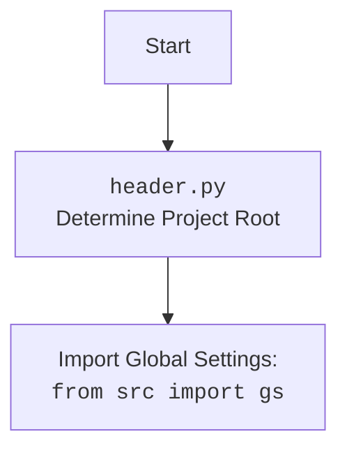

## Анализ кода `hypotez/src/webdriver/firefox/_docs/firefox.md`

### <алгоритм>

1. **Инициализация:**
   - Создается экземпляр класса `Firefox`.
   - Принимает на вход опциональный `user_agent` (словарь). Если не предоставлен, генерируется случайный `user_agent`.
   - Загружаются настройки из `firefox.json` в `SimpleNamespace` `settings`.
   - Определяется путь к `geckodriver` на основе настроек.
   - Создается и настраивается профиль Firefox с помощью метода `_set_profile` и объект `Options` с помощью `_set_options` на основе загруженных `settings`.
   - Создается объект `Service` с путем к `geckodriver`.
   - Если создан профиль, он устанавливается в опции.
   - Вызывается конструктор родительского класса `WebDriver` с настроенными опциями и сервисом.
   - Обрабатываются исключения `WebDriverException` и общие `Exception` при запуске драйвера.

   *Пример:*
   ```python
   firefox_driver = Firefox()  # Инициализация с настройками по умолчанию
   firefox_driver_custom_ua = Firefox(user_agent={"User-Agent": "My Custom User Agent"}) # Инициализация с пользовательским user agent
   ```

2. **`_set_options`:**
   - Принимает `SimpleNamespace` `settings`.
   - Создает объект `Options`.
   - Проходит по настройкам `options` из `settings`, добавляет `headless` или другие аргументы.
   - Проходит по настройкам `headers`, добавляет их в качестве аргументов.
   - Возвращает настроенный объект `Options`.

   *Пример:*
   ```python
   settings = SimpleNamespace(options=['--kiosk', '--disable-gpu'], headers={"User-Agent": "My Custom User Agent", "Accept-Language": "en-US"})
   options = self._set_options(settings) # Настройка опций
   ```

3.  **`_set_profile`:**
    - Принимает `SimpleNamespace` `profile`.
    - Определяет путь к директории профиля на основе `profile.profile_path` и `profile.default_profile_from` а также `profile.default_profile_directory`.
    - Если в пути есть `%APPDATA%`, заменяет его на значение переменной окружения APPDATA и ищет по указанному пути.
    - Если в пути нет `%APPDATA%` то идет по пути `gs.path.src / 'webdriver' / 'firefox' / 'profiles'`
    - Создает объект `FirefoxProfile` с указанным путем.
    - Возвращает созданный объект `FirefoxProfile`.

   *Пример:*
   ```python
   settings = SimpleNamespace(profile = SimpleNamespace(profile_path = {"default": "%APPDATA%/Mozilla/Firefox/Profiles/"}, default_profile_from = "default", default_profile_directory = ["default_profile"]))
    profile = self._set_profile(settings.profile) # Настройка профиля
   ```

### <mermaid>

```mermaid
flowchart TD
    Start --> Initialize[Initialize Firefox Driver];
    Initialize --> LoadSettings[Load settings from `firefox.json`];
    LoadSettings --> GetGeckoDriverPath[Determine GeckoDriver path];
    GetGeckoDriverPath --> SetProfile[Set Firefox Profile: `_set_profile()`];
    SetProfile --> SetOptions[Set Firefox Options: `_set_options()`];
    SetOptions --> CreateService[Create `Service` with GeckoDriver path];
    CreateService --> ApplyProfile[Apply profile to options (if profile exists)];
    ApplyProfile --> StartWebDriver[Start WebDriver: `super().__init__()`];
    StartWebDriver --> HandleExceptions{Handle Exceptions};
    HandleExceptions -- WebDriverException --> LogCriticalError[Log Critical WebDriver Error];
    HandleExceptions -- Exception --> LogGeneralError[Log General Error];
    StartWebDriver -- Success --> End;
    LogCriticalError --> End;
    LogGeneralError --> End;

    subgraph _set_options()
        SOStart[Start _set_options] --> SOCreateOptions[Create `Options` Object];
        SOCreateOptions --> SOProcessOptions[Process options from settings];
        SOProcessOptions --> SOProcessHeaders[Process headers from settings];
        SOProcessHeaders --> SOReturnOptions[Return `Options` Object];
    end

    subgraph _set_profile()
        SPStart[Start _set_profile] --> SPDetermineProfilePath[Determine profile directory path];
        SPDetermineProfilePath --> SPCreateProfile[Create `FirefoxProfile` Object];
        SPCreateProfile --> SPReturnProfile[Return `FirefoxProfile` Object];
    end


    Initialize -- Loads settings --> settings
    Initialize --  user_agent --> user_agent
    SetOptions -- settings --> options
    SetProfile -- profile settings --> profile
    CreateService -- geckodriver_path --> service
    ApplyProfile -- profile, options --> options
    StartWebDriver -- options, service --> WebDriver instance

```



### <объяснение>

#### Импорты:
- `os`:  Предоставляет функции для взаимодействия с операционной системой, например, для работы с путями и переменными окружения.
- `pathlib.Path`: Упрощает работу с путями к файлам и директориям.
- `types.SimpleNamespace`:  Создаёт простой объект с атрибутами, доступными через точку. Используется для хранения настроек.
- `typing.Optional, Any`: Используется для аннотации типов, указывает что переменная может быть либо определенного типа, либо None.
- `selenium.webdriver.Firefox as WebDriver`: Импортирует класс `Firefox` из `selenium.webdriver` и переименовывает его в `WebDriver`. Используется как базовый класс.
- `selenium.webdriver.firefox.options.Options`: Класс для установки опций запуска браузера Firefox.
- `selenium.webdriver.firefox.service.Service`: Класс для запуска сервиса `geckodriver`.
- `selenium.webdriver.firefox.firefox_profile.FirefoxProfile`:  Класс для работы с профилем Firefox.
- `selenium.common.exceptions.WebDriverException`: Исключение, которое может возникнуть при работе с веб-драйвером.
- `fake_useragent.UserAgent`: Библиотека для генерации случайных `user-agent` строк.
- `src.gs`:  Импортирует глобальные настройки проекта, предположительно, для доступа к путям и другим общим параметрам.
- `src.utils.jjson.j_loads_ns`:  Функция для загрузки данных из JSON-файла и преобразования их в `SimpleNamespace`.
- `src.logger.logger`:  Модуль для ведения журнала работы программы.

Взаимосвязи с `src`:
- `src.gs`:  Используется для получения доступа к общим настройкам проекта, таким как пути к каталогам и другим общим параметрам.
- `src.utils.jjson`: Используется для загрузки настроек из `firefox.json`.
- `src.logger.logger`: Используется для логирования работы драйвера.

#### Класс `Firefox`:
- **Роль**: Подкласс `webdriver.Firefox`, предоставляющий дополнительную функциональность.
- **Атрибуты**:
    - `driver_name`:  Имя драйвера, установлено в `firefox`.
- **Методы**:
    - `__init__(self, user_agent: Optional[dict] = None, *args, **kwargs)`:
        - Инициализирует драйвер, принимает `user_agent` в виде словаря, если не задан, то сгенерируется автоматически,  загружает настройки, определяет путь к geckodriver, настраивает профиль, опции и запускает драйвер, обрабатывает исключения.
        - `user_agent`: Словарь с настройками user agent.
    - `_set_options(self, settings: SimpleNamespace) -> Options`:
        - Устанавливает опции запуска браузера, принимает `settings`, настраивает `headless` режим, дополнительные аргументы и заголовки и возвращает объект `Options`.
        - `settings`: Объект `SimpleNamespace` с настройками опций.
    - `_set_profile(self, profile: SimpleNamespace) -> FirefoxProfile`:
        - Настраивает профиль Firefox, определяет путь к профилю на основе настроек, создает объект `FirefoxProfile` и возвращает его.
        - `profile`: Объект `SimpleNamespace` с настройками профиля.

#### Функции:
- `__init__`:  Конструктор класса, инициирует WebDriver, загружает и применяет настройки.
    - `user_agent`: (optional) Словарь пользовательского агента.
    - `*args`, `**kwargs`: дополнительные аргументы и именованные аргументы для родительского класса.
    - Возвращает: `None`.
- `_set_options`: Настраивает опции запуска Firefox.
    - `settings`: `SimpleNamespace` с настройками опций.
    - Возвращает: `selenium.webdriver.firefox.options.Options`
- `_set_profile`: Настраивает профиль Firefox.
    - `profile`: `SimpleNamespace` с настройками профиля.
    - Возвращает: `selenium.webdriver.firefox.firefox_profile.FirefoxProfile`

#### Переменные:
- `user_agent`: Словарь с настройками `user-agent`.
- `settings`: `SimpleNamespace` с загруженными настройками из `firefox.json`.
- `geckodriver_path_parts`: Список частей пути к `geckodriver`.
- `geckodriver_path`: Полный путь к `geckodriver`.
- `profile`: Объект `FirefoxProfile`.
- `options`: Объект `Options` с настройками запуска.
- `service`: Объект `Service` для запуска `geckodriver`.

#### Потенциальные ошибки и улучшения:
- Путь к профилю может быть жестко закодирован в файле конфигурации или может быть вычислен на основе переменных окружения. Необходимо предусмотреть проверку на ошибки при чтении JSON файла.
- Необходимо добавить проверку на существование файла `geckodriver` по указанному пути, а также проверку на наличие необходимых прав для запуска этого файла.
- Логика определения пути к профилю сложная, и ее можно упростить.
- Необходимо добавить дополнительные проверки и обработку ошибок при создании профиля и установке опций.
- Добавить дополнительные комментарии для лучшего понимания.

#### Цепочка взаимосвязей:
- Класс `Firefox` наследует от `selenium.webdriver.Firefox`.
- Использует `src.gs` для доступа к общим настройкам.
- Использует `src.utils.jjson` для загрузки настроек из JSON.
- Использует `src.logger.logger` для логирования.
- Использует `fake_useragent` для создания случайного user-agent.