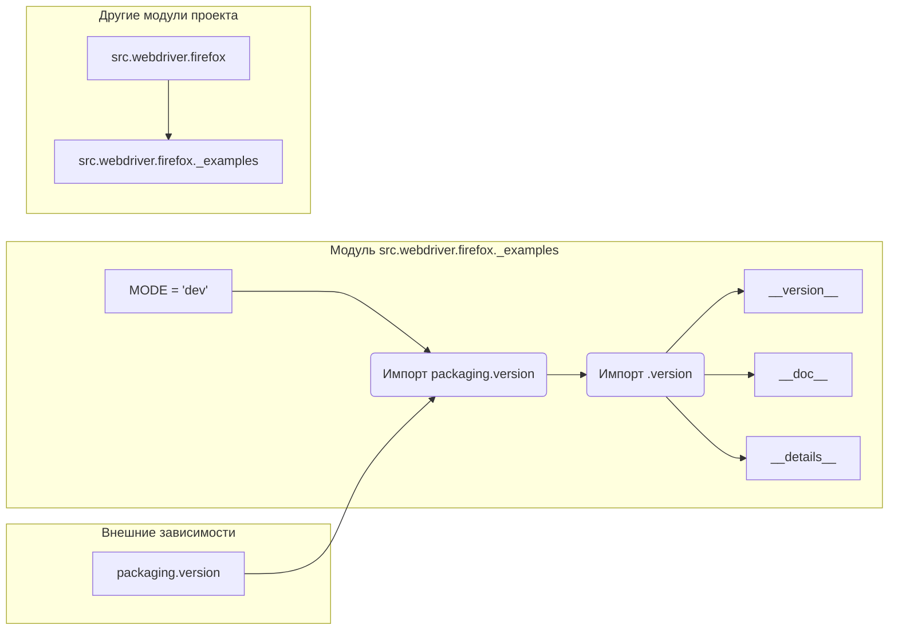

# <input code>

```python
## \file hypotez/src/webdriver/firefox/_examples/__init__.py
# -*- coding: utf-8 -*-\
#! venv/Scripts/python.exe
#! venv/bin/python/python3.12

"""
.. module: src.webdriver.firefox._examples 
	:platform: Windows, Unix
	:synopsis:

"""
MODE = 'dev'

"""
	:platform: Windows, Unix
	:synopsis:

"""


"""
	:platform: Windows, Unix
	:synopsis:

"""


"""
  :platform: Windows, Unix

"""
"""
  :platform: Windows, Unix
  :platform: Windows, Unix
  :synopsis:
"""MODE = 'dev'
  
""" module: src.webdriver.firefox._examples """


""" Firefox examples """


from packaging.version import Version
from .version import __version__, __doc__, __details__
```

# <algorithm>

В данном коде нет алгоритма в привычном понимании, так как он не содержит циклов, условных операторов или сложной логики.  Код представляет собой инициализацию модуля `src.webdriver.firefox._examples`.

**Пошаговая блок-схема:**

1.  **Импорт модулей:** Импортируются необходимые модули.
    *   `packaging.version`:  Для работы с версиями пакетов.
    *   `.version`: предполагаемый модуль из той же папки `_examples`, содержащий информацию о версии, документацию и другие детали.
2.  **Константы:**
    *   `MODE = 'dev'`:  Инициализация переменной MODE со значением 'dev', скорее всего, для обозначения режима работы (разработка).

**Пример данных:**

*   Нет конкретных примеров обмена данными, так как код не выполняет вычислений или операций над данными.

**Взаимодействие с другими частями проекта:**

*   Зависит от `packaging.version` и внутреннего модуля `version`, который вероятно содержит метаданные проекта. Этот модуль находится в той же папке, что и инициализируемый модуль.

# <mermaid>



# <explanation>

**Импорты:**

*   `from packaging.version import Version`: Импортирует класс `Version` из пакета `packaging.version`, который используется для работы с версиями программного обеспечения. Это стандартная библиотека Python, поэтому она может быть импортирована без дополнительных настроек.  Этот импорт нужен для работы с версиями, но в данном примере не используется.
*   `from .version import __version__, __doc__, __details__`: Импортирует переменные `__version__`, `__doc__`, и `__details__` из модуля `version`, который предположительно находится в той же папке (`./version.py`). Это позволяет использовать информацию о версии, документации и подробные данные проекта.  Этот импорт необходим для формирования метаданных, относящихся к модулю.

**Классы:**

Нет определенных классов.  Код содержит только инициализацию переменной и импорт модулей.

**Функции:**

Нет определенных функций.

**Переменные:**

*   `MODE = 'dev'`:  Строковая переменная, определяющая режим работы (вероятно, 'dev' означает режим разработки).

**Возможные ошибки или области для улучшений:**

*   **Неявная зависимость:** `from .version import ...` предполагает наличие файла `version.py` в том же каталоге. Если такого файла нет, то вызов `from .version ...` приведёт к ошибке `ImportError`.  Рекомендуется использовать абсолютные пути импорта, особенно если ожидается, что модули будут вызываться из разных мест проекта.
*   **Документация:**  Документация в формате reStructuredText (`"""..."""`) - хороший стиль, но в примере она слишком обширная.  Лучше было бы объединить или сократить аннотации в данном примере.

**Цепочка взаимосвязей:**

Этот модуль (`_examples/__init__.py`) скорее всего, служит частью пакета, связанного с управлением веб-драйвером Firefox (`webdriver/firefox`). Зависимости от внешних пакетов (`packaging`) очевидны. Он может быть связан с другими модулями (например, `src.webdriver.firefox` или `src.webdriver`) для предоставления специфических примеров или вспомогательных функций работы с веб-драйвером Firefox.