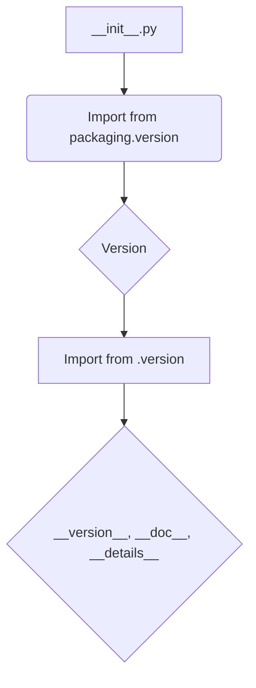
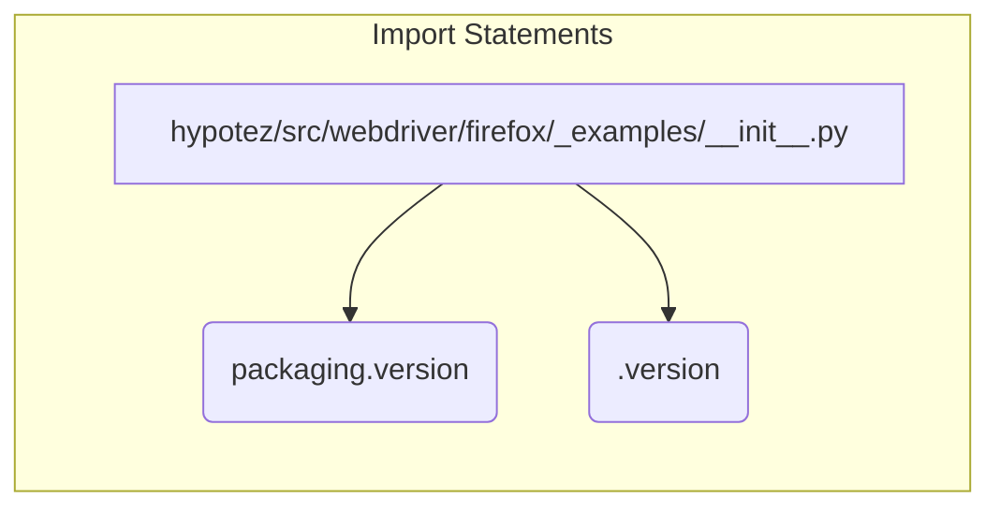

# <input code>

```python
## \file hypotez/src/webdriver/firefox/_examples/__init__.py
# -*- coding: utf-8 -*-\
#! venv/Scripts/python.exe
#! venv/bin/python/python3.12

"""
.. module: src.webdriver.firefox._examples 
	:platform: Windows, Unix
	:synopsis:

"""
MODE = 'dev'

"""
	:platform: Windows, Unix
	:synopsis:

"""


"""
	:platform: Windows, Unix
	:synopsis:

"""


"""
  :platform: Windows, Unix

"""
"""
  :platform: Windows, Unix
  :platform: Windows, Unix
  :synopsis:
"""MODE = 'dev'
  
""" module: src.webdriver.firefox._examples """


""" Firefox examples """


from packaging.version import Version
from .version import __version__, __doc__, __details__
```

# <algorithm>



В этом случае алгоритм прост: скрипт импортирует необходимые модули из других частей проекта. В данном случае импортируются функции `Version` из `packaging.version` и `__version__`, `__doc__`, `__details__` из файла `.version`.


# <mermaid>



# <explanation>

* **Импорты**:
    * `from packaging.version import Version`: Импортирует класс `Version` из пакета `packaging.version`.  Этот пакет используется для работы с версиями программного обеспечения.  Этот импорт предполагает, что пакет `packaging` установлен в окружении проекта.  Связь с другими частями проекта – `packaging` используется для корректной обработки версий, возможно, для сравнения или проверки версий зависимостей.
    * `from .version import __version__, __doc__, __details__`: Импортирует переменные `__version__`, `__doc__` и `__details__` из модуля `version.py` в текущем каталоге `_examples` (то есть из подпапки `version` внутри папки `_examples`). Это позволяет использовать информацию о версии, документацию и другую детальную информацию из этого файла.  Это предполагает, что внутри `_examples` есть файл `version.py`.

* **Классы**:
   В этом файле нет определений классов.

* **Функции**:
   В файле нет определений функций.

* **Переменные**:
    * `MODE = 'dev'`:  Это глобальная переменная, которая скорее всего определяет режим работы (например, "development" или "production").  Значение  `'dev'` в данном случае не оказывает видимого влияния на логику кода, но может использоваться в других частях приложения.


* **Возможные ошибки или улучшения**:

    * **Отсутствие функциональности**: Файл `__init__.py` в данном случае не содержит никакой собственной логики или функциональности.  Он лишь импортирует переменные и функции из других модулей. Для этого файла не указан функционал, следовательно, нет ничего, что нужно исправить или улучшить в нем напрямую.  Возможно, это вспомогательный файл, который будет использован в других частях проекта.
    * **Неясная цель**: Цель файла `__init__.py` должна быть более явной.  Например, он мог бы содержать функции, которые предоставляют доступ к другим функциям, классам или переменным, которые содержатся в папке `_examples`.
    * **Пустые строки документации**: Многие строки документации (docstrings) пустые. Их нужно заполнить описанием функций, классов и переменных. Это необходимо для того, чтобы другие разработчики (и сам автор) могли легко понять назначение кода.

* **Взаимосвязи с другими частями проекта**: Файл импортирует информацию о версии из `_examples/version.py`.  Этот файл `version.py` скорее всего определяет данные о версии модуля, который содержит примеры работы с Firefox webdriver.  Вероятно, информация о версии используется для согласования с другими частями проекта, которые работают с Firefox webdriver.