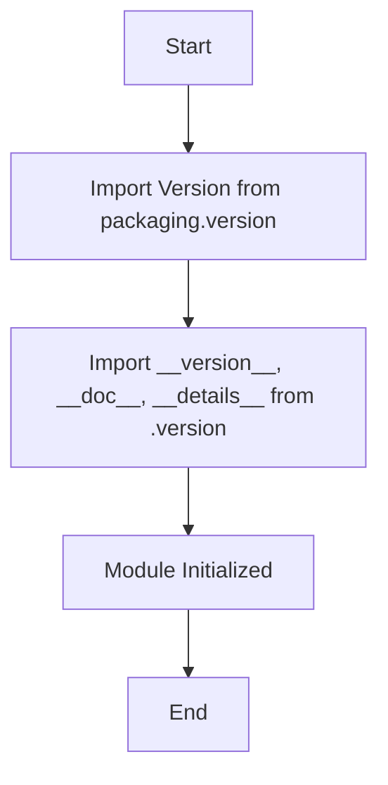

## Анализ кода `hypotez/src/webdriver/firefox/_examples/__init__.py`

### 1. <алгоритм>

1.  **Импорт модулей**:
    *   Импортируется `Version` из библиотеки `packaging.version`. Эта библиотека используется для работы с версиями программного обеспечения. Пример: `Version("1.2.3")`
    *   Импортируются `__version__`, `__doc__`, и `__details__` из модуля `src.webdriver.firefox._examples.version`. Эти переменные, вероятно, содержат информацию о версии, документацию и детали данного модуля.

2.  **Инициализация модуля**:
    *   После импорта, код не выполняет никаких дальнейших действий, но данные из импортированных переменных могут быть использованы в другом коде для определения версии, документации и деталей модуля `src.webdriver.firefox._examples`.
    *   Пример:  `print(f"Версия: {__version__}")`, `print(f"Документация: {__doc__}")`, `print(f"Детали: {__details__}")`

### 2. <mermaid>

**Объяснение зависимостей:**

*   `Start`: Начало выполнения модуля.
*   `import_packaging`: Импортирует класс `Version` из библиотеки `packaging.version`. Это позволяет сравнивать и управлять версиями программного обеспечения, например, "1.2.3", "2.0.0" и т. д.
*   `import_version`: Импортирует три переменные: `__version__`, `__doc__`, и `__details__` из локального модуля `version.py`  в той же директории. Эти переменные предоставляют информацию о версии, документации и деталях текущего модуля.
*    `Module_Init`: Модуль инициализирован, готов к использованию, импортированные переменные могут использоваться в других частях проекта.
*   `End`: Конец выполнения модуля.

### 3. <объяснение>

**Импорты:**

*   `from packaging.version import Version`: Импортирует класс `Version` из пакета `packaging.version`. Этот класс позволяет работать с версиями программного обеспечения в удобном формате, делая возможным сравнение и проверку версий. Это полезно для определения совместимости с различными версиями Firefox. Библиотека `packaging` является сторонней библиотекой и входит в стандартный пакетный менеджер PyPI
*   `from .version import __version__, __doc__, __details__`: Импортирует переменные `__version__`, `__doc__`, и `__details__` из файла `version.py`, расположенного в той же директории. Эти переменные, вероятно, определены в файле `version.py` и содержат строку версии, документацию к модулю и дополнительные детали. `.` в пути импорта указывает на текущую директорию, в которой находится `__init__.py`.  
    *   `__version__`:  Строка, представляющая текущую версию модуля. Используется для контроля версий и информирования пользователей.
    *   `__doc__`: Строка с описанием модуля. Полезна для автогенерации документации.
    *  `__details__`: Строка с дополнительной информацией о модуле, используемая в отчетах и логах.

**Классы:**

В данном коде классы не определены.

**Функции:**

В данном коде функции не определены.

**Переменные:**

*   `__version__`:  Строковая переменная, представляющая версию модуля, импортируется из модуля `version.py`.
*    `__doc__`: Строковая переменная, содержащая документацию модуля, импортируется из модуля `version.py`.
*   `__details__`: Строковая переменная, содержащая детали модуля, импортируется из модуля `version.py`.

**Потенциальные ошибки или области для улучшения:**

*   Код сам по себе не содержит ошибок, но отсутствуют функции или классы, которые бы использовали импортированные данные. Данный файл по сути инициализирует модуль, предоставляя его мета-данные.
*   Можно добавить более подробные комментарии, описывающие назначение модуля и импортированных переменных.
*   В дальнейшем можно использовать импортированные переменные для автоматической генерации документации, отображения версии в CLI и т.д.

**Цепочка взаимосвязей с другими частями проекта:**

*   Данный модуль `__init__.py` находится в пакете `src.webdriver.firefox._examples` и служит для инициализации этого пакета.
*   Он зависит от модуля `src.webdriver.firefox._examples.version` для получения информации о версии, документации и деталей.
*   Вероятно,  импортированная информация используется в других модулях проекта, таких как тесты или примеры, для контроля совместимости и предоставления пользователю информации о текущей версии.
*    Использование `packaging.version.Version` может быть связано с проверкой совместимости данного модуля с определенными версиями Firefox.