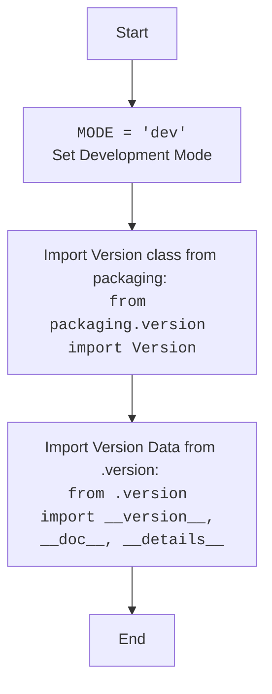

## Анализ кода `hypotez/src/webdriver/firefox/_examples/__init__.py`

### 1. <алгоритм>

1. **Объявление MODE:**
   - Определяется переменная `MODE` и ей присваивается строковое значение `'dev'`.
   - Пример: `MODE = 'dev'`
   - Эта переменная, вероятно, используется для определения режима работы программы, например, `dev` для режима разработки, а другие значения для других режимов (напр. 'prod' для production).
2. **Импорт модулей:**
   - Импортируется `Version` из пакета `packaging.version`.
   - Пример: `from packaging.version import Version`
   - Эта библиотека нужна для работы с версиями программ.
   - Импортируются `__version__`, `__doc__`, и `__details__` из модуля `.version`.
   - Пример: `from .version import __version__, __doc__, __details__`
   - Эти переменные, вероятно, содержат информацию о версии текущего модуля, его документацию и дополнительные детали.
3. **Конец:**
   - Завершение скрипта.

### 2. <mermaid>

### 3. <объяснение>

#### Импорты:
- `from packaging.version import Version`:
    -  Импортирует класс `Version` из пакета `packaging.version`.
    -  `packaging.version` - это библиотека для работы с версиями пакетов, позволяющая сравнивать и обрабатывать их. Класс `Version` используется для представления конкретной версии пакета.
    -   Взаимосвязь с другими пакетами `src`: Этот импорт не имеет прямой связи с пакетами внутри `src` напрямую, но он добавляет возможности обработки версий, которые могут использоваться в других частях проекта, например, в модуле `webdriver.firefox.version`.
- `from .version import __version__, __doc__, __details__`:
    -  Импортирует переменные `__version__`, `__doc__`, и `__details__` из модуля `version.py`, расположенного в том же каталоге (`.`).
    -   `__version__` обычно содержит строку с номером версии текущего модуля.
    -   `__doc__` - это docstring (строка документации) модуля, содержащая описание его назначения.
    -   `__details__` - это переменная с дополнительной информацией.
     - Взаимосвязь с другими пакетами `src`: этот импорт напрямую связан с модулем  `src.webdriver.firefox.version` , так как он импортирует оттуда данные о версии, что позволяет отслеживать и управлять версионированием в рамках пакета `src.webdriver.firefox`.

#### Переменные:
- `MODE`:
    -  Тип: строка (`str`).
    -  Использование: Хранит режим работы программы. В данном случае установлено значение `'dev'`, что указывает на режим разработки. Это значение может использоваться для включения отладочных сообщений или настройки поведения программы.

#### Общее:
- Данный файл - это файл инициализации (`__init__.py`) для модуля `src.webdriver.firefox._examples`. Он устанавливает начальные значения и импортирует необходимые компоненты для работы с примерами.
- Файл содержит определение переменной `MODE` и  импортирует данные о версии из модуля `version.py` .
- Строки с "Windows, Unix" в docstring указывают на поддержку работы на этих платформах.
- Потенциальная область для улучшения - это добавление более подробной документации для каждой переменной в docstring и  указать более конкретные примеры использования этих переменных в проекте.
- Цепочка взаимосвязей:
    -  `packaging.version` не является частью `src` , но это внешняя зависимость
    -  `.version` является частью проекта `src.webdriver.firefox`.
    -  Данный файл является частью пакета `src.webdriver.firefox._examples`, который может использовать функции из других частей проекта.
    - `__version__`, `__doc__`, и `__details__` могут использоваться для управления версионированием и предоставления документации к пакетам `src.webdriver.firefox`.