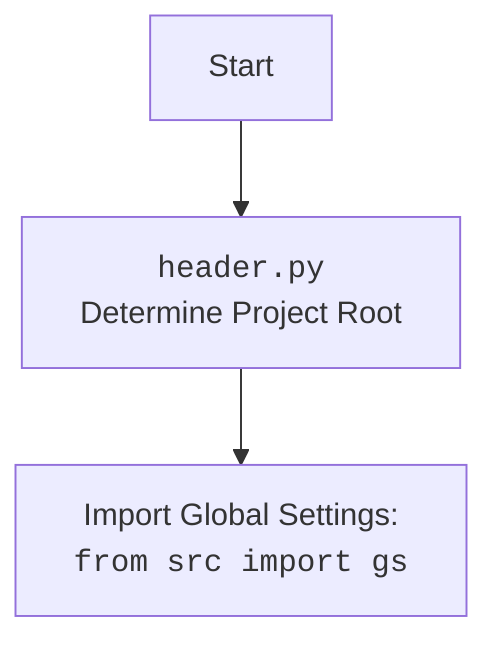

## АНАЛИЗ КОДА: `hypotez/src/webdriver/firefox/_examples/header.py`

### 1. <алгоритм>

1. **Импорт модулей:**
    - Импортируются модули `sys` и `os` для работы с системными функциями и путями.
    - Импортируется `Path` из `pathlib` для работы с путями файловой системы как с объектами.
    
2. **Определение корня проекта:**
    - `os.getcwd()` возвращает текущий рабочий каталог.
    - `os.getcwd().rfind(r'hypotez')` находит индекс последнего вхождения подстроки `hypotez` в текущем рабочем каталоге. Если строка не найдена, возвращает -1.
    - `[:os.getcwd().rfind(r'hypotez') + 7]` извлекает из текущего рабочего каталога строку, заканчивающуюся на `hypotez`, если `hypotez` найдено, либо возвращает пустую строку, если не найдено. +7 включает `hypotez` в строку
    - `__root__` переменная присваивается значению, полученному из текущего рабочего каталога, определяя корень проекта.
   
3. **Добавление корня проекта в `sys.path`:**
    - `sys.path.append(__root__)` добавляет путь к корню проекта в список путей поиска модулей. Это позволяет импортировать модули из проекта в любом месте кода.

**Пример:**

Предположим, текущий рабочий каталог `/home/user/projects/hypotez/src/webdriver/firefox/_examples`.

1.  `os.getcwd()` вернет `/home/user/projects/hypotez/src/webdriver/firefox/_examples`
2.  `os.getcwd().rfind(r'hypotez')` вернет `20`.
3.  `[:os.getcwd().rfind(r'hypotez') + 7]` вернет `/home/user/projects/hypotez`
4.  `__root__` будет `/home/user/projects/hypotez`
5.  `/home/user/projects/hypotez` добавляется в `sys.path`, делая возможным импорт модулей из этого каталога и его подкаталогов.

### 2. <mermaid>

```mermaid
flowchart TD
    Start --> GetCurrentWorkingDirectory[GetCurrentWorkingDirectory]
    GetCurrentWorkingDirectory --> FindHypotezIndex[FindIndex of 'hypotez']
    FindHypotezIndex -- Index found --> ExtractRootPath[Extract Substring  '/.../hypotez']
     FindHypotezIndex -- Index Not found -->  ReturnEmptyString[Return Empty String]
    ExtractRootPath --> SetRootVariable[Set Project Root: __root__]
    ReturnEmptyString --> SetRootVariable
    SetRootVariable --> AddRootToSysPath[sys.path.append(__root__)]
    AddRootToSysPath --> End
```

### 3. <объяснение>

#### Импорты:

- **`import sys`**:  Модуль `sys` предоставляет доступ к переменным и функциям, используемым интерпретатором Python. В данном случае, используется `sys.path` для изменения пути поиска модулей.
- **`import os`**: Модуль `os` предоставляет функции для взаимодействия с операционной системой, включая работу с файловой системой.  Используется `os.getcwd()` для получения текущего рабочего каталога, а также `os.path.rfind` для поиска нужной подстроки.
- **`from pathlib import Path`**:  Модуль `pathlib` предоставляет класс `Path` для представления путей к файлам и каталогам, облегчая работу с ними. Хотя `Path` импортируется, он не используется непосредственно в этом коде.

#### Переменные:
- `__root__`: переменная типа `str` (хотя ей присваивается `Path`, затем при добавлении в `sys.path` приводится к str) хранит путь к корню проекта. Определяется динамически на основе текущего рабочего каталога и подстроки `hypotez`.

#### Функция/Метод:

- В этом коде нет явно определенных функций или классов. Код выполняет последовательность действий по определению корня проекта.

#### Общее назначение:

Код определяет корень проекта `hypotez` и добавляет его в путь поиска модулей Python. Это обеспечивает возможность импортировать модули из разных частей проекта, даже если скрипт запускается из подкаталога. 

#### Потенциальные ошибки и области для улучшения:
- **Жестко заданная строка `hypotez`:** Если имя папки `hypotez` будет изменено, код перестанет корректно определять корень проекта. Было бы более гибко использовать переменные окружения или конфигурационные файлы для настройки пути к корню проекта.
- **Обработка ошибки поиска:**  Код не проверяет, найдена ли подстрока `hypotez` в текущем рабочем каталоге. Если подстрока не найдена, то будет возвращена пустая строка.
- **Неиспользуемый импорт `Path`:**  Импорт `Path` не используется в коде. Его можно удалить, если нет планов на его использование в будущем.
- **Зависимость от положения папки `hypotez`:** Код полагается на то, что корень проекта содержит папку `hypotez`. Если структура папок изменится, определение корня может работать неправильно.

#### Взаимосвязь с другими частями проекта:

- Этот код может быть использован как "header" или точка входа для каждого модуля или скрипта в проекте `hypotez`. В каждом модуле, скрипте, достаточно импортировать `header`, чтобы все модули проекта были доступны.
- Код обеспечивает возможность импортировать другие модули проекта через `sys.path`, и поэтому является важной частью механизма импорта проекта.
- Этот код является частью общего механизма настройки проекта `hypotez`, позволяя скриптам работать независимо от их фактического местоположения относительно корня проекта.