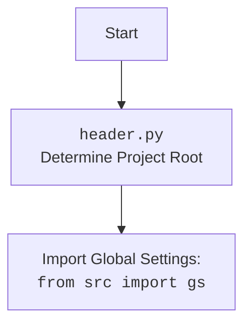

## Анализ кода `hypotez/src/webdriver/firefox/_examples/header.py`

### 1. <алгоритм>
1.  **Инициализация режима:**
    *   Устанавливается переменная `MODE` в значение `'dev'`. Это может использоваться для различных настроек или поведения программы в зависимости от режима работы (например, разработка или продакшн).
    *   *Пример*: `` - режим разработки, `MODE = 'prod'` - режим продакшн.
2.  **Получение текущей директории:**
    *   Функция `os.getcwd()` возвращает строку, представляющую текущую рабочую директорию.
        *   *Пример*: Если текущая директория `/home/user/projects/hypotez/src/webdriver/firefox/_examples`, то `os.getcwd()` вернет эту строку.
3.  **Определение корня проекта:**
    *   Метод `rfind(r'hypotez')` находит последнее вхождение подстроки `'hypotez'` в строке текущей рабочей директории. `+7` добавляется к индексу для получения конца слова `hypotez`.
        *   *Пример*: Если `os.getcwd()` возвращает `/home/user/projects/hypotez/src/webdriver/firefox/_examples`, то `rfind(r'hypotez')` вернет 20, а `os.getcwd()[:27]` выделит подстроку `/home/user/projects/hypotez`.
        *   Обрезается строка до найденного корня проекта, включая слово `hypotez`.
    *   Результат преобразуется в объект `pathlib.Path` и сохраняется в переменной `__root__`.
4.  **Добавление корня проекта в системный путь:**
    *   `sys.path.append(__root__)` добавляет путь к корню проекта в список путей, где Python ищет модули при импорте. Это позволяет импортировать модули из корня проекта в любом месте кода.
        *   *Пример*: Если `__root__` равен `/home/user/projects/hypotez`, то эта строка добавит `/home/user/projects/hypotez` в список `sys.path`.

### 2. <mermaid>
```mermaid
flowchart TD
    Start --> InitializeMode[Initialize ]
    InitializeMode --> GetCurrentDirectory[GetCurrentDirectory: os.getcwd()]
    GetCurrentDirectory --> FindProjectRoot[FindProjectRoot: os.getcwd().rfind('hypotez')]
    FindProjectRoot --> ExtractProjectRoot[ExtractProjectRoot: os.getcwd()[:index+7]]
    ExtractProjectRoot --> CreatePathObject[Create Path Object: __root__ = pathlib.Path(project_root)]
    CreatePathObject --> AppendPathToSysPath[Append Path to sys.path: sys.path.append(__root__)]
    AppendPathToSysPath --> End
```



### 3. <объяснение>

**Импорты:**
   - `import sys, os`:
     - `sys`: Модуль `sys` предоставляет доступ к некоторым переменным и функциям, которые тесно взаимодействуют с интерпретатором Python. В данном случае, используется `sys.path` для добавления пути к корню проекта в список путей поиска модулей.
     - `os`: Модуль `os` предоставляет функции для взаимодействия с операционной системой. Здесь используется `os.getcwd()` для получения текущей рабочей директории.
   - `from pathlib import Path`:
      - `pathlib`: Модуль `pathlib` предоставляет способ работы с путями в файловой системе, используя объекты. Здесь `Path` используется для представления пути к корню проекта.

**Переменные:**
   - `MODE`: Строковая переменная, устанавливающая режим работы программы (в данном случае, `'dev'`, что означает режим разработки).
   - `__root__`: Объект `pathlib.Path`, представляющий путь к корню проекта. Находится путем поиска вхождение подстроки `hypotez` и последующим добавлением к системному пути.

**Функции:**
   - **`os.getcwd()`**: Функция из модуля `os`, которая возвращает строку, представляющую текущую рабочую директорию.
   - **`str.rfind(sub)`**: Метод строки, который возвращает индекс последнего вхождения подстроки `sub`.
   - **`pathlib.Path(path)`**: Конструктор класса `Path` из модуля `pathlib`, который создает объект `Path` из строки.
   - **`sys.path.append(path)`**: Метод из списка `sys.path`, который добавляет строку `path` в список путей поиска модулей.

**Объяснение работы кода:**
   - Код предназначен для автоматического определения корня проекта (папки, где находится папка `hypotez`) и добавления его в список путей, где Python ищет модули.
   - Это позволяет разработчикам импортировать модули из любой части проекта, не заботясь о том, в какой директории находится текущий исполняемый скрипт.
   - Такой подход делает структуру проекта более гибкой и позволяет избежать проблем с относительными путями при импорте модулей.
   - `MODE` может быть использован для переключения между различными конфигурациями в зависимости от того, в какой среде запущен проект.
**Цепочка взаимосвязей с другими частями проекта:**
   - Код `header.py` используется в качестве начальной настройки для всей системы, гарантируя, что все модули могут быть импортированы без проблем с путями.
   - Код добавляет корень проекта в `sys.path`, что позволяет другим модулям импортировать  `src` и его подмодули.
**Потенциальные ошибки и улучшения:**
   - **Зависимость от имени папки `hypotez`**:  Код жестко зависит от того, что корень проекта называется `hypotez`. Если имя папки изменится, код сломается. Можно сделать это параметром или найти более универсальный способ определения корня.
   - **Жестко заданный MODE**: Режим работы `MODE` жестко закодирован как `'dev'`, возможно стоит предоставить механизм для его изменения.
   - **Обработка ошибок:** Код не проверяет, было ли найдено вхождение 'hypotez' в пути и не обрабатывает ситуацию, когда оно не найдено. Это может привести к ошибкам при работе в нетипичных средах.
   - **Не используются переменные окружения**:  Стоит рассмотреть использование переменных окружения для определения корня проекта и режима работы.