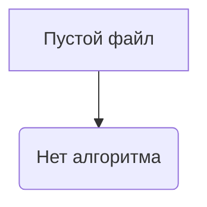
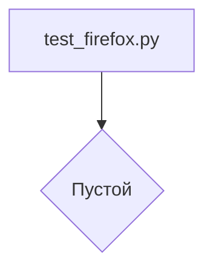

# <input code>

```python
## \file hypotez/src/webdriver/firefox/_pytest/test_firefox.py
# -*- coding: utf-8 -*-\n#! venv/Scripts/python.exe\n#! venv/bin/python/python3.12\n\n"""\n.. module: src.webdriver.firefox._pytest \n\t:platform: Windows, Unix\n\t:synopsis:\n\n"""\nMODE = \'dev\'\n\n"""\n\t:platform: Windows, Unix\n\t:synopsis:\n\n"""\n\n"""\n\t:platform: Windows, Unix\n\t:synopsis:\n\n"""\n\n"""\n  :platform: Windows, Unix\n\n"""\n"""\n  :platform: Windows, Unix\n  :platform: Windows, Unix\n  :synopsis:\n"""MODE = \'dev\'\n  \n""" module: src.webdriver.firefox._pytest """\n\n\n\n```

# <algorithm>

Данный код представляет собой пустой файл `test_firefox.py` в директории `hypotez/src/webdriver/firefox/_pytest`.  Алгоритм работы не определен, так как в файле отсутствуют какие-либо функции, классы или логика.  В нем только комментарии, которые документируют предполагаемую функциональность, но без конкретных действий.



# <mermaid>



# <explanation>

Файл `test_firefox.py`  в папке `_pytest` (предполагаемо для тестирования)  является пустым. Он не содержит ни одной функции, класса, переменной, или инструкций.  Все содержимое – это многострочные комментарии, которые описывают предполагаемый функционал и платформы, на которых он должен работать.  В Python, пустой файл, как правило, не выполняет никаких операций.


**Импорты**: Отсутствуют импорты, так как файл пуст.


**Классы**: Отсутствуют классы.


**Функции**: Отсутствуют функции.


**Переменные**: Единственная переменная, `MODE`, определена, но ее значение не используется.


**Возможные ошибки или улучшения**:  Наличие пустого файла не является ошибкой, но может быть недостатком или заблуждением.  Если этот файл должен содержать тесты, то в нем должны быть определены функции (например, с `@pytest.mark.parametrize` или `pytest.mark.parametrize`) которые запускаются при выполнении pytest для проверки работы модулей из `src.webdriver.firefox`. В данном случае,  необходима корректировка в зависимости от того, что планируется тестировать.  Это может быть просто неверное расположение файла или недостаток информации.  Нужно уточнить, какой функционал этот файл должен тестировать.

**Взаимосвязь с другими частями проекта**:  Если это файл для тестирования, он должен взаимодействовать с модулями из папки `src.webdriver.firefox`. В идеале, в нем были бы тесты, которые проверяют различные аспекты функционала, доступного через интерфейс webdriver, например, инициализацию драйвера Firefox, выполнение действий с открытой страницей и т.д.  Отсутствие содержимого затрудняет анализ взаимосвязей.


**Важно**:  Пустой файл обычно не имеет взаимосвязей с другими частями проекта.  Его ценность как часть проекта, сильно зависит от его будущего содержимого.  Описанные комментарии лишь указывают на ожидаемые детали файла, но не реализуют их.