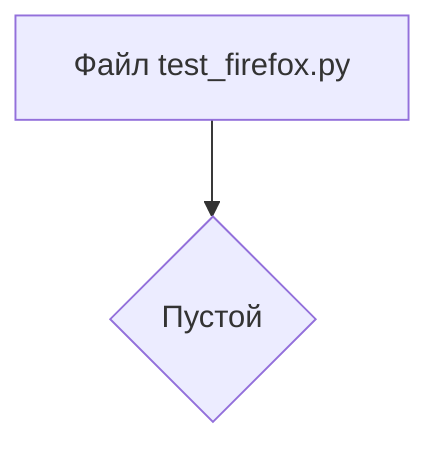

```MD
# Анализ кода hypotez/src/webdriver/firefox/_pytest/test_firefox.py

## <input code>

```python
## \file hypotez/src/webdriver/firefox/_pytest/test_firefox.py
# -*- coding: utf-8 -*-
#! venv/Scripts/python.exe
#! venv/bin/python/python3.12

"""
.. module: src.webdriver.firefox._pytest 
	:platform: Windows, Unix
	:synopsis:

"""
MODE = 'dev'

"""
	:platform: Windows, Unix
	:synopsis:

"""

"""
	:platform: Windows, Unix
	:synopsis:

"""


"""
  :platform: Windows, Unix

"""
"""
  :platform: Windows, Unix
  :platform: Windows, Unix
  :synopsis:
"""MODE = 'dev'
  
""" module: src.webdriver.firefox._pytest """


```

## <algorithm>

Код представляет собой пустой файл Python.  Алгоритм работы не определен, так как файл не содержит функций, классов или управляющих конструкций.  В нем присутствуют только комментарии и константы.

## <mermaid>



## <explanation>

**Импорты**:  Файл не содержит импортов.  Отсутствие импортов означает, что для работы кода не требуется внешних библиотек.

**Классы**:  В файле нет определений классов.

**Функции**:  Нет функций.

**Переменные**:  Наличие глобальной переменной `MODE` со значением 'dev' указывает на то, что файл потенциально может быть частью системы конфигурации или модуля. 

**Возможные ошибки и улучшения**:

* **Отсутствие функциональности**:  Файл не содержит никакого кода, выполняющего какую-либо логику.  Для тестирования модуля `firefox` он бесполезен в таком виде.
* **Неясность назначения**:  Многочисленные пустые строчки и комментарии не слишком информативны.  Следует улучшить структуру файла и добавить  описание целей и роли файла в проекте.
* **Несоответствие имени файла**:  Имя файла `test_firefox.py` подразумевает наличие тестовых функций или методов для тестирования драйвера Firefox, но файл пустой.

**Связь с другими частями проекта**:

Файл, скорее всего, является частью проекта автоматизации тестирования веб-приложений с использованием Selenium WebDriver и Firefox.  Он, вероятно, предназначен для тестирования функций, связанных с Firefox,  или для инициализации и конфигурирования среды тестирования.  Отсутствие кода затрудняет точное определение взаимосвязей с другими частями проекта.