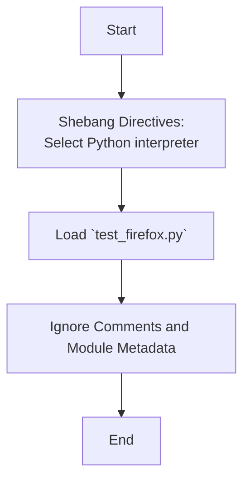

# Анализ кода `hypotez/src/webdriver/firefox/_pytest/test_firefox.py`

## 1. <алгоритм>

Данный файл `test_firefox.py` является частью пакета `src.webdriver.firefox._pytest` и предназначен для тестирования функциональности, связанной с браузером Firefox. Однако, представленный код не содержит никакого исполняемого кода, кроме комментариев и директив shebang.

**Пошаговая блок-схема**:

1. **Начало**: Запускается интерпретатор Python.
2. **Директивы Shebang**: Интерпретатор определяет, какой исполняемый файл Python использовать (`` или `#! venv/bin/python/python3.12`).
3. **Загрузка Модуля**: Модуль `test_firefox.py` загружается.
4. **Комментарии**: Различные комментарии с информацией о модуле, платформах и т.д. игнорируются.
5. **Конец**: Завершение выполнения модуля.

**Примеры**:
- **Директивы Shebang**: `` указывает на использование Python из виртуального окружения на Windows, а `#! venv/bin/python/python3.12` на Unix-системах.
- **Комментарии**: `""" .. module:: src.webdriver.firefox._pytest ... """`  описывают метаданные модуля.

**Поток данных**:
Данный файл в текущем состоянии не содержит потока данных.

## 2. <mermaid>

**Объяснение:**

- `Start`: Начало выполнения скрипта.
- `Shebang`: Директивы shebang указывают, какой интерпретатор Python следует использовать для запуска скрипта.
- `LoadModule`: Загрузка модуля `test_firefox.py`.
- `IgnoreComments`: Игнорирование всех комментариев и описаний модуля.
- `End`: Завершение выполнения скрипта.
- **Зависимости**:  В данном коде нет импортов, поэтому диаграмма показывает только последовательность выполнения файла.

## 3. <объяснение>

-   **Импорты**: В представленном коде нет никаких импортов. Следовательно, он не зависит от других модулей или пакетов.

-   **Классы**: В коде отсутствуют определения классов.

-   **Функции**: Код не содержит определений функций.

-   **Переменные**: Переменных в коде нет.

**Подробности:**

1.  **Директивы Shebang (`#!`)**:
    -   ``: Эта директива сообщает операционной системе, что файл должен быть выполнен с использованием интерпретатора Python, расположенного в виртуальном окружении `venv/Scripts/` на Windows.
    -   `#! venv/bin/python/python3.12`: Эта директива выполняет аналогичную функцию на Unix-подобных системах, указывая на интерпретатор Python 3.12, расположенный в `venv/bin/python/`.

2.  **Комментарии (`""" """`):**
    -   Комментарии используются для документирования кода, а также для указания метаданных модуля. В данном случае указана платформа (`Windows`, `Unix`),  путь модуля (`src.webdriver.firefox._pytest`) и общее описание (пустое).
    -   Множество пустых комментариев `""" """` без описания не несут какой-либо функциональной нагрузки, они могут быть использованы для будущих описаний или могут быть остатками от старой версии файла.

3.  **Проектная структура**:
    -   Файл является частью  модуля `src.webdriver.firefox._pytest`.
    -   Это указывает на то, что файл скорее всего используется для тестирования функциональности, связанной с управлением браузером Firefox в рамках проекта `hypotez`.

**Потенциальные ошибки и улучшения:**

1.  **Отсутствие исполняемого кода:** В текущем состоянии, этот файл не выполняет никаких действий. Обычно тестовые файлы содержат тестовые функции и утверждения (`assert`).
2.  **Избыточные комментарии:**  Множество пустых комментариев не добавляет ценности. Желательно их удалить или заменить на информативные.
3.  **Отсутствие импортов**: Для тестового файла обычно требуются импорты из `pytest` и, возможно, других частей проекта.

**Цепочка взаимосвязей:**

-   `test_firefox.py` предположительно будет использовать другие модули внутри `src.webdriver.firefox`, а также фреймворк `pytest`.
-  Возможно в модуле `src.webdriver.firefox` есть свой модуль `header.py` который устанавливает настройки.

**Заключение:**

Файл `test_firefox.py` в текущем виде является заготовкой или заглушкой для тестового файла. Он не содержит фактического кода для тестирования Firefox. Для полноценной работы, необходимо добавить код для тестов и необходимые импорты.