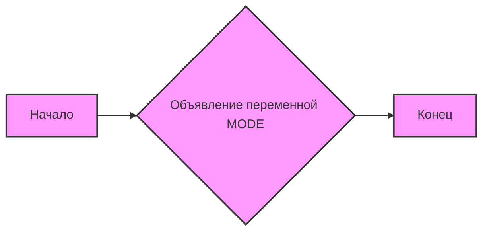
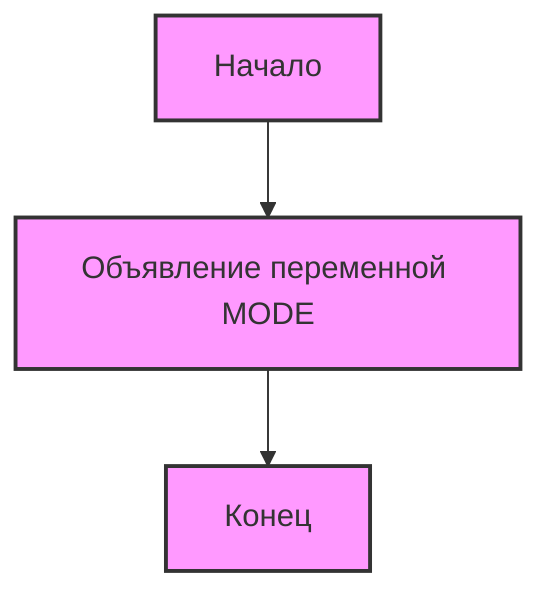

# Анализ кода `hypotez/src/webdriver/firefox/_pytest/test_firefox.py`

## 1. <алгоритм>

**Описание**:
Файл `test_firefox.py` содержит объявление переменной `MODE` и не содержит исполняемого кода, классов или функций. В основном, он предназначен для использования в качестве тестового файла в рамках `pytest`. Его основное назначение -  настройка среды или переменных для тестовых запусков.

**Блок-схема**:

**Примеры**:

1. **Объявление переменной `MODE`**:
    - `MODE = 'dev'`: Переменной `MODE` присваивается строковое значение `'dev'`. Это может использоваться для определения, в каком режиме выполняется тестирование. Например, если `MODE == 'dev'`, то будут использоваться настройки для разработки, а не для продакшена.

## 2. <mermaid>

**Объяснение зависимостей**:
- `Start`: Начало выполнения скрипта.
- `DeclareModeVariable`: Объявление переменной `MODE` со значением `'dev'`. В данном случае, это единственная зависимость в коде, представляющая основную операцию, выполняемую в этом файле.
- `End`: Конец выполнения скрипта.

## 3. <объяснение>

**Импорты**:
- В данном файле импорты отсутствуют. Файл не взаимодействует напрямую с другими частями проекта через импорт.

**Классы**:
- В данном файле классы отсутствуют. Файл не содержит объектно-ориентированного кода.

**Функции**:
- В данном файле функции отсутствуют. Файл содержит только переменную.

**Переменные**:
- `MODE`:
    - Тип: `str` (строка).
    - Использование: Задается как `'dev'` (режим разработки). Она может влиять на конфигурацию тестов, например, позволяя использовать различные наборы данных или настройки в зависимости от среды.
    - **Цепочка взаимосвязей**: Значение `MODE` может использоваться в других модулях или файлах, связанных с тестированием, для настройки поведения тестов, определения окружения.

**Потенциальные ошибки и области для улучшения**:

1. **Отсутствие функциональности**: Файл в текущем виде содержит только объявление переменной. Для полноценного тестового файла, следует добавить тестовые функции и импортировать необходимые библиотеки для тестирования.
2. **Отсутствие констант**: Значение `MODE = 'dev'` записано "как есть". Было бы правильнее вынести его в константу, чтобы упростить процесс изменения в дальнейшем.
3. **Отсутствие комментариев**: Необходимо добавить комментарии, поясняющие назначение файла и переменной `MODE`, особенно если она используется в других модулях проекта.
4.  **Использование doctest**
    -   `pydoc` позволяет проверять примеры использования прямиком в документации. Добавить такие примеры может помочь другим понять, как использовать это модуль.
    
**Цепочка взаимосвязей с другими частями проекта**:

- Файл `test_firefox.py` находится в каталоге `hypotez/src/webdriver/firefox/_pytest`. Он предназначен для тестирования функциональности, связанной с браузером Firefox.
- В рамках проекта `hypotez` он может быть частью тестовой инфраструктуры, где переменная `MODE` может влиять на выполнение тестов.
- Другие части проекта могут импортировать или использовать эту переменную, чтобы адаптировать свое поведение в зависимости от режима (`dev`, `test`, `production`). Например, можно использовать переменную `MODE` в файле `conftest.py` в корневой директории тестов, и передавать значение в зависимости от типа запуска.
- Взаимодействие с `src` пакетами в проекте может происходить через import в тестовых функциях внутри этого файла, где можно импортировать другие модули из `src` для тестирования.