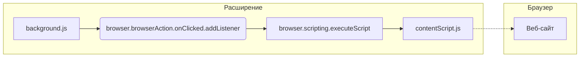

```MD
# Анализ кода background.js

**1. <input code>**

```javascript
// background.js
// background.js
browser.browserAction.onClicked.addListener((tab) => {
    browser.scripting.executeScript({
        target: { tabId: tab.id },
        files: ["contentScript.js"],
    });
});
```

**2. <algorithm>**

**Блок-схема:**

```mermaid
graph TD
    A[Клик по иконке расширения] --> B{Проверка активной вкладки};
    B -- Да -- C[Выполнение contentScript.js];
    B -- Нет -- D[Ошибка];
    C --> E[Завершение];
    D --> E;
```

**Описание алгоритма:**

1. **Клик по иконке расширения (A):** Пользователь кликает по иконке расширения в браузере.
2. **Проверка активной вкладки (B):** Код проверяет, какая вкладка активна.
3. **Выполнение contentScript.js (C):** Если вкладка активна, код вызывает функцию `browser.scripting.executeScript` для выполнения скрипта `contentScript.js` в контексте этой вкладки.  В данном случае, выполнение происходит в активной вкладке.
4. **Ошибка (D):** Если что-то идет не так (например, вкладки нет), происходит ошибка и процесс завершается.
5. **Завершение (E):** Выполнение кода завершается.

**Пример:** Пользователь кликает по иконке расширения на вкладке с веб-сайтом example.com.  Код получает `tabId` этой вкладки и выполняет `contentScript.js` в этом контексте.


**3. <mermaid>**



**Описание диаграммы:**

Диаграмма демонстрирует взаимосвязь между компонентами.  `background.js` использует API браузера (`browser.browserAction.onClicked.addListener` и `browser.scripting.executeScript`) для взаимодействия с браузером и выполняет код в `contentScript.js`. `contentScript.js` выполняется в контексте веб-сайта (вкладка браузера).


**4. <explanation>**

* **Импорты:** Нет явных импортов из `src.`, код использует API браузера, встроенное в контекст расширений.

* **Классы:** Нет классов в приведённом фрагменте кода.

* **Функции:**
    * `browser.browserAction.onClicked.addListener((tab) => { ... });`: Эта функция является обработчиком события клика на иконку расширения. Функция принимает объект `tab`, содержащий информацию о текущей вкладке.  Она асинхронно запускает `browser.scripting.executeScript` с `tabId` как параметром для выполнения скрипта в текущей вкладке.
    * `browser.scripting.executeScript(...)`: Эта функция выполняет скрипт в контексте заданной вкладки (`tabId`). Она получает скрипт из `files` (в данном случае `contentScript.js`).  Важно, что `tabId` определяет контекст выполнения (`target`).

* **Переменные:**
    * `tab`:  Объект, содержащий информацию о вкладке.  В данном случае предполагается, что он содержит, по крайней мере, `tab.id`.


* **Возможные ошибки или области для улучшений:**

    * **Отсутствие обработки ошибок:** Код не содержит механизмов обработки ошибок. Если `browser.scripting.executeScript` не сможет выполнить скрипт по какой-либо причине (например, вкладка закрыта), то расширение не сообщит об этом.  Следует добавить `try...catch` блок для обработки потенциальных исключений.
    * **Логирование:**  Включение логирования может помочь отладить проблемы с выполнением скриптов.
    * **Улучшение производительности:** Если `contentScript.js` выполняет длительные операции, это может привести к зависанию браузера.  Необходимо учитывать этот фактор и организовать асинхронное выполнение.
    * **Управление зависимостями:**  Необъявленные зависимости в коде.


**Цепочка взаимосвязей:**

Клики по иконке браузера вызывают `background.js`, который использует API браузера для выполнения `contentScript.js` в контексте текущей активной вкладки.  `contentScript.js`, в свою очередь, может взаимодействовать с контентом веб-страницы.