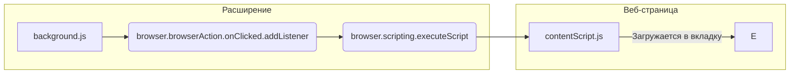

```MD
# Анализ кода background.js

## <input code>

```javascript
// background.js

browser.browserAction.onClicked.addListener((tab) => {
    browser.scripting.executeScript({
        target: { tabId: tab.id },
        files: ["contentScript.js"],
    });
});
```

## <algorithm>

**Блок-схема:**

```mermaid
graph TD
    A[Клик по иконке расширения] --> B{Получить текущую вкладку};
    B --> C[Выполнить скрипт contentScript.js];
    C --> D[Завершить];
    
    subgraph Получить текущую вкладку
        B --> E[tab.id];
    end
    
    subgraph Выполнить скрипт contentScript.js
        C --> F{Загрузить contentScript.js};
        F --> G[Выполнить скрипт в текущей вкладке (tab.id)];
    end
```

**Пример:**

Пользователь кликает по иконке расширения в контексте веб-страницы, у которой `tab.id = 123`. Алгоритм получает `tab.id = 123`, затем загружает и выполняет скрипт `contentScript.js` в вкладке с `tabId = 123`. После этого выполнение заканчивается.

## <mermaid>



**Описание диаграммы:**

*   `background.js` - главный скрипт расширения, содержащий обработчик клика по иконке.
*   `browser.browserAction.onClicked.addListener` - функция, которая регистрирует слушатель на событие клика по иконке расширения.
*   `browser.scripting.executeScript` - функция, выполняющая скрипт в контексте веб-страницы текущей вкладки.
*   `contentScript.js` - скрипт, который будет исполнен в контексте веб-страницы.

## <explanation>

**Импорты:**

В коде нет явных импортов, т.к. он использует API браузера.  `browser` - это объект, предоставляемый платформой расширений браузера (например, Chrome, Firefox), который предоставляет доступ к API для управления расширениями.

**Классы:**

Код не использует классы.

**Функции:**

*   `browser.browserAction.onClicked.addListener((tab) => { ... });`:  Данная функция регистрирует обработчик для события `onClicked` на иконке расширения.  Аргумент `tab` содержит информацию о текущей вкладке, включая `tab.id`. Обработчик анонимная функция, которая выполняет код внутри блоков `{}`.

*   `browser.scripting.executeScript({ ... });`:  Выполняет скрипт `contentScript.js` в указанной вкладке.
    *   `target: { tabId: tab.id }`: Указывает, что скрипт должен быть выполнен в контексте вкладки с идентификатором `tab.id`.
    *   `files: ["contentScript.js"]`: Указывает, что скрипт `contentScript.js` должен быть загружен и выполнен.

**Переменные:**

Переменных нет,  используется только аргумент `tab` внутри `addListener`.

**Возможные ошибки и улучшения:**

*   **Отсутствие проверки ошибок:** Код не проверяет, существует ли `tab.id`.  Если `tab.id` недоступен или невалиден, произойдет ошибка.  Рекомендуется добавить проверку на валидность `tab.id` перед использованием.

*   **Обработка ошибок:**  Следует добавить обработку ошибок внутри `browser.scripting.executeScript`, чтобы обработать потенциальные исключения, которые могут возникнуть при выполнении `contentScript.js`.

*   **Управление ресурсами:** Если `contentScript.js` будет загружать какие-то дополнительные ресурсы, необходимо предусмотреть механизм их освобождения (например, используя `browser.tabs.remove()` после завершения работы расширения).

**Взаимосвязи с другими частями проекта:**

`background.js` взаимодействует с `contentScript.js`, загружая и выполняя его в контексте вкладки. `contentScript.js` отвечает за выполнение логики, необходимой для расширения, прямо внутри веб-страницы.  Разделение логики между `background.js` и `contentScript.js` является типичным подходом для расширений, позволяющим избежать конфликтов с другими веб-страницами.