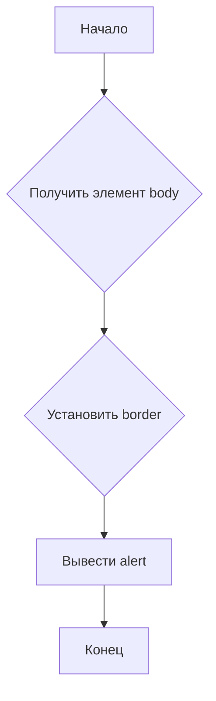

```MD
# Анализ кода borderify.js

**1. <input code>**

```javascript
document.body.style.border = "5px solid red";
alert();
```

**2. <algorithm>**



**Пример:**

* **Получить элемент body:**  Функция `document.body` возвращает DOM-элемент `<body>`.
* **Установить border:**  Свойству `style.border` элемента `<body>` устанавливается значение `5px solid red`.  Это задаёт красную границу шириной 5 пикселей вокруг всего содержимого страницы.
* **Вывести alert:** Функция `alert()` выводит всплывающее диалоговое окно с сообщением.

**Данные:**  Единственное используемое значение - строка `"5px solid red"` для задания стилей.  Она перемещается непосредственно в свойство `style.border` DOM-элемента.

**3. <mermaid>**

```mermaid
graph LR
    subgraph DOM
        A[document] --> B(body);
        B --> C{style.border};
    end
    D[alert()] --Вызов--> E[Всплывающее окно];
```

**Объяснение диаграммы:**

Диаграмма показывает взаимодействие с DOM (Document Object Model).  `document` — корневой объект DOM, `body` — элемент body страницы.  Свойство `style.border` устанавливается непосредственно на элементе `body`. Функция `alert()` вызывает отдельное диалоговое окно.

**4. <explanation>**

* **Импорты:** Нет импортов, код использует только встроенные объекты JavaScript (в частности, `document` и `alert()`).
* **Классы:** Нет классов.
* **Функции:**
    * `document.body`: Функция не в полном смысле слова, но доступ к элементу `body` страницы. Возвращает сам элемент `body` как объект.
    * `alert()`: Функция вывода всплывающего диалогового окна. Аргументов не принимает, возвращаемого значения нет.
* **Переменные:** Нет объявленных переменных.  Значение `"5px solid red"` используется непосредственно.
* **Возможные ошибки или области для улучшений:**
    * Код делает только одно действие — устанавливает границу и выводит диалоговое окно.  Его сложно назвать сложным или полезным.
    * Отсутствие обработки ошибок.  Если элемент `body` не найден, код все равно будет выполняться, но с непредсказуемым результатом.
    * Нет пользовательской логики; это просто демонстрационный фрагмент кода.

**Цепочка взаимосвязей:**

Код напрямую взаимодействует с DOM-деревом веб-страницы, изменяя внешний вид. Это одна из основных возможностей JavaScript.  Он не имеет явной зависимости от других частей проекта, если это не общий контекст проекта, в котором выполняется этот JavaScript.


**Примечание:**  Данный код не является частью сложного приложения, он предназначен для простого изменения стилей. Его анализ рассматривает базовые возможности JavaScript.