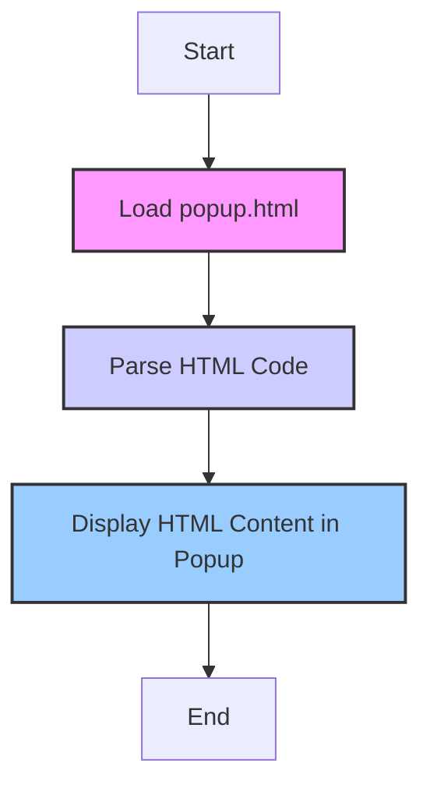

# Анализ кода `hypotez/src/webdriver/firefox/extentions/test_extention - Copy/html/popup.html`

## 1. <алгоритм>
Файл `popup.html` представляет собой HTML-страницу, которая будет отображаться в виде всплывающего окна (popup) в расширении браузера.
1.  **Начало:** Загрузка HTML-файла браузером.
2.  **Обработка HTML:** Браузер парсит HTML-код.
3.  **Отображение страницы:** Браузер отображает HTML-контент:
    -   `<h1>Hypotez</h1>`: Заголовок первого уровня "Hypotez" отображается в верхней части окна.
    -   `
Привет, Это Давидка. Я обучаю модель
`: Абзац текста "Привет, Это Давидка. Я обучаю модель" отображается под заголовком.
4.  **Конец:** Страница отображается в виде popup.

## 2. <mermaid>

**Объяснение:**
- `LoadHTML`: Этот блок представляет собой загрузку HTML файла `popup.html` браузером.
- `ParseHTML`: Этот блок представляет собой парсинг загруженного HTML файла для дальнейшего отображения.
- `DisplayPage`: Этот блок представляет собой отображение контента на странице.
- `Start` и `End` это начальная и конечная точки процесса.

## 3. <объяснение>
- **Импорты:**
  В начале файла указано ``, но это не импорт Python. Это shebang, который указывает операционной системе, каким интерпретатором должен быть выполнен файл (если он был бы исполняемым скриптом), но здесь он не используется, поскольку это HTML-файл.
  `-*- coding: utf-8 -*-` указывает кодировку символов, что позволяет использовать символы Unicode.

- **Классы:**
  В данном файле нет классов, так как это HTML-файл, а не скрипт на Python или JavaScript.

- **Функции:**
  В данном файле нет функций, так как это HTML-файл.

- **Переменные:**
   `MODE = 'debug'` - определяет режим работы модуля, в данном случае он установлен в `'debug'`, но не используется в этом HTML-файле.

- **HTML структура:**
  -   `<!DOCTYPE html>`: Объявление типа документа HTML5.
  -   `<html lang="en">`: Корневой элемент HTML-документа, язык - английский.
  -   `<head>`: Содержит метаданные о HTML-документе, такие как кодировка (`<meta charset="UTF-8">`) и viewport (`<meta name="viewport" content="width=device-width, initial-scale=1.0">`), и заголовок вкладки.
  -   `<body>`: Содержит весь контент, отображаемый пользователю:
      -   `<h1>Hypotez</h1>`: Заголовок первого уровня с текстом "Hypotez".
      -   `
Привет, Это Давидка. Я обучаю модель
`: Абзац с текстом "Привет, Это Давидка. Я обучаю модель".

**Потенциальные ошибки и улучшения:**
-  В данном файле нет ошибок, так как он корректно структурирован, это простой HTML.
-  На данный момент это просто отображение статического текста, но в будущем в него можно добавить элементы, которые будут взаимодействовать с расширением.
- Можно добавить стили CSS для изменения внешнего вида, а также JS для реализации функционала.
-  В будущем, если потребуется динамическое обновление контента popup, можно добавить JS скрипты.

**Взаимосвязь с другими частями проекта:**

Этот HTML файл является частью расширения для Firefox, находящегося в каталоге `hypotez/src/webdriver/firefox/extentions/test_extention - Copy/`. Он будет отображаться, когда пользователь нажмет на иконку расширения. Расширение использует этот файл как интерфейс для пользователя. Другие части расширения, вероятно, будут содержать JavaScript код для работы с этим интерфейсом, а также Python код для управления браузером.