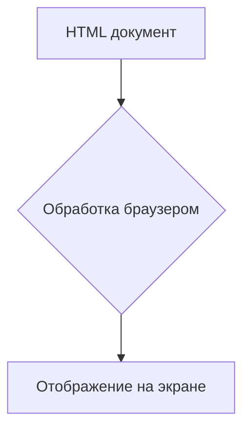
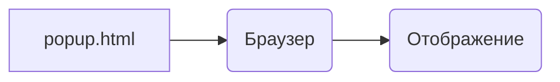

# Анализ кода popup.html

## <input code>

```html
## \file hypotez/src/webdriver/firefox/extentions/test_extention - Copy/html/popup.html
# -*- coding: utf-8 -*-
#! venv/Scripts/python.exe

""" module: src.webdriver.firefox.extentions.test_extention - Copy.html """
MODE = 'debug'
<!DOCTYPE html>
<html lang="en">
<head>
    <meta charset="UTF-8">
    <meta name="viewport" content="width=device-width, initial-scale=1.0">
    <title>Hypotez</title>
</head>
<body>
    <h1>Hypotez</h1>
    <p>Привет, Это Давидка. Я обучаю модель</p>
</body>
</html>
```

## <algorithm>



Пример: Пользователь открывает расширение. Браузер обрабатывает HTML-документ, содержащий заголовок "Hypotez" и абзац с сообщением. Затем браузер отображает этот контент на экране пользователя.


## <mermaid>



Описание:  Диаграмма отображает простую связь:  файл `popup.html` (A) передаёт данные (HTML) браузеру (B), который их отображает на экране (C).


## <explanation>

Этот код представляет собой HTML-документ, который, скорее всего, используется в расширении Firefox. Он не содержит Python-кода, поэтому нет импорта пакетов, классов, функций и переменных в привычном для Python понимании.

**Импорты:**

Отсутствуют, так как это HTML, а не Python-код.


**Классы:**

Отсутствуют.


**Функции:**

Отсутствуют.


**Переменные:**

`MODE = 'debug'`:  Это константа, вероятно, используемая для определения режима работы расширения (debug/release). В данном контексте она нужна для понимания, для каких целей используется данный код.


**Возможные ошибки или улучшения:**

* **Отсутствие JavaScript:**  Для динамического взаимодействия с расширением потребуется JavaScript.  В HTML необходимо добавить теги `script` и соответствующий JS-код для более сложной функциональности.
* **Непонятно назначение:** Без контекста (Python-кода, который использует этот HTML) трудно определить, как этот HTML используется.


**Цепочка взаимосвязей:**

Этот HTML-файл, скорее всего, является частью большего расширения.  Связь с другими частями проекта устанавливается через JavaScript-код, который будет взаимодействовать с этим HTML (например, обрабатывать события, обновлять содержимое элементов страницы).  Связь осуществляется через API браузера, вызовы из расширения.  Это расширение, вероятно, находится в папке `hypotez/src/webdriver/firefox/extentions/test_extention - Copy/` и имеет соответствующую логику и подключение к другим частям приложения.